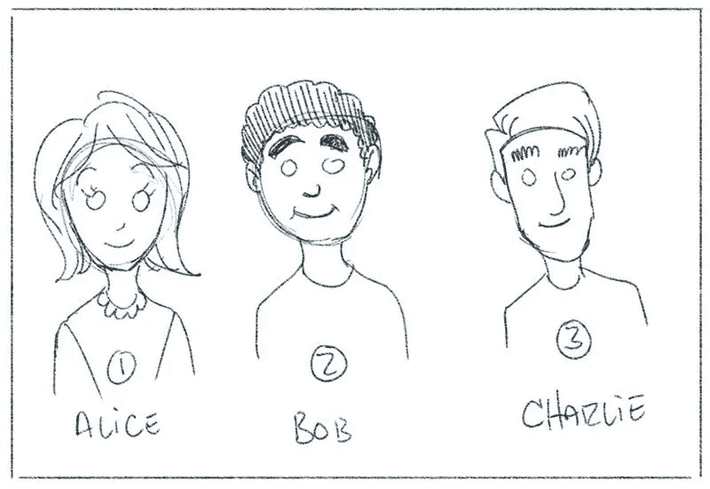
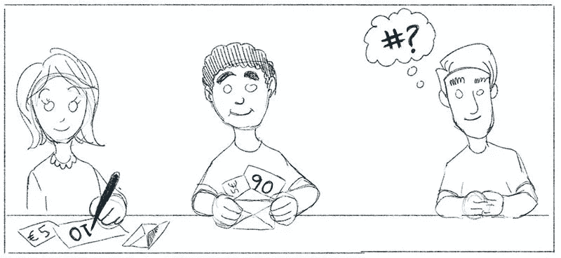
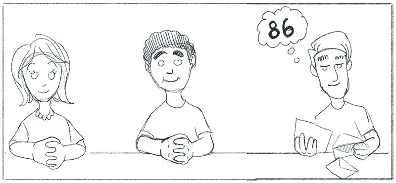
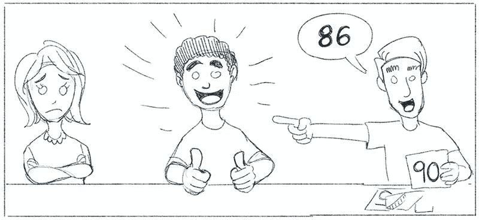
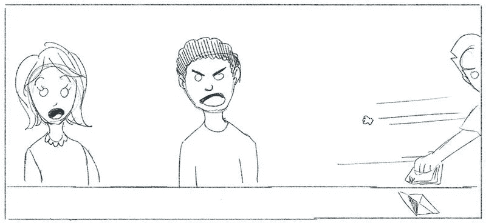
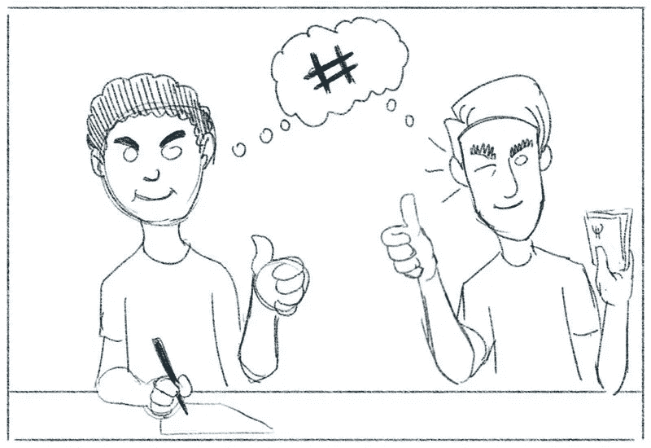
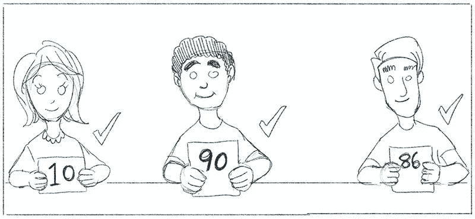

# 智能合同:新经济时代

> 原文：<https://medium.com/hackernoon/smart-contracts-a-new-economic-era-e95f407d49ef>

## 为什么智能合约如此具有革命性？

*(如果你是区块链科技新手，先从我的简短介绍开始:* [*区块链能为你做什么？*](https://hackernoon.com/what-can-blockchain-do-for-you-746ed436a371)

*智能合约如今风靡一时，而且理由充分。*

*当以太坊在 2015 年出现时，它在区块链社区引起了风暴，因为它证明了除了数字货币之外，这项技术还可以做更多的事情。突然间，一种全新的分散式应用程序可以被构想出来，并部署到支持它们的区块链上。*

*智能合同只是区块链上的一个计算机程序:dapp 的基本单元，一个分散的应用程序。dapp 可以被认为是相互关联的智能合约的集合，它们共同导致高级功能的出现，就像大型 IT 系统由多个子系统或模块组成，这些子系统或模块共同工作，而不仅仅是它们各部分的总和。*

*dapp 是通过将一组智能合约部署到区块链层上，然后与这些智能合约进行交互来实现的。示例:*

*   *供应链跟踪和追溯解决方案，如[出处](https://www.provenance.org/)，或 [IBM 和沃尔玛的试点](https://www.forbes.com/sites/rogeraitken/2017/08/22/ibm-forges-blockchain-collaboration-with-nestle-walmart-for-global-food-safety/#7452c7143d36)；*
*   *类似[的预测市场预示](http://augur.net)或[的认知](https://gnosis.pm/)；*
*   *像[道](https://en.wikipedia.org/wiki/The_DAO_(organization))这样的分权组织；*
*   *ICOs /代币销售；*
*   *[隐猫](https://www.cryptokitties.co/)。*

*[区块链是将信任商品化的技术革命。](https://hackernoon.com/forever-on-the-chain-c755838dfc79)智能合约是我们用来实现这场革命的工具。*

*这是一个很难理解的概念，所以让我们以一个简单的游戏为例。*

# *号码是正确的*

*让我们玩一个游戏。有三个玩家:爱丽丝、鲍勃和查理。*

**

*Meet Alice, Bob, And Charlie. They’ll play our game.*

*查理想到了一个数字。爱丽丝和鲍勃必须试着猜一个尽可能接近查理的数字；他们把它写在一个信封里，和一张 5€的钞票放在一起，然后把赌注交给查理。查理把两张€5 元钞票都给了更亲近的人。*

**

*Charlie thinks of a number. Alice and Bob write down their bets.*

*例如，如果查理想到 86，爱丽丝猜 10，鲍勃猜 90，鲍勃会赢，因为他更接近。*

**

*Charlie compares the bets to the number he thought of.*

**

*Bob had 90, which is closer to 90 than 10, so he wins!*

*只要爱丽丝、鲍勃和查理是可信的一方，这个简单的游戏就能很好地运行。但事实上，这些简单的规则确实存在一些漏洞，可能需要加以解决。*

## *与信任相关的问题无处不在*

*首先，查理可以拿了钱就跑。*

**

*Charlie absconds with the money!*

*第二，查理可以和其中一个玩家合谋，比如说鲍勃，这样他总是说鲍勃的猜测更接近。或者，Charlie 可以通过向 Bob 支付更高比例的时间来掩饰欺骗，而 Bob 本来有资格独自偶然得到这些时间。*

**

*Bob and Charlie, ever the rascals, conspire.*

*现在，我们如何解决这个问题？我们可以让查理写下他的号码，在结果出来后，让爱丽丝和鲍勃看到彼此的赌注。这样，我们就创建了一个可以被审计的跟踪。*

**

*All players reveal their number for everyone else to see.*

*唉，对查理来说，这不再有趣，也不再有利可图。他再也不会轻易被鲍勃收买了。因此，他决定开始向 Alice 和 Bob 收取一定百分比的赌注，作为他的服务费。*

*因此，Alice 和 Bob 发现他们被一个昂贵的第三方作为中间人，但是问题仍然没有解决。查理仍然可以与他们中的一个合谋，总是在一定范围内生成数字，这样他们更容易接近——即使有审计，也不能证明有违规行为。*

*这使得 Alice 和 Bob 向易腐败的第三方支付了防止欺骗的保险费，该第三方仍然可以找到欺骗的方法。*

## *智能合约拯救世界*

*这就是智能合约的用武之地。如果 Charlie 不是一个真实的人，而是区块链上的一个智能契约，Alice 和 Bob 都可以检查它的代码并审计它以确保它的有效性和公正性。查理的随机数和赌注也会被记录下来以备审计。*

*此外，作为一个程序，查理没有“乐趣”或“利润”的概念，也不需要收取任何费用。它将没有代理机构。它只会无意识地永远执行它的指令。*

*永远。*

*这是一个很重要的词，它引出了我的下一个观点。永久性和不变性是区块链技术的两个核心属性。事实上，这也是这个领域如此激动人心的原因，区块链是我们知道如何在数字记录中实现永久性和不变性的唯一方法。一旦部署了智能合同，它将永远保持不变。因此，爱丽丝和鲍勃可以永远玩下去，相信查理永远不会改变，因为智能合同就像一个数字纹身:一旦部署，它就会被数千个节点部署、复制和验证，不会改变，永远不变。*

*这就是为什么我喜欢说区块链技术是将信任商品化的革命。这个例子很简单，但是所阐述的原理在任意复杂程度下都同样适用。一旦我们最终认识到这种非中介化力量的含义，我完全期待这种转变会比我们在互联网和网络上看到的一样深远。*

# *变革的含义*

*那么，我们可以用智能合约做什么呢？我们可以信任他们。我们可以相信他们忠于自己的准则，并完全按照他们被告知的去做。*

*这意味着我们可以将许多当前的、真实世界的功能移植到区块链中，撇开扩展问题不谈，这可以为我们当前的系统带来前所未有的透明度和信心。像货币、投资基金和保险合同这样的东西是移民到区块链的首选。*

## *密码经济学:一种新范式*

*更有趣的是，我们可以使用智能合约来开发和实现新的加密经济范式。密码经济学是信任的最有趣的方法之一。它将密码的确定性与经济机制设计结合起来，以激励某种行为。*

*密码经济学是关于使用经济激励来奖励推进系统目标的参与者，并惩罚损害系统目标的参与者([维塔利克·布特林对此有很好的论述](https://www.youtube.com/watch?v=lYGOMGqz9zE))。*

*这允许新的系统类别，这在我们有区块链技术之前是不可能实现的。让我们看另一个例子:[令牌管理的注册中心](/@ilovebagels/token-curated-registries-1-0-61a232f8dac7)。*

## *围绕列表构建经济*

*令牌管理的注册中心是一种激励列表产生和管理的机制。这是一个加密经济协议，体现了一个良性的经济循环，以保持其监管活动的进行。BigchainDB 即将推出的[海洋协议](https://oceanprotocol.com/)，一个数据交换，利用令牌管理的注册表来跟踪他们数据源的信誉。*

*让我们想象一个简单的列表系统:最佳餐厅列表。在这个系统中有三类参与者:消费者、候选人和策展人。*

*首先，列出消费者。他们不为使用该系统付费，但他们是该系统相关性的主要驱动力，因为他们对该列表的消费在现实世界中有影响，因为他们会去他们在该列表上找到的某个餐厅消费。*

*第二类参与者由候选人组成。如果这份名单变得受欢迎，反过来会导致餐馆想要出现在名单上。因此，他们购买这个生态系统的令牌，并使用它们来申请列表。申请包括标记令牌(这意味着，为了申请，你把一些令牌放在第三方保管处)，以防止候选人滥发名单，并为策展人提供费用。*

*馆长，第三类参与者，然后投票。他们购买代币，并使用代币来决定申请是否应该通过，餐馆应该出现在列表中。如果他们拒绝，餐馆就会失去他们的代币。如果他们接受了，代币将被托管。无论如何，策展活动的回报是付给策展人一部分餐馆的代币。*

*所以，总结:策展人被激励去制作最好的列表。这是因为最佳名单吸引了很多消费者，反过来，很多申请人希望吸引这些消费者的注意。这些申请人必须购买该系统的代币才能申请，从而提高代币的价值。*

## *新经济时代的一瞥*

*令人着迷的是，这凭空创造了一个全新的民主微观经济。任何人都可以通过购买一些代币并成为策展人来参与这些系统，因此有资格从策展活动中获得更多代币。代币必须是流动的，否则人们不能购买它们来应用于列表，这意味着代币持有者也可以将它们转换成法定货币或另一种加密货币并套现。*

*我们发明了一些新的神奇的互联网货币，用密码术保护它，并设计了经济激励机制，这样这个系统将在没有监督的情况下自动运行，除了博弈论和对人们将永远喜欢钱这一事实的信任之外，什么也没有管理。*

*我很期待看到未来。*

*想去区块链探险吗？ [**跟我们说**](https://lifeonmars.pt/) **。**火星生活是一家精英软件咨询公司，现在正在进军区块链领域。*