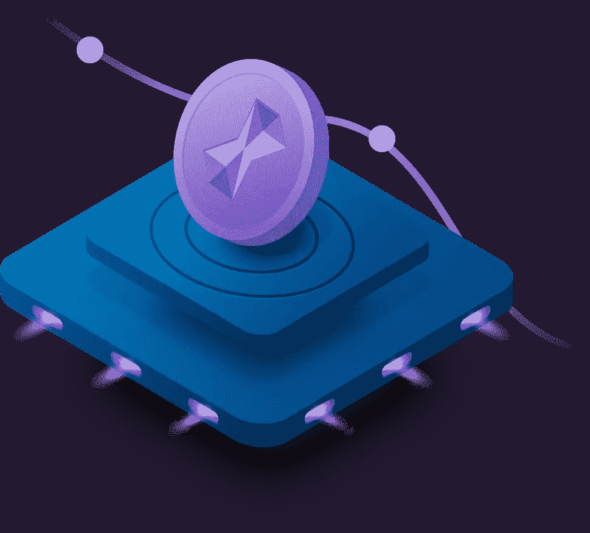

# 智能合同演示

> 原文：<https://medium.com/hackernoon/smart-contracts-demo-905e7f11cc84>

随着我们新网站设计的完成，是时候编码了。我们中的一个人正在为此努力——随着我们的进展，我们将不断更新社区。这是最新设计的另一个预览:

# **演示**

本周，我们将发布智能合约演示！这些部署的合同展示了新智能合同即将推出的功能。演示版的 Github 库可以在[这里](https://github.com/elixirToken/P2P-Payments-Demo)找到。
已经创建了六个演示场景，在这里[可用](https://github.com/elixirToken/P2P-Payments-Demo/tree/master/Scenarios)。运行 testrpc 或另一个 testnet 时，您可以在启用了开发工具的浏览器中打开每个场景，并在每个场景运行时查看结果。这六种情况包括:

1.一次付款，带矿。
2。单次延期支付与采矿。
3。采矿的多重支付。
4。带利息和采矿的多次付款。
5。单次支付利息和采矿。
6。采矿和试图打破控股的单一付款。

花一点时间通读文档，从概念上理解合同是如何工作的。你可以在这里找到文档。您还可以使用文档来修改任何场景或创建自己的场景。此外，您可以连续运行多个方案。令牌管理器将跟踪所有相关的支付信息。[场景 5](https://github.com/elixirToken/P2P-Payments-Demo/blob/master/Scenarios/Scenario5.html) 应我们的一名社区成员的要求而加入。[场景 6](https://github.com/elixirToken/P2P-Payments-Demo/blob/master/Scenarios/Scenario6.html) 包含打破持有的企图，这导致智能合约恢复——当贷方试图打破持有期时的预期行为。如场景所示，合同支持多部分支付、利息和开采。我们的文档详细介绍了智能契约中的每个公共函数，这些函数有助于请求和返回付款。您还可以在这里查看每个场景[的示例输出。您可以将这些合同用作付款分类账和贷款服务。有了功能性智能合约，我们正朝着我们的 Alpha 和 Beta 测试目标快速前进。](https://github.com/elixirToken/P2P-Payments-Demo/tree/master/Sample%20Results)

如果您是一名开发人员，并且想从事 ELIX 方面的工作，我们希望在不久的将来收到您的来信。我们将发布公告，敬请关注。

请务必查看我们的[网站](http://elixirtoken.io/)，并在 [Reddit](https://www.reddit.com/r/elixirtoken/) 、 [Twitter](http://twitter.com/elixtoken/) 、 [Discord](https://discord.gg/mu4EJaz) 和 [Telegram](https://t.me/ElixirToken) 上连接我们的社交媒体。如果您有任何问题，请告诉我们，我们很乐意帮助您解决问题！