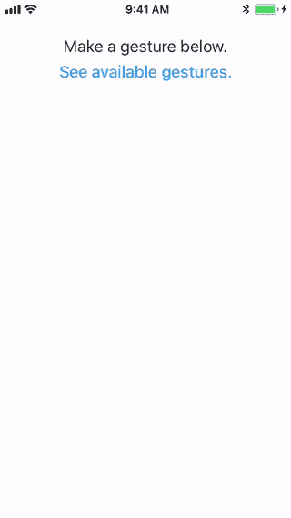
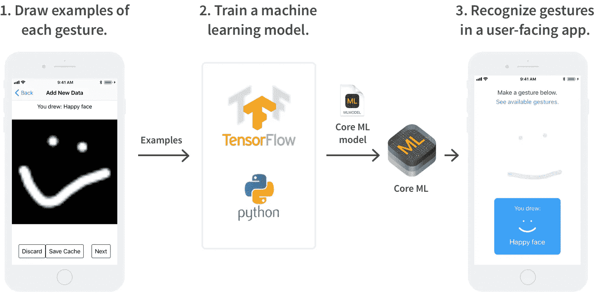
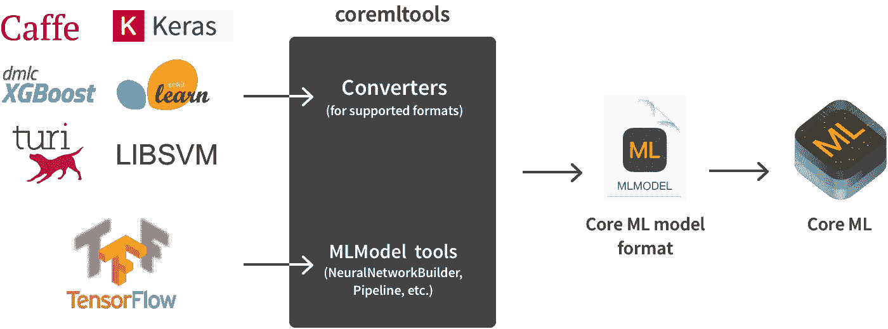
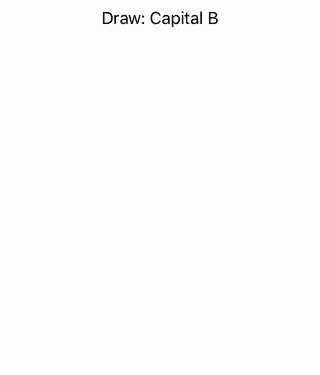
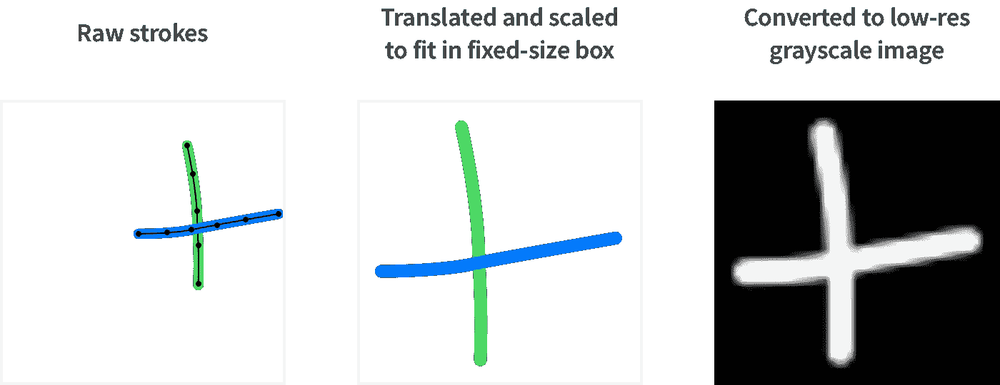
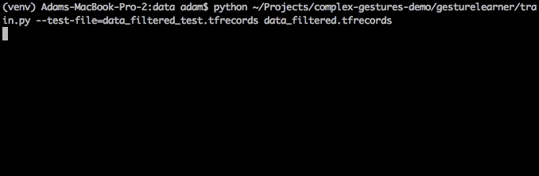

# 采用 Core ML 和 TensorFlow 的 iOS 11 中的智能手势识别

> 原文：<https://medium.com/hackernoon/smart-gesture-recognition-in-ios-11-with-core-ml-and-tensorflow-1a0a92c99c51>

在第一部分中，我展示了如何使用深度学习来识别复杂的手势，如移动设备上的心形、复选标记或笑脸。我还解释了应用程序如何从使用这种手势中受益，并对 UX 方面的事情做了一些探讨。

这一次，我将带你经历在你自己的应用中实现这些想法的技术过程。我还会介绍和使用苹果的核心 ML 框架(iOS 11 新增)。



Real-time recognition of complex gestures, at the end of each stroke

这项技术使用机器学习来鲁棒地识别手势。为了接触尽可能多的开发人员，我不会假设对该领域有任何了解。这篇文章的一些内容是针对 iOS 的，但是 Android 开发者仍然会发现它的价值。

已完成项目的源代码是[可在这里](https://github.com/mitochrome/complex-gestures-demo)。

# 我们正在建造的东西

在教程结束时，我们将有一个设置，允许我们选择完全自定义的手势，并在 iOS 应用程序中以高精度识别它们。涉及的组件有:

1.  一个应用程序收集每个手势的一些例子(画一些复选标记，画一些心，等等)。)
2.  一些 Python 脚本来训练机器学习算法(下面解释)来识别手势。我们将使用 TensorFlow，但我们将在稍后讨论它。
3.  使用自定义手势的应用程序。记录用户在屏幕上的笔画，并使用机器学习算法来计算出它们代表的手势(如果有的话)。



Gestures we draw will be used to train a machine learning algorithm that we’ll evaluate in-app using Core ML.

在第 1 部分中，我解释了为什么有必要使用机器学习算法。简而言之，举例来说，编写代码来明确检测用户的笔画是心形的要比你想象的困难得多。

## 什么是机器学习算法？

机器学习算法从一组数据中学习，以便在给出关于其他数据的不完整信息的情况下做出推断。

在我们的例子中，数据是用户在屏幕上画出的笔画和它们相关的手势类别(“心形”、“复选标记”等)。).我们想要推断的是我们不知道手势类别(不完整信息)的用户所做的新笔画。

允许算法从数据中学习被称为“训练”它。由此产生的对数据进行建模的推理机被恰当地称为“模型”。

# 什么是 Core ML？

机器学习模型可能很复杂，并且(尤其是在移动设备上)评估起来很慢。在 iOS 11 中，苹果引入了 [Core ML](https://developer.apple.com/documentation/coreml) ，这是一个新的框架，使它们快速且易于实现。使用 Core ML，实现一个模型主要归结为以 Core ML 模型格式保存它。mlmodel)。Xcode 9 让剩下的事情变得简单。

有一个官方的 Python 包 [coremltools](https://pypi.python.org/pypi/coremltools) 可以轻松保存 mlmodel 文件。它有用于 Caffe，Keras，LIBSVM，scikit-learn 和 XCBoost 模型的[转换器](https://apple.github.io/coremltools/coremltools.converters.html)，以及一个低级别的 API，用于当这些不够用时(例如当使用 TensorFlow 时)。不幸的是，coremltools 目前需要 Python 2.7。



Supported formats can be automatically converted into Core ML models using coremltools. Unsupported formats like TensorFlow require more manual work.

注意:Core ML 仅支持*在设备上评估*型号，而不支持*培训*新型号。

# 1.制作数据集

首先让我们确保我们有一些数据(手势)供我们的机器学习算法学习。为了生成真实的数据集，我编写了一个名为 GestureInput 的 iOS 应用程序，用于在设备上输入手势。

如果你的用例与我的没有太大的不同，你也许可以按原样使用手势输入。它允许您输入笔画数，预览生成的图像，并将其添加到数据集中。您还可以修改关联的类(称为标签)并删除示例。

GestureInput 随机选择手势类别供您绘制示例，以便您获得大致相同数量的每个类别。当我想要改变它们出现的频率时(例如，当添加一个新的类到一个现有的数据集时)，我改变[硬编码的值](https://github.com/mitochrome/complex-gestures-demo/blob/ddaef7401cf3024c2df0a0af5883bbf2e7fac12a/apps/GestureInput/Source/InputViewController.swift#L8)并重新编译。不漂亮，但很管用。



Generating data for the machine learning algorithm to learn from

该项目的自述文件解释了如何[修改手势类](https://github.com/mitochrome/complex-gestures-demo/tree/ddaef7401cf3024c2df0a0af5883bbf2e7fac12a#adding-new-gesture-classes)的集合，其中包括复选标记、x 标记、上升对角线、“涂鸦”(快速左右移动，同时上下移动)、圆圈、U 形、心形、加号、问号、大写 A、大写 B、笑脸和笑脸。还包括一个[样本数据集](https://github.com/mitochrome/complex-gestures-demo/tree/ddaef7401cf3024c2df0a0af5883bbf2e7fac12a/sample_data)，您可以通过[将其传输到您的设备](https://github.com/mitochrome/complex-gestures-demo/tree/ddaef7401cf3024c2df0a0af5883bbf2e7fac12a#transferring-data-to-and-from-your-device)来使用。

你应该画几个手势？正如我在第 1 部分中提到的，每个手势有 60 个例子，我能获得 99.4%的准确率，但我实际上建议做大约 100 个。尝试以各种方式绘制您的手势，以便算法可以全部学习。

## 为培训而导出

手势输入中的“光栅化”按钮将用户的笔画转换为图像，并保存到一个名为 data.trainingset 的文件中。这些图像就是我们将输入到算法中的内容。

如第 1 部分所述，在将用户的手势(“绘图”)转换成灰度图像之前，我将它缩放并转换成一个固定大小的框。这有助于我们的手势识别独立于用户在哪里做手势以及手势的大小。它还最小化了图像中表示空白空间的像素数量。



Converting the user’s strokes into a grayscale image for input into our machine learning algorithm

注意，我仍然将每个笔画的触摸位置的原始时间序列存储在另一个文件中。这样我就可以改变未来手势转换成图像的方式，甚至可以使用非基于图像的方法来识别，而不必重新绘制所有的手势。

GestureInput 将数据集保存在其容器的 documents 文件夹中。从你的设备上获取数据集最简单的方法是通过 Xcode 下载容器。

# 2.训练神经网络

在步骤 1 中，我们将数据集转换成一组图像(带有类别标签)。这将我们的手势分类问题转化为图像分类问题——只是识别手势的一种(简单)方法。一种不同的方法可以使用速度或加速度数据。

我提到过我们会使用机器学习算法。事实证明，目前用于图像分类的最先进的机器学习算法是卷积神经网络(CNN)。请看这篇[优秀的 CNN 初学者友好介绍](https://ujjwalkarn.me/2016/08/11/intuitive-explanation-convnets/)。我们将使用 TensorFlow 训练一个，并在我们的应用程序中使用它。

如果你不熟悉 TensorFlow，你可以[在这里](https://www.tensorflow.org/get_started/)了解它，但这篇文章有你训练一个模型所需的所有说明。我的神经网络是基于专家深度 MNIST 教程中使用的神经网络。

我用来训练和导出模型的一组脚本位于一个名为 [gesturelearner](https://github.com/mitochrome/complex-gestures-demo/tree/master/gesturelearner) 的文件夹中。我将介绍典型的用例，但是他们有一些额外的命令行选项可能会有用。通过设置 [virtualenv](https://virtualenv.pypa.io/en/stable/) 开始:

```
cd /path/to/gesturelearner
# Until coremltools supports Python 3, use Python 2.7.
virtualenv -p $(which python2.7) venv
pip install -r requirements.txt
```

## 准备数据集

首先，我使用 [filter.py](https://github.com/mitochrome/complex-gestures-demo/blob/ddaef7401cf3024c2df0a0af5883bbf2e7fac12a/gesturelearner/filter.py) 将数据集拆分成 15%的“测试集”和 85%的“训练集”。

```
# Activate the virtualenv.
source /path/to/gesturelearner/venv/bin/activate# Split the data set.
python /path/to/gesturelearner/filter.py --test-fraction=0.15 data.trainingset
```

训练集当然用于训练神经网络。测试集的目的是显示神经网络的学习如何推广到新数据(即，网络只是记住训练集中的手势标签，还是发现潜在的模式)？

我选择为测试集留出 15%的数据。如果你总共只有几百个手势示例，那么 15%将是一个相当小的数字。这意味着测试集上的准确性只会给你一个算法做得有多好的粗略想法。

这部分是可选的。最终，了解网络性能的最佳方式可能是将它放入您的应用程序并进行测试。

## 培养

在改变了我的习惯之后。trainingset 格式成 TensorFlow 喜欢的 TFRecords 格式，我用 [train.py](https://github.com/mitochrome/complex-gestures-demo/blob/ddaef7401cf3024c2df0a0af5883bbf2e7fac12a/gesturelearner/train.py) 训练一个模型。这就是奇迹发生的地方。我们的神经网络从我们给它的例子中学习，对未来遇到的新手势进行稳健分类。

train.py 打印其进度，定期保存 TensorFlow 检查点文件，并在测试集上测试其准确性(如果指定)。

```
# Convert the generated files to the TensorFlow TFRecords format.
python /path/to/gesturelearner/convert_to_tfrecords.py data_filtered.trainingset
python /path/to/gesturelearner/convert_to_tfrecords.py data_filtered_test.trainingset# Train the neural network.
python /path/to/gesturelearner/train.py --test-file=data_filtered_test.tfrecords data_filtered.tfrecords
```

训练应该很快，在一分钟内达到大约 98%的准确率，并在大约 10 分钟后稳定下来。



Training the neural network

如果您在训练期间退出 train.py，您可以稍后重新开始，它将加载检查点文件以从它停止的地方开始。它[有选项](https://github.com/mitochrome/complex-gestures-demo/blob/ddaef7401cf3024c2df0a0af5883bbf2e7fac12a/gesturelearner/filter.py#L14)来选择从哪里加载模型以及将模型保存到哪里。

## 不平衡数据训练

如果某些手势的例子比其他手势多得多，网络将倾向于学习识别更好代表的手势，而牺牲其他手势。有几种不同的方法可以解决这个问题:

*   通过最小化与出错相关的成本函数来训练神经网络。为了避免忽略某些类，您可以增加错误分类的成本。
*   包括较少代表的手势的副本，以便你有相同数量的所有手势。
*   移除一些更具代表性的手势示例。

我的代码不会开箱即用地做这些事情，但是它们应该相对容易实现。

## 导出到核心 ML

正如我前面提到的，Core ML 没有像 Caffe 和 scikit-learn 那样将 TensorFlow 模型转换为 Core ML ML 模型的“转换器”。这给我们留下了两种选择来将我们的神经网络转换成 ml 模型:

*   使用 [coremltools](https://pypi.python.org/pypi/coremltools) 。模型包，它有一个用于构建神经网络的[API](https://apple.github.io/coremltools/generated/coremltools.models.neural_network.html)。
*   由于 MLModel [规范](https://developer.apple.com/machine-learning/)是基于 [Google 的协议缓冲区](https://developers.google.com/protocol-buffers/)的，你可以跳过 coremltools，直接在几乎任何编程语言中使用 protobuf。

到目前为止，除了现有转换器的内部代码之外，web 上似乎没有任何这两种方法的例子。下面是我使用 coremltools 的示例的精简版本:

要使用它:

```
# Save a Core ML .mlmodel file from the TensorFlow checkpoint model.ckpt.
python /path/to/gesturelearner/save_mlmodel.py model.ckpt
```

完整的代码可以在[这里找到](https://github.com/mitochrome/complex-gestures-demo/blob/ddaef7401cf3024c2df0a0af5883bbf2e7fac12a/gesturelearner/gesturelearner/graph.py#L113)。如果出于某种原因，您喜欢跳过 coremltools，直接使用 MLModel protobuf 规范，您也可以在那里看到如何做。

不得不自己编写这个转换代码的一个丑陋的副作用是，我们在两个地方描述我们的整个网络(张量流代码和转换代码)。每当我们更改张量流图时，我们都必须同步转换代码，以确保我们的模型能够正确导出。

希望未来苹果能开发出一种更好的导出张量流模型的方法。

在 Android 上你可以使用官方 [Tensorflow API](https://github.com/tensorflow/tensorflow/tree/master/tensorflow/examples/android/) 。谷歌还将发布 TensorFlow 的移动优化版本，名为 [TensorFlow Lite](https://techcrunch.com/2017/05/17/googles-tensorflow-lite-brings-machine-learning-to-android-devices/) 。

# 3.在应用内识别手势

最后，让我们在一个面向用户的应用程序中使用我们的模型。项目的这一部分是[手势识别器](https://github.com/mitochrome/complex-gestures-demo/tree/ddaef7401cf3024c2df0a0af5883bbf2e7fac12a/apps)，你在文章开头看到的应用程序。

一旦有了 mlmodel 文件，就可以在 Xcode 中将它添加到目标中。您需要运行 Xcode 9。目前它处于公开测试阶段，但它的发布可能会与下周的新 iPhone 和 iOS 11 同时进行。

Xcode 9 将编译您添加到目标中的任何 mlmodel 文件，并为它们生成 Swift 类。我将我的模型命名为 GestureModel，因此 Xcode 生成了`GestureModel`、`GestureModelInput`和`GestureModelOutput`类。

我们需要将用户的手势(`Drawing`)转换成`GestureModel`接受的格式。这意味着将手势转换成灰度图像，就像我们在第一步中所做的一样。然后，核心 ML 要求我们将灰度值数组转换为多维数组类型`[MLMultiArray](https://developer.apple.com/documentation/coreml/mlmultiarray)`。

`MLMultiArray`就像一个原始数组的包装器，告诉 Core ML 它包含什么类型和它的形状(即尺寸)。有了一个`MLMultiArray`在手，我们可以评估我们的神经网络。

我使用了一个共享的`GestureModel`实例，因为每个实例似乎都要花费相当长的时间来分配。事实上，即使在实例创建之后，模型第一次评估也很慢。当应用程序启动时，我用一个空图像评估了一次网络，这样当用户开始打手势时就不会看到延迟。

## 解释网络的输出

上面的函数为每个可能的手势类别(标签)输出一个“概率”数组。较高的值通常代表较高的可信度，但是许多不属于任何类别的手势会得到违反直觉的高分。

在第 1 部分中，我谈到了如何可靠地区分无效手势和有效手势。一种解决方案是创建一个“无效手势”类别，包含各种不同的手势，这些手势不属于任何其他类别。对于这个项目，我只是认为一个手势有效，如果网络将其归类为“概率”高于某个阈值(0.8)。

## 避免手势之间的冲突

由于我使用的一些手势类包含彼此(快乐的脸包含 U 形嘴，x 标记包含上升的对角线)，当用户实际打算绘制更复杂的手势时，可能会过早地识别出更简单的手势。

为了减少冲突，我使用了两个简单的规则:

*   如果一个手势可以组成一个更复杂的手势的一部分，短暂地延迟它的识别，看看用户是否画出了那个更大的手势。
*   给定用户所画的笔画数，不要识别出一个还没有画出的手势(例如，一张快乐的脸至少需要嘴巴和两只眼睛的 3 次笔画)。

不过，一般来说，为了获得更高的鲁棒性和响应性，你可能应该选择不互相包含的手势。

就是这样！通过这种设置，您可以在大约 20 分钟内将一个全新的手势添加到您的 iOS 应用程序中(输入 100 张图像，训练到 99.5+%的准确度，并导出模型)。

要了解这些部分是如何组合在一起的，或者如何在你自己的项目中使用它们，请参见[完整源代码](https://github.com/mitochrome/complex-gestures-demo)。