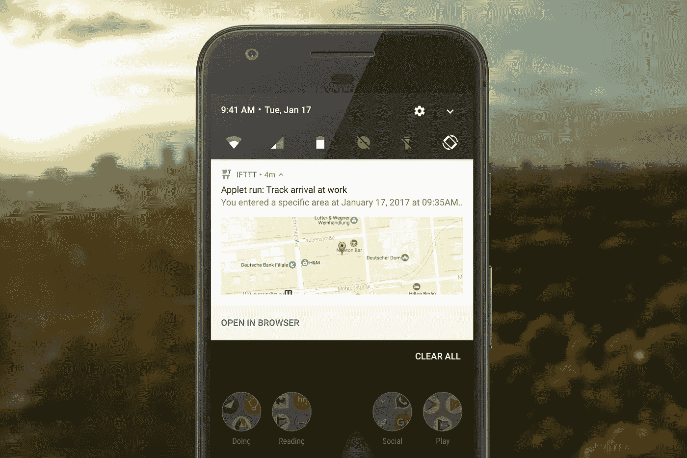
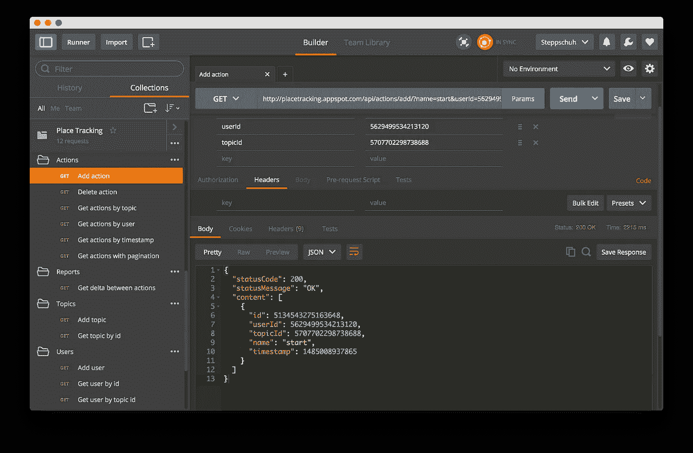
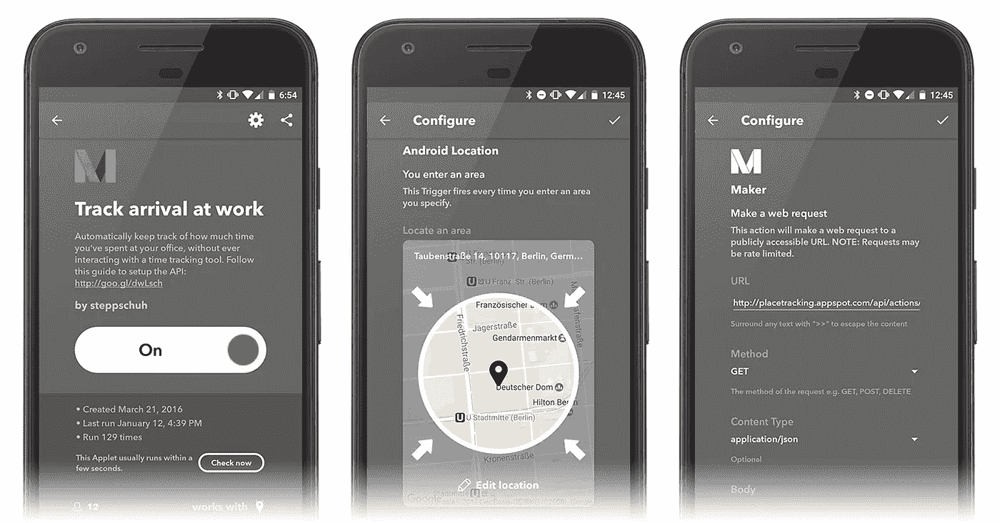

# 更智能的时间跟踪

> 原文：<https://medium.com/hackernoon/smarter-time-tracking-370c600af52b>



Automated tracking using IFTTT

有很多原因可以解释为什么你应该记录你在项目上花费的时间，只要浏览一下出售时间记录工具的网站就可以了。如果你精通技术，你可能更喜欢使用一个简单易用的免费 API 来实现这一点。

# 现有跟踪解决方案

有足够多的跟踪工具可用，看看这个列表就知道了。绝对没有理由创建另一个具有漂亮用户界面和伟大 UX 的 Android、BlackBerry、iOS 或 Web 应用程序。

但是，有相当多的人不想要任何 UI。拒绝与任何非电脑终端的东西互动的人。或者，更普通的是，那些忘记按一个奇特的按钮来开始记录他们工作时间的人。

# 低级跟踪

开源的[跟踪 API](https://github.com/Steppschuh/PlaceTracking) 提供了易于使用的端点，可以使用 web 请求跟踪你想要的任何东西。无论是你的办公时间，你的锻炼还是你吃了多少甜甜圈。你可以看看[这个邮差集合](https://app.getpostman.com/run-collection/434707094bd26e283ffc)来摆弄可用的端点。



Postman Collection with available API endpoints

该 API 可以免费使用，不需要认证，并且托管在[谷歌应用引擎](https://cloud.google.com/appengine/)上。你可以建立自己的应用引擎实例，或者使用 placetracking.appspot.com[的公共实例。](https://placetracking.appspot.com)

## API 概念

跟踪 API 处理 3 种不同的类型:

*   **用户**，代表使用 API 的用户(如您)
*   **主题**，代表您想要跟踪的任何内容(例如一个项目)
*   **动作**，代表跟踪事件(如开始工作)

那么，让我们来做一个演示:

## 添加用户

简单来说，API 不需要任何形式的认证。您可以通过调用以下 URL 来创建用户:

```
[https://placetracking.appspot.com/api/users/add/?**name**=John%20Doe](http://placetracking.appspot.com/api/users/add/?name=John%20Doe)
```

这将创建一个名为“John Doe”的用户。您可能会得到类似于以下内容的响应:

```
{
  "statusCode": 200,
  "statusMessage": "OK",
  "content": [
    {
      "id": 5736296311947264,
      "name": "John Doe"
    }
  ]
}
```

## 添加主题

与用户一样，您可以通过调用以下命令来创建主题:

```
[https://placetracking.appspot.com/api/topics/add/?**name**=Click%20Count%20Demo](https://placetracking.appspot.com/api/topics/add/?name=Click%20Count%20Demo)
```

这将导致一个新的主题，称为“点击计数演示”:

```
{
  "statusCode": 200,
  "statusMessage": "OK",
  "content": [
    {
      "id": 5666601139437568,
      "name": "Click Count Demo"
    }
  ]
}
```

## 添加操作

现在您已经设置了一个演示用户和主题，您可以添加动作了。注意，这次我们不仅指定了一个 *name* 参数，还指定了来自上面响应的 *userId* 和 *topicId* :

```
[https://placetracking.appspot.com/api/actions/add/?**name**=Click&**userId**=5736296311947264&**topicId**=5666601139437568](https://placetracking.appspot.com/api/actions/add/?name=Click&userId=5736296311947264&topicId=5666601139437568)
```

每次您调用此 URL，一个新的操作将被添加到“John Doe”的“点击计数演示”中:

```
{
  "statusCode": 200,
  "statusMessage": "OK",
  "content": [
    {
      "id": 5643172898144256,
      "userId": 5736296311947264,
      "topicId": 5666601139437568,
      "name": "Click",
      "timestamp": 1485002118855
    }
  ]
}
```

## 互动演示

打开下面 js dild 中的*结果*选项卡，点击黑色按钮。您将在图表的最左侧看到一个新的“点击”事件。

Click Count Demo

当然，每当您想要跟踪东西时，向 API 发出 GET 请求并不是您想要手动完成的事情。你最好使用 [IFTTT](https://ifttt.com/) 提供的令人敬畏的触发器。

## 如果这然后那

IFTTT 是一项面向 Android、iOS 和网络的免费服务，可以让你创建所谓的**小程序**。小程序有一个**触发器**(例如，你连接到 WiFi 网络)和一个**动作**(例如，将你的手机静音)。触发器和动作可以从许多流行的服务(例如，社交网络、云存储提供商、智能家居设备等)连接。

## 跟踪小程序触发器

您选择什么样的触发器取决于您自己，取决于您的用例。一些例子是:

如果您[进入/退出](https://ifttt.com/search/location)您办公室的位置，跟踪开始/停止。
如果您[连接/断开](https://ifttt.com/android_device)办公室 WiFi，跟踪开始/停止。
如果您[按下按钮](https://ifttt.com/do_button)，跟踪事件。

## 跟踪小程序操作

要真正跟踪任何东西，您需要向跟踪 API 发出一个 web 请求。这可以使用[制作器](https://ifttt.com/maker)轻松完成。



IFTTT Applet, Trigger and Action

如果你有一台 Android 设备，你可以复制以下两个小程序:

*   [连接办公室 WiFi 后开始时间追踪](https://ifttt.com/applets/399028p-start-time-tracking-when-you-connect-with-the-office-wifi)
*   [断开办公室 WiFi 时停止时间追踪](https://ifttt.com/applets/399029p-stop-time-tracking-when-you-disconnect-from-the-office-wifi)

如果您有任何问题，请随时联系我们！

[](http://bit.ly/HackernoonFB)[](https://goo.gl/k7XYbx)[](https://goo.gl/4ofytp)

> [黑客中午](http://bit.ly/Hackernoon)是黑客如何开始他们的下午。我们是阿美族家庭的一员。我们现在[接受投稿](http://bit.ly/hackernoonsubmission)并乐意[讨论广告&赞助](mailto:partners@amipublications.com)机会。
> 
> 如果你喜欢这个故事，我们推荐你阅读我们的[最新科技故事](http://bit.ly/hackernoonlatestt)和[趋势科技故事](https://hackernoon.com/trending)。直到下一次，不要把世界的现实想当然！

