# 使用 Sinatra 和“Facebook-Messenger”gem 在 Ruby 中构建您的第一个 Facebook Messenger 机器人(第 1/3 部分)

> 原文：<https://medium.com/hackernoon/smooth-coordinator-1427dce17f00>

## *下面是制作一个简单的脸书机器人的第 1 部分***，它利用了* [***谷歌地图地理编码 API***](https://developers.google.com/maps/documentation/geocoding/intro) *的力量。在* [***第二部分***](https://hackernoon.com/build-your-first-facebook-messenger-bot-in-ruby-with-sinatra-part-2-3-b3d929a4606d#.4jblmtuod) *中我们将添加更多功能，重构代码，让一切* [*烘干机*](https://en.wikipedia.org/wiki/Don%27t_repeat_yourself) *。在* [***第三部分***](https://hackernoon.com/build-your-first-facebook-messenger-bot-in-ruby-with-sinatra-part-3-3-c1b9f55ae121#.7jq1h0u5w) *中，我们将把我们的 bot 部署到*[*Heroku*](http://heroku.com)*并增强其接口。**

**

*An obscure cultural reference for Soviet-born readers*

**本教程假设你已经在你的机器上安装了一个普通的 Ruby 环境，并且你知道《美丽新世界》*[*Ruby gems*](https://rubygems.org/)*给我们的。下面是我们在第二部分结束时将要构建的内容的预览:**

*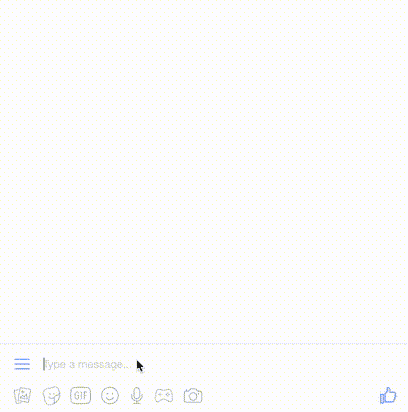*

*Cool, huh?*

# ***前言***

*et 面对难以忽视的真相。机器人被过度宣传，主要是因为[它们仍然是哑的](https://www.cnet.com/news/chatbots-facebook-bots-are-super-stupid-right-now/)。他们中的大多数。我今年 32 岁，从 15 岁起就对一切数码事物感到兴奋，我在 [IRC](https://en.wikipedia.org/wiki/Internet_Relay_Chat) 上学会了快速打字。它是 1988 年首次出现的聊天服务，比万维网早了一两年。当网络聊天室成为现实时，IRC 已经有了一个全球性的黑客社区。当我在 DALnet 上有自己的名为#402 的频道时，我在那里至少认识了两个现在最好的朋友。是的，它有以散列符号开始的频道(我看着你，Slack，为复兴一个有 25 年历史的科技而喝彩)。它还有 [**机器人**](https://en.wikipedia.org/wiki/IRC_bot) 。*

**

*Old is the new young, as seen by Google Trends*

*所以难怪当 2016 年 bots 再次成为一个家喻户晓的词时，我和我的朋友们只是耸耸肩。当然，当你加入一些严肃的 AI 巫毒时，机器人可以实现[惊人的壮举](http://www.telegraph.co.uk/technology/2016/03/24/microsofts-teen-girl-ai-turns-into-a-hitler-loving-sex-robot-wit/)。但是，说真的，让我们坦诚相待吧，我的开发伙伴们:你们的普通机器人并不比 2002 年在 IRC 服务器上运行的 Perl 脚本聪明多少。*

**

*A bot-related prehistoric meme circa 1995*

*综上所述，**我仍然相信机器人是伟大的，它们将会变得伟大。即使他们从不打扮。为什么这样机器人可以减少前端的热量，降低应用程序的开发成本，因为开发人员可以专注于业务逻辑，而不是外观。JavaScript 社区[现在很混乱](https://hackernoon.com/how-it-feels-to-learn-javascript-in-2016-d3a717dd577f#.n05g4p88j)，新的前端框架每隔一周就会出现，任何或多或少像样的现代界面都需要一个摇滚明星程序员，他碰巧也是一名设计师**和一名 UX 工程师**。虽然这对聪明人来说是个好消息，但对那些为了看起来漂亮而不得不雇佣更多聪明人的人来说却是个坏消息。***

*遇见机器人。很快你就会看到，你只需要一个微框架和一种后端语言(当然，它可以是 JS，如 [NodeJS](https://en.wikipedia.org/wiki/Node.js) )来快速构建一个交互式应用。如果你用它做一些有用的事情，它实际上可能会吸引用户。*

# ***说够了，让我们造一个***

**

*Frank Sinatra after a certain Ruby framework stole his name and his hat*

*尽管我想使用更多的 Rails(不到三个月前，我在巴黎的 Le Wagon boot camp 开始学习 Rails，并且只用它做了两个学生项目)，我们选择的武器将是 Sinatra，下面的截图是原因。*

**

*Folder structure of a Rails app (right) vs. the structure of a Sinatra app (left)*

*Sinatra 让你只用几行代码就能创建一个正常运行的 web 应用，没有任何样板文件。在我们的例子中，我们将只需要 Sinatra 做一件具体的事情，其余的将由令人难以置信的 **facebook-messenger***

*转到您的控制台并键入:*

```
*gem install facebook-messenger*
```

*机器人在[架](https://rack.github.io/)上运行，和 Sinatra 一样(就此而言，还有[轨道](http://blog.gauravchande.com/what-is-rack-in-ruby-rails))。所以，为了开始，我们需要一个**的备份文件**。为您的项目创建一个文件夹(我的名为 coordinator-bot ),并将名为 **config.ru** 的文件放入其中。*。ru* 代表 rack-up(俄罗斯联邦的顶级互联网域名)。把这个放进去:*

*接下来，**在同一个文件夹中创建一个名为 **app.rb** 的文件**，并放入以下内容:*

*接下来，创建**另一个文件**，名为 **Gemfile** ，内容如下:*

*现在转到命令行并运行:*

```
*bundle install*
```

# ***好了，是时候在脸书上创建我们的应用了***

*到目前为止，你是一个[脸书](https://hackernoon.com/tagged/facebook)用户，现在是时候成为一名脸书开发者了。前往[https://developers.facebook.com/](https://developers.facebook.com/)，使用您常用的脸书账户登录，在屏幕右上角选择**“添加新应用”**。*

**

*输入您的应用程序名称(使用您的幻想！)并且不要忘记设置一个类别为**“Messenger 应用程序”**。*

*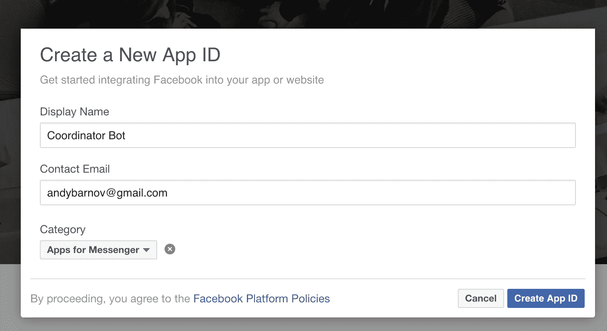*

*然后脸书会确定你不是机器人，这很讽刺，但避免了天网的场景。然后，在**“令牌生成”**下，选择**“创建新页面”**并选择一个类别。我的是“品牌或产品”。*

*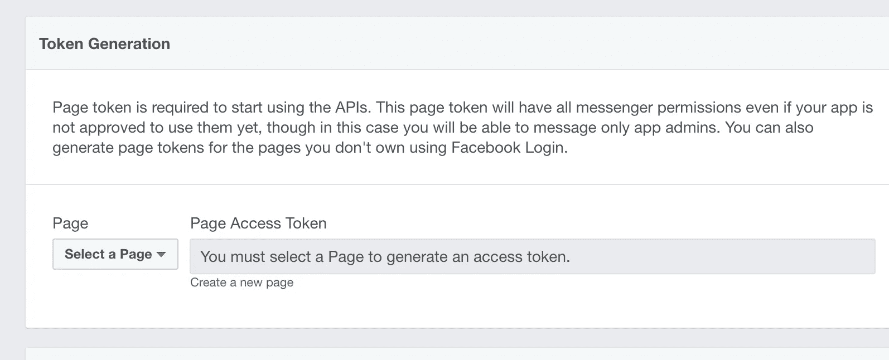***

*跳过向导菜单中的所有内容(当然，如果您想让您的测试页面看起来更好，请便！)，返回到开发人员的仪表板，为新页面生成一个令牌。*

*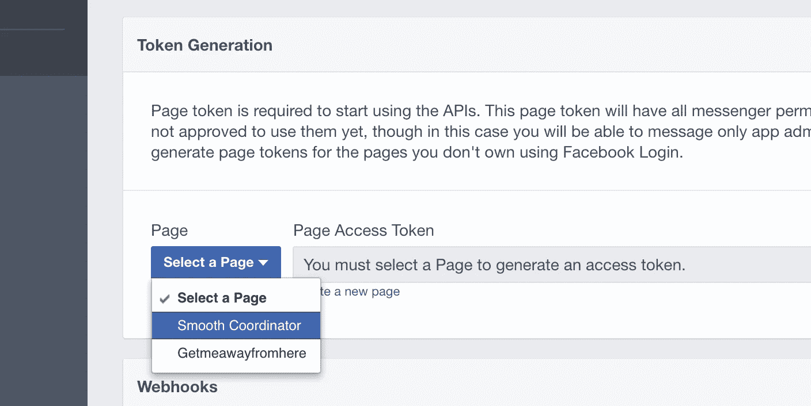**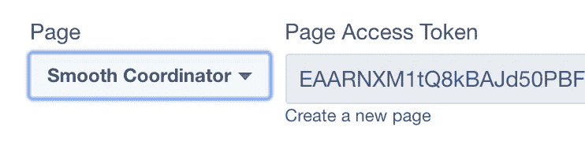*

*把它保存在你电脑的某个地方(但是**不要给任何人或者公开发布**！)，一会儿你会需要的。*

*你的脸书仪表盘上会有两件你应该保密的东西。你的**页面令牌**(我们姑且称之为 *ACCESS_TOKEN* )和 webhook 验证的令牌( *VERIFY_TOKEN* )。页面令牌刚刚生成，验证令牌可以是您想要的任何东西，只是要确保以后记住它。接下来，在您的终端中打开另一个选项卡，在“=”符号后键入 *export ACCESS_TOKEN=* 和 *export VERIFY_TOKEN=，*而使用您自己的值(另外，请注意，令牌周围没有引号)。这就是所谓的**设置环境变量**。*

*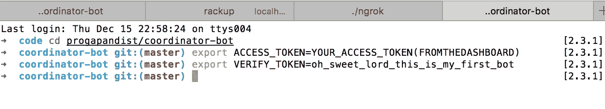*

*对于 Rails 来说，这种事情可以由 Figaro gem 来处理，但是在 Sinatra 下我无法让它工作，我的猜测是:它不被支持(请在评论中纠正我)*

****NB！*** *在继续之前，从你的* `*config.ru*` *文件中注释掉* `*require_relative 'bot'*` *。当我们实际创建一个 bot 文件时，你需要把这一行放回去，但是现在，只是为了测试* `*rackup*` *是否工作，我们需要暂时禁用它。**

*是时候启动我们的服务器了。从你的项目文件夹中返回到命令行(**注意！**它应该是**与您刚刚输入的环境变量相同的终端标签**并输入:*

```
*rackup -p 5000*
```

*您应该看到这个:*

*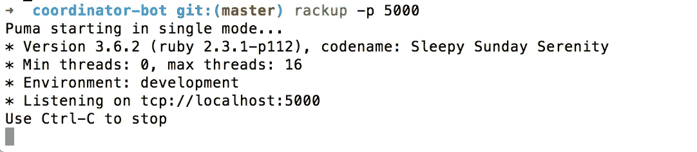*

*可以再挑一个端口号( *1337* ，有人吗？)，但它应该与我们将通过 **Ngrok** 管道传输的那个相同。去 [Ngrok 的](https://ngrok.com/)网站，下载并把可执行文件放在你的项目文件夹或它的一个父文件夹中。然后你可以像这样运行它(在一个新的标签中)。*

```
*./ngrok http 5000*
```

*具有这样的效果:*

*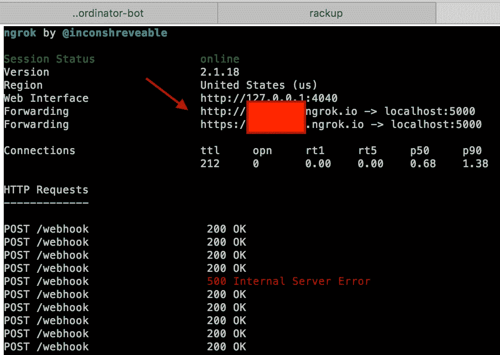*

*现在，您的本地主机[上的端口 5000 上发生的任何事情都将在互联网上以一个为您唯一生成的域名广播，类似于以下内容:](https://www.rt.com/viral/370070-russian-regulator-bans-itself/)[*http://982 BD 57 f 8 . ngrok . io*。](http://982bd57f8.ngrok.io.)*

*在您的浏览器中转到这个地址:您应该会看到文本*“此处无内容”*。没错，这就是我们 **app.rb** 中这些台词的内容:*

*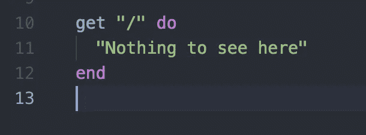*

*在您的脸书仪表板中，您刚刚为您的脸书页面生成了访问令牌，向下滚动一点，在**“web hooks”**下单击**“Setup**[**web hooks**](https://en.wikipedia.org/wiki/Webhook)**”。**切换到您的终端(您运行了那个*)。/ngrok* 命令在一个新的选项卡中，对吗？)，复制“转发”下的网址(确保复制的是以 [*https://* )](https://%29) 开头的，并附加 */webhook* 。这就是我们如何命名我们的服务器将与脸书通信的路径。我们可以称之为*/bot*——由你决定。在**“验证令牌”**下，输入之前设置环境变量时得到的相同字符串。勾选“信息”标记。*

*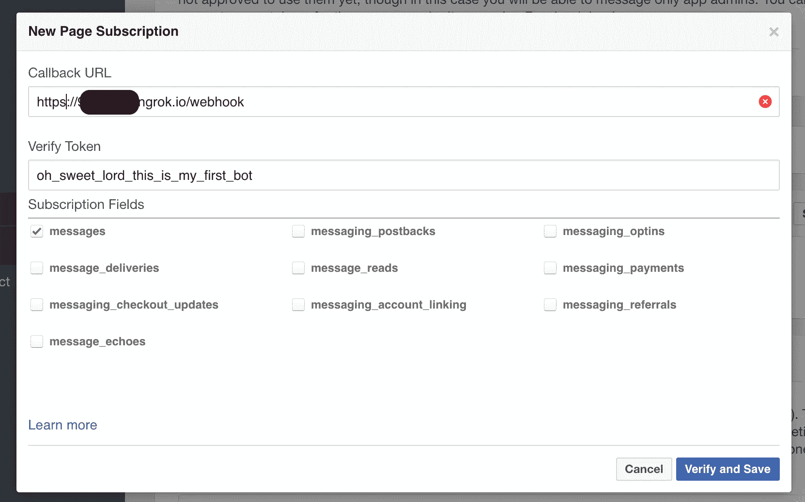*

*现在您可以**点击**“验证并保存”。如果你正确设置了你的服务器，脸书会调用你的 ngrok URL 上的/webhook path，给你发送一个“挑战”(只是一个随机的数字串)，然后等待它的回应。 **app.rb** 中的这些行是这样做的:*

*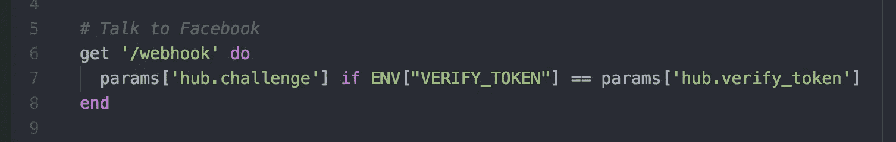*

*这就是我们需要辛纳屈的原因。继续前进。*

# *机器人，见见你的创造者*

*所有进一步的编程都将在我们的 **bot.rb** 文件中完成。继续在您的项目文件夹中创建一个。你的第一个机器人只会说“你好！”人类送他的任何东西。*

> *记住，**每次你改变任何文件中的某个东西**，你都必须返回到你的 rack 服务器正在运行的终端标签页(你可以不动 ngrok)，按 Ctrl-C 并重启它。同样，现在你需要在你的`config.ru`中`require_relative ‘bot’`*

*现在打开你的 Facebook Messenger(无论是桌面还是移动)，在“搜索 Messenger”下使用你最近创建的页面名称找到你的机器人，然后输入任何内容。他会回应“你好！”。*

> *祝贺你，你刚刚与你自己的机器人进行了第一次对话！*

*在您的服务器选项卡中，您应该会看到如下内容:*

```
*"POST /webhook HTTP/1.1" 200 - 0.0011*
```

*这意味着 bot 已经在其/webhook 路径上向您的服务器发送了一个 [HTTP POST](http://www.restapitutorial.com/lessons/httpmethods.html) 请求，并且服务器(facebook-messenger gem)做出了相应的响应。您可以在 *Bot.on* 块的开头添加这一行。*

```
*Bot.on :message do |message|
    puts "Received '#{message.inspect}' from #{message.sender}" 
    (…rest of the code in bot.rb)*
```

*它将让您了解更多关于您的机器人正在进行的对话，您的服务器选项卡将记录如下内容:*

*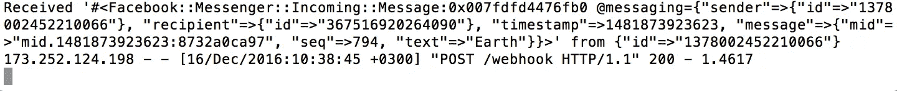*

*好吧，你的机器人在这一点上并不特别聪明。让我们添加一些真实世界的功能。当你输入世界上任何一个地址的时候，机器人都会给你 GPS 坐标，怎么样？我们将使用 [**谷歌地图地理编码 API**](https://developers.google.com/maps/documentation/geocoding/intro) **。**你需要做的就是发送一个 GET 请求(你也应该把你的私有 API 密匙放在 URL 的末尾，但是为了测试我们可以不用它，查看 Google 的文档以获得更多关于 API 密匙的信息):*

```
*[https://maps.googleapis.com/maps/api/geocode/json?address=ANY_STRING_THAT_LOOKS_LIKE_ADDRESS](https://maps.googleapis.com/maps/api/geocode/json?address=ANY_STRING_THAT_LOOKS_LIKE_ADDRESS)*
```

*谷歌将施展它的魔法(例如，如果你与一个俄罗斯提供商连接，它将计算出你想要俄罗斯的莫斯科，而不是德克萨斯州的莫斯科)，它将发回一个包含所有有用数据的 [JSON](https://en.wikipedia.org/wiki/JSON) ，即纬度和经度。*

*我们将使用一个神奇的[http party](https://github.com/jnunemaker/httparty)宝石来提出我们的请求。在最初的*包安装*期间，我们已经在我们的项目中安装了它。将此方法添加到您的 **bot.rb** 中*

*我们使用 Ruby 的标准 JSON 解析功能将来自 API 的响应转换成常规的 Hash 对象。确保你的 **bot.rb** 在顶部有一行*require‘JSON’*。*

*现在在杂凑里找我们的坐标。将此方法添加到 **bot.rb** 中。*

*更新您的 Bot 块以发送回您从 API 获得的数据。将您的 *Bot.on* 方法替换为:*

*最终你的 **bot.rb** 应该是这样的:*

*太好了！继续测试你的机器人吧！它应该这样做。*

*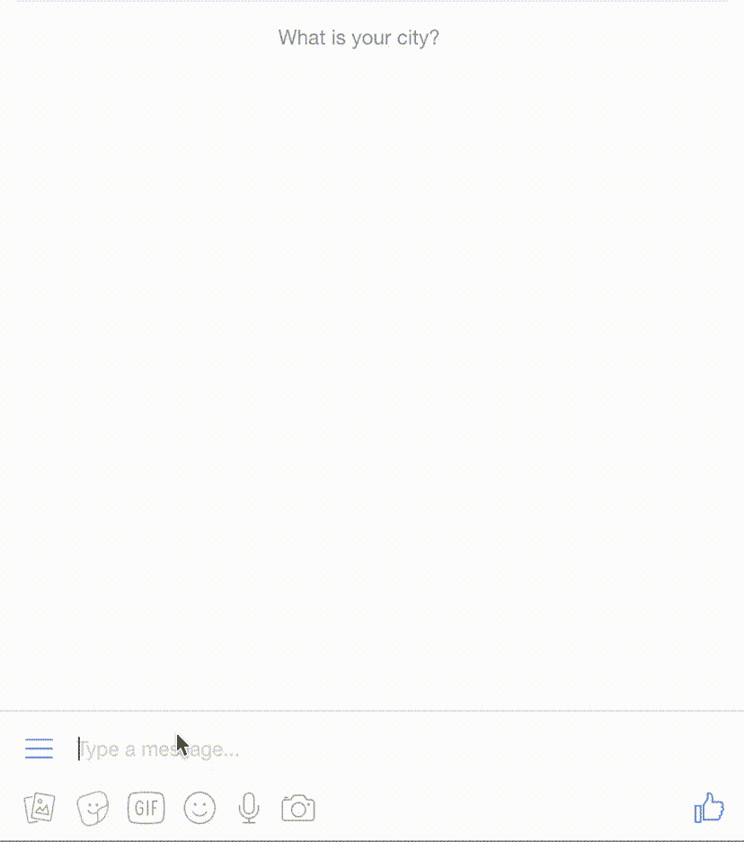*

*YAY! Our first bot that makes sense!*

*现在我们的机器人仍然非常愚蠢。只有当你输入一个有效的地址时，它才能返回坐标给你。不打招呼，不道别。如果你输入谷歌找不到的东西，它就会挂起，你必须重新启动你的机架。*

*在本教程的**第二部分**中，我们将让我们的机器人更加智能，它将能够跟上简单的对话。我们还将处理 API 不返回任何结果的情况，我们将教它查找任何位置的完整邮政地址。*

> *暂时就这些了。我希望你喜欢它！*

# *去看看第二部分吧！*

> *我们的机器人在这个开发阶段的所有代码都可以在我的 Github 上找到。*
> 
> *您可以在同一个 repo 中找到最终项目的代码(在撰写本文时仍在 WIP 中)，但是在[主分支](https://github.com/progapandist/coordinator-bot)中。**随便叉，随便克隆，随便玩。***

***免责声明** : *我是一名初学网站开发的人，曾是资深国际电视记者，也是一名对 IT 毫无经验的年轻父亲。在寻找我的第一份严肃的开发工作时，除了痴迷于编码风格并试图让我的脑袋充满技术文献之外，我最近以全班第一的成绩从巴黎的一个优秀的* [*Le Wagon*](https://www.lewagon.com/) *编码训练营毕业，并在那里与人合著了一个毕业项目*[*【midway . ninja*](http://halfway.ninja)*。这是情侣机票的比较。去看看！你可以在*[*Github*](https://github.com/progapandist)*，*[*Twitter*](https://twitter.com/progapandist)*和*[*insta gram*](https://www.instagram.com/progapanda/)*上找到我。我也拥有这个* [*域*](https://progapanda.org) *。我也可以被雇佣，无论是鼓舞人心的实习，自由职业者，甚至是全职工作。我会说英语、俄语、法语、Ruby、JavaScript、Python 和 Swift，目前在俄罗斯联邦莫斯科工作。随便* [*直接写我*](mailto:andybarnov@gmail.com) *有什么优惠(或者死亡威胁)。**

*[](http://bit.ly/HackernoonFB)**[](https://goo.gl/k7XYbx)**[](https://goo.gl/4ofytp)*

> *[黑客中午](http://bit.ly/Hackernoon)是黑客如何开始他们的下午。我们是 [@AMI](http://bit.ly/atAMIatAMI) 家庭的一员。我们现在[接受投稿](http://bit.ly/hackernoonsubmission)并乐意[讨论广告&赞助](mailto:partners@amipublications.com)机会。*
> 
> *如果你喜欢这个故事，我们推荐你阅读我们的[最新科技故事](http://bit.ly/hackernoonlatestt)和[趋势科技故事](https://hackernoon.com/trending)。直到下一次，不要把世界的现实想当然！*

**