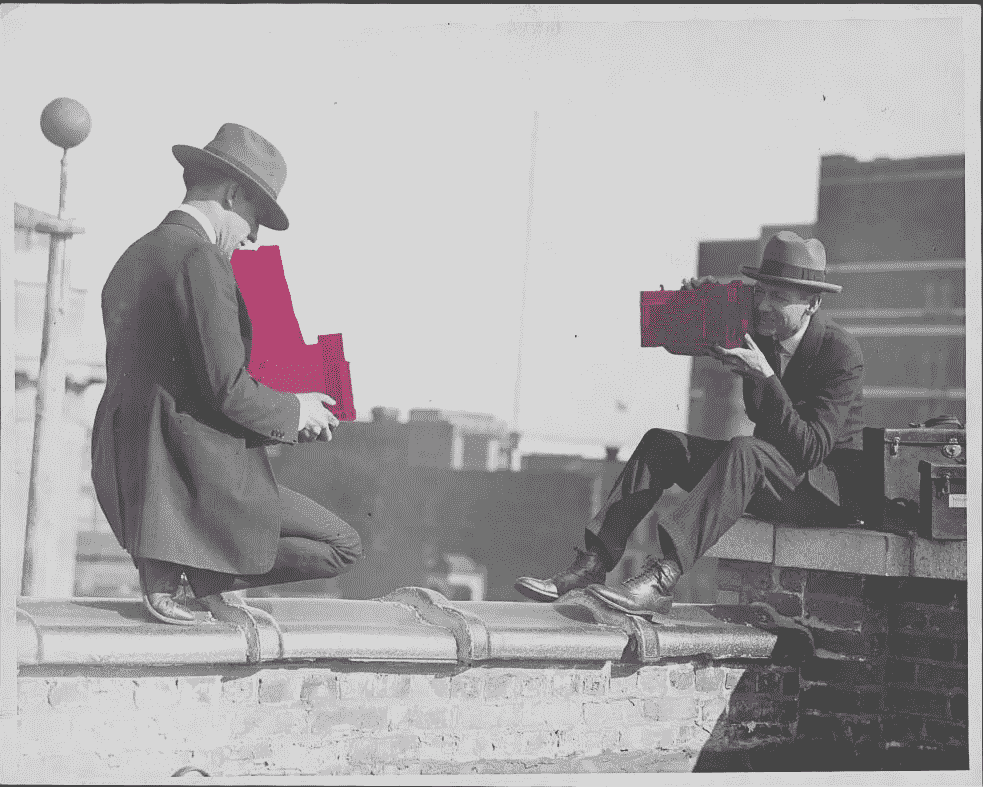
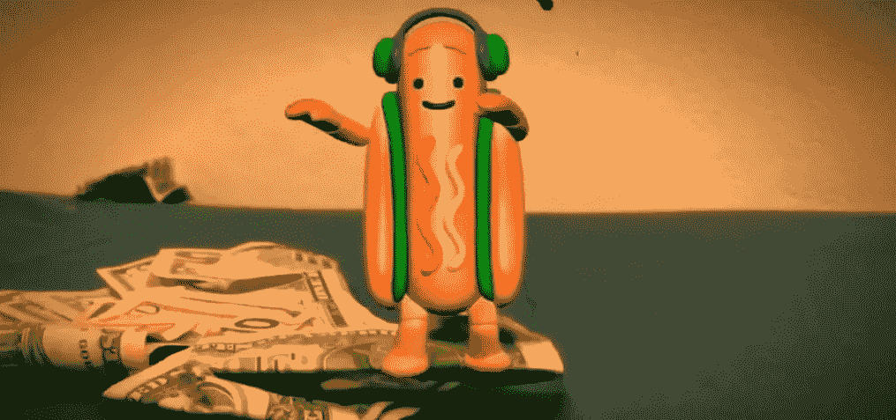

# Snap 是 AR 的 MySpace

> 原文：<https://medium.com/hackernoon/snap-is-the-myspace-of-ar-34766550f8d7>

从前，每个人都需要一个 MySpace 页面。他们很有趣，很时髦，到处都是自拍。事实上，他们[可以说将自拍](http://www.newyorker.com/tech/elements/the-return-of-the-selfie)作为一种现代现象推出，多年来“MySpace Pic”一词一直是“自拍”的同义词。然而，自拍仍然存在，而 MySpace 已经淡出。任何人提起它的唯一原因就是问为什么它在脸书活着的时候就死了，或者将它与当前的公司进行比较，问他们是否也在走 MySpace 的路。

说到这个，Snap 公司最近在忙什么？

Snap 最近因为各种错误的原因出现在新闻中。虽然 Snapchat 坚持认为他们的跳舞热狗是“[第一个 AR 巨星](https://www.fastcompany.com/40452199/snapchat-ceo-our-dancing-hot-dog-is-the-worlds-first-augmented-reality-superstar)”，但新的[皮卡丘镜头发布](https://www.engadget.com/2017/08/14/selfie-pikachu-snapchat-lens/)是他们最近做的最令人兴奋的事情——而且不是很令人兴奋。Snap 在过去三个月亏损了 4.43 亿美元，而去年同期亏损了 1.16 亿美元。哦，是的，没错。这种损失并不是新趋势。事实上，就在 2017 年初 IPO 之前，他们的首席执行官提醒潜在投资者，该公司 2016 年净亏损 5.146 亿美元，他们“可能永远无法实现或保持盈利。”然而，投资者仍然竞相向这台机器投入更多资金，认为 Snap 是向前看的，盈利迟早会到来。

现在，仅仅过了几个月，这一愿景正在被脸书的顽强决心所动摇，他决心做 Snapchat 所做的一切，而且做得更好。从抄袭镜头到引入 Instagram 故事，Snapchat 已经不在前沿。事实上，他们的一些技术落后于脸书和谷歌这样的巨头。现在，苹果正在与 Snap 并驾齐驱，他们的 ARKit 将于 2017 年底推出，适用于所有智能手机，未来仍不确定。

关于为什么脸书赢了而 MySpace 失败了，有很多理论。最有趣的一个(也是与 Snap 目前的失败最相关的)假设脸书赢得了这场战争，因为有一种叫做“空白空间管理”的东西白色空间管理背后的理念是，公司不应该被更高的愿景所指引；相反，他们应该去市场希望他们去的地方。脸书最初是一个网络平台，用户可以在这里互相发帖。但是人们想互相玩游戏，所以扎克伯格内置了应用程序(还记得 Farmville 吗？)允许在网站上进行完全不同的互动。它不仅仅是旋转。它实际上是对所有的事情说“是”,然后看看哪些事情坚持下来了。

问题是 Snapchat 不可能成为所有人的一切。他们的受欢迎程度取决于排他性；孩子们使用 Snapchat 是因为他们的父母不知道如何使用，一旦业务扩大到获得更大的基础，他们就有失去狂热粉丝的风险。此外，Snapchat 推出的短暂性妨碍了它们在其他情况下的使用能力。保存快照并在以后重新观看在技术上是可能的，但平台使它变得困难，并且以这样一种主要的方式旋转是困难的。这不是不可能的，但似乎没有采取行动的意愿。Snap 的创新是犹豫的，踮起脚尖而不是全心全意的运动。他们没有进行大规模的试验，而是在玩弄硬件，没有完全投入原创内容，通常也没有给予它蓬勃发展所需的关注。

似乎问题不再是 Snapchat 会不会倒下。相反，问题是，如果 Snapchat 是 MySpace，谁是脸书？

脸书有可能是 AR 大战中的脸书。他们出色地复制了 Snapchat 的创新，然后用卓越的工程技术推动了这些创新。他们的 Instagram 故事做得很好，他们进入 AR 的举动也很受欢迎。它们让分享创作变得容易，到目前为止，还没有其他人在他们的水平上竞争。

然后是苹果，他们的 AR 之旅才刚刚开始。他们还没有将 AR 引入消息传递(可以说在社交媒体战争中并不存在)，但他们的 ARKits 将使其他人在该平台上构建变得非常容易。可能 AR 的脸书还不存在，将通过苹果的 ARKit 建立自己(可能在这个过程中被收购)。

当然，谷歌永远是一个竞争者。他们在社交媒体上非常落后，Google Plus 和 Allo 都失败得很惨，但他们也有推出一千艘船的创新部门。时间会看他们是否能以严肃的方式闯入这个空间。

目前，如果 AR 是你想骑的马，我们会暂缓从任何人那里购买任何股票。这场比赛还远没有结束，一只跳舞的热狗不太可能跑到最后一圈。它的腿好小。

*由鹪鹩手打为* [*锤子&獠牙*](http://www.hammerandtusk.com) *。*