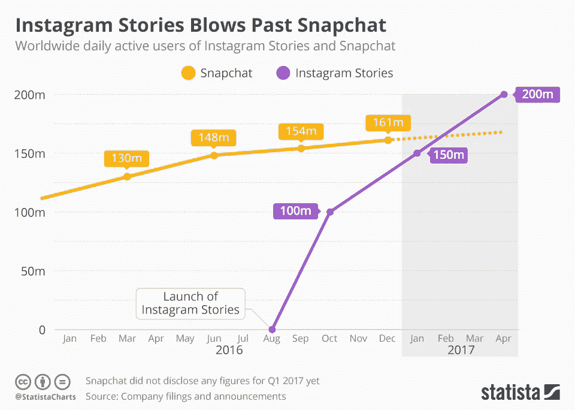
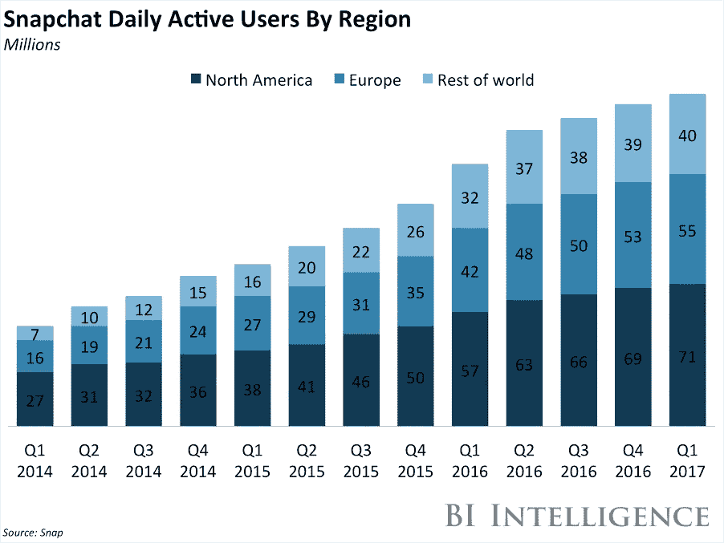

# 窃取故事来赚广告费

> 原文：<https://medium.com/hackernoon/snap-that-money-maker-46646e2d241a>

## 还能再讲一个故事吗？

似乎不太可能后，窝子的 Q1 叫:

或者是脸书在 Instagram 上第一次成功的故事闪电战后的图表:

credit: [Statista](https://www.statista.com/chart/9086/daily-active-users-instagram-stories-snapchat/)

尽管 Spiegel 对脸书抄袭 Snapchat 的担忧一笑置之，甚至称脸书为新的雅虎(😱zing) ，很难忽视我们达到最大故事容量的可能性。

脸书和 Snapchat 都从广告中赚钱，所以我们不能忘记，Stories 成为脸书热门媒体的核心原因之一是因为收入机会。

脸书公司的用户接近 20 亿。仅 Instagram 就有 7 亿月/2 亿日用户。因此，Snapchat 的规模并不是脸书掀起故事狂潮的原因。

**担心的是花在 Snapchat 上的时间。在 Instagram Stories 成为一件事情之前，人们每天在 Snapchat 上花费[30 分钟](http://expandedramblings.com/index.php/snapchat-statistics/)，而在 Instagram 上花费 1 [5 分钟](http://www.socialmediatoday.com/marketing/how-much-time-do-people-spend-social-media-infographic)。因为时间本质上是相互排斥的，在 Snapchat 上花的任何一分钟对脸书来说都是时间和金钱上的损失。**

Snapchat 在其年轻且迅速增长的用户群中对广告商有着独特的价值主张。然而，与 Instagram 相比，这一价值主张变窄了，因为 Instagram 在相同的用户群中仍然具有相关性。然而，一旦 Instagram 推出类似 Snap 的功能，人口统计学的价值主张就变窄了。

那么作为一个广告客户，差异化来自于广告产品。Instagram 与脸书更成熟的广告业务联姻，正因为如此，它利用了已建立的广告客户关系和稳定的商业模式作为交易的一部分。一个广告客户有明确的和可衡量的行为，如分享、喜欢、印象、观点等，这使得品牌账户的正反馈循环永久化。

> “Instagram 是一个粉丝平台，Snapchat 更像是一个最好的朋友平台，”VaynerMedia 平台合作伙伴副总裁丹·格罗斯曼说。" Snapchat 并没有鼓励品牌建立庞大的追随者."— [丹·格罗斯曼，韦纳尔媒体，格言](http://adage.com/article/digital/instagram-stories-appeal-snapchat-brands/305317/)

尤其是 Instagram 上的故事，Instagram 还可以在自己的 Stories feed 中提供空隙*(基本上)*。T2 还保留了自动推进功能，因此库存仍然高于 Snapchat。[一旦 Instagram 发布面部过滤器](https://www.theverge.com/2017/5/16/15643062/instagram-face-filters-snapchat-facebook-features)，Instagram 也将提供赞助过滤器，从而为 Snapchat 广告平台上的广告商留下任何独特之处(截至目前)。

# Snapchat 还能从脸书那里赢得美元吗？

🤑可能吧。

Snapchat 在几个方面稍有优势。

## 用户增长

比较每个公司在每个地区的用户增长情况:

Source: [Business Insider](http://www.businessinsider.com/snap-q1-earnings-results-2017-5)

Source: [Tech in Asia](https://www.techinasia.com/facebook-asia-growth-426-million-monthly-active-users)

虽然不完全是🍎：🍎相比之下，Snapchat 有很多机会在美国之外发展，而脸书需要首先让地球上另外 40-50 亿人上网以增加更多用户。

## 过滤器和贴纸

甚至在 Instagram 推出故事之前，就有很多人从 Snapchat 下载视频和快照，并发布在 Instagram 上。Snapchat 的内部创意设计机构无法像 Instagram 采用的其他 Snapchat 功能那样被模仿。我仍然觉得 Snapchat 上的镜头比脸书(c/o MSQRD)上的面部滤镜更令人愉快。

MSQRD 的人脸滤镜做的极其好，也许太好了。Snapchat 的镜头有趣、愚蠢或令人恐惧，因此它在每个镜头中都唤起了许多情感。而 MSQRD，要么非常生活化，要么毫无新意。

Snapchat left, MSQRD right. Both jarring for different reasons

## 然而，更好的镜头并不能为 Snapchat 创造防御护城河。

脸书可以做的是在过滤器方面变得更具竞争力，这有两个方面:真正提升 MSQRD 提供的奇异/怪异因素，比如川普面具(暂时忽略任何法律影响)，以及变得真正可爱。如果创建内容是脸书关心的问题，那么创建引人注目的过滤器将不仅有助于增加应用程序的内容创建*和*时间，还能把那些有价值的眼球留在脸书家族内部。

Snow filter, so kawaii

Instagram 应该考虑从 [Snow](https://www.nytimes.com/2016/07/06/technology/snapchat-snow-korea.html) 那里偷点人才，这是一个韩国 Snapchat，有这么多可爱有趣的滤镜。当谈到滤镜时，用户显然是不知道应用程序的，因为我已经看到 Snapchat 和 Snow 滤镜都出现在 Instagram 帖子上。用户知道 Instagram 有影响力，但因为他们可以下载他们的照片，他们不需要忠于任何一个平台，仍然可以挑选出最好的过滤器。随着消失的图片和文本越来越成为一种商品，这对 Snapchat 和脸书来说都将是一个挑战。

# 只是为了好玩:脸书 Snapchat 抢劫循环

c/o the ever so talented [Damien Beard](http://theroamingdev.com)

以下是脸书和 Snap 相互借鉴的功能列表:

## FB 取自快照

*   故事
*   自动推进故事(Snapchat 已移除此功能)
*   镜头和滤镜
*   通过 vis 直接消息传递终止文本/图像
*   位置标签(但更精细)
*   在视频中粘贴标签
*   倒带视频

## 从 FB 拍摄快照

*   回飞镖
*   位置标签(但更精细)

## 脸书还没有拿走的东西

*   快进视频过滤器
*   Snapchat 的表情符号画笔
*   “世界镜头”
*   [这份专利申请清单上的所有东西](https://www.cbinsights.com/blog/snapchat-patents/)
*   “神奇画笔”
*   比特莫吉
*   可搜索的贴纸

我错过什么了吗？让我知道👇

> [黑客中午](http://bit.ly/Hackernoon)是黑客如何开始他们的下午。我们是 [@AMI](http://bit.ly/atAMIatAMI) 家庭的一员。我们现在[接受投稿](http://bit.ly/hackernoonsubmission)并乐意[讨论广告&赞助](mailto:partners@amipublications.com)机会。
> 
> 如果你喜欢这个故事，我们推荐你阅读我们的[最新科技故事](http://bit.ly/hackernoonlatestt)和[趋势科技故事](https://hackernoon.com/trending)。直到下一次，不要把世界的现实想当然！

