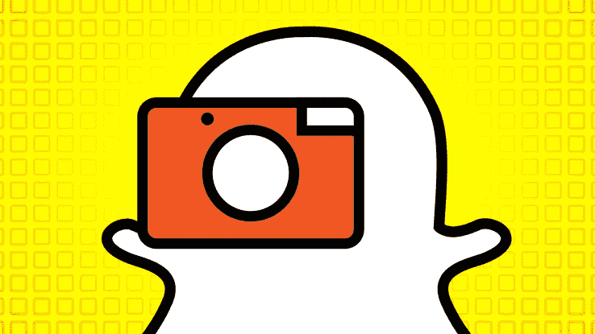

# Snapchat 的竞争优势可能并不像它认为的那样

> 原文：<https://medium.com/hackernoon/snapchats-competitive-advantage-may-not-be-what-it-thinks-it-is-659e809758c7>

在今年早些时候低于标准的 IPO 之后， [Snapchat](https://hackernoon.com/tagged/snapchat) 一直面临着一系列关于其增长战略和数据的问题和评论，当脸书的 Instagram 决定[在自己的游戏中击败它](https://www.thequint.com/technology/2017/05/11/snapchat-user-growth-falls)时，这些问题和评论变得更加严重(仅从用户增长数据来说)。此外，Snapchat 的烧钱率相当高，因为它将大部分计算资源外包给了谷歌云等服务。

**抛开不利因素不谈，Snapchat 是不是出了大问题？还是说，它有一个未公开的、突破性的长期战略？**

Snapchat (Snap) 的战略基于**高速常规创新**以保持竞争领先，然而**脸书**对种子成长具有**无与伦比的网络效应。虽然脸书的模仿方法获得了很好的回报，但它的一位设计工程师[提到](https://www.quora.com/How-do-Facebook-designers-feel-about-duplicating-Snapchat-in-Instagram-Messenger-WhatsApp-and-so-on/answer/Mills-Baker)“故事是一种格式，而不是一个应用程序”，这基本上意味着脸书增加这些功能是为了增强他们应用程序的 UX。这可以和苹果从施乐公司“偷走”鼠标相提并论——这真的是偷窃吗？大概不会。史蒂夫将鼠标视为一种与苹果公司正在制造的计算机进行交互的方式，其目的也是为了增强 UX。他们没有公然对施乐鼠标进行逆向工程，并将其捆绑在麦金塔电脑上；他们是根据自己的设计理念建造的。让我们把关于脸书是否是一个模仿者的争论放在一边，我宁愿在一篇单独的文章中讨论它。**

**产品创新本身是一种自给自足的战略吗？**

> **最没用的事莫过于有效地做那些根本不应该做的事。彼得·德鲁克**

**没有精心策划的战略的创新就像是在空气中射飞镖。在这方面，脸书的战略非常明确——基于 Snapchat 的功能，在其平台上为用户提供更身临其境的体验。另一方面，Snapchat 将其信心建立在独自创新的能力上。**

# ****前方另一条路****

**因为 Snap 自称是一家相机公司，这是相当真实的，因为它实际上已经在这个古老的硬件上进行了彻底的创新。但它仍然是一个应用程序，一个产品，有一天可能会被推翻。**

**平台往往有更长的可持续寿命，因为存在转换成本和历史因素，它们随着存在而不断构建，这使得用户或竞争对手很难复制。让我们以脸书的信使为例:脸书将信使上的“标签”转变为市场而不仅仅是一个功能的方式，使得创新变得更加快速和激进，因为它变得分散化，对创造者开放。**

**同样，如果 Snapchat 专注于为其底层过滤器构建技术，并使其成为其业务的核心，那么如果他们使其成为智能手机上的默认相机应用程序，并覆盖全球数十亿台设备，可能会与 Android 产生似乎合理的协同效应。同样，如果他们可以授权自己的软件来增强佳能或尼康等公司现有的相机，就像 Android 在智能手机领域的商业模式一样，他们就可以再次利用自己的生态系统。事实上，即使这样的飞跃是不可能的，他们也可以将自己的滤镜变成一个市场，让开发者和创作者可以为其相机应用程序构建迷人的新滤镜和体验。这将从本质上使它成为一个难以复制的快速创新平台，而不仅仅是市场上的一个应用程序。**

**谢谢你停下来听这个冲动的观点！我也很想听听你的想法:)**