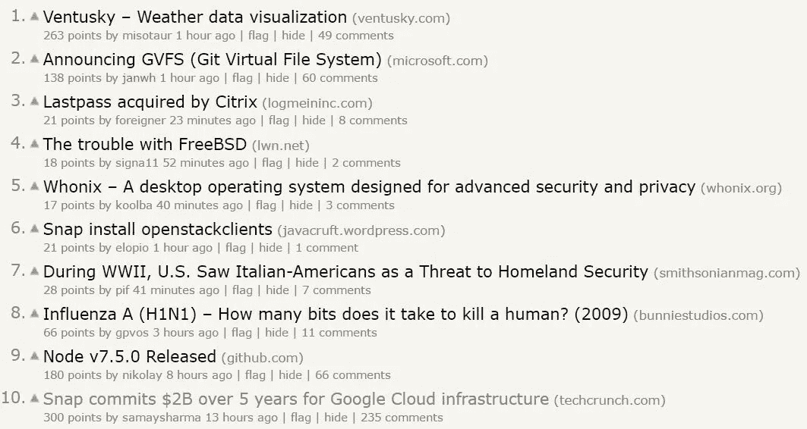
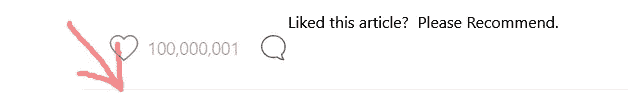

# Snap 斥资 20 亿美元收购谷歌云平台背后的战略

> 原文：<https://medium.com/hackernoon/snaps-2-billion-gcp-purchase-is-strategic-e6ce3ef5f5e1>

Snap 宣布将在未来五年内使用[谷歌](https://hackernoon.com/tagged/google)云平台【GCP】*用于其基础设施，总价值达 20 亿美元，这引起了[技术](https://hackernoon.com/tagged/tech)社区的极大关注。*

> 它甚至在同一天以两个不同的故事登上了黑客新闻的头版！

一天后，仍然排在前 10 名。

大部分注意力都放在了购买还是建造的争论上。对任何规模的公司来说，这都是一个问题。Snap 应该构建自己的基础架构还是外包给大型提供商？和$2B？似乎很多。

但这也与联盟有关，甚至比科技更重要。

考虑到 Snap 的计算和带宽需求以及未来增长的潜力，如果你认为你必须选择亚马逊、谷歌或微软中的一家，那么真的只有三个选择。

但是，谷歌正在建立平台。这是自 20 世纪 80 年代和 90 年代微软主宰个人电脑以来从未有过的。没错，苹果拥有庞大的客户群，但 G 在企业领域的发展要比苹果好得多。

Snap 决定与谷歌合作，这是一个更有意义的战略商业决策，而不仅仅是选择一家基础设施提供商。

**考虑到:**

谷歌在客户端取得了巨大的成功。不仅仅是 Android(15-20 亿用户)，还有 Chrome(> 10 亿用户)。谷歌正在整合其客户端和服务器端技术。

再看 JavaScript 技术 *Web 推送*。这是一种推送通知技术，在 Chrome 中，必须与谷歌消息服务一起使用。Chrome 原生支持保存到 Firebase 还要多久？

谷歌正在连接他们的客户端和服务器产品。简而言之，AWS 是一个发电站，但在 AWS 和微软之间，谷歌是现代计算的真正力量。他们制定标准并拥有消费者平台。
亚马逊没有。

因此，从基础架构的角度转向业务管理的角度。你更愿意与谁结盟？在你的成功中，你想让谁成为你的赌注？Snap 现在有大把的现金。

Snap 一举成为 GCP 最大的客户之一。Snap 的成功与 g 有利害关系。联盟。

在未来的几年里，GCP 将会变得很大。如果你在 IT 部门工作，看看有多少基础设施仍在内部维护。

就购买和建造而言，我认为

> 喜欢运行内部服务器、网络和管理的 IT 员工
> 首席信息官讨厌运行内部服务器、网络和管理

从宇航服的角度来看，Snap 的决定比从技术角度来看更有意义。

> [黑客中午](http://bit.ly/Hackernoon)是黑客如何开始他们的下午。我们是 [@AMI](http://bit.ly/atAMIatAMI) 家庭的一员。我们现在[接受投稿](http://bit.ly/hackernoonsubmission)，并乐意[讨论广告&赞助](mailto:partners@amipublications.com)机会。
> 
> 如果你喜欢这个故事，我们推荐你阅读我们的[最新科技故事](http://bit.ly/hackernoonlatestt)和[趋势科技故事](https://hackernoon.com/trending)。直到下一次，不要把世界的现实想当然！

