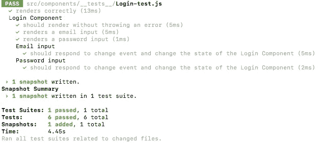
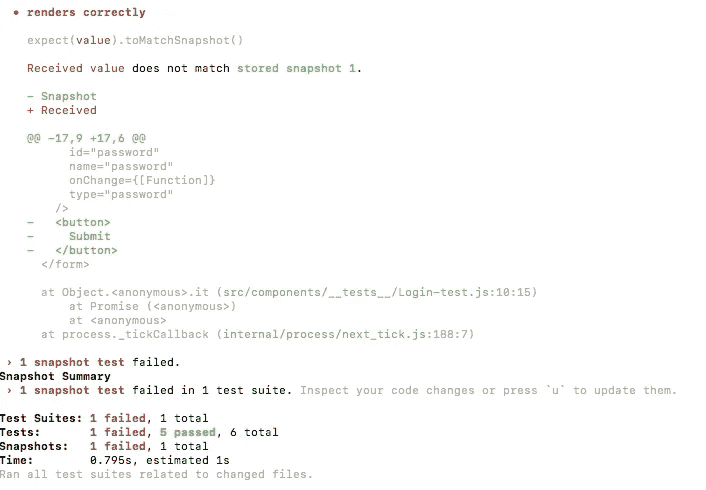
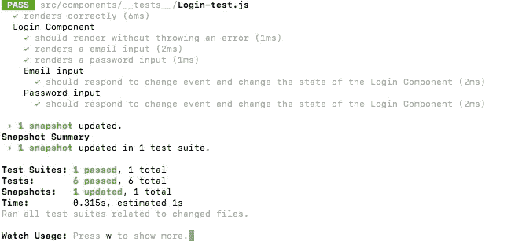
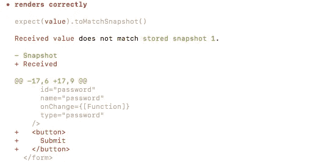
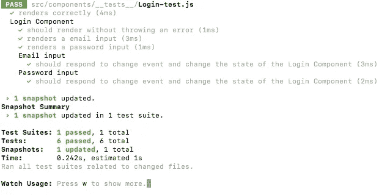

# 快照测试用 Jest 反应组件

> 原文：<https://medium.com/hackernoon/snapshot-testing-react-components-with-jest-744a1e980366>

在我的[上一篇关于使用 Jest 和酶来测试 React 组件的文章](https://hackernoon.com/implementing-basic-component-tests-using-jest-and-enzyme-d1d8788d627a)之后，我想更深入地了解 Jest 本身能做什么。通过使用内置的功能，很容易跟踪你的组件和他们渲染什么，或者如果他们渲染。所以让我们开始快照测试吧！

# 什么是快照测试？

快照测试顾名思义。Jest 获取它正在测试的组件，呈现它，然后获取该组件的快照。当你继续你的项目时，每次你运行你的测试套件，Jest 将会重复这个过程，并且将旧的快照和新的快照进行比较。如果快照不匹配，则会在终端中显示一条错误消息，并突出显示不匹配的部分。

快照测试虽然非常有用，但不被认为是 TDD。快照测试需要一个已经编写好的组件，这样它就可以给它拍照了。快照测试还依赖于组件已经正确呈现的事实。TDD 要求您为最初失败的组件编写测试，当您对组件进行编码时，它会通过测试。因此，虽然快照测试不是 TDD，但它仍然是跟踪组件并确保它们不会意外更改的有用工具。

# 设置快照测试

因此，要开始测试，我们需要在测试文件的顶部导入一些东西，并下载一个包。我们将使用 React 测试渲染器包提供的渲染器。要安装它，只需运行以下代码，

```
npm install react-test-renderer
```

安装之后，我们需要用 React 和我们正在测试的组件将它导入到我们的文件中。现在我们已经导入了所有这些，我们可以开始编写快照测试了。

```
// app/src/components/__tests__/Login-test.jsimport React from 'react';
import renderer from 'react-test-renderer';
import Login from '../Login';
```

我将使用我在上一篇文章中使用的登录组件。我的组件看起来像这样

```
// app/src/components/Login.jsimport React from 'react'class Login extends React.Component {constructor() {
  super()
  this.state = {
   username: '',
   password: ''
  }
 }handleInputChange = (event) => {
  this.setState({
   [event.target.name]: event.target.value
  })
 }render() {
  return (
   <form className='login'>
    <label>Username</label>
    <input id='email' onChange={this.handleInputChange} name='email' type='text' />
    <label>Password</label>
    <input id='password' onChange={this.handleInputChange} name='password' type='password' />
    <button>Submit</button>
   </form>
  )
 }
}export default Login
```

我的测试文件看起来已经是这样了，

```
// app/src/components/__tests__/Login-test.jsimport React from 'react';
import { shallow, mount, render } from 'enzyme';
import Login from '../Login'
import renderer from 'react-test-renderer';describe('Login Component', () => { it('should render without throwing an error', () => {
    expect(shallow(<Login />).exists(<form className='login'></form>)).toBe(true)
   }) it('renders a email input', () => {
    expect(shallow(<Login />).find('#email').length).toEqual(1)
   }) it('renders a password input', () => {
    expect(shallow(<Login />).find('#password').length).toEqual(1)
   })

   describe('Email input', () => {

    it('should respond to change event and change the state of the Login Component', () => {
     const wrapper = shallow(<Login />)
     wrapper.find('#email').simulate('change', {target: {name: 'email', value: '[blah@gmail.com](mailto:blah@gmail.com)'}})
     expect(wrapper.state('email')).toEqual('[blah@gmail.com](mailto:blah@gmail.com)')
    })
   })

   describe('Password input', () => {

    it('should respond to change event and change the state of the Login Component', () => {
     const wrapper = shallow(<Login />)
     wrapper.find('#password').simulate('change', {target: {name: 'password', value: 'cats'}})
     expect(wrapper.state('password')).toEqual('cats')
    })
   })
})
```

这些测试并不重要，但我想提供它们，因为它们稍后会出现在终端中。因此，如果你在这里查看 Jest [的文档，你可以看到如何创建快照的样本代码。我们所做的是调用 renderer 对象上的 create 函数，并将组件作为参数传入。我将添加到测试文件中的新代码是这样的，](https://facebook.github.io/jest/docs/en/snapshot-testing.html)

```
// app/src/components/__tests__/Login-test.jsit('renders correctly', () => {
  const tree = renderer.create(
    <Login />
  ).toJSON();
  expect(tree).toMatchSnapshot();
});
```

运行时，渲染器会渲染组件。然后在下一行中，我们检查我们渲染的组件是否与之前的快照匹配。当我们运行 npm 测试时，Jest 会在 __tests__ 文件夹中创建一个名为 _ _ snapshots _ _ 的新文件夹，并在该文件夹中为每个快照测试创建一个文件。因为我的测试文件被命名为 Login-test.js，所以自动创建的快照是 Login-test.js.snap。

```
// app/src/components/__tests__/__snapshots__/Login-test.js.snap
// Jest Snapshot v1, [https://goo.gl/fbAQLP](https://goo.gl/fbAQLP)exports[`renders correctly 1`] = `
<form
  className="login"
>
  <label>
    Username
  </label>
  <input
    id="email"
    name="email"
    onChange={[Function]}
    type="text"
  />
  <label>
    Password
  </label>
  <input
    id="password"
    name="password"
    onChange={[Function]}
    type="password"
  />
  <button>
    Submit
  </button>
</form>
`;
```

这只是我们的组件在呈现时的外观的一个表示。终端将显示此消息，表明我们创建了一个新快照。它看起来像这样，



Snapshot is created

假设我们不小心删除了提交按钮。当我更改组件并保存文件时，我在控制台中得到一个错误，让我知道组件看起来不正确。它用绿色突出显示了我缺少的代码，如果我要添加一些以前没有的代码，它会用红色突出显示。



Our component is missing the button shown in green

查看错误消息 Jest 给了我们一点帮助。它告诉我们检查我们的代码更改，如果我们的组件是我们想要它呈现的，我们可以键入 u 来更新快照。当我输入 u 时，测试再次运行，我得到一个通过的快照测试。



Snapshot is updated

但这是不对的，因为我需要那个按钮来提交我的表单。当我将它添加回去时，您可以看到按钮现在显示为红色，这意味着它是添加到组件中的代码。



Our snapshot does not contain the button so it shows up in red

如果我再更新一次，我们就可以按照我想要的方式恢复组件，并且所有测试都通过了。



Everything is back to normal and our snapshot is correct once again.

# 摘要

如你所见，快照测试是一个非常强大的工具，可以跟踪组件的任何变化。如果有意外的变化，Jest 会提醒你。然后，您只需键入 u 来更新您的快照，或者检查您的代码并修复问题区域。随着应用程序代码库的增长，这可能是监控所有组件和捕捉 bug 的最佳方式。就像我前面提到的，这并不能取代测试或 TDD，但是可以补充它，并且是监控代码的有用工具。因为这很容易做到，所以没有理由不实现快照测试！

# 来源:

[](https://facebook.github.io/jest/docs/en/snapshot-testing.html) [## 快照测试笑话

### 当你想确保你的用户界面不会发生意外变化时，快照测试是一个非常有用的工具。典型的…

facebook.github.io](https://facebook.github.io/jest/docs/en/snapshot-testing.html)