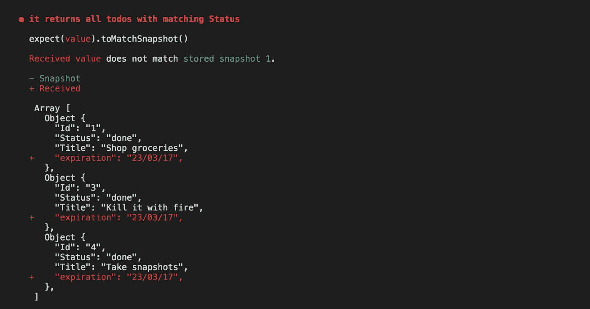

# Jest 快照测试—超越 React 组件

> 原文：<https://medium.com/hackernoon/snapshot-testing-with-jest-beyond-react-components-7630fd0024c5>

快照是测试 [UI](https://hackernoon.com/tagged/ui) 组件的一种很棒的新方法，但是它们的适用性不止于此，它们在其他环境中也非常有用。

**实际上，使用 Jest 快照可以测试和断言任何可序列化值的输出。**

让我们假设以下场景:我们有一个 todos 列表(Array <obj>)，在我们的应用程序中，我们希望能够通过它的一个属性来过滤它们。让我们为它写一个函数和一些测试:</obj>

```
**var** ToDos = [
  { 'Id': '1', 'Title': 'Shop groceries', 'Status': 'done' },
  { 'Id': '2', 'Title': 'Go to gym', 'Status': 'pending' },
  { 'Id': '3', 'Title': 'Kill it with fire', 'Status': 'done' },
  { 'Id': '4', 'Title': 'Take snapshots', 'Status': 'done' },
  { 'Id': '5', 'Title': 'Be awesome', 'Status': 'pending' },
];function filterTodos(arr, key, term) {
  return arr.filter(function(obj) {
    return obj[key] === term
  });
}test('it returns all todos with matching Id',() =>{
  expect(filterTodos(ToDos,'Id', '1')).toBe(
    { 'Id': '1', 'Title': 'Shop groceries', 'Status': 'done' }
  )
})test('it returns all todos with matching Title',() =>{
  expect(filterTodos(ToDos,'Title', 'Shop groceries')).toBe(
    { 'Id': '1', 'Title': 'Shop groceries', 'Status': 'done' }
  )
})test('it returns all todos with matching Status',() =>{
  expect(filterTodos(ToDos,'Done', 1)).toBe(
    { 'Id': '1', 'Title': 'Shop groceries', 'Status': 'done' },
    { 'Id': '3', 'Title': 'Kill it with fire', 'Status': 'done' },
    { 'Id': '4', 'Title': 'Take snapshots', 'Status': 'done' }
  )
})
```

通常，当测试这样的功能时，我们需要一个模拟的 todos 列表，然后我们需要手动断言预期的返回值。

> 一切都很好，但是，如果将来我们需要改变我们的数据，我们需要手动更新每个测试。

假设我们有了一个新的需求，要求所有的待办事项都应该有一个带有到期日期的到期密钥。然后，我们必须手动更新我们的数组和每个测试用例的返回值。这可能很麻烦，特别是在一个具有更复杂功能的大型应用程序中。

借助快照，我们可以复制同样的测试场景:

```
**var** ToDos = [
  { 'Id': '1', 'Title': 'Shop groceries', 'Status': 'done' },
  { 'Id': '2', 'Title': 'Go to gym', 'Status': 'pending' },
  { 'Id': '3', 'Title': 'Kill it with fire', 'Status': 'done' },
  { 'Id': '4', 'Title': 'Take snapshots', 'Status': 'done' },
  { 'Id': '5', 'Title': 'Be awesome', 'Status': 'pending' },
];function filterTodos(arr, key, term) {
  return arr.filter(function(obj) {
    return obj[key] === term
  });
}test('it returns all todos with matching Id',() =>{
  expect(filterTodos(ToDos, 'Id', '1')).toMatchSnapshot()
})test('it returns all todos with matching Title',() =>{
  expect(filterTodos(ToDos, 'Title', 'Shop groceries')).toMatchSnapshot()
})test('it returns all todos with matching Status',() =>{
  expect(filterTodos(ToDos, 'Status', 'done')).toMatchSnapshot()
})
```

这将为您提供以下快照:

```
// Jest Snapshot v1, [https://goo.gl/fbAQLP](https://goo.gl/fbAQLP)exports[`it returns all todos with matching Id 1`] = `
Array [
  Object {
    "Id": "1",
    "Status": "done",
    "Title": "Shop groceries",
  },
]
`;exports[`it returns all todos with matching Status 1`] = `
Array [
  Object {
    "Id": "1",
    "Status": "done",
    "Title": "Shop groceries",
  },
  Object {
    "Id": "3",
    "Status": "done",
    "Title": "Kill it with fire",
  },
  Object {
    "Id": "4",
    "Status": "done",
    "Title": "Take snapshots",
  },
]
`;exports[`it returns all todos with matching Title 1`] = `
Array [
  Object {
    "Id": "1",
    "Status": "done",
    "Title": "Shop groceries",
  },
]
`;
```

那么对 todos 数组的更新将导致测试失败，并产生以下输出:



如果这个新输出是预期的，我们可以简单地通过运行`` `$ jest — updateSnapshots 命令在所有测试用例中复制它，不需要遍历每个测试并更新它的返回值。

> 这就是为什么快照对于具有复杂和频繁变化的需求的应用程序非常有用，并且是一个非常好的测试工具，它的适用性可以远远超出 react 组件。

**资源:**

 [## 西贝柳斯·塞拉菲尼的《到处开玩笑》

### 编辑描述

jest-everywhere.now.sh](https://jest-everywhere.now.sh/#/?_k=vkg4ky)