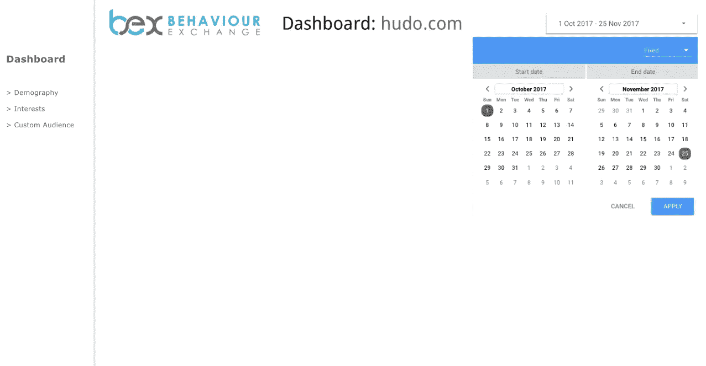
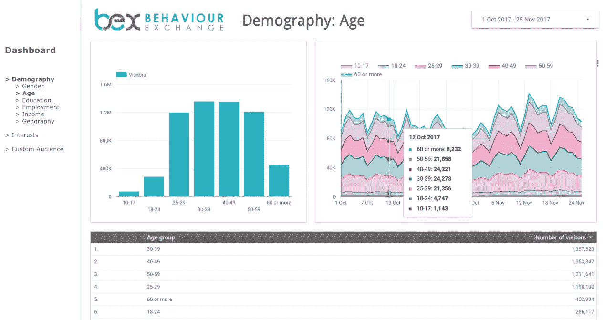
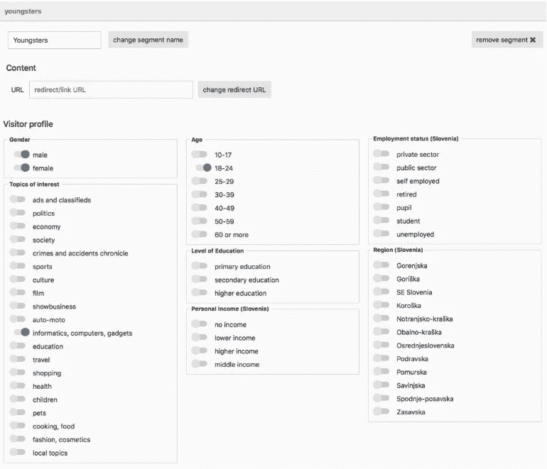
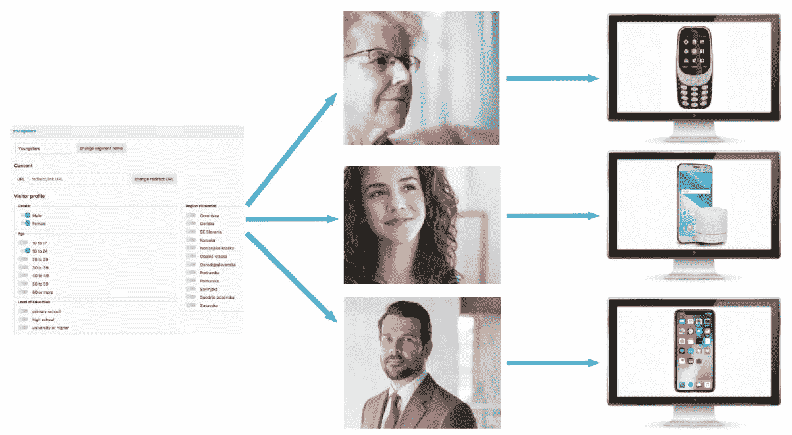

# 行为交换用户界面预览

> 原文：<https://medium.com/hackernoon/sneak-peek-of-behaviourexchange-user-interface-5dd615bce827>

BehaviourExchange 用户界面在斯洛文尼亚的区块链和比特币大会上公开。演示结束后，我们收到了惊人的反馈，让很多人对这个项目感兴趣。

[BehaviourExchange](http://behaviour.exchange) 实时提供每个在线访问者的唯一身份，并详细描述访问者的人口统计特征和兴趣。行为交换技术能够根据每个访问者的个人资料来调整内容。

我们非常自豪能够向我们忠实的社区展示我们的用户界面。

当您打开用户界面时，在顶部您会看到您正在监控的网页，在左侧有一个显示人口统计、兴趣和自定义受众的仪表盘菜单。在右侧的时间窗口中，您可以选择报告的时间段(可以是每天、每周、每月或每年)。

选择期间后，会以图表和表格的形式显示报告。所有的图表都是交互式的，所以如果你把鼠标放在上面，你会得到更多关于访问者的详细信息。

## **而现在最好的部分**[**behaviour exchange**](http://behaviour.exchange)**技术:网站内容实时定制。**

如果您对特定的受众特别感兴趣，您可以在我们的用户界面中定义它。例如，如果你对年轻人感兴趣，你可以通过设置参数来定义定制受众:男性和女性，年龄在 18 至 24 岁之间，对技术、计算机和小工具感兴趣。

在你选择了你的受众后，你会得到一份针对青少年的图表报告。你可以在你的网站上看到数字数据和所有访问者中年轻人的比例。

现在，让我们想象一下，你拥有一家非常成功的电信公司，你想向不同的客户展示不同的内容/产品。在我们的用户界面中，你只需简单地定义你想要访问的访问者，例如年长的女士、十几岁的女孩或商人，我们的技术将立即实时地向每个访问者显示适当的内容。年长的女士会看到一个简单易用的手机的报价，十几岁的女孩会看到最新的手机和一个小工具，一个商人会看到一个高端手机的报价。

我们正处于最后的开发阶段，所以期待更多的功能即将到来。关注 [**行为交换**](http://behaviour.exchange) **项目！**

感谢您信任我们。如果您对投资感兴趣，请通过 investments@behaviour.exchange 联系我们