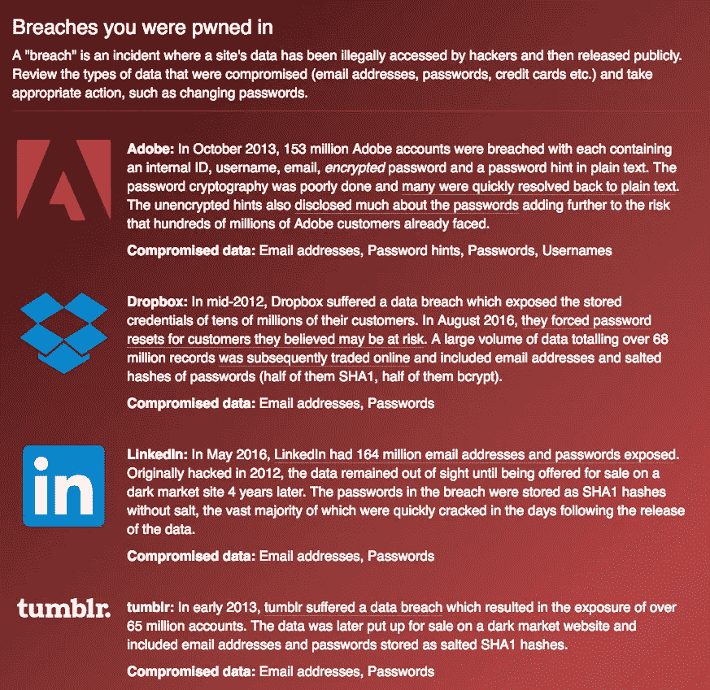
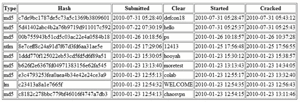
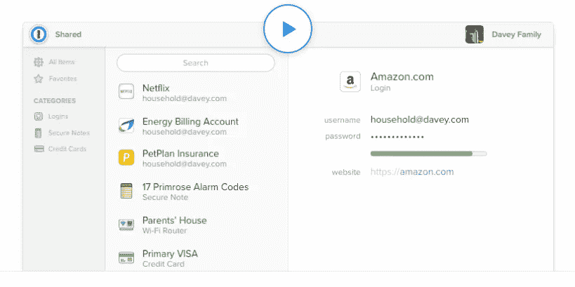
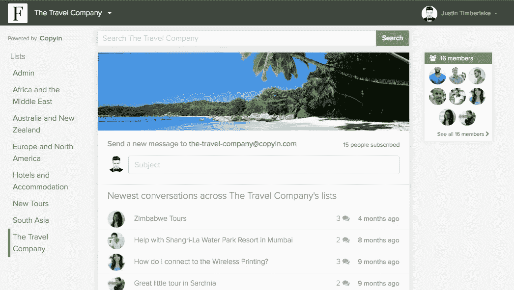

# 所以 Dropbox 被黑了…

> 原文：<https://medium.com/hackernoon/so-dropbox-got-hacked-aa4b4a6435fc>

Websites who have accidentally leaked my email/password in the past

本周有消息称，大约四年前，Dropbox 的所有电子邮件地址和密码都遭到了黑客攻击。真扫兴。你是其中之一吗？如果你的 Dropbox 早于 2012 年，那么是的。如果你不确定，那么去[https://haveibeenpwned.com](https://haveibeenpwned.com)看看。

所以你现在已经更改了你的 [Dropbox](https://hackernoon.com/tagged/dropbox) 密码？很好，做得好。Dropbox 现在对您来说再次安全了。不过有个小问题——这是你唯一使用电子邮件/密码组合的地方吗？你知道，matt99@gmail.com/猴子，或者你用它在亚马逊/苹果/ Gmail 或你的任何其他账户。

在我们继续之前，让我说，在这种情况下，你可能是安全的，即使你做了。这是因为 Dropbox 仔细加密了你的密码。但是把这当成一次消防演习，因为情况并不总是这样。 **Dropbox 被黑是 LinkedIn** 早些时候被黑的结果。[**LinkedIn 的密码并没有全部安全加密**](https://motherboard.vice.com/read/another-day-another-hack-117-million-linkedin-emails-and-password) ，其中一个密码属于 Dropbox 的一名员工，他在 Dropbox 公司网络中使用了相同的用户名和密码。正是这个密码被用来进入 Dropbox 网络，然后访问他们的数据库和密码。

现在我要用非常简单的术语向你解释网站如何加密你的密码，以及为什么当你使用强密码时会有所不同。

Are you listening? Good then I shall begin.

所以这才是大问题。人们在任何地方都使用相同的密码。这意味着当出现这种数据泄露时，密码通常可以在其他地方使用(就像 LinkedIn 的密码一样)。当数以百万计的密码被破解时，黑客们所做的就是在他们可以赚钱的有趣网站上集体尝试这些密码，比如亚马逊、苹果和贝宝。或者用它们侵入 Dropbox 之类的公司网络。或者你的。

如果你在任何地方都使用不同的密码，那么他们只能访问被黑的原始网站。但如果你不这么做，你的苹果、亚马逊和贝宝账户也会突然被黑。都是因为硅谷的一个员工在两个网站用了同一个密码。可怕吧？

# 网站如何保护您的密码

当您注册网站并设置密码时，该网站会存储该密码，以便您下次再次访问时可以检查它。这以三种方式之一发生:

## 它存储它没有加密(非常糟糕)

这就像在没有密码保护的电子表格中写下它一样。这是非常不安全的，因为当有人访问电子表格时，他们就会得到你的密码。有很多旧的或廉价的网站仍然这样做，所以总是做最坏的打算。黑客不需要做任何事情来解密你的密码。他们只是找到它们，然后在暗网上卖给那些想把它们变现的人。

## 它使用一种简单的加密形式(更好)对其进行加密

这是更好的一步。你的密码现在被加密了，所以很难看出原来的密码是什么。加密很难撤销，而且计算量很大。

嗯，除了现在没有那么多…以前是这样，直到有一天有人说——嘿，为什么我不加密所有的单词，然后我会有一个单词+加密单词的大表。我不需要再费心去解密密码了，我只需要查找加密的版本，看看原来的是什么。这就是所谓的*彩虹桌。*

A rainbow table showing the encrypted password (hash) and the original version (clear)

这些彩虹表列出了所有常见的单词和密码以及它们的加密版本，然后让别人反过来查找它们。假设你是一名黑客，你有一个密码的加密版本:d 0763 EDA a9 d 9 BD 2 a 9516280 e 9044d 885。你所需要做的就是拿着它去一个像 [Crackstation](https://crackstation.net/) 这样的网站，在那里你可以粘贴它(试试看它能不能工作)，它会查找并告诉你原来的密码是什么。这是单词*猴子*的加密版本。

You found me

## 它使用盐加密它(最好)

彩虹表并没有涵盖世界上所有可能的字母和数字串——这样做太难了，需要太多的计算能力(也是不可能的)。所以他们只能选择有限的字母和数字组合，就像所有的单词或短语一样。彩虹表有效的原因是大多数人使用简单的密码。许多人使用糟糕的密码。

[2015 年十大密码分别是](https://www.teamsid.com/worst-passwords-2015/):

> 1.123456
> 2。密码
> 3。12345678
> 4。qwerty
> 5。12345
> 6。123456789
> 7。足球
> 8。1234
> 9。1234567
> 10。棒球

(*猴子*落后六位排在第 18 位)

现在请记住，彩虹表是通过遍历一系列密码，预先加密(耗时)以便以后可以(快速)查找而制成的。然而，没有计算能力或磁盘空间来创建所有可能的数字和字母组合的表格。所以彩虹表只涵盖了创建者有预算加密的密码范围。

让你的密码不那么容易被破解的下一步是降低彩虹表包含它的可能性。你可以通过使用一个更长或不常用的密码来做到这一点(对不起，但*足球*？).或者……网站可以帮你做到这一点。他们通过生成一个巨大的随机字母/数字组合来做到这一点，并在使用密码之前将其贴在密码的末尾。

每次你在这样做的网站上创建密码时，该网站也会为你创建一个随机字符串，比如 51dc30ddc473d4。然后，它将该字符串添加到您的密码中，使其成为 monkey 51 DC 30 DC 473d 4，然后对其进行加密。

当您下次登录时，它会再次做同样的事情。它获取您提交的密码“monkey”并将其添加到 salt(它单独存储)“51dc30ddc473d4”中，对两者的组合进行加密，并根据存储的加密版本检查结果。如果匹配，网站会让你进入。

**你的密码**:猴子
盐 : 51dc30ddc473d4
**密码和盐:**monkey 51 DC 30 DDC 473d 4 **加密版**11ec 055 CD 41848 a7d 684 e 104525 c 8439

现在尝试在 [Crackstation](https://crackstation.net/) 输入这个。它不会找到的。因为创建彩虹表的家伙最初没有尝试加密*monkey 51 DC 30 DC 473d 4*因为那样会太昂贵(实际上是大量的计算成本)。

因此，这一点是，它基本上使得生成一个查找表来让您解开密码/盐组合的成本太高(记住，计算机可能很快，但它们需要钱)。

# 看在上帝的份上，用密码管理器吧

总之，当一个大网站遭到黑客攻击，密码被泄露时，黑客可以解开这些加密的密码，得到原始的密码。然后他们在所有其他大网站上尝试。因此，如果你是 LinkedIn 黑客的一员，并在亚马逊使用了相同的密码，黑客将能够使用你的 LinkedIn 用户名/密码进入你的亚马逊账户。

我认为你应该考虑买一个密码管理器。但是你不应该考虑它。你必须得到一个。如果你不这样做，那你就把自己的头埋在沙子里，比支持特朗普的英国退欧者还要深。所以，不要在酒吧排队给奈杰尔买一品脱啤酒，抖掉你头上的沙子，集中注意力一分钟。

[1 密码](https://1password.com/)是我和我尊敬的许多其他人使用的，它有三大好处:

## **1。这使得输入密码更加容易**

它可以在 OSX、Windows 和你的移动设备上运行。有很棒的 Chrome 和 Safari 插件，还有一个 iOS 和 Android 应用程序，可以很容易地在移动设备上使用。你只需在网站上按下按钮输入你的用户名和密码。在 iOS 上，它使用指纹登录。很甜蜜。

## **2。为不同的网站创建不同的密码很容易**

让自己更安全的方法是在任何地方使用不同的密码。这样，当一个网站遭到黑客攻击时，它就会与你所有其他网站的账户隔离开来。如果你必须记住密码，那就真的很难了，但是如果你有一个密码管理器，那就简单了。

## 3.它帮助您生成更难破解的安全密码

每次您访问一个新网站，Password 都会为您生成一个超级安全的新密码，例如:LzD9p]hpaFVGh3=f+。这在许多彩虹表中是不太可能找到的。

# 看看你是否已经被黑了

还是不相信有风险？去 https://haveibeenpwned.com/的它会告诉你一个有你电子邮件地址的网站是否曾经是数据库漏洞的一部分。我的至少有 4 次——Adobe、Dropbox、LinkedIn 和 Tumblr 的数据库被破解时，都从我这里获得过用户/密码。

帮你自己一个忙，**投资一个密码管理器**和**逐渐将你现有的账户**转换成使用不同的独特密码。你不必一次完成所有的工作，这在短期内会让生活变得更轻松(不用记住密码真好)，在长期内会更安全。https://1password.com/(如果你注册，我什么也得不到——只是为了分享爱)

**显示你的电子邮件是否被黑客入侵的网站:** [https://haveibeenpwned.com/](https://haveibeenpwned.com/)

**保护你的密码管理器**
[https://1password.com/](https://1password.com/)

伟大的故事彼得——你是谁？

谢谢你的邀请。我是[Copyin.com](http://copyin.com)的创始人，该公司正在重新设计电子邮件组和电子邮件分发列表在公司内部的工作方式。如果你感兴趣，请联系。

Next generation email groups