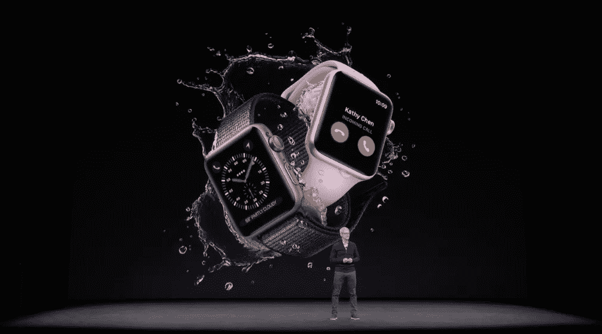
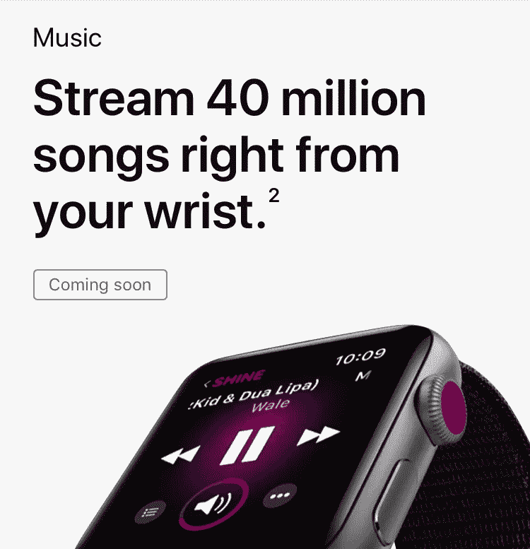
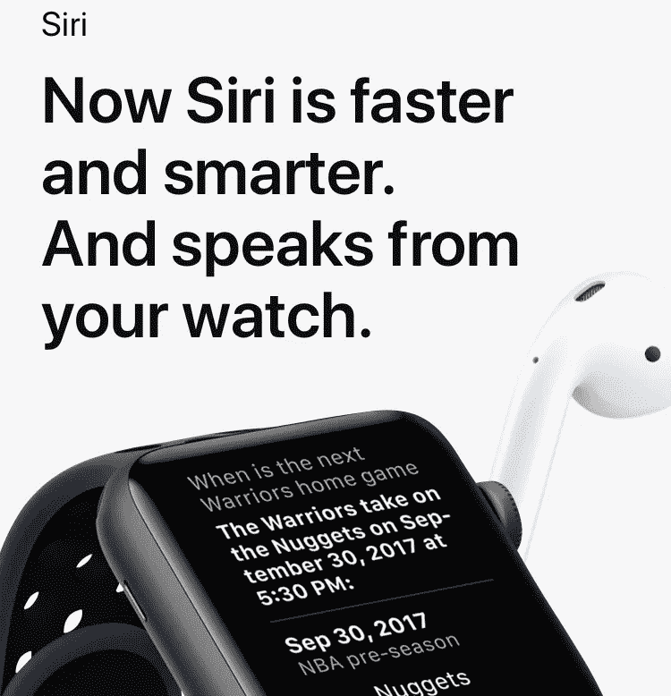
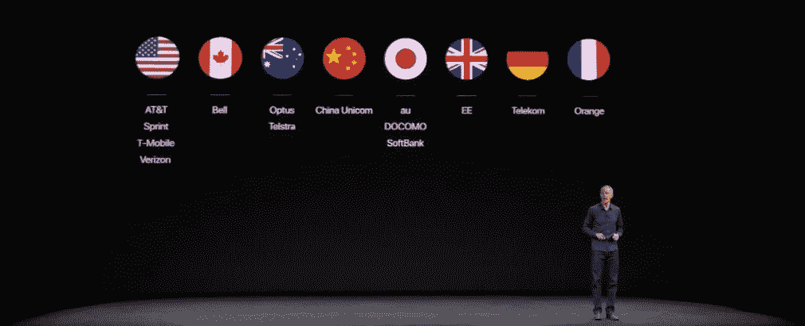
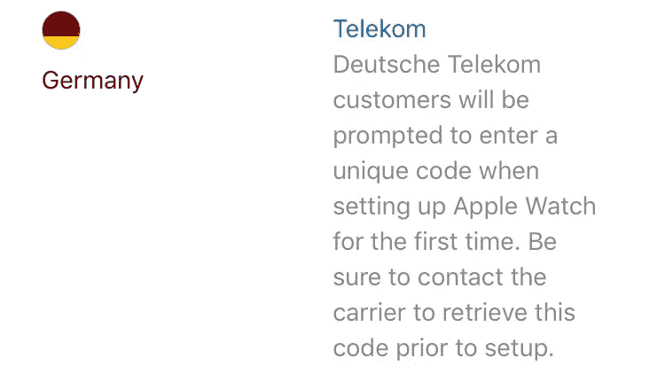
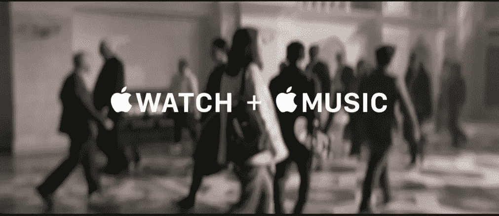
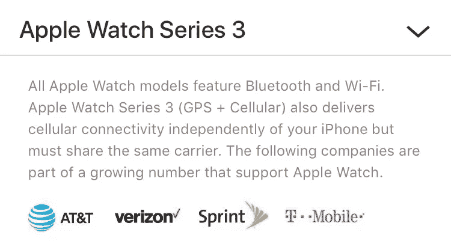

# 所以说到底，LTE Apple Watch *是关于通话的

> 原文：<https://medium.com/hackernoon/so-in-the-end-the-lte-apple-watch-is-about-calls-29dcdf59be0a>

## 苹果公司已经宣布了他们的 Apple Watch 系列 3，带有蜂窝选项，其中展示的功能是语音通话

正如[暗示了一段时间](/@jorge.serna/wwdc-2017-social-comms-2-watchos-4-and-the-smartphone-disintegration-340050269251)，以及[在一些泄露](https://techcrunch.com/2017/09/09/the-next-apple-watch-will-have-lte-cell-service/)，[苹果](https://hackernoon.com/tagged/apple)终于宣布了一款[支持蜂窝功能的新版苹果手表](https://www.apple.com/watch/cellular/)。

但是与一些传言相反(还有一些预测，比如我的预测)，打电话不仅是服务的一部分，而且是他们强调的主要使用案例。这一点在他们更新的网站上的产品展示和营销材料中都很突出，该网站经常显示来电手表的外观。

这一围绕通话的决定具有更广泛的依赖性，将影响市场和苹果手表生态系统的潜在演变。

# 支持蜂窝的能力

除了打电话之外，苹果的演示中并没有太多蜂窝功能的特色:

*   音乐。用户将能够在他们的手表上播放完整的苹果音乐库，正如我在之前的一篇文章中预测的那样。虽然这个用例是最后展示的视频广告的焦点，但它还没有为下周的设备发布做好准备，所以没有展示任何其他内容。

*   地图和方向。也简单提一下(还有[预测为开箱即用的特性](https://hackernoon.com/the-lte-apple-watch-new-value-and-new-applications-fcbf8cfc77c5))。
*   Siri。主要是作为一种与手表互动的相关方式，而不是任何新的东西(是的，[我也谈到了这一点](https://hackernoon.com/the-lte-apple-watch-new-value-and-new-applications-fcbf8cfc77c5)😀).

但总的来说，焦点是无手机的使用将是随意的。这并不是为了取代你的手机，而是为了让你在“办点急事”时把它留在身后，这正是最初的用例，我预计[可以围绕这款设备](https://hackernoon.com/the-lte-apple-watch-virtuous-cycle-for-a-new-ecosystem-a9211c608f54)引发一个新的生态系统。

# 定价和计划

支持手机功能的苹果手表的价格[和我一个月前预测的一模一样:399 美元](https://hackernoon.com/the-lte-apple-watch-virtuous-cycle-for-a-new-ecosystem-a9211c608f54)

> **让我们假设 LTE Apple Watch 的价格将在 399/490 美元左右€** (我使用的是最小的 iPhone SE 的参考价格，它提供了类似的连接)

但除了强调最初的促销价格外，苹果没有宣布运营商将提供的蜂窝计划的具体费用。美国运营商的初步信息高于我最初的估计，即在现有 iPhone 计划的基础上增加 3-4 个€，因为[他们提供 10 美元/月的计划，并有 3 个月的免费促销期](https://9to5mac.com/2017/09/12/att-verizon-sprint-and-t-mobile-to-support-cellular-apple-watch-series-3/)。但这更接近英国每月 5 英镑的价格。

# 操作员比预期的多

真正让我吃惊的是发布时支持的运营商数量。与我本周早些时候的预测不同，我在那次预测中说该设备将只支持美国的通话。):

我绝对没有达到那个预测。

(我还错误地预测了[通话将只在& T](https://hackernoon.com/why-most-apple-watch-users-will-not-get-lte-calls-on-it-and-why-some-will-2e7a39aad379) 推出，作为对最初 iPhone 发布的认可。但是当苹果演示通话功能时，他们提到他们使用 AT & T 网络进行通话，所以我对此只拿半分😉)

我的错误预测来自三个期望:

*   苹果公司更保守的方法。我认为产品的重点应该是数据连接，这样通话将是一个很好的补充，但不是产品的强制功能。iPhone 中基于运营商的功能以前也发生过这种情况，比如[可视语音邮件或 Wi-Fi 通话，这些功能远非所有地方都支持](https://support.apple.com/en-us/HT204039)。但苹果已经将通话定位为主要用例(目前)，这导致他们强制要求所有支持蜂窝手表的运营商都必须这么做。
*   集成呼叫功能的难度更大。**我认为，在推出时，很少有运营商会准备好支持这一功能，**，因为我认为它的实现将与[“在支持 iCloud 连接的设备上进行 Wi-Fi 呼叫”相关联，除了美国的四大运营商之外，很少有运营商会这样做](https://support.apple.com/en-us/HT204039)。我仍然认为会是这种情况，但必须等待发布后的进一步分析来验证这一点。一个暗示是，如果这些运营商在 iOS 11 公开发布时也发布这一功能。
*   与运营商整合 eSIM 设置的额外复杂性(苹果证实该设备正在使用[)。大概是这样，但是苹果已经能做到 14 家运营商了。这个过程显然不是独一无二的，因为在某些情况下，iPhone 系列和 Apple Watch 系列的配对需要用户采取额外的步骤，这是所涉及的复杂性的另一个暗示:](https://techcrunch.com/2017/09/12/the-cellular-enabled-apple-watch-has-the-sim-built-in/?ncid=rss&utm_source=tctwreshare&utm_medium=feed&utm_campaign=Feed%3A+Techcrunch+%28TechCrunch%29&sr_share=twitter)

仍然需要强调的是，所有推出蜂窝手表的运营商都支持 iPhone 的 VoLTE 服务(大多数还支持 Wi-Fi 通话)。这意味着[VoLTE](/@jorge.serna/how-volte-makes-whatsapp-calls-better-fcb324a94fd0)的缓慢推出将影响蜂窝手表的更广泛可用性，这加强了[我的论点，即通话将无法触及大量受众](https://hackernoon.com/why-most-apple-watch-users-will-not-get-lte-calls-on-it-and-why-some-will-2e7a39aad379)。

这一点尤其重要，因为用户无法在 iPhone 和手表中找到不同的服务提供商:

(另请注意，手表不支持漫游)

因此，想要苹果手机手表的人将不得不把他们的 iPhone 移植到不同的供应商，如果他们的不支持它的话。对于一些运营商来说，这可能会成为一个问题，因为手机手表的价格可能会推动需求，成为获得最新苹果小工具的“廉价选择”，而不必花费 1000 美元购买 iPhone X。

还可能发生的是，苹果可能会在未来将聚光灯转向与通话不同的东西。如果苹果开始淡化通话，转而专注于音乐流媒体，他们可能会开始允许运营商推出只提供数据服务的蜂窝手表。鉴于他们在 Apple Watch 演示结束时展示的视频广告的主要信息，这可能是一个计划:

因此，也许他们还没有这样做，因为他们不想加快手表的供应，并保持需求有点遏制。

在他们的演示中，他们坚持他们所面临的挑战，即在不增加设备尺寸的情况下将所有新技术集成到 Series 3 中，这可能需要成本。鉴于他们在生产新的 AirPods 时面临的问题，**也许设备的小型化正在影响他们大规模生产的能力，他们希望限制它的可用性，直到他们能够找到正确的方法。**

# 对生态系统建设的影响

因此，通过让语音通话成为手表的强制性功能，他们也(可能有意识地)缩小了目标市场。而减少他们的市场，[对开发者的吸引力也会减少](https://hackernoon.com/the-lte-apple-watch-virtuous-cycle-for-a-new-ecosystem-a9211c608f54)。

但是因为他们支持美国的主要运营商，

并且这些运营商为他们的数据资费提供初始促销期，这种市场缩减的摩擦可以显著减少。最终，许多大型应用开发商采取了美国优先的策略，而美国正是 iPhone 市场最重要的地方。

但是除了运营商的可用性，其他因素也会严重影响 Apple Watch 创建这个新的无手机生态系统的能力。我将在几天后的下一篇文章中探讨其中的一些问题(与音乐服务生态系统的关系、通知行为和电池寿命)。