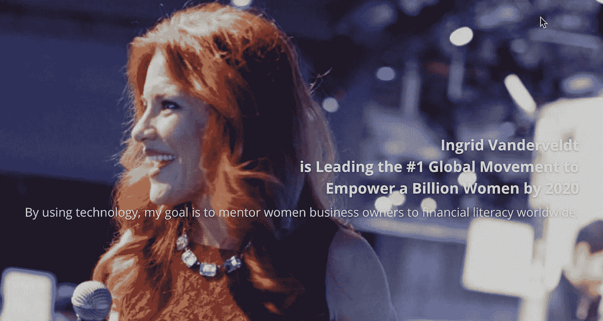

# SXSW 有如此多的创业机会！

> 原文：<https://medium.com/hackernoon/so-many-startup-opportunities-at-sxsw-22452b854a4b>

## 《阿甘正传》四部曲:2017 年 9 月 6 日

创始人、投资者和创业生态系统的其他成员被提醒，SXSW 最便宜的徽章价格将于 9 月 8 日星期五到期。[在此截止日期前注册](https://www.sxsw.com/attend/),可节省近 40%的免预约价格。

如果你是一名学生企业家，那么[点击这里了解更多关于](http://explore.sxsw.com/sxsw-student-registration-offer-2018?_ga=2.146264500.1892363713.1504470329-1905574091.1492687372)我们明年春天在奥斯丁的额外特别徽章价格。

最适用于企业家的会议编程课程是“[初创公司&科技行业](https://www.sxsw.com/conference/startups-and-tech-sectors/)”，将于 3 月 9 日至 15 日举行。但一如既往，SXSW 最大的价值之一是有机会与其他行业的创新者建立联系并向他们学习。那些寻找新的创业想法的人可能特别感兴趣的其他 2018 年赛道包括[品牌&营销](https://www.sxsw.com/conference/brands-and-marketing/)(3 月 10 日至 15 日)[编码&编程](https://www.sxsw.com/conference/code-and-programming/)(3 月 10 日至 14 日)[食品](https://www.sxsw.com/conference/food/)(3 月 12 日至 14 日)[健康&健康](https://www.sxsw.com/conference/health-and-wellness/)(3 月 9 日至 13 日)[智能未来](https://www.sxsw.com/conference/intelligent-future/)(3 月 9 日至 15 日)和[工作场所](https://www.sxsw.com/conference/workplace/)

[访问本页](https://www.sxsw.com/conference/)查看 SXSW 2018 全部 24 首曲目的完整列表。

已经确认将在三月魔法大会上发表创业相关专业演讲的人包括马克·库班(鲨鱼池)、奥德丽·格尔曼(The Wing)、史蒂夫·赫夫曼(Reddit)、迪安·卡门(高级再生制造研究所)、[威廉·赫尔利](/@hugh_w_forrest/quantum-this-10-questions-with-whurley-6e83703bbc2f)(量子计算专家)、约瑟夫·卢宾(以太坊)、蒂姆·奥赖利(奥赖利传媒)、鲍勃·理查兹(月球快车)、[英格丽·范德维尔特](http://ingridvanderveldt.com/)(到 2020 年让 10 亿女性拥有权利)、亚里沙·维蒂(FLOLiving.com)和艾米·韦伯(今日未来研究所)。

请继续关注十月初的 SXSW 网站,了解更多令人兴奋的演讲者公告。

还鼓励企业家申请参加 3 月 10 日至 11 日举行的 SXSW 加速器推介活动。但是你可以多花点时间参加这个比赛。参赛截止日期是 11 月 10 日星期五(提前参赛对你没有任何好处)。

休·福里斯特在世界上最独特的创意专业人士聚会[*SXSW*](http://www.sxsw.com)*担任首席编程官。他还试图每天至少写四段***在介质上。这些帖子通常涵盖与技术相关的趋势；其他时候，他们关注书籍、流行文化、体育和其他时事。**

**帮助 SXSW*[*帮助红十字会赈灾*](http://www.redcross.org/sxsw) *在这里捐款。**