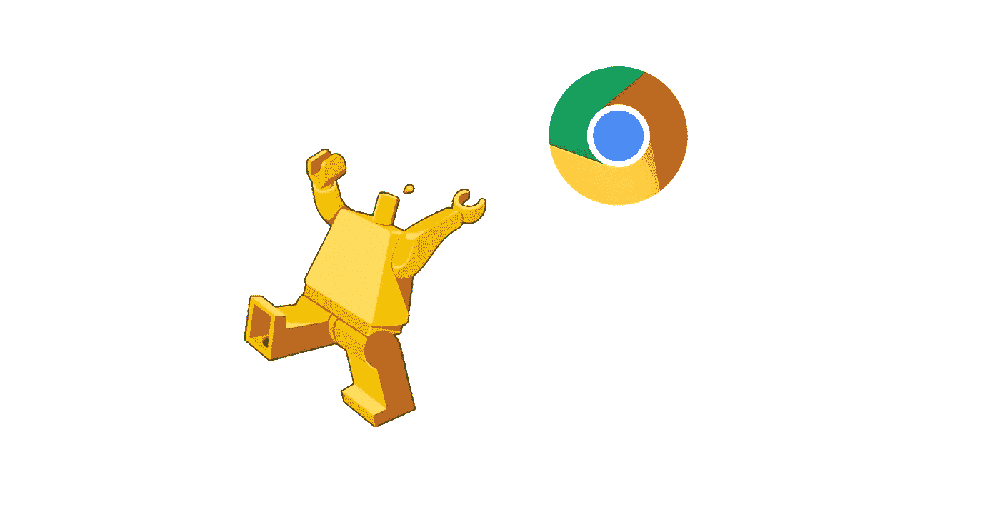

# 了解 chrome headless

> 原文：<https://medium.com/hackernoon/so-many-testing-frameworks-so-little-time-b03c707b8f90>

由于 Chrome 在 v59 中的新无头功能，一系列自动化“东西”刚刚到来。作为 [snaptest.io](https://www.snaptest.io) 的开发者，我的工作就是与他们保持同步。

## *所以你需要知道的是:*

**一个** [**无头**](https://hackernoon.com/tagged/headless) **浏览器**意味着当你启动它时你看不到它，它都在内存中——这也意味着用户的动作是自动的。

**自动化**的用途:

1.  质量保证测试
2.  擦
3.  预渲染单页应用。

**无头**的用途:

1.  资源密集度较低。
2.  非常适合在部署前运行测试的构建系统。
3.  可以在更多的服务器环境中运行，比如 Lambda。

**这是第一款*无头*T21 自动化浏览器吗？**不，phantomJS 一直是这样的 goto 浏览器，但主要贡献者在听说 Chrome 的新无头功能后几乎立刻[下台。原来维护一个完整的浏览器是很难的。](https://groups.google.com/forum/#!topic/phantomjs/9aI5d-LDuNE)

## 那么 Chrome v59 实际上有什么新功能呢？

*   像这样运行可执行文件:**` chrome-headless-disable-GPU-remote-debugging-port = 9222 `**打开时没有可见窗口。
*   然后向上面的端口发送命令……离金属节点库最近的是[这个](https://www.npmjs.com/package/chrome-remote-interface)。
*   上面的命令让您能够做几乎任何用户会做的事情…所以您可以收集数据或进行测试。

## 社区对这些新特性做了什么？

社区已经决定我们需要一个漂亮的包装来包装这些“低级”的东西，并且已经开始制作这些:

1.  [**Chromeless**](https://github.com/graphcool/chromeless) (由“ [Chrome](https://hackernoon.com/tagged/chrome) ”和“Headless”两个词组合而成，甚至可能是“Serverless”)。
2.  **(谷歌自己的“轻量级包装”)**
3.  ****(另一个包装器)****
4.  ****如果你知道更多，请联系我…****

## ****结论:****

****这些框架各自的状态如何？几个月后，等他们长大一点，我们就能知道了。现在进行比较和对比是徒劳的。****