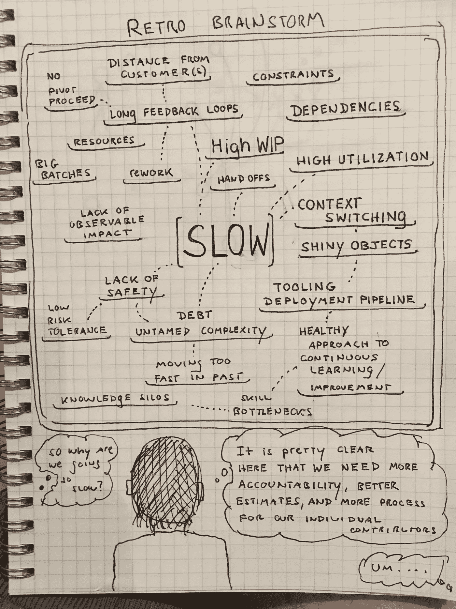

# 那我们为什么走得这么慢？(漫画)

> 原文：<https://medium.com/hackernoon/so-why-are-we-going-so-slow-cartoon-be2e349da5cd>

在这幅漫画中，我们无畏的经理正在回顾一个团队的成果。企业想知道:

> 为什么我们走得这么慢？

她看到墙上的字了吗？

> [黑客中午](http://bit.ly/Hackernoon)是黑客如何开始他们的下午。我们是 [@AMI](http://bit.ly/atAMIatAMI) 家庭的一员。我们现在[接受投稿](http://bit.ly/hackernoonsubmission)，并乐意[讨论广告&赞助](mailto:partners@amipublications.com)机会。
> 
> 如果你喜欢这个故事，我们推荐你阅读我们的[最新科技故事](http://bit.ly/hackernoonlatestt)和[趋势科技故事](https://hackernoon.com/trending)。直到下一次，不要把世界的现实想当然！

