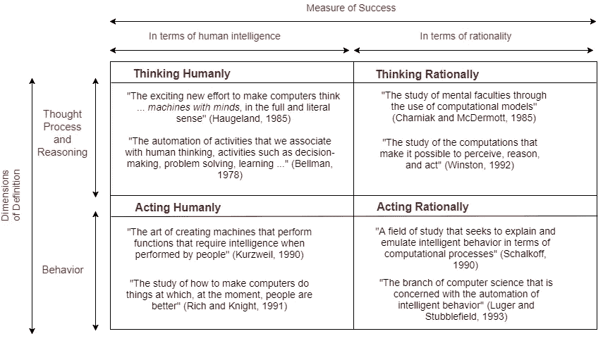
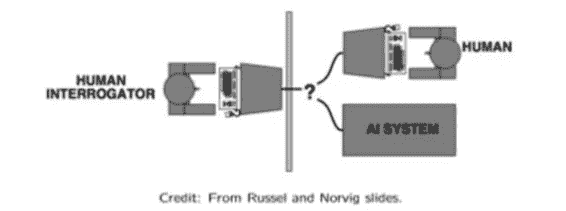

# 所以你认为你知道什么是人工智能？

> 原文：<https://medium.com/hackernoon/so-you-think-you-know-what-is-artificial-intelligence-6928db640c42>

当你想到人工智能时，首先想到的不是机器人，就是有大脑的机器，或者是黑客帝国，或者是终结者，或者是前玛奇纳，或者是任何其他拥有会思考的机器的神奇概念。这是对人工智能的一种恰当但模糊的理解。在这篇文章中，我们将看到人工智能到底是什么，以及这个定义在过去是如何变化的。

在概括或定义一个新概念/新学科时，设定正确的目标并根据我们希望实现的目标以及我们将如何实现来定义该领域是有益的。由于**人工智能是一个广阔的话题**，体现了许多科学领域的知识，近年来它的定义发展迅速。下图包含了来自不同教科书的 ***8 个定义。这些定义中的每一个都以不同的方式描述了什么是人工智能。*** 让我们来了解一下。

Credit — Stuart Russell and Peter Norvig

根据我们希望人工智能实现的目标和我们衡量其成功的方式，各种定义被分为 4 个不同的维度或思想流派。如图所示， ***这些定义设定了人工智能的目标，要么基于思维过程和推理(顶行)，要么基于行为(底行)。*** 进一步来说， ***的定义也是按照我们如何衡量人工智能的成功来分组的。这既可以是就人类的智力而言(左栏)，也可以是针对理性的观念或智力的理想概念*** 。人类思维和理性的区别在于，前者必须是经验科学，涉及假说和实验证实，后者涉及数学和工程的结合。

这四种方法中的每一种，包括思考和行动，人类的和理性的，都得到了遵循，并且每一种都为人工智能领域提供了有价值的见解。我们现在将会看到在这些维度中的每一个维度中，系统看起来是什么样子，以及它们的可行性如何。

## 能够像人类一样思考的系统

为了遵循这种方法，首先需要理解人类是如何思考的。 通过内省或心理实验可以了解人脑的内部工作原理。这本身就是一个广阔的跨学科领域， ***被称为认知科学。它将人工智能的计算机模型和心理学的实验技术结合在一起，试图构建人类大脑工作的精确且可测试的理论。因此， ***这个定义也被称为认知建模方法*** 。今天，人工智能和认知科学是两个独立的领域，但它们继续相互促进，主要是在视觉、自然语言和学习领域。***

## 能够像人类一样行动的系统

*这个定义是在* ***艾伦·图灵提出图灵测试*** 时产生的。如果一个系统能够通过描绘智能行为来欺骗人类询问者，那么它就通过了这个测试。*我们所说的智能行为是指在认知任务中达到人类水平的表现。*

***大致来说，一个人工智能系统通过图灵测试，如果在审讯过程中，人类审讯者无法分辨，是在审讯人类还是人工智能***

这样的系统将需要拥有人工智能的主要组件，包括自然语言处理、知识表示、自动推理、机器学习、机器人和计算机视觉。考虑到潜在的复杂性，没有人努力去制造这样的机器。

## 能够理性思考的系统

这种方法的目的是建立在代表“正确思维”的程序之上，创造智能系统。 这种“正确的思维”或不可辩驳的推理过程，是用编码定义的(用数学术语来说) [**逻辑或思维法则**](https://en.wikipedia.org/wiki/Law_of_thought) 。因此，这种方法也被称为思维法则方法。

使这种方法不可行的基本问题是:

1.  ***并不是所有的知识都可以用逻辑符号来表达(尤其是知识不是 100%确定的时候)。***
2.  ***它会导致计算爆炸，如同没有指导一样，有很多推理步骤可以尝试。***

## 能够理性行动的系统

这种方法包括创建系统，在给定可用信息的情况下，以最大化其实现目标的机会的方式行动。这些系统被称为**理性代理，**这样 ***它们感知环境并采取行动以实现最佳结果，或者当存在不确定性时，实现最佳预期结果。***

因此，将 AI 作为理性代理设计进行研究具有以下优势**。**

1.  **与“思维法则”方法不同，其中整个重点是正确的推理， ***这种方法通过使用正确的推理作为机制之一而非必要机制来实现合理性。*** 这个属性使得这种方法更加通用。**
2.  **与基于人类行为或人类思想的方法相比，这种方法 ***对于科学发展是可行的，因为合理性的标准是明确定义的并且完全通用的。另一方面，人类的行为很好地适应了特定的环境，并且在某种程度上是一个复杂的、未知的进化过程的产物，这个过程可能还远未达到完美。*****

**理性主体设计的研究相对更具一般性和可行性。然而，所有定义人工智能的方法/方向都有助于理解其复杂性和组成部分，以及如何真正创造人工智能。**

**今天，最先进的技术已经达到了一个水平，我们拥有了围棋、国际象棋、跳棋等世界冠军的人工智能，它们可以点餐、预定出租车、翻译文本、识别人、玩扑克等等。但是实现人工智能的真正潜力还有很长的路要走。**

**如果你喜欢这篇文章，一定要点击下面的❤来推荐它，如果你有任何问题，**留下评论**，我会尽力回答。**

**我很快会写更多关于设计理性代理和在人工智能中使用机器学习的研究。所以，为了更加了解人工智能的世界，请跟我来。这是最好的办法，等我多写点这样的文章就知道了。**

**也可以在 **Twitter 关注我在**[**@ pra shant _ 1722**](https://twitter.com/Prashant_1722)， [**直接发邮件给我**](mailto:pr.span24@gmail.com) 或者 [**在 linkedin**](https://www.linkedin.com/in/prashantgupta17/) 上找我。我很乐意收到你的来信。**

**乡亲们，祝你们有美好的一天:)**

## **信用**

**本文内容的灵感来自人工智能这一现代方法。斯图尔特·拉塞尔和彼得·诺维格。第三版。皮尔森教育。**