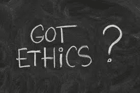
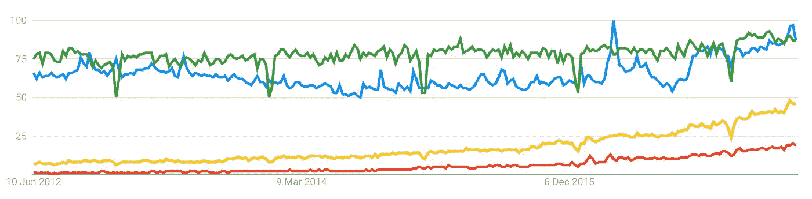

# 所以你想成为一名数据伦理学家？

> 原文：<https://medium.com/hackernoon/so-you-want-to-be-a-data-ethicist-ea5bbdad0993>

[https://siliconangle.com/blog/2013/08/10/how-ethical-is-your-big-data/](https://siliconangle.com/blog/2013/08/10/how-ethical-is-your-big-data/)

# 恭喜你！

你可能会成为世界上第一个！

就我而言，我这样称呼自己是因为我研究并积极考虑在社会中使用数据的道德含义。随着我们收集更多的数据，这些影响只会变得更加深远。

我在这个领域开始了我的旅程，因为我想知道模型做出“决定”的深度。对于这个问题，我还没有找到一个好的答案——但是正在进行的研究发现了这一点。

但实际上，理解这个模型只是一个更大问题的一小部分。深度学习模型——或任何预测算法——存在于人类、程序和政治的生态系统中。

贯穿整个过程的是——数据。有很多问题需要问数据:它从哪里来？代表性如何？如何操纵它以适应机器学习模型？模型试图优化什么？数据在整个过程中是否保持其完整性？输出数据去哪里？数据是否以适当的方式得到解释？诸如此类…

因此，我会说，数据伦理学家在本地环境中查看数据，以满足组织的目标，同时也在社会环境中查看数据。可以归结为这样一个问题:我们*能*做到这一点，但是*应该*做到吗？

# 互联网上“数据伦理学家”的调查

Google Trends (7Jun17): Green = automation; Blue = artificial intelligence; Yellow = machine learning; Red = deep learning

人们对数据和人工智能的兴趣正在迅速增长。我们需要数据伦理学家来管理社会影响。不过，不要费心在趋势中搜索“数据伦理学家”——它不在雷达上！

在[谷歌学术](https://scholar.google.com.au/scholar?hl=en&q=%22data+ethicist%22&btnG=&as_sdt=1%2C5&as_sdtp=&oq=data+et)上搜索“数据伦理学家”会返回 4 个结果。

一个标准的谷歌网络搜索返回 705 个结果。这些结果中的绝大多数是一篇文章的辛迪加片段，或者以各种方式，不太可靠。但是对于更有趣的项目，我将在下面提供一个时间表。

# 2017

[boingboing，“伦理和人工智能:所有的模型都是错的，有些是有用的，有些是好的”](http://boingboing.net/2017/03/10/ethics-reviews.html)

一篇关于[阿部恭](http://www.abegong.com/)演讲的文章。

“龚重申了一个重要观点，即问题很少与算法有关，而是与训练数据有关——机器学习只是让我们将我们的采样偏差隐藏在一个[黑盒](https://boingboing.net/2016/05/24/algorithmic-risk-assessment-h.html)后面，提供了一个覆盖种族主义和歧视的经验主义的外表。”

# 2016

[国家安全电信咨询委员会，“国家安全电信咨询委员会向总统提交的大数据分析报告”](https://www.dhs.gov/sites/default/files/publications/NSTAC%20Report%20to%20the%20President%20on%20Big%20Data%20Analytics%20%285-11-16%29-%20508%20compliant.pdf) (PDF)

该报告提出了许多建议，呼吁数据伦理学家参与大数据项目。

**“数据伦理学家**:其对数据使用伦理的判断已经得到特定社区的信任，并以某种方式表达出来，使得其他人有可能模仿或接近该判断。”

# 2015

[埃森哲，“数据伦理案例”](https://www.accenture.com/au-en/insight-outlook-case-data-ethics)

“在 2014 年 8 月联合统计会议的年度聚会上进行的一项调查中，42%的受访者同意应为数据科学家制定伦理研究标准，而 43%的人表示伦理已经在他们的研究中发挥了“重要作用”

“到 2017 年，他们预计 25%的大型企业将拥有数字行为准则，到 2018 年，整整一半的商业道德违规将由大数据分析的不当使用引起。”

“如果有问题的实体是一个平台，宽松的道德数据实践的影响是复合的，并可能在整个系统中蔓延——如果决策是由自动算法执行的，则更是如此。”

"为了保护公共安全，这些感知和响应系统必须由伦理算法来管理."

[媒体、艺术+文化联盟，“数据、伦理、社区”](http://www.thealliance.media/data-ethics-community/)

“我想起了加州大学伯克利分校的数据伦理学家安娜·劳伦·霍夫曼就这个话题与我们分享的一些观点:

1.  公民科学存在伦理问题，围绕个人在实地收集的数据的有效性也存在矛盾。这是守门的一种形式。
2.  想想隐私和社交数据——在与社区合作时，一个人的信息通常会提供一整群人的信息。
3.  想想平台的政治——技术是如何设计的，平台包括和排除了谁。
4.  对于数据，我们面临着一些与我们思考信息和设计时相同的问题——你带着一组类别/分类来，准备将数据放入这些盒子中，但它们不适合这些盒子。"

# 2013

[信息周，“为什么您需要大数据伦理专家”](http://www.informationweek.com/it-leadership/why-youll-need-a-big-data-ethics-expert/d/d-id/1108001)

这是网上一些人提到“找一个数据伦理学家”时的首选文章。

“除了大数据技术开发人员，贵公司还应该考虑增加一名‘大数据伦理学家’。”"

“大数据中迫在眉睫的问题不是技术，而是与如何、何时以及是否应该提供结果相关的决策。”

> [黑客中午](http://bit.ly/Hackernoon)是黑客如何开始他们的下午。我们是 [@AMI](http://bit.ly/atAMIatAMI) 家庭的一员。我们现在[接受投稿](http://bit.ly/hackernoonsubmission)并乐意[讨论广告&赞助](mailto:partners@amipublications.com)机会。
> 
> 如果你喜欢这个故事，我们推荐你阅读我们的[最新科技故事](http://bit.ly/hackernoonlatestt)和[趋势科技故事](https://hackernoon.com/trending)。直到下一次，不要把世界的现实想当然！

