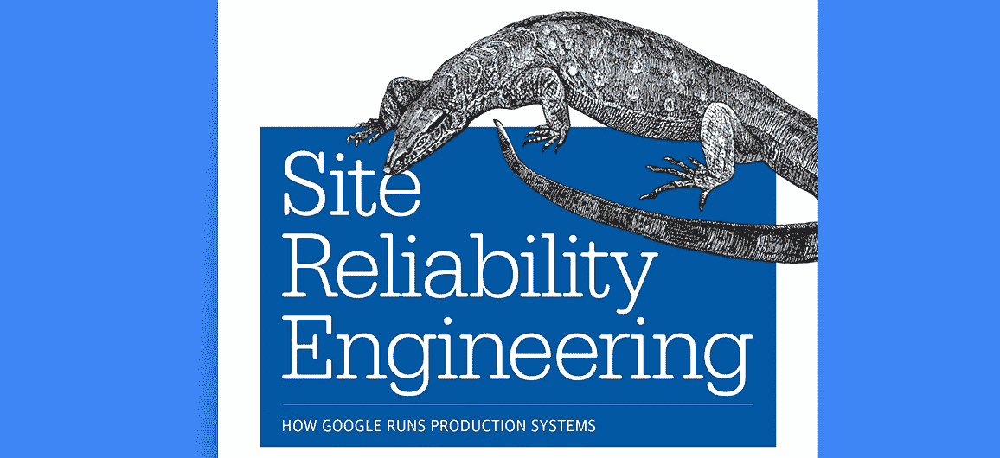
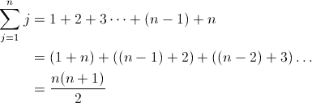

# 所以你想成为 SRE？

> 原文：<https://medium.com/hackernoon/so-you-want-to-be-an-sre-34e832357a8c>

The SRE Book

大约九个月前，我打算离开我六年的教学生涯，去追求一份软件工程师的职业。我参加了一个名为 [Hackbright Academy](https://hackbrightacademy.com/) 的为期 3 个月的编程训练营，在此期间，我不仅学到了编程的基础知识，更重要的是，什么类型的工作让我兴奋。我意识到我热爱设计。我喜欢数据模型设计、用户体验设计、建筑设计、系统设计……还有很多，我喜欢设计。正因为如此，我认为最适合我的地方是前端工程师，天哪，我错了。

Dropbox Office Library in San Francisco, 2017

在 Hackbright，我们花了四周时间在一个[单一项目](https://github.com/khardsonhurley/Hackbright-Project)上工作。有人可能会想，对于这样一个小规模的项目，我并没有过多地考虑可靠性和可伸缩性。

直到我开始与行业专业人士交谈，特别是几位 sre，我才意识到我对思考大规模系统并使它们可伸缩和可靠感兴趣。

我现在是 Dropbox 监控团队的一名[站点可靠性工程师](https://www.dropbox.com/jobs/listing/237271) (SRE)，我非常热爱我正在做的工作。我可以和我的队友一起设计大型系统以及监控它们的内部工具！

自从我在 Dropbox 开始工作以来，我有机会与许多像我一样的转行者交谈，分享我在过去几个月里学到的东西。我经常被问到的问题是:

> 什么是 SRE，我如何成为一个？

这篇文章是为那些对了解 SRE 感兴趣的人设计的。我对这个职位做了一个大致的解释，提出了在申请 SRE 职位之前要问自己的关键问题，并指出了几个资源来启动你的旅程。

# 什么是 SRE？

为了理解这个问题的答案，学习一点历史是很重要的。让我们谈谈传统的系统管理方法。在谷歌设立 SRE 职位之前，[系统管理员](https://en.wikipedia.org/wiki/System_administrator)负责公司运营。

## *什么是系统管理员？*

*   系统管理员是负责复杂计算系统的配置、维护和可靠性的人。
*   他们组装软件组件(由开发人员编写)并部署它们以产生服务。
*   它们监控这些服务，并在服务发生任何事件时做出响应。

系统管理员从事“操作”方面的工作，而工程师从事“开发”方面的工作。

## 这种方法有什么不好？

根据 [SRE 的书](http://shop.oreilly.com/product/0636920041528.do)，这种方法导致了开发人员和系统管理员之间的分歧和冲突。因为两人有不同的背景、技能和动机，这意味着他们有不同的词汇，对可靠性的思考也非常不同。开发人员希望新特性能尽快发布给用户，而运营团队成员(系统管理员)则希望避免破坏任何东西。谷歌看到了这种方法的问题，并创造了“网站可靠性工程”的想法。

## *那么，什么是 SRE？*

根据谷歌这个职位的创始人，本·特雷诺在[这个采访](https://landing.google.com/sre/interview/ben-treynor.html)中对 SRE 的定义是:

> “从根本上来说，这就是当你要求软件工程师设计一个运营功能时会发生的情况……所以 SRE 从根本上来说正在做的工作一直是由运营团队完成的，但使用了具有软件专业知识的工程师，并指望这些工程师天生就有能力用自动化取代人工。”

Example of a data center

让我举一个具体的例子，说明 SRE 如何把“新方式”做得更好。

几个月前，我有机会参观了一个数据中心，就像您在这里看到的图片一样。我参观了几个仓库大小的房间，里面装满了数千台机器。这个空间的规模是惊人的。

现在，假设数据中心的一台服务器出现故障，需要更换。使用“旧方法”，新服务器将由系统管理员手动配置。这意味着系统管理员将*手动*确保新机器有正确的操作系统、软件、标签等。现在想象一下，需要更换 1000 台服务器。明白我的意思了吗？这将花费很长时间，否则公司将需要大量的系统管理员来完成这项工作。

现在，考虑一下我从 Dropbox 网站可靠性工程师招聘启事中摘录的要点中描述的“新方式”:

> “您将自动执行服务器配置流程，以减少我们网络工程和数据中心运营团队的工作量。一旦我们插入一台新的服务器，它就会自动完成配置的各个方面，无需任何人工干预就能加入服务器群。”

**没有任何人为的介入。**

在这个例子中，SRE 将负责编写自动化服务器配置过程的软件。酷吧？这个例子真的帮助我理解了什么是真正的 SRE:

**现场可靠性工程师=软件工程师+系统爱好者**

据 Dropbox 的 SRE 经理[塔米·布托](https://twitter.com/tammybutow)称，

> “sre 是专门研究可靠性的软件工程师。SREs 将计算机科学和工程的原理应用于计算机系统的设计和开发:通常是大型分布式系统

通过自动化消除人工干预，SREs 使系统更加可靠。所以从本质上来说，SRE 人的工作就是自动完成工作。

## **但是克里斯，你为什么认为这很酷呢？**

我发现这很酷的原因和我决定学习数学的原因是一样的。数学允许你利用函数和规则来计算大规模问题。我教书时最喜欢的一课就是基于这个问题:

The Staircase Problem Visual Aid

*“你拥有一家景观美化公司，你的专长之一是室外砖砌楼梯。如果客户订购 10 层高的楼梯间，您需要带多少砖？对于 20 层高的楼梯间，客户需要多少砖？一个 38 层高的楼梯间需要多少块砖？”*

Gauss’ Trick for summing the numbers from 1 to n

我的学生很快意识到，对于较小的楼梯来说，数砖块是一个不错的策略。但是当我把高度一路增加到 100 米高的楼梯间时，他们被迫寻找另一条路。他们意识到数学可以用作计算大规模问题的工具，避免使用暴力方法(在我的代数 1 课程中，我会让学生发现他们可以使用方程 n(n+1)/2 来解决楼梯问题。)

正如数学是解决大规模问题的工具一样，在计算机世界中，代码是管理大规模系统的工具。它是一种工具，允许通过软件自动完成任务，并消除对人工劳动的需求。现场可靠性工程师支持这项工作，他们利用自己的系统知识和代码管理和自动化这些系统，使系统更加可靠。

# 我怎么知道 SRE 是否适合我？

当我与考虑追求 SRE 职位的求职者交谈时，这是一个很大的问题。我整理了一些重要的问题，在你完全投入之前问你自己。

## **SRE 兼容性测试**

1.  你喜欢思考有很多活动部分的大规模问题吗？
2.  你喜欢思考如何让大型系统更可靠吗？
3.  你对开发一个可能永远不会被外部用户公开看到的软件没问题吗？
4.  你喜欢长时间看着终端吗？
5.  你喜欢诊断和解决问题的过程吗？如果是，那么如果诊断涉及到您并不总是能看到的系统级问题呢？
6.  你喜欢思考系统信息(例如，磁盘空间、cpu、操作系统、内核等)吗？)和系统级功能(例如 ssh、proc、cron、swaps 等)。)?
7.  你对“随叫随到”的想法感到舒服吗？在这种情况下，你可能处于需要解决问题的高风险场景中。
8.  你能在压力下保持冷静吗？
9.  你用逻辑的、面向过程的方式处理问题吗？
10.  你愿意尝试一个从未解决过的问题吗？
11.  你是那种会思考如何让事情变得更好的人吗？

如果你对这些问题中的至少 8 个回答是肯定的，SRE 可能是你的一个好职位。继续读下去，找到更多关于 SRE 的资源和提供 SRE 职位的公司名单。

# 所以我真的想成为 SRE，现在呢？

有很多资源可以帮助你开始了解更多关于 SRE 的知识，并获得获得角色所需的技能。以下是我推荐的几个开始。

## 了解 SRE 的角色和职责

你还在试图理解 SRE 的意思吗？查看这些资源:

🌐[谷歌的 SRE 资源](https://landing.google.com/sre/)——一个包含谷歌对 SRE 的定义、采访该职位创建者的文字记录以及其他资源(包括 SRE 书籍的[网络版)的网站。](https://landing.google.com/sre/book/)

🌐 [SRE 读书笔记](http://danluu.com/google-sre-book/)——意识到你可能还没准备好出去花 40-50 美元买 SRE 的书，这是丹·卢对这本书每一章的一套很棒的笔记。

🎥[SRE 之钥](https://youtu.be/n4Wf14e2jxQ)——谷歌 SRE 角色的创造者本·特雷诺的演讲。

🎥[站点可靠性工程师——保持谷歌全天候运行](https://youtu.be/yXI7r0_J29M) —与谷歌 SREs 的网络研讨会。

🎥[Dropbox 的现场可靠性工程](https://www.youtube.com/watch?v=ggizCjUCCqE&feature=youtu.be)—Dropbox SRE 经理 Tammy Butow 的演讲。

🎥网飞的现场可靠性工程——SRE·乔纳·霍洛维茨在网飞的演讲。

🎥谁/什么是 SRE？ —位于 SRECon16 的 sre 面板。

📰[安德鲁·方(Andrew Fong)谈应对全栈问题](/dropbox-makers/andrew-fong-on-tackling-the-full-stack-4bb2aa07e783#.e91gzb9ys)——Dropbox SRE 经理安德鲁·方(Andrew Fong)访谈。

📰站点可靠性工程师:“我们解决更酷的问题” —一篇关于 SRE 在谷歌的文章。

📰[爱德文普斯？等到你遇见 SRE](https://www.atlassian.com/it-unplugged/devops/site-reliability-engineering-sre)——一篇关于 SRE 在亚特兰蒂斯的文章。

## 雇佣 sre 的公司

好奇有哪些公司雇佣 SREs？以下是几个例子:

*   [收纳箱](https://www.dropbox.com/jobs/listing/237271)
*   [谷歌](https://careers.google.com/jobs#!t=jo&jid=/google/software-engineer-site-reliability-1600-amphitheatre-pkwy-mountain-view-ca-2500016&)
*   [网飞](https://jobs.netflix.com/jobs/861152)
*   [GitHub](https://github.com/about/careers#positions)
*   [大西洋人](https://www.smartrecruiters.com/Atlassian/110170651)
*   [条纹](https://stripe.com/jobs/positions/site-reliability-engineer)
*   [Pinterest](https://www.usenix.org/conference/srecon17americas/program/presentation/evans)
*   [脸书](https://www.facebook.com/careers/jobs/a0I1200000Iglf8EAB/)(称为生产工程师)
*   Reddit (称为 DevOps 软件工程师)

……还有很多[更有](https://www.linkedin.com/jobs/search/?keywords=Site%20Reliability%20Engineer&locationId=us%3A0)！我已经链接了一些招聘职位的样本，这样你就能感受到 SRE 在不同公司的意义。

## 有抱负的 SRE 的资源

一旦你觉得你已经掌握了 SRE 的定义，看看这些资源，开始扩展你的技能。

***一般资源***

📰[从 Bootcamp 毕业，有兴趣成为现场可靠性工程师？塔米·布托和我为对 SRE 角色感兴趣的训练营毕业生整理的综合资源列表。](/@tammybutow/graduating-from-bootcamp-and-interested-in-becoming-a-site-reliability-engineer-b69a38ce858b#.bpxamstwa)

📰开发人员必须知道的清单&现场可靠性工程师——SRE 的技能和心态清单。

🌐[分布式系统设计简介](http://www.hpcs.cs.tsukuba.ac.jp/~tatebe/lecture/h23/dsys/dsd-tutorial.html)—Google Code 大学课程。

🌐[令人敬畏的站点可靠性工程](https://github.com/dastergon/awesome-sre) —由 Pavlos Ratis 策划的 SRE 和生产工程资源的惊人列表。如果你成为 SRE，绝对值得收藏。

***Linux 资源***

由于我在开始初级 SRE 角色时没有太多的 Linux 经验，所以我为我发现对学习 Linux 基础很有用的教程和工具提供了一个单独的部分。

🎥[电脑人 Eli 的 Linux 视频系列](https://www.youtube.com/watch?v=_gCwCOhMcog&list=PLD6B6473ACF32C59D)——一系列打破关键 Linux 概念的精彩视频。

🌐 [Unix/Linux 初学者教程](http://www.ee.surrey.ac.uk/Teaching/Unix/) —循序渐进的教程

🌐[LinuxCommand.org](http://linuxcommand.org/index.php)——一步一步的教程。

📋[Cheatography Linux cheat sheet](https://www.cheatography.com/davechild/cheat-sheets/linux-command-line/)

📋[福斯威尔 Linux 备忘单](https://files.fosswire.com/2007/08/fwunixref.pdf)

## 关注 Twitter 账户和博客

*   茱莉亚·伊万斯在推特和博客上
*   布兰登·格雷格
*   伊莱·本德斯基
*   [几个九](https://twitter.com/severalnines)
*   菲利普·费舍尔-奥格登
*   塔米·布托
*   诺拉·琼斯
*   [pav los Ratis](https://twitter.com/dastergon)——pav los 提供[以下推荐](https://github.com/dastergon/awesome-sre#blogs)！
*   [SRE 周刊](https://sreweekly.com/)
*   [SREcon](https://twitter.com/SREcon)

## Dropbox 基础设施资源

Dropbox’s Magic Pocket

除了在 Tammy 的博客文章[中提到的 Dropbox 的具体资源之外，还有一些让我对在 Dropbox 做 SRE 非常感兴趣的资源:](/@tammybutow/graduating-from-bootcamp-and-interested-in-becoming-a-site-reliability-engineer-b69a38ce858b#.gfaz5j9lr)

🎥[魔法口袋](https://youtu.be/QULM7M98TLo)

📰[扩展至千兆字节以上](https://blogs.dropbox.com/tech/2016/03/magic-pocket-infrastructure/)

📰[在魔法口袋里](https://blogs.dropbox.com/tech/2016/05/inside-the-magic-pocket/)

🌐 [Dropbox 基础设施博客](https://blogs.dropbox.com/tech/category/infrastructure/)

## **觉得这个帖子有用？请点击下面的❤按钮，并与考虑 SRE 角色的朋友分享！**

## 关于作者

Krishelle 是一名前高中数学和西班牙语教师，后来成为了 T21 Dropbox 的网站可靠性工程师。[阅读](http://www.huffingtonpost.com/entry/5824e18ce4b094483eef3690?timestamp=1478812083540)关于她从教育到科技的旅程，并在 [Twitter](https://twitter.com/khardsonhurley) 和 [LinkedIn](https://www.linkedin.com/in/khardsonhurley) 上与她联系。

想改变职业，但不知道从哪里开始？找工作，不知道如何有条理？看看 Krishelle 的这些文章:

*   [设计你的职业变化](https://hackbrightacademy.com/blog/3-key-elements-designing-career-change/)
*   [我是如何从教学转向工程的(网络研讨会](/@khardsonhurley/4-ways-i-celebrated-womens-history-month-this-year-dec06997d78f))
*   [组织求职的工具](https://hackernoon.com/8-tools-for-organizing-your-job-search-post-bootcamp-abe9b2d54c12#.7iz84p4n1)

> [黑客中午](http://bit.ly/Hackernoon)是黑客如何开始他们的下午。我们是 [@AMI](http://bit.ly/atAMIatAMI) 家庭的一员。我们现在[接受投稿](http://bit.ly/hackernoonsubmission)，并乐意[讨论广告&赞助](mailto:partners@amipublications.com)机会。
> 
> 如果你喜欢这个故事，我们推荐你阅读我们的[最新科技故事](http://bit.ly/hackernoonlatestt)和[趋势科技故事](https://hackernoon.com/trending)。直到下一次，不要把世界的现实想当然！

