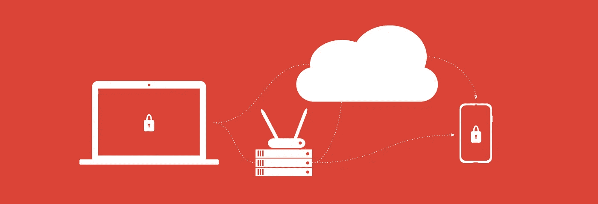
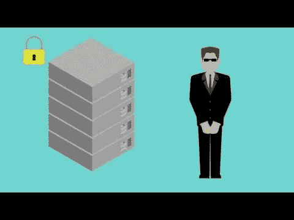

# 所以你想建立一个 E2E 加密的 P2P Twitter？

> 原文：<https://medium.com/hackernoon/so-you-want-to-build-a-p2p-twitter-with-e2e-encryption-f90505b2ff8>



## 第一部分:理解和创建加密身份。

所有这些都有麻省理工学院许可的开源代码，并且可以在浏览器中实时更新？

那你来对地方了。首先，观看这段 1 分钟的讲解视频，了解加密技术的工作原理:

[](http://gun.js.org/explainers/data/security.html)

第二，由于 [@mhelander](https://github.com/mhelander) 在 SEA 框架(安全、加密、授权)上的工作，你的应用将使用最新的原生 Web Crypto API 来实现上述视频系列中解释的所有功能——像 ECDSA、PBKDF2、AES 等等。这是一个它实际工作的演示:

[](https://youtu.be/52Z72bDCtMU)

要开始构建您的应用程序，只需在您的应用程序中包含 SEA:

```
<script src="https://cdn.jsdelivr.net/npm/gun/gun.js"></script>
<script src="https://cdn.jsdelivr.net/npm/gun/lib/cryptomodules.js"></script>
<script src="https://cdn.jsdelivr.net/npm/gun/sea.js"></script>
```

> *注意:如果 CDN 遭到破坏，你的应用程序可能会被黑客攻击，考虑将你的应用程序电子化以移除任何主机。此外，* `*lib/cryptomodules*` *名称将来会更改，你需要及时更新你的应用。*

现在，在您的 javascript 中，您实例化 gun 和并引用您的用户:

```
var gun = Gun();
var user = gun.user();
```

要创建一个由公钥/私钥对支持的加密身份(参见视频讲解)，只需:

```
// Browser Native Web Crypto API used to PBKDF2 extend password.
user.create('alice', 'unsafepassword', function(ack){
  // done creating user!
});
```

创建用户后，您可以使用以下方式登录他们:

```
// Browser Native Web Crypto API used to PBKDF2 extend password.
user.auth('alice', 'unsafepassword', function(ack){
  // logged in!
});
```

最后，您可以将数据保存到其他人无法写入的帐户:

```
var alice = {name: "Alice"};
alice.boss = {name: "Fluffy", species: "Kitty", slave: alice};
user.get('profile').put(alice);
```

当它存储在磁盘上或通过网络发送时，它使用加密签名(见视频解释者)，来保护帐户和数据，而不依赖任何可信的服务器！

然后当你使用[枪](https://github.com/amark/gun)读取数据时，它会自动为你验证和解密数据:

```
user.get('profile').get('boss').get('slave').get('name').val(data =>
  console.log("The boss's slave's name is:", data); // Alice
);
```

尝试在 [Codepen](https://codepen.io/anon/pen/QajxOz?editors=1012) 中自己运行它！

现在您已经有了 P2P 身份，您可以将它与来自[5 分钟交互式待办事项应用教程](http://gun.js.org/think.html)的逻辑相结合，来创建用户的推文列表。

我们将在第二部分讨论如何做到这一点。至于现在，认识并发挥令人兴奋的想法，您现在有安全的用户帐户，没有任何中央或联邦服务器来授权他们！

在我们关闭 Twitter 的同时，在 Twitter 上关注我们，或者阅读关于未来社交网络如何工作的文章，或者制作一个 PR 来改进这篇文章，不要忘记分享！