# 所以，你想有一个实用工具代币销售…(第一部分，许多:注册和 KYC 过程)

> 原文：<https://medium.com/hackernoon/so-you-want-to-have-a-utility-token-sale-part-i-of-many-the-registration-kyc-process-a3ef6f35f0a8>

我们目前正处于[简易代币](https://simpletoken.org)的 [ICO](https://hackernoon.com/tagged/ico) 流程的高潮，明天开始预注册和 KYC，然后 2017 年 11 月 14 日开始 ST 代币发售。简单令牌是 OpenST 协议的[的实用令牌，我们](/simple-token/openst-protocol-and-platform-released-to-the-public-under-open-source-licenses-d4700d83ea7a)[在一个充满泡沫、不确定性、投机和彻头彻尾的骗局的复杂且快速变化的 ICO 环境中，努力举办一场专业令牌销售活动](/simple-token/simple-token-finalizes-token-sale-price-43f96e37cc0b)。

在简单令牌媒体上，我定期发布关于简单令牌项目的关键话题。我还可以每天 18 小时通过我们的电报直接回答来自社区的问题。

在接下来的几周，我希望在[**hacker noon**](https://hackernoon.com)**上分享几个关于 ICO 过程的内幕花絮——这是我整个职业生涯中经历的最折磨人、最令人兴奋的过程中好的、令人筋疲力尽、最具挑战性和最令人讨厌的部分。**

**今天的帖子是关于获得令牌注册和 KYC 过程的权利。您可以在这里随意借用任何东西来举办您自己的代币销售活动，或者联系我和我们的团队，因为我们在我们的合作伙伴 [Cynopsis Solutions](https://www.cynopsis-solutions.com/) 的合规支持下，在这里自行构建了一切。**

# **一些顶级的东西**

**我们的代币分发活动强调建立和培养一个强大的社区的重要性，该社区由为生态系统做出贡献的简单代币会员公司和开发者组成，因此我们正在采取措施验证每个参与者。**

**注册过程中收集的必要信息使我们能够:**

1.  **满足了解您的客户、反洗钱、反恐怖融资合规需求；和**
2.  **通过允许尽可能多的参与者加入销售，实现公平的代币分配。**

# **销售参与者的重要信息**

*   **简易代币公开销售是参与者可以购买简易代币“ST”的活动。谁应该购买 ST？想要创造品牌代币的公司。想要探索在 OpenST 上开发的开发人员。考虑 ST. ST 未来项目的个人不是证券，不应该被秘密投机者购买。**
*   **“ETH”将是代币分发活动中唯一可接受的支付形式。注册时，您将被要求输入用于代币活动的以太坊钱包的地址。**
*   **出售的每 ST ETH 价格将在出售前确定。**
*   **作为注册的一部分，我们将收集信息，目的是验证每个参与者的 KYC(“了解你的客户”)，并运行反洗钱(“反洗钱”)和 CTF(“反恐怖融资”)数据库的数据。**
*   **您将能够在注册期间为您的项目保留一个品牌令牌名称。**
*   **试图从不同的地址或直接从某个交易所(如比特币基地、北海巨妖、波兰等)发送 ETH。)将导致无法购买简单令牌(“ST”)，您的 ETH 可能会永久丢失。**
*   **警惕试图获取密码或 ETH 地址等敏感信息的诈骗网站或网络钓鱼电子邮件。**
*   **简单令牌公共令牌销售仅发生在域 *(TBA)* 上，并且所有电子邮件通信都从发送域“*@ Simple Token . org”*发送**
*   ****重要提示:**简单令牌从不通过电子邮件请求或发送任何敏感信息。**
*   ****非常重要:**简单令牌从不通过电子邮件请求或发送任何敏感信息。**

# **注册过程中你需要什么？**

*   **你的护照**
*   **相机或智能手机与护照自拍**
*   **您的公共以太坊地址(有问题吗？参考下面的钱包部分)**
*   **如果你是中国公民，你只有居住在国外才有资格参加。在这种特殊情况下，你需要提供你的居住证明。**

**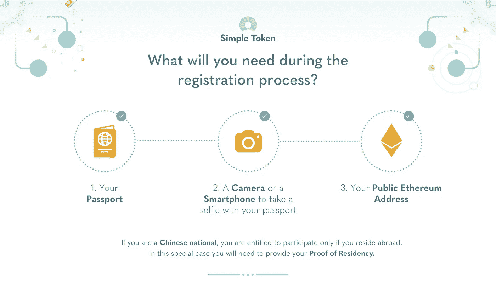**

# **谁可以参与？**

**任何年满 18 岁且不属于以下类别的个人都有资格参与代币销售。**

*   **以下国家的公民没有资格参与象征性销售:阿富汗、波斯尼亚和黑塞哥维那、中非共和国、古巴、刚果民主共和国、朝鲜民主主义人民共和国、厄立特里亚、埃塞俄比亚、几内亚比绍、伊朗、伊拉克、利比亚、黎巴嫩、索马里、南苏丹、苏丹、叙利亚、乌干达、瓦努阿图和也门。**
*   **以下国家的居民没有资格参与象征性销售:阿富汗、波斯尼亚和黑塞哥维那、中非共和国、中国、古巴、刚果民主共和国、朝鲜民主主义人民共和国、厄立特里亚、埃塞俄比亚、几内亚比绍、伊朗、伊拉克、利比亚、黎巴嫩、索马里、南苏丹、苏丹、叙利亚、乌干达、瓦努阿图和也门。**
*   **上述国家的 IP 地址被封锁，以防止参与代币销售。使用 VPN 被视为非法行为，并将向主管部门报告。**
*   **如果您居住在美国纽约州，根据州法规，您无权参与代币销售。**
*   **如果你居住在克里米亚，你没有资格参与代币销售**

# **登记表**

**为了有资格参与令牌分发活动，您必须完成注册过程。**

**您可以在 2017 年 11 月 1 日访问[简单令牌网站](https://simpletoken.org)，点击页面顶部的“立即注册”按钮，开始注册流程。不要试图在除 https://simpletoken.org[之外的任何其他网站注册](https://simpletoken.org)**

****第一步:访问简单代币网站****

**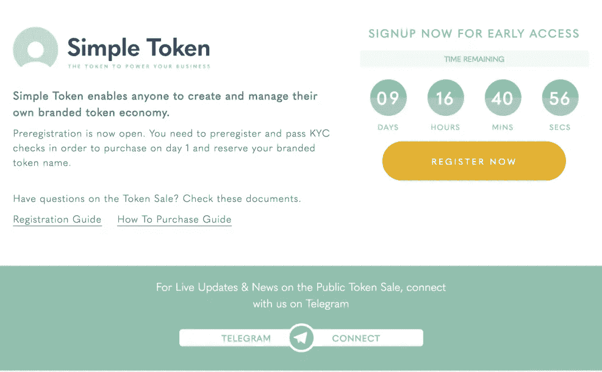**

## **第二步:用电子邮件和密码注册**

**要参与代币销售，您必须使用简单代币创建一个个人帐户。**

**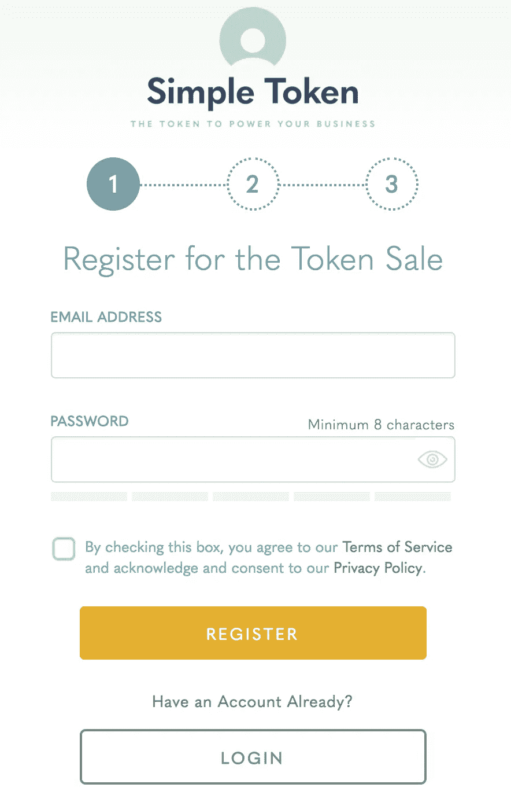**

**在注册页面上，您将被要求输入您的电子邮件。**

**如果您通过参与'[支持证明奖励](https://docs.google.com/document/d/1mOQBspEmW3hDLSfu8eG4bmWML79d5yIKIE1yZjsyDRc/edit)'或任何其他特殊计划获得了 10%的奖金，请确保使用完全相同的电子邮件地址。**

**您需要为您的帐户设置密码。需要电子邮件地址和密码来登录您的帐户，以查看您的个人控制面板并参与代币销售。如果出现与 KYC/反洗钱/CTF 检查相关的问题，您需要登录您的帐户来更新信息。**

**请确保设置一个不在任何其他网站上使用的强密码，并且不要与任何人共享您的密码。**

## **第三步:个人信息**

**创建帐户后，系统会要求您输入下列个人信息。**

*   *****名*****
*   *****姓氏*****
*   *****出生日期*****
*   *****地址详情:*街道地址，城市，州/地区，国家，邮政编码****
*   **请确保输入的姓名与护照上显示的完全一致。如果您的护照包含拉丁字符，请提供拉丁字符。我们不能保证非拉丁字符的护照将被接受。我们只接受护照。我们决定围绕合规性设置一个非常高的标准，以确保安全和公平的代币销售。简单令牌是一个实用程序令牌，我们希望确保它将用于实用程序。如果我们的方法可能会排除一些人，我们很抱歉，但我们认为这是为了社区和简单令牌生态系统的最佳长期利益。**

**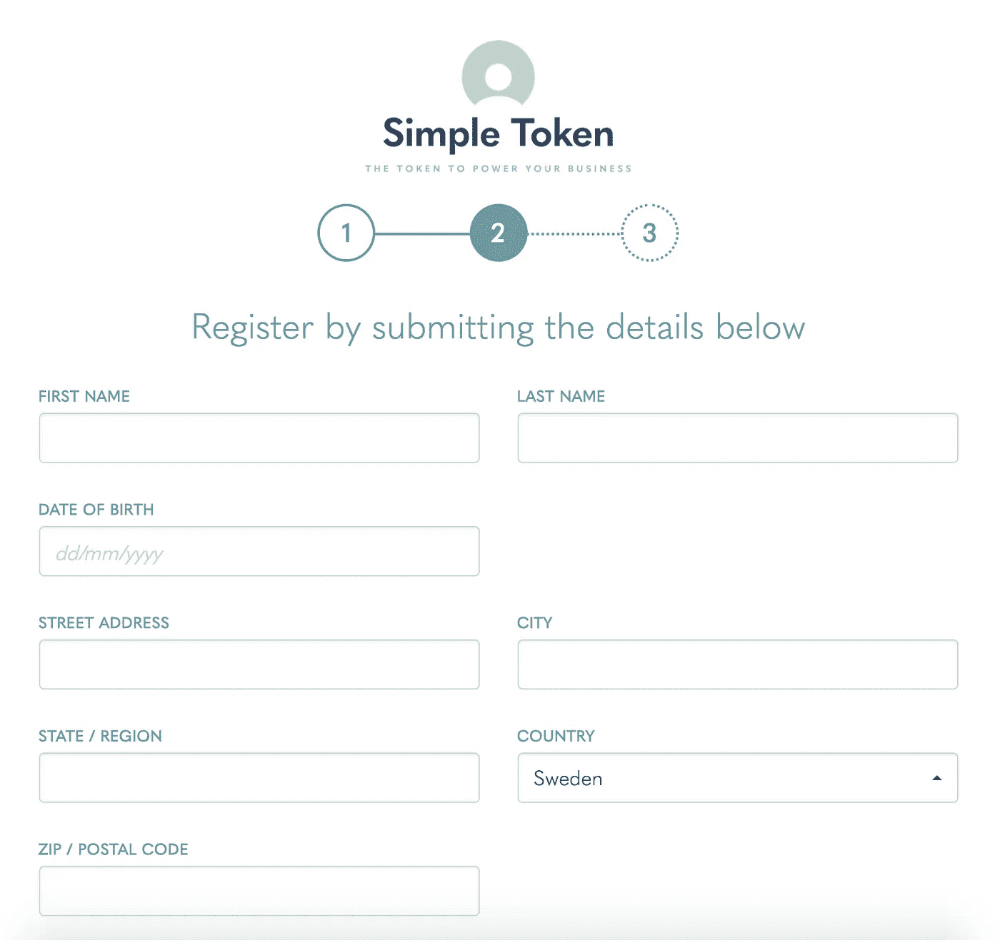**

## **第四步:输入你的以太坊钱包地址**

**当输入您的以太坊钱包地址时，请确保您的以太坊钱包支持 ERC20 令牌，并且您拥有该钱包的私钥。**

**代币销售支持的钱包包括 MyEtherWallet、Mist-Ethereum 钱包、MetaMask、Parity、imToken、Ledger、Trezor 等。您不能使用管理您的密钥的服务，如比特币基地。**

**当您完成购买时，您输入的地址必须在代币销售过程中使用。从注册地址以外的任何地址发送 ETH 将不被接受。此钱包地址只能设置**一次**，并且在您提交数据后不允许进行任何修改。**

**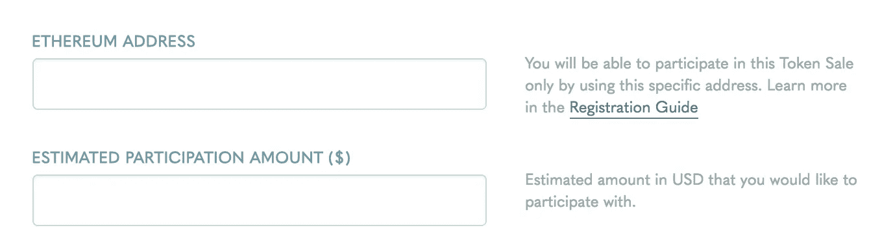**

*****注意:不要从比特币基地、波洛涅克斯、北海巨妖等交易所发 ETH。它将被拒绝。*****

## **第五步:身份证件**

**填写您的个人详细信息和以太坊地址后，您将被要求提供以下形式的其他身份证明文件:**

**1)高质量的 PNG / JPG / PDF 格式的护照复印件；**

**2)你拿着护照的照片。请确保我们能在照片中清楚地看到你和你的护照。**

****

**注意:护照复印件必须与 KYC 表格中提供的信息一致。**

**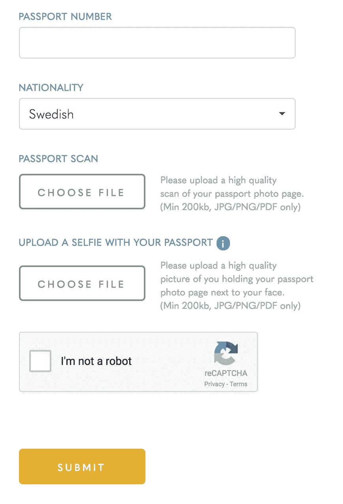**

## **第 6 步:核实信息并接受条款**

**提交您的个人信息和 KYC 后，您必须验证您提交的信息并同意条款和条件。请花时间仔细阅读[条款和条件](https://simpletoken.org/token-sale-terms)。**

**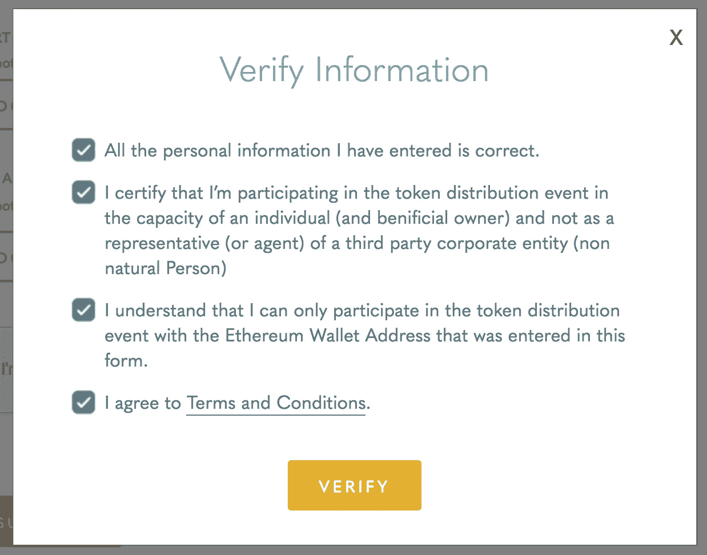**

## **步骤 7:预订您的品牌代币**

**验证您的信息并同意条款和条件后，您将进入一个页面，在此您可以为您的品牌令牌保留一个名称。这只是一个预约，并不保证你可以使用这个名字。OpenST 基金会将审查保留名称，以确保您有权使用该名称。在成员公司注册过程中，当制造品牌标志“BT”时，可以确认/更改保留名称。**

**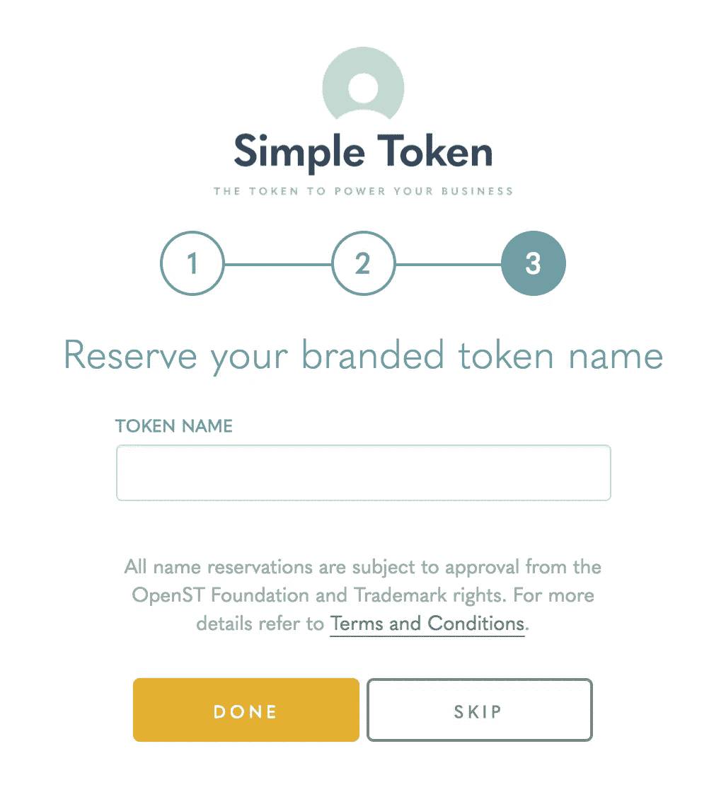**

## **第 8 步:帐户激活**

****重要提示**:注册完成后，您将收到一封来自 Simple Token 的电子邮件，要求您激活您的帐户。请注意，该帐户将保持不活动状态，直到您确认您的注册提交。**

**不要让你的努力白费。请确保验证您的帐户。**

**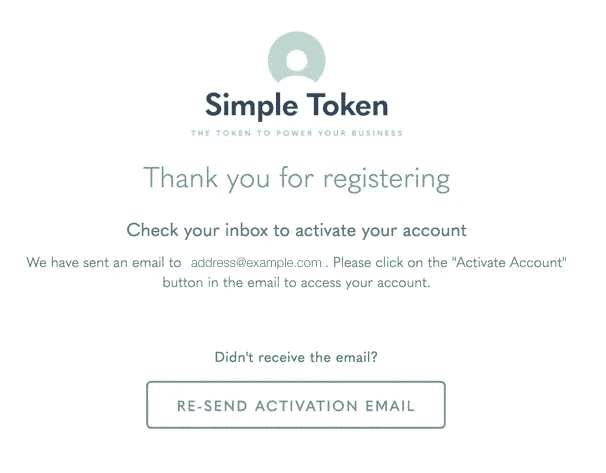****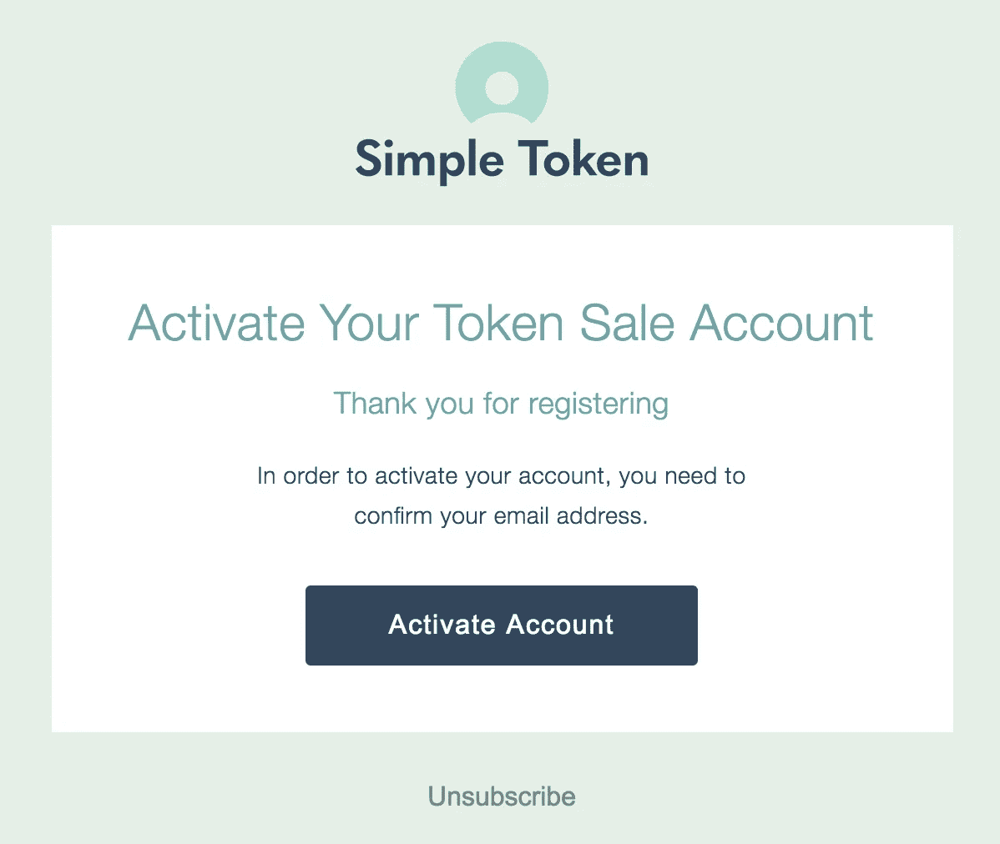**

**您现在可以登录您的帐户来查看您的申请状态。**

**您将从 tokensale@simpletoken.org 收到一封关于注册状态的电子邮件，无论是“批准”还是“拒绝”。在某些情况下(例如，低质量的身份证照片)，电子邮件将包含重新提交您的详细信息的请求。在这种情况下，您需要使用您的密码登录，然后重新提交您的详细信息或身份证明文件。**

**注意:只有来自(tokensale@simpletoken.org 这个地址的邮件才是我们发来的。我们绝不会通过电子邮件发送链接或个人数据。您需要输入或点击 URL: (TBA)并按照登录程序更新您的详细信息。**

# **注册确认的延迟**

**如果我们遇到大量用户涌入，验证的处理时间可能会变慢。这并不一定意味着你的提交有问题。请耐心等待，如果您的 KYC 信息被批准或您提供的信息有问题，我们会与您联系。确保监控与您的简单令牌注册提交相关的电子邮件，以查看您是否收到了我们关于验证的电子邮件。**

# **你应该采取这些预防措施**

1.  **在注册过程中，切勿将 ETH 发送到任何地址。**
2.  **将注册页面(TBA)加入书签，不要通过任何电子邮件链接访问注册网站。**
3.  **不要从比特币基地、波兰、北海巨妖等交易所发送 ETH。**
4.  **不要使用多重签名钱包。**
5.  **永远不要回复我们的邮件。仅在我们的网站上执行您的所有操作。您可以通过登录您的帐户在我们的网站上查看您的注册状态。**

# **钱包**

**以下信息仅为一般性质。OpenST Foundation 和 Simple Token 只能提出关于钱包的建议和推荐。我们强烈建议你进行自己的研究。**

## **我的钱包**

**我们有过使用[我的以太钱包](https://myetherwallet.github.io/knowledge-base/getting-started/getting-started-new.html)的美好经历。**

**以下是他们直接从网站上下载的入门指南:**

**MyEtherWallet 让您能够生成新的钱包，这样您就可以自己存储您的 ETH 令牌，而不是在交易所。这个过程完全发生在你的电脑上，而不是我们的服务器上。我们不是网络钱包。我们是一个客户端界面，可以让你与以太坊**进行交互。我们从不保存、存储或传输任何敏感信息。因此，当您生成新的 wallet 时，您有责任对其进行安全备份。****

****为了入门:****

1.  ***[*新建一个钱包。*](https://myetherwallet.github.io/knowledge-base/getting-started/creating-a-new-wallet-on-myetherwallet.html)***
2.  ***[*背起钱包。*](https://myetherwallet.github.io/knowledge-base/getting-started/backing-up-your-new-wallet.html)***
3.  ***[*验证您是否可以访问这个新钱包。*](https://myetherwallet.github.io/knowledge-base/getting-started/accessing-your-new-eth-wallet.html)***
4.  ***[*将 ETH/token 转移到这个新钱包。*](https://myetherwallet.github.io/knowledge-base/faq/buying-selling-exchanging-eth-tokens-fiat.html)***
5.  ***[*检查你的余额*](https://myetherwallet.github.io/knowledge-base/getting-started/checking-balance-of-my-account.html)***

## ***特雷佐***

***[Trezor](https://trezor.io/) 是最受欢迎的硬件钱包之一。你可以直接从他们那里或者在亚马逊上购买你的钱包。***

***[这个视频](https://youtu.be/_OINuQq3N-M)很好地解释了如何在你的 Trezor 上使用 ERC-20 代币，比如 ST。***

# ***如何将 ETH 从 CoinBase 转移到您的 MyEtherWallet***

***在 Simple Token，我们在代币销售过程中支持我们的社区。我们制作了这个简单的指南，告诉你如何将你的 ETH 从 CoinBase 转移到 MyEtherWallet，以防你需要帮助。***

***下面我们提供了快速完成这一过程的说明。***

***在下面的简短指南中，您将学习如何:***

***a.建立一个兑换账户，将法币兑换成加密货币
b .从兑换平台购买 ETH
c .在钱包上建立一个地址，您将能够在简单代币代币销售中使用该地址
d .将 ETH 从兑换平台转移到钱包***

***本指南重点介绍比特币基地和 MyEtherWallet 的使用，因为许多用户要求澄清这一具体过程。***

***如果您对不同媒体有任何其他问题，您可以通过简单令牌电报频道(t.me/simpletoken)加入我们，我们将很高兴为您提供支持。***

*****第一步。**
登录您的比特币基地账户。***

*****第二步。**
在顶部菜单点击“账户”，选择您的 ETH 钱包查看您的余额。***

***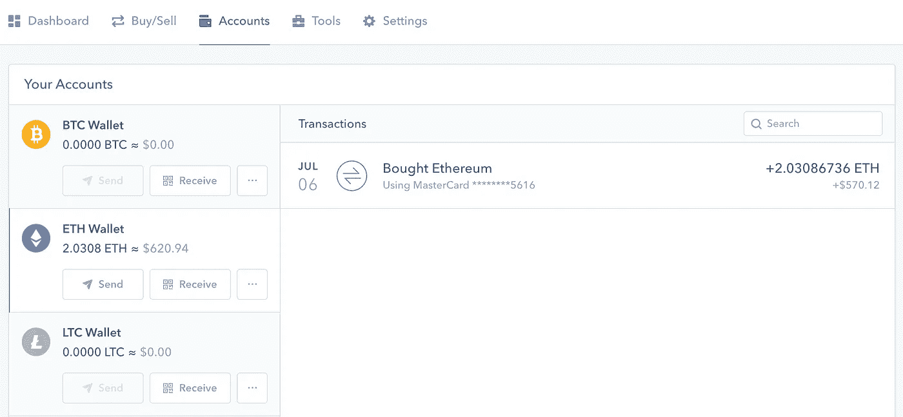***

*****第三步。**
点击“发送”按钮，停留在“钱包地址”标签上。在收件人字段中输入您的 MyEtherWallet 地址。
选择 ETH 中的金额或您选择的货币，并留下备注，以帮助您在将来记住交易原因。***

***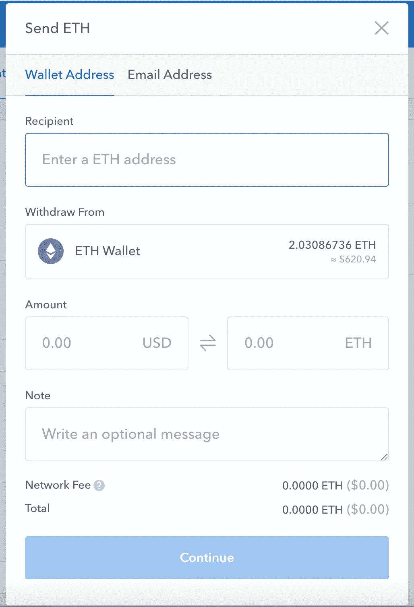***

***准备好后，点击继续。***

***重要提示:请记住，交易费将根据所选金额收取，这是按转账金额的百分比计算的附加费。该金额将在交易结束时反映出来。***

***现在，您将被重定向到一个确认页面，页面上会显示转账金额。***

***你已经把 ETH 转移到我的钱包里了。请记住将您的密钥库文件、私钥和恢复短语保存在一个安全的位置，不要与任何人共享它们。***

***在您将 ETH 发送到简单令牌销售地址之前，您需要完成注册并通过 KYC 检查。***

# ***我们非常重视隐私和安全。以下是我们为保护客户个人数据而采取的一些措施:***

1.  ***数据传输通过使用 HTTPS 的安全连接进行。***
2.  ***所有数据都以加密形式存储在服务器上。每个用户的数据都使用一种独特的盐加密，这种盐本身由基于 HSM 的密钥管理器加密。***
3.  ***无法使用用户密码检索数据。因此，即使密码泄露，用户数据也无法访问。***
4.  ***我们的网站和基础设施通过了安全分析和审查，以发现漏洞模式和攻击。***

# ***一些常见问题***

1.  *****提前接入是如何工作的？**代币销售于 2017 年 11 月 14 日开始。代币销售的第一天仅限于白名单中的早期访问个人。要加入早期访问白名单，请在 2017 年 11 月 1 日至 11 日期间在 https://simpletoken.org/[注册。需要进行标准的 KYC /反洗钱/ CTF 合规检查。一旦您的 KYC /反洗钱/ CTF 获得批准，您将被添加到早期访问白名单中。](https://simpletoken.org/)***
2.  ***如果我错过了预注册期怎么办？如果您在 11 月 11 日之后注册，您仍然可以注册并参与 11 月 15 日开始的公开代币销售。需要进行标准的 KYC/反洗钱/CTF 合规检查。一旦您的 KYC /反洗钱/ CTF 获得批准，您将被添加到公开销售白名单中。***
3.  *****要求还是限制？**任何年满 18 岁、通过 KYC /反洗钱/ CTF 检查的个人都可以参与代币销售，但联合国制裁国家、中国和美国纽约州的居民除外。要了解更多有关 KYC /反洗钱/ CTF 要求或特定限制的信息，请访问我们的常见问题页面或通过电报渠道询问我们的团队。***
4.  *****你应该把钱寄到哪个地址？** Copy: Simple Token 绝不会在此或任何电子邮件或社交媒体网站上发布 ETH 地址。只有当你在[https://sale.simpletoken.org](https://simpletoken.org)登录你的账户，并且完成所有要求后，你才能获得我们的 ETH 地址。***

***查看所有[常见问题](https://simpletoken.org/faq)***

***[在电报上与我们聊天](https://t.me/simpletoken)***