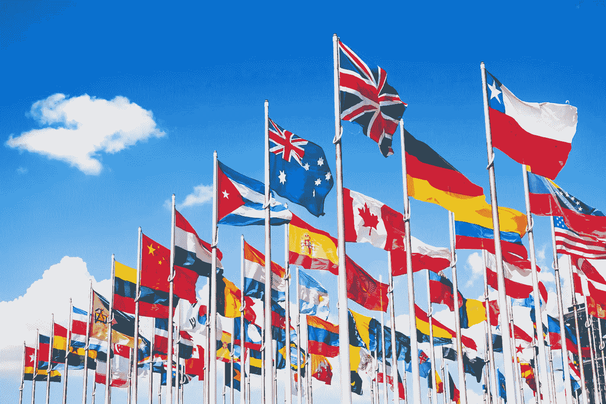

# 社交媒体比国家更大

> 原文：<https://medium.com/hackernoon/social-media-is-bigger-than-countries-5b9a30aa3e0>



## 如果脸书是一个国家，它将是世界上最大的国家。


今年夏天，脸书发布了 2016 年第二季度的财务业绩，该平台的月活跃用户数超过 17 亿。WashApp 和 Messenger 的用户为 10 亿，而 Instagram 的注册用户为 5 亿。

但是脸书并不是唯一一个用户增长的城市。这一趋势似乎表明，社交媒体平台正在变得比国家更大。

事实上，如果你比较一下人口最多的国家(T1)和 T2 最大的社交网络(T3)的月活跃用户，20 个国家中有 15 个在数字领域，而不是主权国家。

```
**TOP 2016 RANKING (by estimated population or monthly active users):**1\.  Facebook      1,712 million             11\. US              323 
2\.  China         1,373                     12\. Twitter         313
3\.  India         1.266                     13\. Baidu Tieba     300
4\.  WhatsApp      1,000                     13\. Skype           300
4\.  Messenger     1,000                     14\. Sina Weibo      282
5\.  QQ              899                     15\. Indonesia       258
6\.  WeChat          806                     16\. Viber           249
7\.  QZone           652                     17\. Line            218
8\.  Tumblr          555                     18\. Brazil          205
9\.  EU              513                     19\. Pakistan        201
10\. Instagram       500                     20\. Snapchat        200 *Sources:* [*CIA World Factbook*](https://www.cia.gov/library/publications/the-world-factbook/rankorder/2119rank.html) *-* [*Statista*](https://www.statista.com/statistics/272014/global-social-networks-ranked-by-number-of-users/) 
```

尽管中国和印度仍是世界上人口最多的国家，但从人口数量上看，它们已被脸书超过。WhatsApp 和 Messenger 都是第 4，Instagram 是第 10。

在脸书的应用程序和工具家族之外，Tumblr 排名第八，Twitter 排名第 12，用户数量略高于 3 亿，而 Snapchat 排名第 20，用户数量约为 2 亿。

在中国，腾讯控制着 QQ、微信和 QZone，它们在该榜单中排名第 5、第 6 和第 7。微博紧随推特之后，排在第 13 位。

回到 2014 年，当[我第一次在社交媒体上发布快速增长](/@andreas212nyc/social-media-platforms-are-growing-bigger-than-countries-2e6c47a3d7ec#.z5yz71s4j)时，中国和印度排名第一，而脸书以 11 亿多一点的用户排名第三。

[](/@andreas212nyc/social-media-platforms-are-growing-bigger-than-countries-2e6c47a3d7ec) [## 社交媒体平台正在变得比国家更大

### 脸书是最大的社交网络，仅次于中国和印度

medium.com](/@andreas212nyc/social-media-platforms-are-growing-bigger-than-countries-2e6c47a3d7ec) [](http://bit.ly/HackernoonFB)[](https://goo.gl/k7XYbx)[](https://goo.gl/4ofytp)

> [黑客中午](http://bit.ly/Hackernoon)是黑客如何开始他们的下午。我们是 [@AMI](http://bit.ly/atAMIatAMI) 家庭的一员。我们现在[接受投稿](http://bit.ly/hackernoonsubmission)并乐意[讨论广告&赞助](mailto:partners@amipublications.com)机会。
> 
> 如果你喜欢这个故事，我们推荐你阅读我们的[最新科技故事](http://bit.ly/hackernoonlatestt)和[趋势科技故事](https://hackernoon.com/trending)。直到下一次，不要把世界的现实想当然！

[](https://goo.gl/Ahtev1)