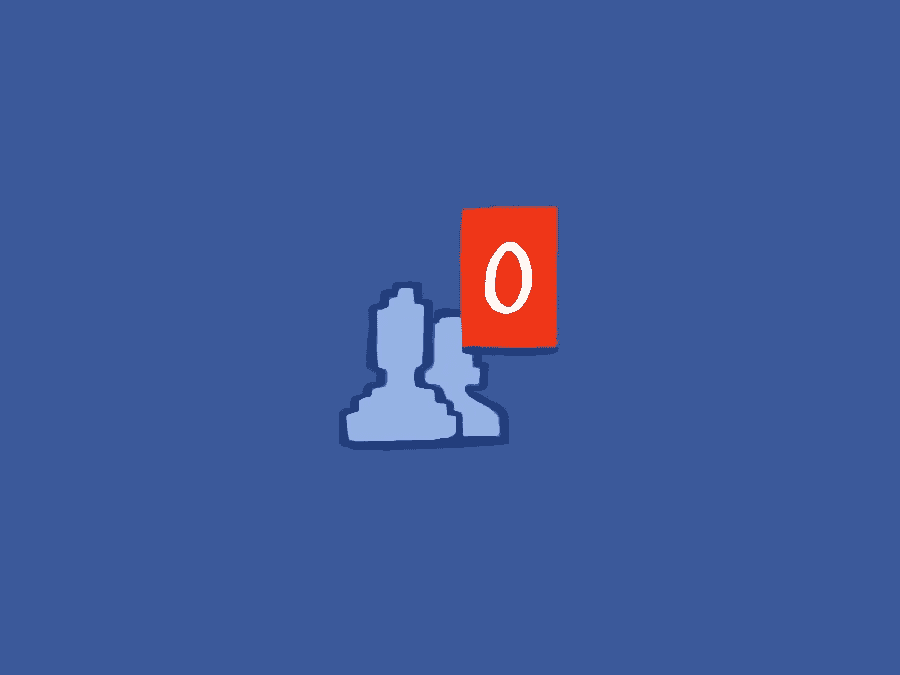

# 反社会人士的社交网络

> 原文：<https://medium.com/hackernoon/social-networks-for-anti-social-people-c6c722aeef92>

前几天 FB 上有一条评论让我措手不及。

Nerdwriter [问](https://www.youtube.com/watch?v=eQzmLrSjmhg)“如果没有赞或评论，你会使用社交媒体吗？如果没有浏览量，你会使用 Youtube 吗？”

然后他说“不”

除了。我会说是的。

你看，FB 和 Instagram 和 Twitter 和 Youtube，甚至这里的 Medium，都不是这样。它们与追随者无关。我把[好奇博士](http://brennanletkeman.com/phd.html)写成了一个邮件列表，只有我知道订阅的人数，也只有那时因为 Mailchimp 坚持认为这很重要。

但事实并非如此。

当点击量为零时，我给 Acrylo 回了信。随着事情的发展，它变得“成功”,因为到最后它已经覆盖了成千上万的人。但它从第一天起就很成功，因为它是我写自己喜欢的垃圾的地方。

就像我在这里写的。

有些人知道这一点，但很多人不知道:我的中型账户比你们公开看到的要大十倍。我几乎每天都记日记。

问题是，写作就像…我不知道。太老套了。呼吸。如果你屏住呼吸太长时间，你的大脑会变得恐慌，并尽力补救。挣扎着浮出水面，奋力挣扎，直到你得到它。

我写作是为了弥补我头脑中*需要*我去做的那一点。

我第一个承认，有时候这些打斗很混乱。有时它们在主题、表达或连贯性方面很糟糕。

但这是一种喘息。这是创造过程的一个出口。

评论是我在自言自语。

这是真的，我发布了一个状态，然后我在自己的回复中评论，继续扩展我的理论。

对于所有的 UX 人来说，脸书的评论回复结构实际上非常适合对相关主题进行分类和子分类。不是给人回复东西，是给我回复不同层次的东西。

这一直是中型/线性写作的问题:它是一个列表。你必须在列表中构建主题。但是如果我们有抽屉和东西来把某些想法放在一起，那是愚蠢和低效的。

酪我跑题了。

问题是，这个评论让我想到了一个想法，那就是，人们确实把脸书作为与他人交谈的一种方式。

听起来很明显，对吧？

但是我在这里，没有那样做。

我提到了我的中型草稿的日志方面。有趣的是，我写给自己的和写给你的没有任何区别。

唯一的不同是我点击了“发布”。

我甚至不知道现在这些文字是否会被任何人看到。如果你正在读这篇文章，恭喜你，我已经出版了。

但也许我不会。十有八九我会读到最后，耸耸肩，然后结账。

Medium 会自动保存它们，这很好，但是没有必要。

在我使用介质之前，我只使用 Notepad.exe 和写作，直到我 CTRL-F4。

所以社交网络在一定程度上是基于个人背景的，对吗？

即使没有人读过，我也会像在这里一样写作。

我会发同样的微博。

我会拍摄并发布相同的 Insta 照片(公平地说，我真的不看其他人的 Instagrams，所以我已经有效地将这些照片发布到了网上)

我会将同样的 Tumblr 照片保存到我的硬盘收藏中(我最近开始将这些照片转发到 [@Acrylodes](https://twitter.com/acrylodes) 上，以分享我多年来很酷的工业设计灵感)

算是放弃 Snapchat 了。它几乎完全依赖于你对接受者的关心，所以自然不在我的能力范围之内。我确实喜欢时间限制，但 Instagram 和 Twitter 发展如此之快，它们实际上只是暂时的。

总的来说，我想知道这是否与人们的创造和消费心态有关。

我是一个创造者。我什么都不拿，却创造了一些东西。

我一整天都在重复这个动作。

这是我的工作。就像鲨鱼闻到血腥味，向它游去。它不会思考，它只是在任何给定的时间朝着最接近它的目标前进。

但对绝大多数人来说，社交媒体基本上是消费动词。你读过脸书。你翻翻 Instagram。你在 Pinterest 和 Tumblr 上转来转去。你消费别人说的和做的东西。

诀窍是，他们也很擅长让你觉得有创造力。

对吗？这是一个令人愉快的反馈循环。你发布了一些东西，然后你得到了喜欢。

喜欢是毫无意义的互联网点，当然，除了你自己的自我，完全没有价值。但是你会因为他们而感觉好一点。你觉得你*做了*什么。我敢说，像你这样的*做出了*的东西。

Tumblr 可能是最适合这种反馈的。你可以通过转贴别人的照片，成为一个非常“成功”、Tumblr 知名度很高的伪名人。这就是[网络](https://hackernoon.com/tagged/network)的工作方式。你可以不摄影，但可以建立一个华丽的照片帝国。而且感觉很好。

你是个馆长，我猜你会因为有好品味而受到表扬吧？

你是人类内容过滤器。

我也是。因为策展是你用最少的工作量获得的最多的荣誉。你只需点击一个“转贴”按钮，然后就可以开始了！

这比想出一些机智的东西，或者实际上拍一张照片要容易得多

用这个很容易陷入抱怨。

我没有。

如果感觉我反对以上任何一条，那是写作中反复思考的产物。事实是，充其量我是无所谓的。

做你喜欢的任何事情。如果是脸书喜欢的，那就去吧。

我只是注意到，我并不像其他人那样使用社交网站，这是整理我对此事的想法的一种方式，就像我处理任何日志一样。

因为写作对我来说，从根本上来说，是一种把抽象的东西变得相对线性的方法。

写作就是思考。

对我来说，社交只是用“发布”按钮来思考。

如果你愿意，你可以喜欢它，但这些都不是我做这件事的原因。

> [黑客中午](http://bit.ly/Hackernoon)是黑客如何开始他们的下午。我们是 [@AMI](http://bit.ly/atAMIatAMI) 家庭的一员。我们现在[接受投稿](http://bit.ly/hackernoonsubmission)，并乐意[讨论广告&赞助](mailto:partners@amipublications.com)机会。
> 
> 如果你喜欢这个故事，我们推荐你阅读我们的[最新科技故事](http://bit.ly/hackernoonlatestt)和[趋势科技故事](https://hackernoon.com/trending)。直到下一次，不要把世界的现实想当然！

