# 社交虚拟现实:是的，我们又是蹒跚学步的孩子了——回到平行游戏

> 原文：<https://medium.com/hackernoon/social-vr-yup-were-toddlers-again-back-to-parallel-play-14aa94a499c0>

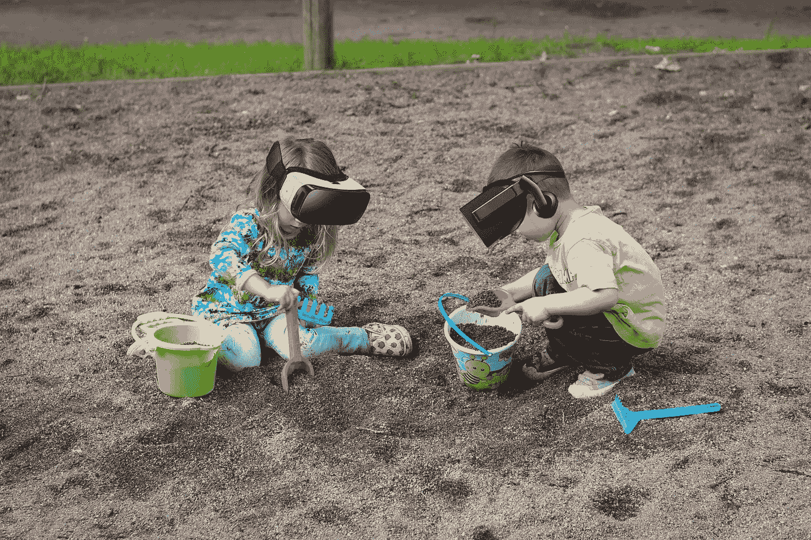

## 外行人的技术:新设备、产品和乐趣的指南——给那些没有计算机科学学位的人。

我最近刚从华盛顿特区的一次家庭访问回来..终于花了一些时间在 HTC VIVE 的设置上，我对虚拟现实系统如何在社交环境中工作有了一些新的认识。奇怪的是，当我们飞向一个新的技术世界时，我们不得不挖掘我们童年的根源来玩社交游戏。

关于虚拟现实，有一些人们互动的标准情况:

*   作为一群独立的虚拟现实用户中的一员。
*   作为唯一的 VR 用户(由旁观者陪同)。
*   并且，通过在线 VR 玩。

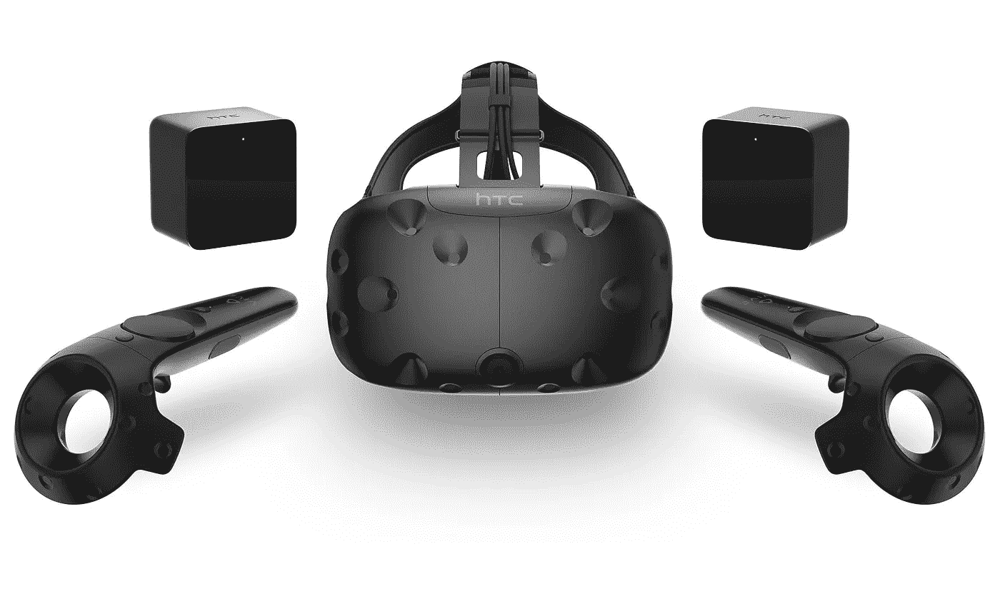

Photo courtesy of Ars Technica.

# **首先，让我们简要介绍一下使用 VIVE** 所需的设置(以及一些关于我妹夫的高科技配件的注意事项)。

*   首先，你需要带系绳的基本耳机。*(在一部为电视制作的科幻电影中，这一部分很可能会融合到你的脑干中。)*
*   直到最近，VIVE 才推出了包含耳机的耳机，因此任何音频组件都需要大型耳机。*(当然！再加一根线！反正我看不到我在往哪里走，所以多一个绊倒的危险又算什么呢？)*
*   两个基站(也称为灯塔)是房间规模的虚拟现实和跟踪的最低要求。这些设备安装在接近天花板的墙壁上。
*   对于大多数操作来说，两个控制器也是必要的，因为它们在 VIVE 的大量操作中模拟了你的手。
*   一台支持虚拟现实的电脑是必须的。一个普通的游戏玩家可能会有一个足以运行 VIVE 的设置，加上额外的冷却系统。
*   一个可供自由漫步的方形房间。(对于像我这样重力受限的人来说，很少有易碎的东西。)
*   对于特定类型的应用，我的妹夫亚当也制作了一个配有车座和脚踏板的装置。它可以折叠并调节高度。(我现在才意识到我没有拍到这张照片。可悲的是，因为他的模拟坑是一个真正的游戏景观！)

考虑到当前普遍的虚拟现实可用性需求，这些项目都不算特别。

# 一群反社交的 VR 用户

在群体环境中，人们可以同时使用多个虚拟现实工作站，人们之间的互动几乎不存在。当我访问西南偏南时，许多地区都显示了这种类型的设置。

从试图让每个人都有机会观看同一素材的角度来看，这是最高效的 VR 方法。然而，它也消除了任何种类的外部交互。

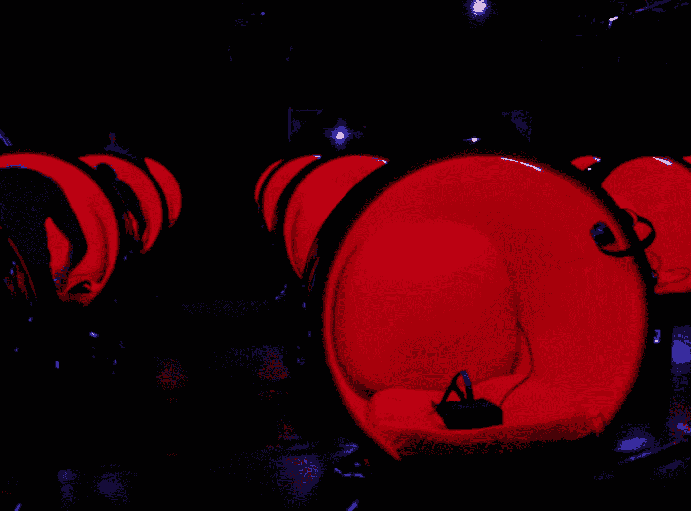

A throwback to The Mumny VR Experience at SXSW. Everyone watched the same video simultaneously, but you couldn’t even hear each other’s laughter.

要明确的是，我不是指“VR 之外”意义上的“外部”。我的意思是，在这些受控的环境中，耳机/虚拟现实世界中也没有交互。这是体验 VR 最被动的方式。你不能和你旁边的人说话，因为他们也被他们的所见所闻所吸引。你不能和耳机里的任何人说话，因为这种结构在这种情况下还不存在。这是真正的平行游戏，不需要比学步儿童更多的社交技巧。

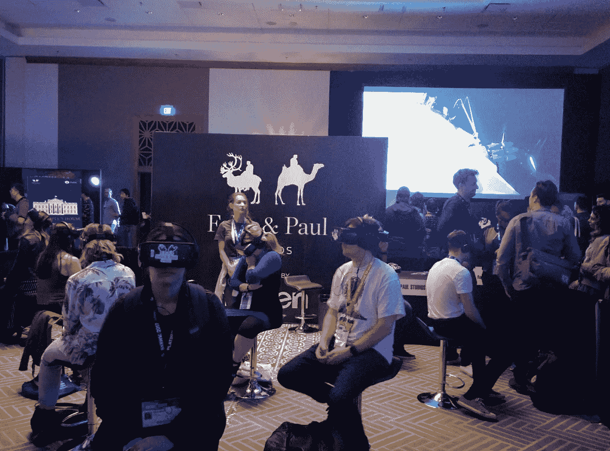

The only people interacting, here, are the ones not inside VR.

> 对于那些没有在母亲攻读心理学硕士学位(并在餐桌上无休止地试图评估你的心理)的环境中长大的人来说，平行游戏是幼儿学习社会行为的第一步。通常，在儿童早期，孩子们在一起玩耍，不会影响彼此的行为。互动要么很少，要么根本不存在。

# 回华盛顿，好吗？

我的妹夫亚当让我成为第一个在晚上尝试这个系统的人，他把这个精巧的椅子巧妙地藏在了基站的视野之外。当耳机被强有力地贴在我的脸上时，亚当开玩笑地叫我 VR 处女。“几乎没有！”我对着一面墙喊道，我的耳机失明让我相信他会在那里。

我很快就会发现他在生活中是多么的正确。虽然我已经使用了相当多的设置，但我从未能够如此自由地使用 VIVE。没有终极目标(比如找到一个 360 度剪辑的方法)，没有销售人员一直和我说话，也没有陌生人挤在一起看我也在看的同一个预先录制的视频。

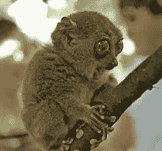

OMG! Even the stick is different!

VR 处女？还是没有处女之身吗？原来我真的是一个。控制是不同的。导航是不同的。入门指南是不同的。一切都与我以前遇到的任何其他设置完全不同。在这个领域中，VR 和 AR 之间有一些非常严重的影响，但我们将把它留到另一天。

# **唯一用户(带旁观者)**

所以，我现在在亚当的家庭办公室里，绑着虚拟现实，站在一个实际上空无一人的房间中间。为了确保住在家里的小狗马文(一只可爱的小狗，长着耷拉的耳朵，一只懒懒的眼睛)不会绊倒我或弄乱绳索，我的妹妹中野律纪扶着它的项圈，守在门口。亚当起初密切监督我，但他也不得不搬到房间外面的椅子上，以便给我足够的自由活动空间。最后，(毕竟这是一个家庭活动)我爸爸也拉了一把椅子加入了这个现在挤在门口的家庭。

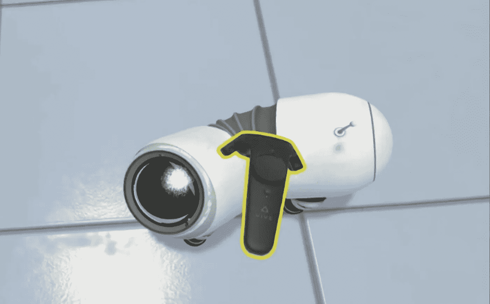

我花了一些时间探索新的娱乐方式。我参加了一个教程，我站在悬崖边，向一个机器人，一只独眼蛞蝓狗扔棍子。尽管我尽了最大努力，我还是无法让机器人在扔出一根“扔得不好”的棍子后跳下悬崖。(我父亲后来在这方面做了更多的工作，这确实是可能的。不要担心，机器人 slog 安全地回来了，蠕动着，并准备好了腹部按摩。)

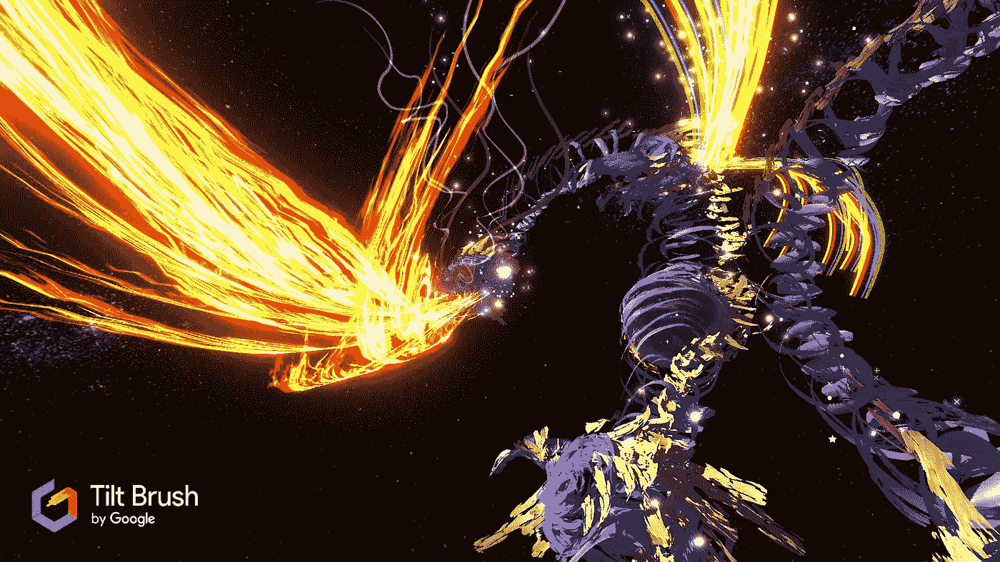

Photo courtesy of gamecrate.com. I definitely didn’t create this, though my creation made people physically sick, so chalk that up as one for me!

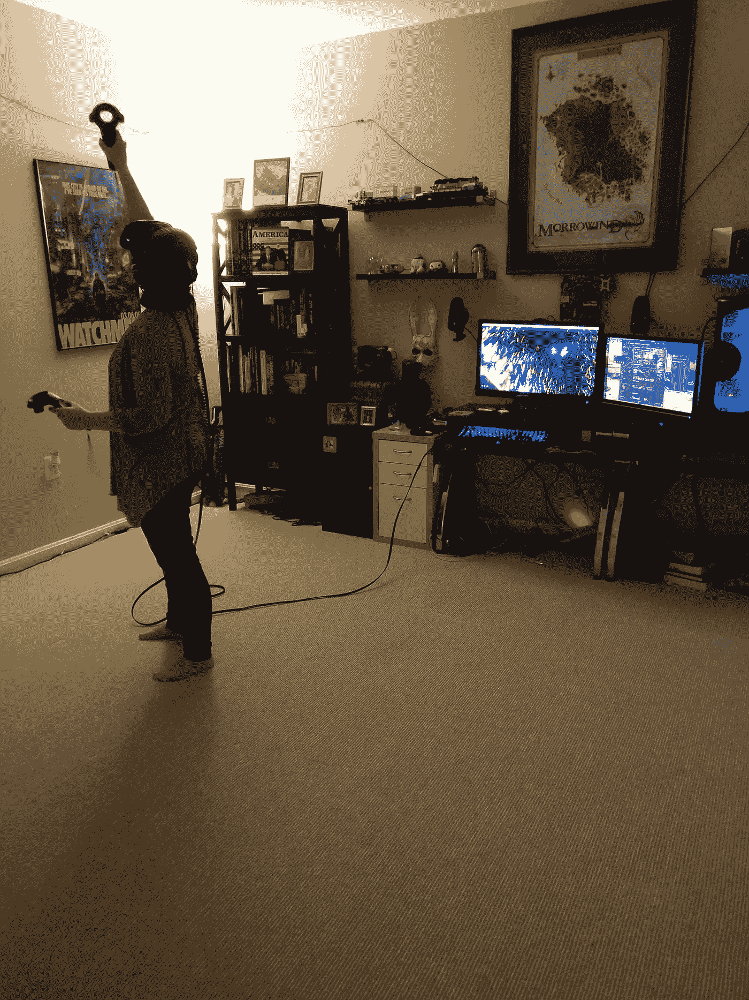

Painting a pyramid!

接下来，我得到了谷歌体验[倾斜刷](https://www.tiltbrush.com/)。我可以预见自己未来会在这个应用上花很多时间——毕竟，我是一名设计师。对于那些不知道的人来说，这是一个应用程序，你可以在 360 度空间中确定颜色和画笔的类型。你实际上是在三维空间中绘画，而不是在 2D 网格上使用透视法来使事物看起来是三维的。你可以画一条线，绕着它走。我选择做一个快速拼凑的金字塔。尝试所有有趣的笔刷(雪、火、电、彩虹等)。)，我能够创造出真正令人作呕的东西。不开玩笑，我正“站在”我的 3D 奇迹里，这个动作让我的胃一阵翻腾。

只是在这个时候，当我在这个神奇的虚拟世界中让自己身体不适的时候，我终于摘下了耳机。没有告诉我的家人为什么，我问谁想从里面看我的杰作。“我们一直在屏幕上看着你，”我姐姐说。拒绝是一种善意的尝试，但我坚持让她试一试。

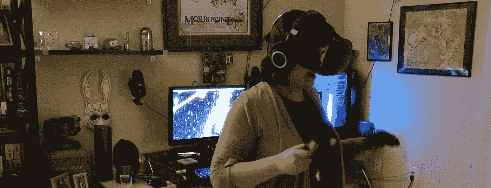

This might be the very moment when my face shows the sudden onset of nausea.

坐在我姐姐曾经坐过的座位上，我注意到作为人类，我们天生具有社会性。 ***社交和……种傻*** 。我的家人试图让非社交娱乐成为一种集体努力。

中野律纪在模拟器中，我现在看到了她在电脑显示器上看到的东西。一个小的(与 360 度版本相比)和相当差的我在虚拟现实中互动的表现。我们三个人坐着，试图进行对话，同时也看着中野律纪在我令人作呕的金字塔里呕吐。时不时地，我们中的一个会对她说些什么。在虚拟现实中，戴着耳机，很难听到所有的话，所以任何“你现在在做什么？“问题或评论给人的感觉是一种悲伤和绝望的尝试，试图与一个注意力 100%在其他地方的人互动。

接下来，我们把我爸爸放进金字塔里。我不知道这让他感到恶心，但这让他非常厌烦。他很快转到了谷歌地球。在那里，您可以放大或缩小地球上的任何地方，并探索位置。在另一次孤注一掷的尝试中，我们其他人一直试图让他谈谈他在做什么，这样我们可能会觉得自己是行动的一部分。我真的不知道我们在期待什么。也许是某种马克·吐温式的叙述？

我开始意识到我可以不坐在门口也能进行同样水平的互动，于是我选择离开两英尺远，去玩一些马里奥派对，等待下一次轮到我。

I WAS Luigi, but I still lost.

我是谷歌地球的下一个用户，我做了我想大多数人都会做的事情:我去探索我已经知道的地方。去看埃菲尔铁塔吗？不，让我们看看我住的地方！那么，既然我在休假，为什么不去我工作的地方格伦辛散步呢？这真的很酷。我走上了我非常熟悉的道路，但这个世界让人想起了《我的世界》。而且，由于谷歌地球是从各种非现场来源获取图像的，一些细节有点偏离。例如，从马车房到苏必利尔湖，我必须穿过一块巨石。

尽管如此，我一定玩得很开心。这家人坚持要给我拍一张背景是谷歌地球 Glensheen 的照片。我甚至试着对着镜头摆姿势，尽管他们花了几次努力让我看向正确的方向。

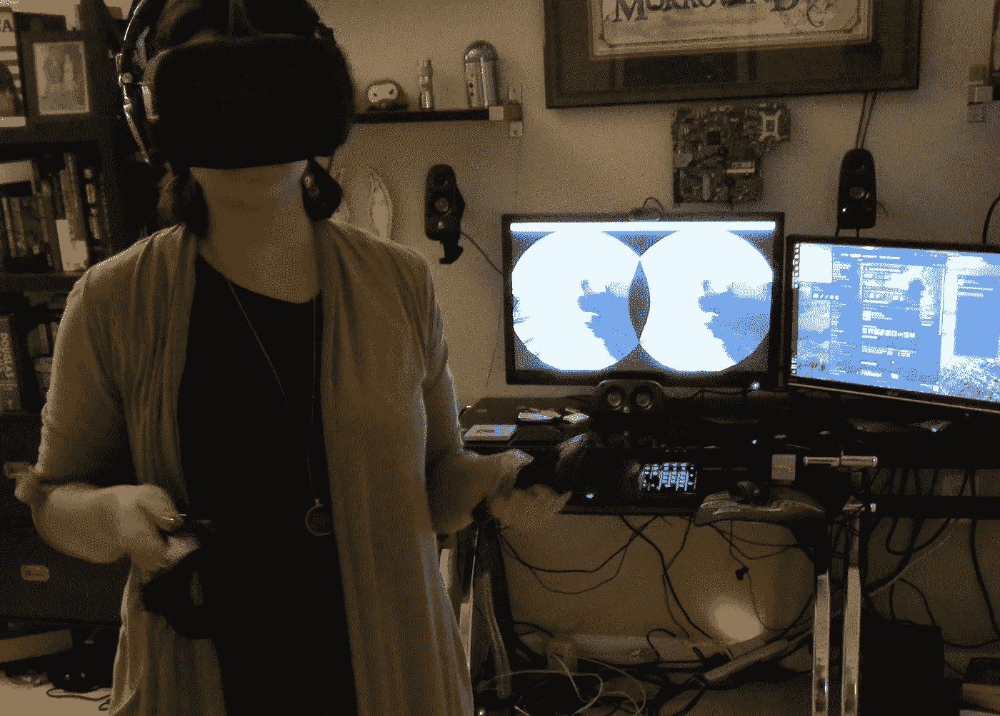

在我身后的显示器上很难辨认出任何可识别的格伦辛属性。亚当为背景中糟糕的监视器图像道歉，但我没有太在意，因为我正在享受 VR 里面的时间。此外，他们知道我可能会在博客中使用这些照片，并通过拍摄它们来帮我一个忙。质量，无论是好的还是坏的图像，从来都不是问题。我们追求的是彼此之间的互动，事实是这样的:

> 当你作为一个虚拟现实旁观者时，在那一刻，你生活的整个目的就是找到一种方式在一个你无法到达的世界中进行互动——找到一种方式在一个不可用的层面上进行连接。

谷歌地球之后，我接着尝试了 Audioshield。与《吉他英雄》相比，我可以诚实地说，这是我一直想体验我所有音乐的方式。我不会进一步详述这有多棒，因为用几句简短的话来说，很多人都比我做得更好。我最喜欢的评论标题是“ ***这款虚拟现实游戏让你把音乐打在脸上*** ”，可以在这里找到。

这大概是所有旁观者都放弃尝试互动的时候了。由于 Audioshield 比我们之前尝试的应用程序更能占据用户的全部注意力和官能，因此不可能进行外部对话。我相信这就是为什么我们门口的家庭开始分散。中野律纪打开了游戏，然后她和我蹲在沙发上，让我爸爸和亚当设置完整的模拟坑。

> 重要的是要注意到:虽然我目前正在批评虚拟现实中群体互动的局限性，但我认为这种体验是对人类和我的神奇家庭的一个很好的证明。我们像兴奋的孩子一样聚集在一起，等待这个科技奇迹的到来。亚当似乎也很兴奋地给了我们这些新的体验——耐心地带着我和爸爸一起导航。中野律纪，虽然我敢肯定她在家里已经多次看到过同样的场景，但也很兴奋地坐下来观看。当他们向我们开放他们的家和技术时，当我注意到我们如何试图找到一些非常规的方式来相互交流时，我也意识到如果我不知道我的失误和奇怪的动作为其他人提供了娱乐的来源，我就不会在虚拟现实中获得如此多的乐趣。在游戏期间有团队在那里**确实**让体验变得更好了！

# 在线 VR 游戏

与许多在线游戏一样，VR 也允许你通过互联网与其他玩家互动。这里的区别似乎是，世界变得如此流动，如此沉浸，以至于其他用户稍微不那么“真实”

当我开始对着电脑生成的马里奥派对对手大喊大叫时，我听到亚当解释了很多。虽然我就在隔壁房间，当他带着模拟舱给我爸爸讲解驾驶飞机的过程时，我听得很清楚，知道我没有在视觉上错过任何东西。

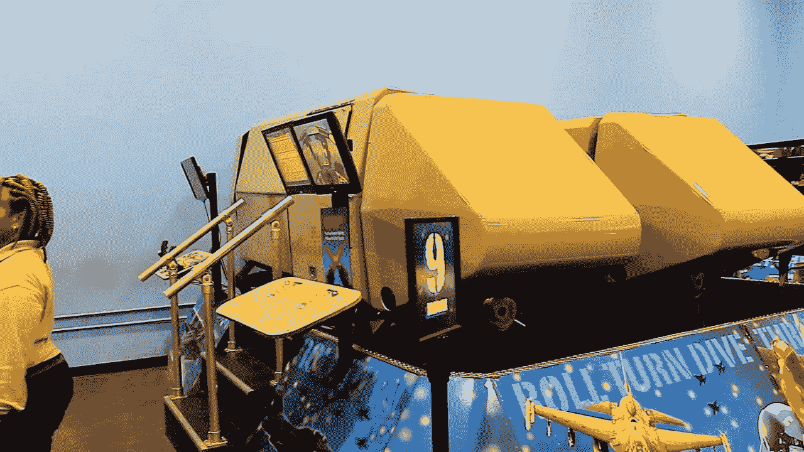

A flight simulator as seen at the Smithsonian. These setups are more encompassing than the VIVE, as they rock and roll as the plane moves.

我的父亲是一名有四十多年飞行经验的飞行员，他很高兴有机会进行虚拟飞行。他之前已经在模拟器中呆过很多次了——为了获得某些飞机的认证——但是虚拟现实是不同的。这些应用程序允许用户在不知道会有灾难性故障需要飞行员恢复的情况下进行探索(这是飞机模拟器中的一种常见训练技术)。在这里，他可以探索他的周围环境，在游戏中，他可以进入类似战争的场景，其中一个人在相同的 VR，交互式环境中与同样是真人的敌机作战。

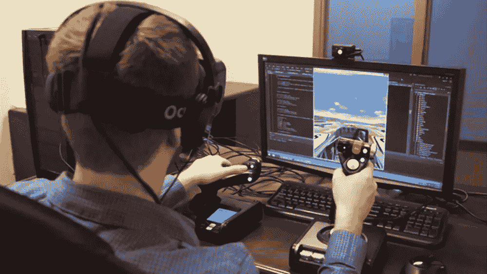

A standard VR flight simulator as seen using the Oculus Rift. Image courtesy of Road to VR.

在一个这样的例子中，当亚当享受时，他已经玩了很长一段时间，这时一架特别的飞机引起了他的注意。与许多标准的在线游戏不同，这个游戏没有为他提供与那个人互动的方式或机会。虽然我没有问细节，但很明显，在传统的游戏意义上，我们无法与这个人交谈。你不能在键盘上输入信息(这不方便，所以不一定是一个选项)，你不能和你的队友说话(没有麦克风)，也没有谁在比赛的连续名单(这会妨碍视线)。

第二天，在工作中，亚当发现前一天的飞机/飞行员是他的同事。一直以来，他们都在同一个游戏里一起玩，但是谁也不知道对方是谁。这让他们有机会讨论游戏，进行本来不会发生的对话，但在事后谈论一次经历，即使双方都在场，也不如在游戏过程中进行这些对话真实。展望未来，可能会有这样的情况，他们可以认出彼此，但由于当前的在线虚拟现实能力，通信仍然受到限制。

当然，可能有一些在线虚拟现实游戏提供了更好的玩家交流选择，但这不是目前的标准。相反，不管我们是否认识其他人，我们都被限制在一种无声的游戏中。平行游戏表明我们不影响他人，但在战争游戏中，目标恰恰相反——你想攻击其他玩家。如果没有基本的交流，我们不知道对手是谁，真正的互动就不可能存在，对我们的社会需求来说，它不会比计算机做得更多。

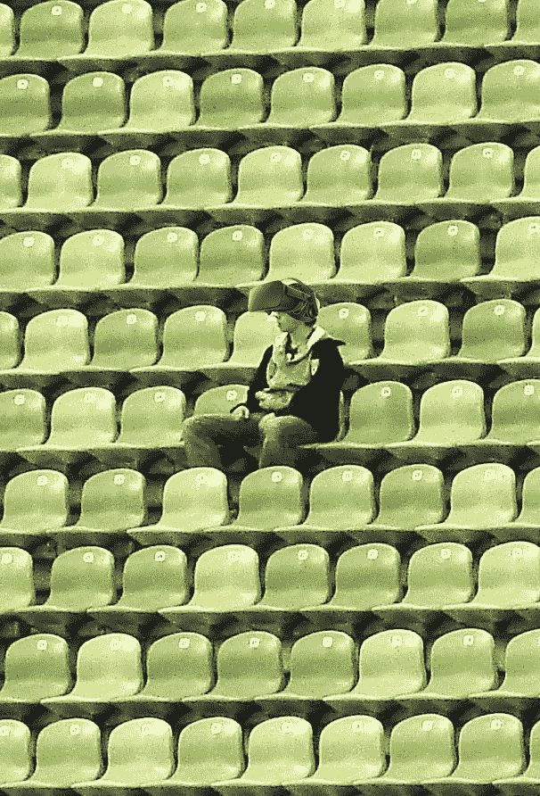

当前形式的虚拟现实是现存的最少社交和最孤立的娱乐选择之一。然而，为了长期生存，这种情况必须改变。正如我们需要以旁观者的身份互动所证明的那样——以那种绝望而又略带羞辱的方式——大多数人都想花时间与他人社交。有时这意味着只是坐在另一个人旁边。其他时候，这是对时事的冗长辩论。不管怎样，当一个人正在经历其他人“不能”经历的事情时，我们的自然反应是想办法参与进来。

在虚拟现实中，我们发现了一些解决方案——都是平行游戏的回归。但是，随着我们超越和进化这种蹒跚学步的倾向，虚拟现实也必须如此，如果它将在未来几十年内伴随我们的话。

最后一次感谢中野律纪和亚当(还有马文),感谢他们无尽的娱乐和盛情款待。我可能还应该对他们在我被吸引到博物馆的 VR/AR 展示并拍摄照片以供未来使用时的宽容表示感谢。你们太棒了！

> [黑客中午](http://bit.ly/Hackernoon)是黑客如何开始他们的下午。我们是 [@AMI](http://bit.ly/atAMIatAMI) 家庭的一员。我们现在[接受投稿](http://bit.ly/hackernoonsubmission)并乐意[讨论广告&赞助](mailto:partners@amipublications.com)机会。
> 
> 如果你喜欢这个故事，我们推荐你阅读我们的[最新科技故事](http://bit.ly/hackernoonlatestt)和[趋势科技故事](https://hackernoon.com/trending)。直到下一次，不要把世界的现实想当然！

