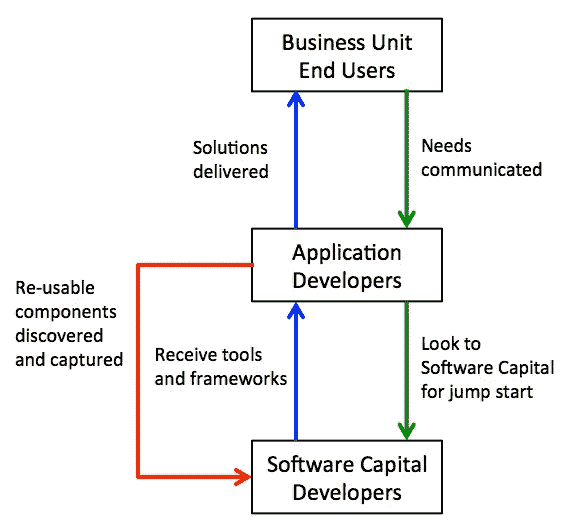
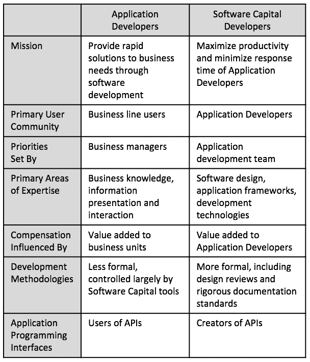

# 软件资本——成就和杠杆

> 原文：<https://medium.com/hackernoon/software-capital-achievement-and-leverage-2c30f6f01ed9>

> **前言**
> 
> 看到这篇 1996 年 12 月 2 日的论文，在这里第一次发表——以其原始形式——对我来说就像打开了一个时间胶囊。在 1997 年 1 月加入贝尔斯登的 FAST 小组后，他和我很快意识到我们在软件开发，尤其是有效的重用方面有着相似的观点。在向他介绍我的第一本书[大型 C++软件设计](https://www.amazon.com/Large-Scale-Software-Design-John-Lakos/dp/0201633620) (1996 年)时，他给我看了这篇论文。读完这本书后，我告诉他，我可能会在我的下一本书[中引用它，这本书名为《大规模 C++:过程和架构](https://www.amazon.com/Large-Scale-Architecture-Addison-Wesley-Professional-Computing/dp/0201717069)——讽刺的是，这本书我现在才刚刚准备完成。但是因为迪恩的作品从未正式发表过，所以我没能做到…直到现在。
> 
> 本质上主要是组织性的，本文中提出的思想超越了编程语言，他没有具体提到任何语言。近 20 年后，我们共同持有的工程思想仍然是彭博 BDE 集团目前使用的[软件开发](https://hackernoon.com/tagged/software-development)实践和过程中不可或缺的一部分，用于创建和增强我们非常成功的 ***、分层的* *可重用的*** BDE 基础库，也称为 ***软件资本*** 。这些想法也为我定期在世界各地发表的演讲奠定了哲学基础，其中许多演讲都可以在网上观看(例如， [1](https://www.safaribooksonline.com/library/view/large-scale-c-livelessonsworkshop/9780134049731/) 、 [2](https://www.youtube.com/watch?v=w1yPw0Wd6jA&list=PL9hrFapz4dsObkSjgBlyFl-aotNvk2GeP&index=6) 、 [3](https://www.youtube.com/watch?v=W3xI1HJUy7Q) 、 [4](https://www.youtube.com/watch?v=1QhtXRMp3Hg) )。事实上，我们在彭博创造的大部分软件资本都是为了大家的利益而开源的。
> 
> Dean 仍然在编写软件，他继续在开发他的 ClearFactr 产品时将这些想法付诸实践。
> 
> — [彭博社 BDE 集团软件工程经理 John Lakos](http://www.techatbloomberg.com/blog/bloomberg-advancing-c-scale/)

## 摘要

为了最有效地管理对日益复杂的软件的日益增长的需求，建立一个旨在实现一个中心目标的组织过程是至关重要的:最大限度地创造并从软件资本**中获益。软件资本，特别是内部开发的软件，可以定义为可以重新部署到新环境中的累积技术。为了最好地实现它，需要有两个独立的开发团队，它们有不同的但是相互加强的目标和任务:应用程序开发人员和软件资本开发人员。应用程序开发人员直接为业务部门服务，而
软件资本开发人员确保应用程序开发人员的最高质量和生产力。这种分离允许双方利用各自在商业知识和优秀软件设计方面的优势。**

软件资本成为高度杠杆化的工具集，应用程序开发人员的小团队可以利用它更快速地响应业务需求。它可以显著提高特定于业务的解决方案的起点，从而显著缩短上市时间。由于许多盈利机会在时间上是前置的，它可以帮助
组织获取更大比例的潜在盈利机会。

## 介绍

应用程序开发人员可以在一个项目上疯狂地工作，并产生大量代码来解决这一时刻的业务需求。另一个需求出现了，开发过程重新开始。关键问题是:*从哪里来？*

软件体现了知识和经验。随着对新业务需求的每次响应，软件都会扩展以包含该知识。知识如何被包含以及如何被访问直接影响到它对未来解决问题的有用性。如果过去的解决方案可能适用于当前的问题，但却无法使用，那么这种知识和经验的任何潜在价值都将丧失。这样会增加太多的工作量，最好的结果就是精确的复制。在某种程度上，昨天的解决方案可以成为今天的起点，软件成为一个强大的杠杆点。它成为**软件之都。**

然而，软件资本的形成不会自动发生。事实上，强大的组织和业务力量通常会积极阻止它的创建。

## 问题、根源和症状

两种常见且共存的情况导致了软件资本基础的缺乏:

第一:在系统设计不完善的情况下，快速响应最终用户的要求。

有经验的开发人员知道，简单地“尽可能快地”响应最终用户的请求通常会导致应用程序缺乏结构完整性。但是，对出色的开发人员生产力的认识得到了建立和深化。然而，快速响应时间是不可持续的，因为越来越脆弱的应用程序正在形成。由于许多修复之间不可预见的交互作用，错误成倍增加，软件质量下降。最终导致应用程序瘫痪。最终用户会突然感到困惑和烦恼，为什么他们的应用程序不再值得信任，并且无法轻松地添加新功能，如果有的话。

对上述情况的反应通常是试图从最终用户那里“争取时间”,以进行结构上的改变和重新设计，开发人员知道这是再次取得进展所需要的。然而，在高度动态的业务环境中，每天都有新的需求和机会出现，这样的时间实际上并不存在，而是以解决新的问题和需求为代价的。通常，与及时交付的“适当的”解决方案相比，延迟交付“伟大的”解决方案对业务来说没有什么价值。因此，及时解决业务需求的重要性往往优先于重组需求。结果是基础架构相对于业务而言变得陈旧，具有讽刺意味的是，这使业务在快速利用新机会方面处于更弱势的地位。

人们很容易认为一个给定的应用程序开发团队可以简单地“做正确的事情”,并编写不仅满足用户需求，而且适用于其他项目的代码。这当然是可能的。然而，因为这样做通常比针对直接需求编写解决方案更困难，所以通常不会发生这种情况。此外，当一个解决方案是为特定的需求而实现时，它通常不能被用来满足其他业务或应用程序的需求。

**第二:仅通过应用通用性来争取跨业务杠杆。**

了解业务需求并能够编写应用程序来满足这些需求是一回事。编写一个可以跨多个业务使用并且具有持久性的工具是一件非常不同的事情。解决方案不一定是使应用程序通用化。通过通用性来实现跨业务杠杆和长寿的努力往往会导致大型、单一的系统，不能很好地服务于任何用户。此外，随着应用程序的增长，复杂性和维护成本往往会增长得更快。

上述两种情况的最终结果通常是:

*   跨项目的重复工作
*   整体生产力降低
*   新解决方案上市时间更长
*   现有代码的维护压倒了进行“新”开发的能力

最重要的是，业务单位饱受交付缓慢的次优软件之苦。

及时满足业务需求和维护一个完善的基础设施来满足这些需求必须被视为同等重要。必须在这两个目标之间取得平衡。

当需要同时解决两个或两个以上的问题时，最有效的反应是，尽可能并行化解决方案。一个特定的开发者很少能同时实现上述两个目标。同样重要的是要认识到，正确地解决一系列业务问题并满足架构和生产力的需求通常需要完全不同的技能组合。*解决方案是正式分离这两个功能，并消除任何单个开发人员或团队将同时实现这两个目标的期望。*

## 软件资本在行动

在扩大软件资本基础的过程中，公共应用程序基础设施和业务逻辑被分解到一个中央存储库中。为了在此基础上构建应用程序，应用程序开发人员可以专注于与其业务完全相关的增量开发。随着他们将更多的时间花在业务上，而将更少的时间花在非业务特定的基础架构上，他们的业务知识和对用户的价值也随之增加。

**软件之都——玩家**

上面的三方，每个都有不同的任务，可以确定:应用程序开发人员、软件资本开发人员和管理人员。

下表总结了应用程序开发人员和软件资本开发人员之间的主要差异:

**应用开发者**

应用程序开发人员从软件资本的能力开始，并使用它们来编写应用程序。他们的角色更加传统，从业务部门的角度来看也很容易定义:通过编写软件来解决业务问题。关键是管理他们花时间写的东西。因此，应用程序开发人员:

*   与业务部门的成员发展密切的工作关系。
*   关注业务需求，而不是用来满足这些需求的基础架构。
*   有责任支持软件资本开发者的努力。
*   必须能够与软件资本开发人员交流规范和要求。
*   让软件资本开发者了解他们的产品是否及时、有用、高效、易用等。

**软件资本开发商**

软件资本开发人员的角色在某种程度上更加抽象，并且与业务无关。他们构建底层平台、工具和“核心技术”因此，软件资本开发者:

*   保持与所有应用程序开发团队的持续沟通，也许通过每个团队的代表。
*   在可能永远没有业务需求或主动性的团队之间建立信息桥梁。
*   努力识别共性和利用机会。
*   必须产生足够高质量和健壮性的代码，这样就不会有应用程序团队试图“自己动手”。
*   对正在进行的开发保持持续的成本效益分析。
*   积极地寻求从应用程序中“捕获”代码到软件资本基础中，以便重新应用到其他业务需求中。
*   促进软件资本的使用，寻找复制现有解决方案的新开发。
*   提供使用此类工具的培训，并在应用程序架构等领域提供指导。
*   必须能够从可能不清楚自己需要什么的应用程序开发人员那里提取规范和要求。他们必须将应用程序开发人员的注意力从如何满足这些需求转移到他们的应用程序需要什么。

当应用程序开发人员“等不及”软件资本开发人员的产出时，就会出现一种有趣的情况。应用程序开发人员开发应该由软件资本开发人员开发的东西的诱惑或需求可能表明以下任何一种情况:

*   一方或双方对未来需求缺乏预期。
*   软件资本方面的生产力问题。
*   应用端的一个软件[设计](https://hackernoon.com/tagged/design)问题。
*   软件资本方的解决方案不合适、不可信或难以使用。
*   软件资本团队的一次营销失败。

上面的任何问题都可以直接解决。然而，当软件资本团队真正应该解决应用程序开发人员的需求时，他们却不能解决，这是合理的。在这种情况下，需要采取的最重要的行动是试图将应用程序开发人员的解决方案捕获回软件资本基础中。在这种情况下，软件资本团队面临以下情况:

*   潜在地必须以其他应用程序开发人员可以使用的方式重新打包解决方案。
*   确保产生新软件的应用程序开发人员可以很容易地用重新打包的解决方案替换掉他们的原始代码，这样他们就不会与软件资本基础失去同步。

当软件资本团队寻求实现它的目标时，它必须记住以下几点:好的，尽管有时很复杂的设计会产生更好的软件。然而，谨慎、相关性和适用性必须占主导地位。套用[设计模式](http://www.amazon.com/Design-Patterns-Elements-Reusable-Object-Oriented/dp/0201633612)中的一段话:

> 使软件更加灵活的技术有一个缺点:动态的、高度参数化的软件比静态的软件更难理解。还存在运行时效率低下的问题，但从长远来看，人的效率低下更为重要。这些技术只有在简化多于复杂化时才是好的设计选择。
> 
> ([设计模式——可重用面向对象软件的元素，Gamma，Helm，Johnson & Vlissides，pg。21](http://www.amazon.com/Design-Patterns-Elements-Reusable-Object-Oriented/dp/0201633612)

关键是恰当地使用设计，然后将工作留给有经验的人，他们可以授权他人从中获益。

**管理**

管理层的角色集中在这样一个事实上，即创建软件资本既是一种技术方法，也是一种组织和哲学方法。事实上，虽然某些技术将为实现软件资本提供帮助，但最终是否存在一个良好的组织策略将发挥更大的作用。同样，如果没有组织最高层对这种战略的明确批准和支持，这种努力最终将会失败。软件资本背后的哲学承认并遵循这样一个事实，即人们确实有专业领域，这些才能应该被最大化。

因此，管理层的角色是:

*提供资源:*

*   才能
*   开发工具
*   作业环境
*   足以吸引和留住优秀人才的薪酬

*视野:*

*   为未来的商业机会和最大化利润需要做的事情提供总体方向。
*   向所有开发人员传达现有软件相对于业务需求的局限性。

*最终用户感知管理:*

*   应用和工具的上市时间
*   有形和无形的发展成就

*支持和营销应用程序开发人员和软件资本开发人员的价值。*

*确保软件资本开发者不会“暂时”而是永久地转移到应用程序开发方面:*

*   有时，从软件资本方“借用”一种资源来满足短期应用程序开发需求可能是一种诱惑。随着开发人员技能集的增长和特殊能力变得更加明显，允许人们在两个开发组之间转移是很重要的。
*   然而，一个群体不能永久地蚕食另一个群体的资源。例如，如果软件资本开发者在应用程序开发方面更有价值，那么他们在软件资本方面的角色应该由另一个人来担任。

## 软件资本团队的议程项目

考察一个软件资本运作的例子是很有帮助的。考虑一个典型投资银行的软件开发需求:

实时定价应用程序的开发者应该关心的是*向实时市场信息服务请求什么*，以及*何时，而不是如何*做出这样的请求。更糟糕的是，他们不应该编写数据服务或用于与之通信的消息服务。相反，他们应该着眼于软件资本的基础，找到两个(或更多)相关的服务来使用。服务应该简单易用，不会给应用程序带来多余的开销，最重要的是，工作可靠。当业务单元和/或手头的问题认为额外的特性是必要的时，而不是软件资本团队，它们被区分优先级并被交流。

继续这个示例环境，有许多利用软件资本的机会:

*   基本软件构建块，如日期、字符串、日历、容器和通用算法
*   数据持久化和检索
*   实时数据处理
*   应用程序之间和内部的通信
*   报告
*   用户界面组件和行为
*   应用框架
*   在线帮助工具
*   开发环境生产力工具

将基本的基础设施与业务逻辑结合起来，会产生一个软件资本领域，与任何特定的业务需求相差一步:

*   市场数据信息服务器
*   计算服务器
*   交易和位置服务器
*   风险管理和分析工具及程序

上面的一些项目最终被实现为应用程序。然而，它们在一个非常重要的方面不同于特定于业务的应用程序:它们通过一个发布的接口向任何数量的特定于业务的应用程序提供资源，包括现有的和未来的。当一个新项目需要利用其中一项服务时，*他们很可能以接近零的边际成本来完成。*

## 结果呢

软件资本的底线是更快交付更好的业务解决方案。随着新功能的开发，多个应用程序准备好同时使用它们。沟通有重点，更有效。随着人们在应用程序和基础设施方面扩展他们特定领域的能力，个人才能得到充分利用和鼓励。

更好的应用源于更一致的设计，从而减少了维护工作，并使新员工的学习曲线更容易。此外，应用程序更加注重业务需求，在基础设施方面的开销更少。

在人员配备方面也有其他好处。人员配备变得更加容易，因为不需要过分强调既擅长业务特定应用程序开发又擅长软件设计的人——这是一种非常罕见的组合，相应地也很昂贵。

## 结论

认识到并解决形成软件资本基础的需求的组织将享有竞争优势。他们不只是更努力地工作，而是更聪明地工作。他们更高的生产率和更短的上市时间使他们能够从商业机会中获取更多的利润。这种资本基础的形成离不开有意识的努力。软件资本更多地植根于组织而不是技术哲学。最重要的是，一个关键的结构——应用程序和软件资本开发的分离——必须到位并得到所有各方的支持。

> [黑客中午](http://bit.ly/Hackernoon)是黑客如何开始他们的下午。我们是 [@AMI](http://bit.ly/atAMIatAMI) 家庭的一员。我们现在[接受投稿](http://bit.ly/hackernoonsubmission)，并乐意[讨论广告&赞助](mailto:partners@amipublications.com)机会。
> 
> 如果你喜欢这个故事，我们推荐你阅读我们的[最新科技故事](http://bit.ly/hackernoonlatestt)和[趋势科技故事](https://hackernoon.com/trending)。直到下一次，不要把世界的现实想当然！

