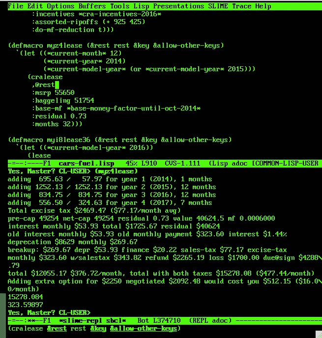

# 1 赫兹的软件开发

> 原文：<https://medium.com/hackernoon/software-development-at-1-hz-5530bb58fc0e>

人们一直在说，一行源代码的更改应该在一秒钟内“生效”。"[有效](https://hackernoon.com/tagged/effective)"意味着你得到了某种形式的反馈——如果你搞砸了，至少是第一条错误消息，或者理想情况下，更改后的代码行已经在一秒钟内运行，你可以观察到你告诉它做了什么(与你希望它做的相反)。

有些人看着它实际上只花了 20 秒，然后一笑置之。不知何故，这就是今天[软件](https://hackernoon.com/tagged/software)开发的“现实”。哈哈。

我做的最快的开发是为我自己的使用破解我的公共 Lisp 代码。这并不复杂，也不深奥。它更像其他人的 excel 电子表格，除了数据不是表格，而是连接的图表或树。对您来说，其中的一些源代码看起来有点疯狂，但它只是代码和数据的一些语法便利的混合(我使用 Lisp 的编译时计算来快速定义最方便的方式，以安全的方式将复杂、不规则的数据告诉计算机)。

开发环境的反应时间可不是开玩笑的，大约 20 秒我就不笑了。在心理学中，有一个关于短期注意力持续时间的数字，或者说在你重启之前短期“工作”记忆能持续多久。它经常被引用在八秒钟[1]。这可能或多或少是无中生有，然而这个数字并不完全糟糕。这是我观察到的大概情况，我看到很多人喜欢这个数字。我的注意力和许多其他人的注意力工作方式不同(对于软件工程师来说这是一件常见的事情)，并且在步骤之间超过一定的时间对我的生产力来说是毒药。更糟糕的是——在一天快结束的时候，我发现我已经筋疲力尽了，因为我从 9:00 一直干到 22:00，甚至在午餐时间跑了几趟。有什么坏处，我在结果之间有这么多时间，我会有一个放松的午餐，对不对？至少我整个周末也不再做了。在这样一个反应缓慢的建造周之后的一周，我看到联邦快递在我的车道上又堆了几把吉他，那些是“我的易趣狙击手为我赢得的，不是我的错”。

在我自己的环境中，我经常接近超过 1 Hz 的更改-编译-观察速率。输入少量代码，编译它[2] (SLIME C-c C-c)，运行它(在已经准备好大数据结构的现有流程实例中)，查看它是否做了正确的事情，然后继续下一个变更的循环——以每秒一个以上这样的循环的速度。这不适合高难度代码。这是公用事业费。没有任何困难的公用事业。你可以像想出一个书面博客的文本行一样快地想出这些代码行。在更大的项目中，您必须在某个时候编写所有这些实用程序——您被迫使用的工具可能会使项目中微不足道的部分变得戏剧化。这会耗尽你的精力——相反，你迫切需要这些精力来处理棘手的代码片段。

紧密 OODA 循环[3]的实际价值更高。一个有效的软件系统是坐下来一行接一行地输入源代码的结果。我不太相信任何编程术语。你要么一行一行地写工作代码，要么不写。快速的转变让你的注意力集中在应该在的地方，以及你想要的地方。与一些人可能认为的相反，使用像 Ebay 这样的注意力跨度裂缝填充器来防止完全脱离轨道一点也不好玩。这很容易发生，如果你没有一个计划来填补这些空白，并试图“什么都不做”(大脑没有这样的事情，你不会每小时冥想多次)。

同时，我不能使用没有编译时类型检查的玩具语言，不能将关键部分加速到接近本机速度的语言，不能不断搅动堆的语言，不能全速使用原始数据的语言(机器语言，C 和 SBCL 可以不经转换直接使用)。当然，这些玩具语言有很好的变通时间，但不用谢。他们也没有 Lisp 将复杂、交织的数据表示为方便、自然的源代码的能力——我发现当我处理复杂、交织的数据时，这一点至关重要。

我们能宣布这是一个比通常被认为的更大的紧急事件吗？

脚注:

[1]现在流行 8 秒钟的注意力持续时间:

*   [https://en.wikipedia.org/wiki/Attention_span](https://en.wikipedia.org/wiki/Attention_span)
*   [https://advertising . Microsoft . com/en/WWDocs/User/display/cl/research report/31966/en/Microsoft-attention-spans-research-report . pdf](https://advertising.microsoft.com/en/WWDocs/User/display/cl/researchreport/31966/en/microsoft-attention-spans-research-report.pdf)
*   [http://www . nytimes . com/2016/01/22/opinion/the-eight-second-attention-span . html](http://www.nytimes.com/2016/01/22/opinion/the-eight-second-attention-span.html)
*   【http://time.com/3858309/attention-spans-goldfish/ 号

[2]至于实用程序类代码的编译速度，我看到较大的函数需要 1/10 秒的时间来编译。我用的是 socket 1366 i7 CPUs。加载到运行中的映像需要 1 毫秒。这里没有单个项目的编译时间上限，因为在 Common Lisp 中，您可以在编译时进行任意计算。显然，在某个时候，您会遇到无法在接近 1 Hz 的地方测试的功能。这里的要点是，你希望以较低的精神成本摆脱较简单的实用程序，这样你就可以专注于后者。

[3] OODA loop ==观察-定位-决定-行动的循环，然后迅速重新开始【https://en.wikipedia.org/wiki/OODA_loop

另外，有人需要调音台吗？不知怎么的，我喝多了。不知道发生了什么。