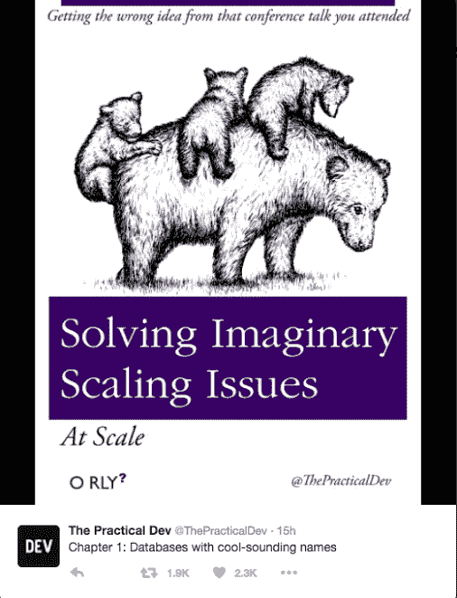

# 软件的七大致命浪费

> 原文：<https://medium.com/hackernoon/softwares-seven-deadly-wastes-8a88360d7027>

## 有七件事会让你的软件团队慢下来。学会克服每一个障碍是更快交付的关键。

七大浪费来自于精益制造 的 [*原理，这个想法起源于 20 世纪初的日本工业。这看起来离今天的软件行业还有很长的路要走，但是这些经验同样适用于现代*](https://en.wikipedia.org/wiki/Lean_manufacturing)*[软件开发](https://hackernoon.com/tagged/software-development)。通过消除流程中的七种浪费，你很快就会发现你的交货时间缩短了。*

让我们来看看每一个。

## 运输

这是材料从一个地方到另一个地方的移动。不难看出这是如何减缓制造业的发展的——一个分散在两个地点的工厂显然很难运营——但是在软件运输中，浪费通常更难发现。考虑团队之间的[交接](https://hackernoon.com/hand-offs-are-productivity-poison-4c653453c559)。如果您的开发人员必须将工作传递给一个测试团队(或个人)，然后它转移到另一个人的接受或签署的责任，然后再次发布，您就有了运输浪费。

减少运输浪费可以像将测试人员与开发人员配对一样简单，但是构建持续集成(CI)系统，或者持续交付(CD)管道也是很好的解决方案。

## *库存*

这是未交付的东西塞满了生产线。那些已经开始但被更高优先级的工作遗留下来的特性被认为是库存，就像那些技术上已经完成但还没有交付给客户的特性一样。随身携带这些东西会占用大脑空间，混淆画面，降低团队的工作效率。如果你的[分支策略](/@jezhalford/choosing-a-git-branching-strategy-cd7a774a68a1)意味着你有很多未合并的分支，这可能是一个特别大的问题。

减少库存最简单的方法就是同意在完成其他事情之前不要开始做事情。每一个功能都应该从概念到交付有一个平稳的过程，而不是在这个过程中停滞不前。在[看板](https://en.wikipedia.org/wiki/Kanban_board)上想象你的工作是一个很好的方法，可以看到你在哪里有库存，并帮助减少库存。

## *动作*

运动是人们围绕手头工作的运动。这可能很简单，就像必须到另一层楼去找会议室，或者在办公桌轮用环境中寻找空间。它也可能更抽象——由于不得不过于频繁地切换任务，或者处理来自其他人和问题的持续干扰而导致的延迟。

运动通常是由于携带过多的库存造成的，所以上面的许多步骤可以帮助减少它。考虑物理环境，同意固定的会议而不是临时的中断也是如此。

## *等待*

很简单，等待就是等待延误。等待一个产品问题的答案，等待一个外部系统准备好，或者等待另一个团队完成他们的工作，这些都会减慢这个过程。

你可以减少等待的时间，方法是小心不要在功能被充分理解之前启动它，并确保任何外部团队或个人在他们的时间表中有一些空闲，以便他们在需要的时候是空闲的。

## *过度处理*

在制造业中，这泛指工作过度——制造出不必要的精密公差，或者打磨隐藏在成品中的东西。在软件中，这符合 [YAGNI](https://en.wikipedia.org/wiki/You_aren%27t_gonna_need_it) 原则(“你不会需要它”)。这指的是为想象中的规模水平编码、构建无用的缓存或者为一个简单产品的架构而苦恼。倾向于频繁发布的团队精神是你对抗这种镀金的最好武器，但是必须小心平衡交付的紧迫性和做足够好的工作。

## *生产过剩*

简单来说，这是在构建无用的功能。一个经常流传的数字是，大约 64%的构建软件特性很少或从不使用。这来自 2002 年的一项有限研究，因此整个行业的实际数字可能会有所不同。然而，建造没人用的东西的荒谬之处并不难理解。谨慎的产品所有权和良好的用户反馈有助于解决这个问题。

## *缺陷*

有一个关于一家制造汽油割草机的公司的老故事。如果割草机离开生产线后第一次没有启动，他们就把它当作废品扔掉。花时间修复缺陷对他们来说没有经济意义。

软件也许没有那么千篇一律，但是在开发过程中追踪 bug 肯定会浪费时间。自动化测试是解决这个问题的好办法，但是一个好的产品所有者也可以通过确保需求在第一时间被理解来减少缺陷。

这七种浪费在不同的团队中会有不同的表现，你减少它们的方式会因你的情况而异。然而，记住它们是你寻求更快交付的一个非常有用的工具。

> [黑客中午](http://bit.ly/Hackernoon)是黑客如何开始他们的下午。我们是 [@AMI](http://bit.ly/atAMIatAMI) 家庭的一员。我们现在[接受投稿](http://bit.ly/hackernoonsubmission)，并乐意[讨论广告&赞助](mailto:partners@amipublications.com)机会。
> 
> 如果你喜欢这个故事，我们推荐你阅读我们的[最新科技故事](http://bit.ly/hackernoonlatestt)和[趋势科技故事](https://hackernoon.com/trending)。直到下一次，不要把世界的现实想当然！

