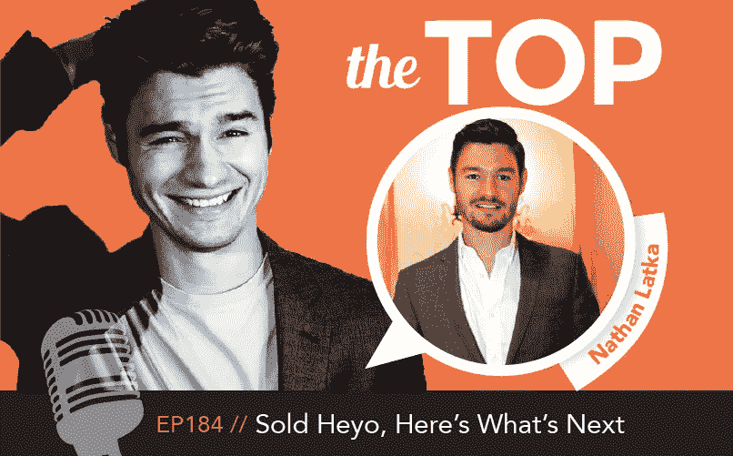

# 昨天卖了我的公司，给你录了。500 万美元的销售额。融资 250 万美元。

> 原文：<https://medium.com/hackernoon/sold-my-company-yesterday-and-recorded-it-for-you-5m-in-sales-2-5m-vc-raised-498ded2557b0>

19 岁时，我在弗吉尼亚理工大学的宿舍里创办了 Heyo.com。这是一个关于我们如何将它发展到成千上万每月付费的客户，筹集 250 万美元风险资本，并在昨天将其出售给我们的头号竞争对手的故事。

# 第一封收购邮件和我的怀疑

在第 171 集，内森透露了一些关于他生意的大新闻——他得到了一个出售它的报价。请听 Nathan 与他的团队讨论潜在出售其业务的过程和后果。

 [## 我们收到了一份来自资金、营销、商业和…

### 免费点播，聆听顶级企业家在金钱、营销、商业和生活方面的观点。听上面的如果…

www.stitcher.com](http://www.stitcher.com/s?eid=42026923) 

3 个要点:

*   透明的好处是让 Heyo 团队中的每个人都了解情况，并让[了解](https://hackernoon.com/tagged/learning)。不利的一面是，他们可能会对未来感到焦虑。
*   出售一家企业很大一部分是考虑其未来的盈利能力和潜力。
*   出售企业时，对投资者的感受保持敏感是很重要的。(员工、投资者、客户等。)

带时间戳的演出备注:

*   00:00 —内森讲述了他第一次和妈妈一起创业的时候。

**相关:**

*   02:02 —在创建 Heyo 的早期，Nathan 决定公开如何协商报价，以便团队中的每个人都可以从中学习。
*   04:28 — Nathan 的团队收到了竞争对手提出的出售其五年历史的企业 Heyo 的报价。
*   05:56 —根据创立理念，Nathan 决定向他的 Heyo 团队完全公开整个过程。
*   07:22—Heyo 运营总监 Chris Rieger 表达了他的想法。
*   08:04 — Heyo 对团队具有情感价值，在未来的机会中仍具有长期价值。
*   09:20 — Nathan 对透明度的担忧是，由于潜在的收购，有才能的员工正在流失。
*   10:10 — Nathan 还担心企业可能会变得过于安逸，从而错过更大的机会。

*   10:30——决定是否出售 Heyo 的一个重要因素是它的未来潜力。
*   11:18——内森不喜欢这个报价——他计划接触其他潜在买家，让 LOI(意向书)利用 Heyo 的价值。
*   13:37—Heyo 的分支战略主管 Christina 参加了节目。
*   16:01 — Nathan 认为，如果 Heyo 的品牌被竞争对手收购，它不会被关闭，只会被重新使用。
*   18:01 — Nathan 和 Christina 相信，如果 Heyo 被收购，他们的团队会找到新项目。
*   19:01 — Christina 认为，只要他们正确管理与客户群的沟通，用户的过渡将会很顺利。
*   21:48-有许多人与业务有关联-内森认为他的业务伙伴是终身的，而不是长期的。
*   22:19—Heyo 的投资者是收购决策中需要考虑的一个重要因素。
*   22:44 —你们怎么看—内森应该卖掉 Heyo 吗？

# 我们如何在 4 家公司之间制造竞标战，以抬高交易价格

在第 177 集，Nathan 更多地谈到了出售他的 Heyo 业务，并邀请 Votigo 的 Jim Risner 来谈谈是什么让 Heyo 变得令人向往。听一听内森对他从 18 岁开始的梦想做出的决定——在 30 岁之前卖掉一家公司。

 [## 我的决定。到底该不该卖 Heyo？从顶级企业家的金钱，营销…

### 免费点播，聆听顶级企业家在金钱、营销、商业和生活方面的观点。听上面的如果…

www.stitcher.com](http://www.stitcher.com/s?eid=42121654) 

3 个要点:

*   要约收购企业可能是竞争对手获取信息的一种策略。通常在看到合同之前，谨慎的做法是推迟发布任何公告。
*   LOI 的人生并不平等。其中一些是纯现金报价，而另一些包括其他东西，如上市公司的股票。
*   即使在签下 LOI 之后，许多交易还是失败了。对一家公司的实际货币兑换需要进行尽职调查。

[**Nathan Live 访谈:**点击这里参加 2 月 4 日 Nathan Live 访谈，他将回答关于收购的问题，并讨论下一步的计划。](https://nathanlatka.leadpages.co/leadbox/144c7de73f72a2%3A169bb6c10346dc/5730450056151040/)

带时间戳的演出备注:

*   01:00 —如果您还没有了解到，Nathan 最大的竞争对手之一已经提出收购 Heyo。
*   01:26 —一种担心是，该提议可能不是认真的，只是一种获取信息的策略。
*   01:51 — Ken Armijo 打电话来提供建议:在认真对待买家之前，等到他们拿出合同。
*   03:02 — Nathan 计划从可能有兴趣购买 Heyo 并利用竞争提高其价格的公司那里获得 LOI 的(意向书)。

相关:[我如何利用竞争推出排名第一的商业播客，在前 75 天获得 75，000 次下载，并在 ITUNES 上排名第一](/@nathanlatka/how-i-launched-fastest-growing-business-podcast-ever-1-new-and-noteworthy-75k-downloads-in-45-364581592315#.lsc0808wp)

*   03:17 —另一位顶级部落听众就 Nathan 应该如何管理公司发表了意见。
*   04:36 — Nathan 致电 CEO，谈论 Heyo 的吸引力，以便更好地了解其卖点。
*   05:06 — Nathan 与 Votigo 的 Jim Risner 讨论获得 LOI(意向书)的事宜，Votigo 是 Heyo 在 SMB 领域的主要竞争对手之一。
*   05:51 —从 Jim 手里拿着一个 LOI，Nathan 开始给其他 CEO 发电子邮件，评估他们对 Heyo 的兴趣。他从感兴趣的公司获得了四个 LOI。
*   06:30——LOI 的创造并不平等——有些是纯现金，有些包括上市公司的股票。
*   07:27 — Jim Risner 谈论 Votigo 以及他们为什么想要收购 Heyo。
*   09:10 — Votigo 一直在考虑进入 Heyo 的领域，向中小企业市场扩张。收购该公司将是进入这一领域的一个良好开端。
*   10:21 — Bethany London 打电话来表达她的想法，即出售 Heyo，这是 Nathan 的一个长期梦想，可能并不像人们所说的那样。
*   11:34——内森的一个朋友来自弗吉尼亚理工大学的潘普林商学院，他认为内森可能已经超越了 Heyo。
*   13:58——内森签署了 LOI——他在出售 Heyo。
*   14:22——许多交易甚至在签署了 LOI 协议后都落空了。
*   15:21 —下周一继续关注，看看会发生什么。还有，打电话来表达你的想法@ nathanlatka.com/talk

# 尽职调查地狱和大签名:

在第 184 集，Nathan 继续讲述 Heyo 的销售。在这一部分，他重点介绍了“尽职调查”和收购后的业务。

 [## 嘿，下面是顶尖企业家在金钱、营销、商业和生活方面的下一步计划

### 免费点播，聆听顶级企业家在金钱、营销、商业和生活方面的观点。听上面的如果…

www.stitcher.com](http://www.stitcher.com/s?eid=42238606) 

3 个要点:

1.  在等待尽职调查期间，Nathan 保留了杠杆作用，并通过保留其他公司的意向书建立了一个安全网，以防与 Votigo 签署的交易失败。
2.  企业家通常有很强的直觉或“直觉”。有时候，相信你的直觉或者找出你为什么会有这种感觉是明智的。
3.  内森已经签署了出售 Heyo 的协议！他的下一步是什么？了解他将于 2 月 4 日举行的网络研讨会。

带时间戳的演出备注:

*   00:00 — Nathan 与 Votigo 的联合首席执行官 Jim Risner 的会谈。
*   01:30 —内森签署了 Votigo 提供的 LOI。
*   01:53 — Jim 谈论 Votigo，一个社交[营销](https://hackernoon.com/tagged/marketing)促销平台。
*   03:22 — Nathan 保留了其他公司的意向书，以防与 Votigo 签署的协议在“尽职调查”期间失败，从而保持了杠杆作用并建立了一个安全网

[相关:世界顶级 CEO 阅读这 18 本书来研究杠杆、交易和谈判](/@nathanlatka/top-18-books-every-ceo-reads-cfef700d359#.6vgkoawkd)

*   04:37 — Sue Zimmerman 加入了这个节目，她是内森在 Heyo 的第一批顾客之一。
*   06:41——内森做热门播客是因为他喜欢出现在人们面前，而不是为了钱。
*   07:38——Joe Snider 发表意见，认为既然 Heyo 被出售，Nathan 应该如何处理他的播客。
*   08:56 —“写你自己的故事”播客的秋梁打来电话。
*   10:05 — Nathan 与 Jim Risner 谈论 Heyo 收购后的未来—计划中的变化很少。
*   11:09 — Nathan 和 Jim 讨论业务收购和尽职调查的危险信号。
*   12:40 — DJ Stephan 是一位非常成功的企业家和播客听众，他打电话给 Nathan 提供建议。
*   15:03 — Nathan docu 签署收购协议并出售 Heyo。
*   18:29——专注于某件事，努力去做，不要理会那些讨厌的人，乘着动力去赢得胜利。
*   19:07—[**Nathan Live 访谈:**点击此处，收听 2 月 4 日 Nathan Live 访谈，届时他将回答有关收购的问题，并讨论下一步行动。](https://nathanlatka.leadpages.co/leadbox/144c7de73f72a2%3A169bb6c10346dc/5730450056151040/)

相关阅读:

[Heyo 从福布斯亿万富翁那里筹得 200 万美元](http://www.roanoke.com/business/blacksburg-startup-heyo-wins-million-investment/article_bfbaeedc-ae3a-11e3-97a4-0017a43b2370.html)

[“你真是个天才”](https://twitter.com/NathanLatka/status/692189863370694656)

> [黑客中午](http://bit.ly/Hackernoon)是黑客如何开始他们的下午。我们是 [@AMI](http://bit.ly/atAMIatAMI) 家庭的一员。我们现在[接受投稿](http://bit.ly/hackernoonsubmission)并乐意[讨论广告&赞助](mailto:partners@amipublications.com)机会。
> 
> 如果你喜欢这个故事，我们推荐你阅读我们的[最新科技故事](http://bit.ly/hackernoonlatestt)和[趋势科技故事](https://hackernoon.com/trending)。直到下一次，不要把世界的现实想当然！

