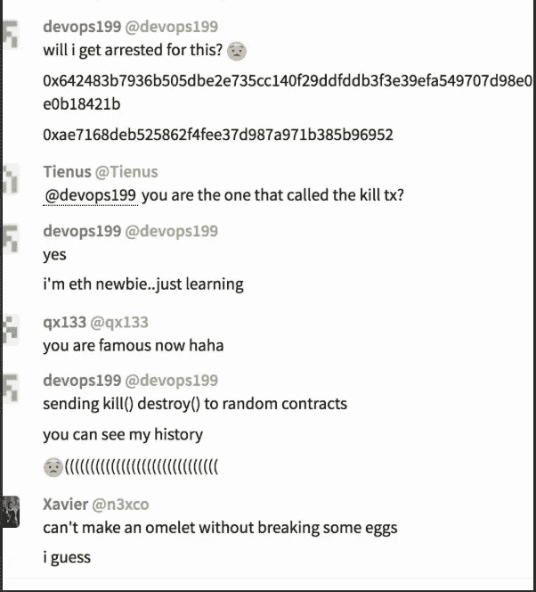

# 可靠性单元测试价值 2.8 亿美元，而且还在增加。

> 原文：<https://medium.com/hackernoon/solidity-unit-tests-are-worth-280mil-and-counting-9e3d8083c5a7>

## 哎呀，我们炸了你所有的钱。

Your Startup’s Money — Photo by [Dawn Armfield](https://unsplash.com/photos/28v9cq7ytNU?utm_source=unsplash&utm_medium=referral&utm_content=creditCopyText) on [Unsplash](https://unsplash.com/?utm_source=unsplash&utm_medium=referral&utm_content=creditCopyText)

今天有人“不小心”删除了流行的平价 multisig 钱包使用的一些关键代码。

I have no idea if this was the real person or not, but it doesn’t matter. It happened.