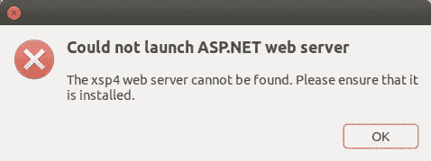
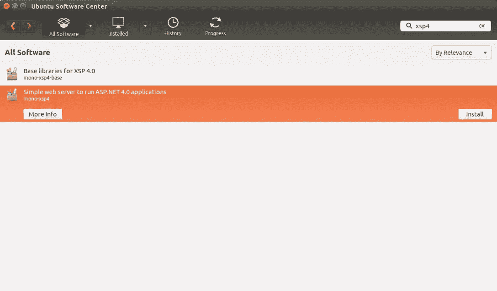

# 在 Mono 上解决 ASP.NET MVC 项目运行时错误

> 原文：<https://medium.com/hackernoon/solving-asp-net-mvc-project-runtime-errors-on-mono-394c18e2c770>

[礼遇](https://chornsokun.wordpress.com/2011/11/11/build-monodevelop-on-ubuntu-11-10/)

如果我们第一次使用 [Monodevelop](http://www.monodevelop.com/) 在 Mono 上运行[ASP.NET 应用程序，](http://www.mono-project.com/docs/web/aspnet/)[我们可能会收到以下错误](http://stackoverflow.com/a/34872143/2404470):

在某些情况下，问题是`[xsp4](http://packages.ubuntu.com/precise/web/mono-xsp4)`服务器的[安装](https://hackernoon.com/tagged/installation)不正确。

使用以下方式安装:

`sudo apt-get install mono-xsp4`

这就解决了上面的错误。

**可选:**通过搜索`xsp4`从 **Ubuntu 软件中心**获取

在`xsp4`服务器安装就绪后。该项目将于 [http://127.0.0.1:8080/](http://127.0.0.1:8080/) 开始运行

也可能出现目录访问错误[说](https://hackernoon.com/tagged/error)`[Access to the path “/etc/mono/registry” is denied](http://stackoverflow.com/q/24872394/2404470)`，这可以通过*简单地*使用`[mkdir](http://alvinalexander.com/unix/edu/examples/mkdir.shtml)`创建文件夹来解决

`sudo mkdir /etc/mono/registry`

并使用`[chmod](https://en.wikipedia.org/wiki/Chmod)`设置正确的权限

`sudo chmod uog+rw /etc/mono/registry`

[照片](https://goo.gl/photos/1GKy1Q5cQErmafNWA)

*最初发布于*[*xameeramir . github . io*](http://xameeramir.github.io/solve-asp-net-error-on-mono/)*。*