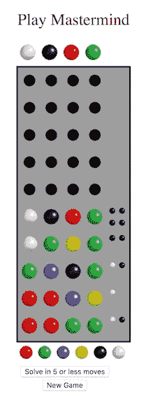
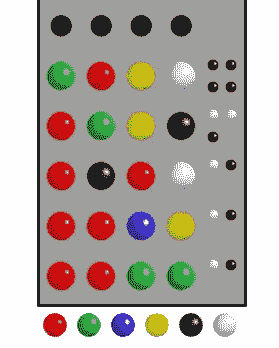
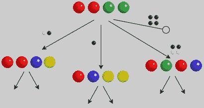
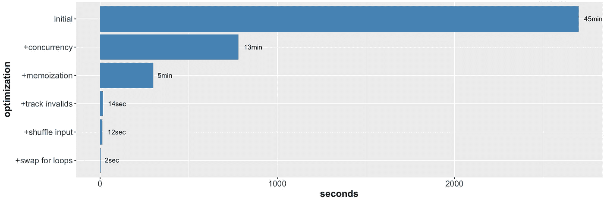

# 用围棋解决智多星

> 原文：<https://medium.com/hackernoon/solving-mastermind-with-go-a930004c22a0>

## 设计网页和提高围棋水平

我最近发现了 [gopherjs](https://github.com/gopherjs/gopherjs) 包，这是一个将 Go 转换成 JavaScript 的源代码到源代码的编译器。gopherjs 为我们这些对 web 的通用语言 JavaScript 心存疑虑的人打开了另一条 web 开发的途径。出于对用熟悉的语言创建网页的可能性的好奇，我开始编写棋盘游戏 **pure Go** 中的[主谋](https://en.wikipedia.org/wiki/Mastermind_(board_game))的程序。结果如左图所示，可在线玩。如果一个逻辑谜题听起来工作量太大，只需按下“5 步或更少”按钮，让电脑来玩。

摄魂师的目标是破解一个隐藏的代码，这是一个颜色序列。玩家用她对密码的猜测填写一行，并在该行的右边接收到黑白“钉”形式的**反馈**。黑色的钉子表示正确的颜色，正确的位置，白色的钉子表示正确的颜色，错误的位置。错误的颜色不会被扣分。利用她以前所有行动的反馈，玩家试图推断出解决方案。她要么赢了，得到四个黑色的钉子，要么输了，用完了棋盘上的行。

Win

在 Go 中编写前端需要呈现嵌套的`*html.Node`结构，而不是在 HTML 中显式拼写标签。仅仅安排元素*和设置挑剔的样式属性是很麻烦的，但是随着实践，这变得不那么痛苦了。因为游戏显示在浏览器中，所以我可以通过检查颜色和数量来轻松检查程序是否正常工作。*

1976 年，计算机科学家 Donald Knuth 发表了一篇论文,其中的算法可以在五步或更少的步数内找到答案。该算法通过播放给出最多信息的代码来工作，其中信息被定义为解空间缩小了多少。

在每一轮中，它会针对它可以播放的每一个代码，扫描它可以接收到的每一个反馈，并计算剩余的可能解决方案的数量(如果针对该代码给出了反馈的话)。在所有反馈中最小化剩余可能性的最大数量的代码是播放的代码。打破平局的方法是优先选择本身是可能解的代码，然后是数字顺序。

有趣的是，该算法主要关注的是修剪可能的解决方案的代码集。它播放的代码可能是解决方案是一个次要问题，为了获得更多信息，它甚至播放不在解决方案空间中的代码。这是一个不同于我和其他人使用的策略，那就是把猜测限制在解空间。

我[在 Go 中编写了](https://github.com/ludi317/ludi317.github.io) Knuth 的算法并编译了它，但是 JavaScript 太慢了，无法即时找到算法的下一步。我的解决方法是预先计算每个解决方案的移动顺序，并将它们存储在一个 [**trie**](https://en.wikipedia.org/wiki/Trie) 中。如图所示，trie 根据反馈给出算法的下一步棋。它有一个共同的根和 6⁴ = 1296 叶(6 种颜色和 4 列)。它的最大深度是五，验证了 Knuth 的五步棋解决游戏的说法。trie 构建在 Go 中并编译成 JavaScript，点击 solve 按钮就可以遍历它。

Partial trie of codes played by Knuth algorithm

创建 trie 是计算密集型和 CPU 受限的。根据我的计算，时间复杂度是 O(c⁶r^(3c+1，其中 c 是列数，r 是颜色数。我在 4 核 MacBook Pro 上的初始实现花了 45 分钟，因此我应用了以下优化:

*   并发
*   记忆化。我通过在构建 trie 时读取它来记忆 trie 生成器函数，有效地将它用作缓存。
*   跟踪无效解决方案的代码
*   打乱构建分支的顺序，以增加记忆步骤的“高速缓存”命中率
*   重新排列循环以更有效地计算可能的解决方案

这些优化的累积效应在两秒钟内生成了 trie，性能比初始实现提升了**1350 倍**。令人欣慰的是，看到程序的输出闪电般地出现在屏幕上，一片模糊的绿色文本，矩阵风格。

Time taken to build the complete trie of moves made by the Knuth algorithm

一路走来，我找到了几种普遍适用的加速 Go1.9 代码的方法。一如既往，您的里程可能会有所不同。

*   使用常量`const`而不是变量`var`。当我将`numColors`和`numCols`从常量改为变量时，计算时间增加了一倍。我很快就把它们换了回来。
*   让对象的默认值/零值成为有效的初始值。不要像`up`那样在使用前将布尔值设置为真，而是将其更改为`down`，这样它的值 false 就已经是正确的了，而无需进行设置。
*   在剥离受 CPU 限制的 goroutines 时，一个很好的启发是将它们的数量限制在可用的逻辑 CPU 的数量之内。

当然，所有这些优化对于传统版本的摄魂师来说都是多余的，它有四列和六种颜色。然而，它们对于生成具有更多颜色和列的游戏变体是必不可少的。下面的热图显示了解决此类变量需要多少步。随着复杂性的增加，我转向 48-和 64-CPU 的机器，但是即使在拿出大枪之后，超过一定数量的颜色和列的计算也是不可行的。

Number of moves needed to win variants of Mastermind with Knuth’s algorithm. * Traditional game.

令人惊讶的是，移动的次数并不随颜色的数量而单调变化。例如，在五列时，三种颜色的游戏可以比两种颜色的游戏用更少的棋来解决。事实证明，Knuth 的算法是次优的，因为它是一个贪婪的算法，只向前看一步，以减少解决方案的空间。此后，研究人员提出了平均用更少的步数就能找到答案的算法。

*感谢 Mario Latendresse 对算法的讨论和* [*网页游戏*](http://www.web-games-online.com/mastermind/) *对彩色 gif 的讨论。*