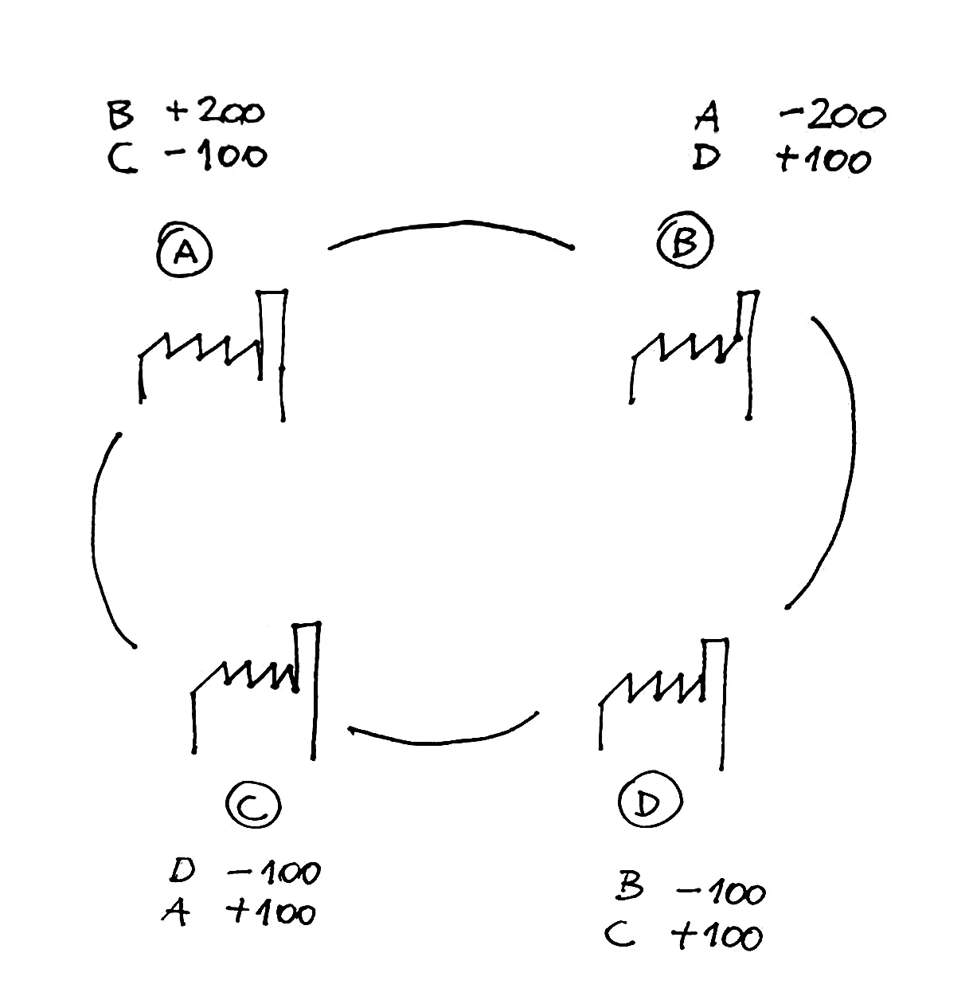
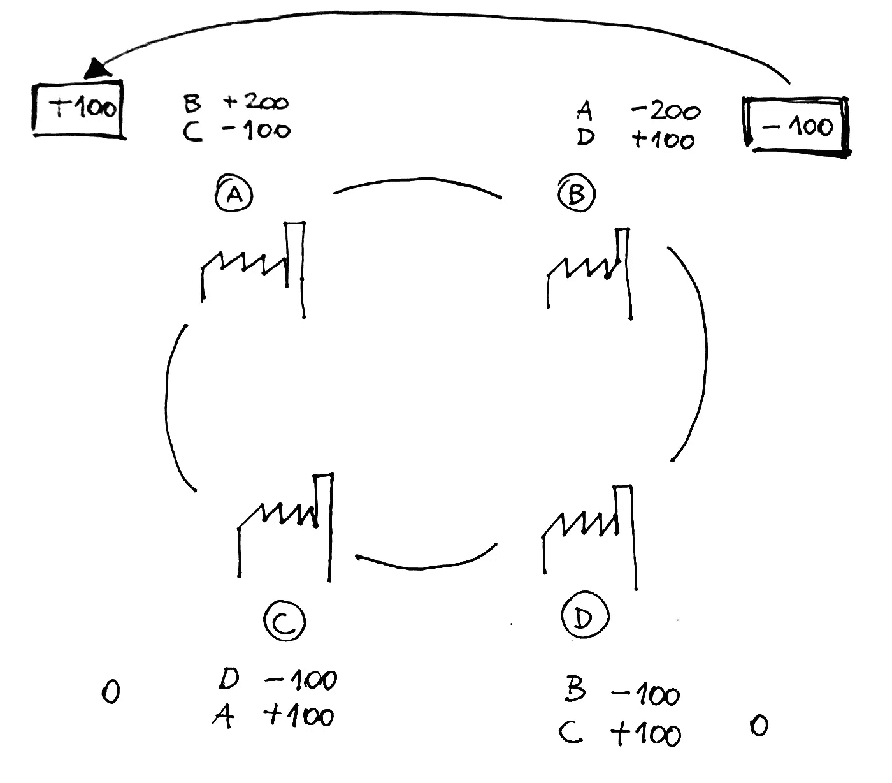

# 解决区块链的延迟付款问题

> 原文：<https://medium.com/hackernoon/solving-the-late-payment-problem-with-the-blockchain-f5b9214d95be>

毫不奇怪，公司之间的逾期付款是一个大问题(尤其是在欧洲)，会严重危及公司的稳定性，有时甚至危及公司的生存。我个人认识一些朋友，他们经营着成功的企业，却因为公司的银行账户缺乏流动资金而不得不申请破产，原因是拖欠或未解决的付款。当企业家发现自己处于这种情况时，他们经常不得不借钱来支付账单，同时等待客户付款。这是一个破碎的机制，让几家公司受到信贷机构的摆布，而信贷机构有可能决定一家公司的生命历程。

几年前，我思考过这个问题，以及如何更好地解决这个问题。当时实现是一个问题，但最近，由于区块链相关技术的爆发，我开始看到大规模解决这个问题的机会。

我猜你们中的一些人在与朋友分享账单时使用过费用分摊应用程序(如 SplitWise)。我喜欢这些[工具](https://hackernoon.com/tagged/tools)的地方是，如果我代表我的朋友花了 25 美元，后来我的朋友代表我花了 15 美元，应用程序将执行所有需要的补偿，并告诉我的朋友他只欠我 10 美元。这是一个非常简单的例子，但是该机制在涉及多方的复杂场景中甚至可以工作得更好。你想想，我替朋友花点钱，是因为我相信他以后会还我的。另外，我知道今天我代表他付钱，但是明天他可能代表我付钱。在多项交易和多方参与的情况下，很容易看到债务和信贷余额如何相互补偿，从而减少各方之间的现金流通量。

现在，把上面的例子带到一个商业环境中:A 公司向另一家 B 公司销售产品，总是向 B 公司开具发票。付款条件总是在开具发票后 30 天、60 天甚至 90 天。在这个特殊的时刻，公司 A 相信公司 B 将在以后支付发票。与此同时，B 公司向另一家 C 公司出售产品，后者也将以类似的条件付款。公司 C 会将产品卖给另一家公司 D，依此类推。
然而，所有这些公司，为了销售产品，他们也需要购买产品。结果是，在任何特定时刻，每家公司都持有其他公司的一系列债务和信用。很多时候，为了按时支付账单，一家公司被迫向银行借钱，银行会根据该公司持有的信用发放贷款。这是一个非常反常的机制，它引入了一个可信的中介，不必要地增加了资金成本。

考虑上面的例子，现在想象 C 公司向 a 公司销售一些产品，会发生什么？我们在集团公司之间创造了一个圈子，这可能有助于我们补偿它们之间的债务和信用。让我用下面的例子更好地解释一下。

旁边的图代表了 4 家公司及其各自的资产负债表:

*   A 公司欠 C 公司 100 美元
*   B 公司欠 A 公司 200 美元
*   D 公司欠 D 公司 100 美元
*   C 公司欠 D 公司 100 美元

您可能已经注意到，A 公司欠 C 公司 100 美元的债务，但它也在等待 B 公司支付 200 美元。作为 B 公司，与 C 公司间接关联，很容易看到我们如何补偿循环中所有公司之间的债务，并得到一个简单得多的场景。

C 公司和 D 公司已经清理了债务和债权，而 B 公司只欠 a 公司 100 美元。

通过检测公司之间的信用循环，我们已经能够清除一些债务，而不需要双方之间的任何现金交易。这降低了资金成本，因为公司不再需要向中介借钱来支付账单。

现在让我们假设世界上每家公司出具的每张发票都作为智能合同存储在区块链上。智能合同包含发送方和接收方的地址，以及应付金额和支付条款。

如果我们可以在这张巨大的发票图中识别出信用循环，我们就可以很容易地应用上述相同的算法，执行所有的补偿，并大幅减少流通现金的数量。