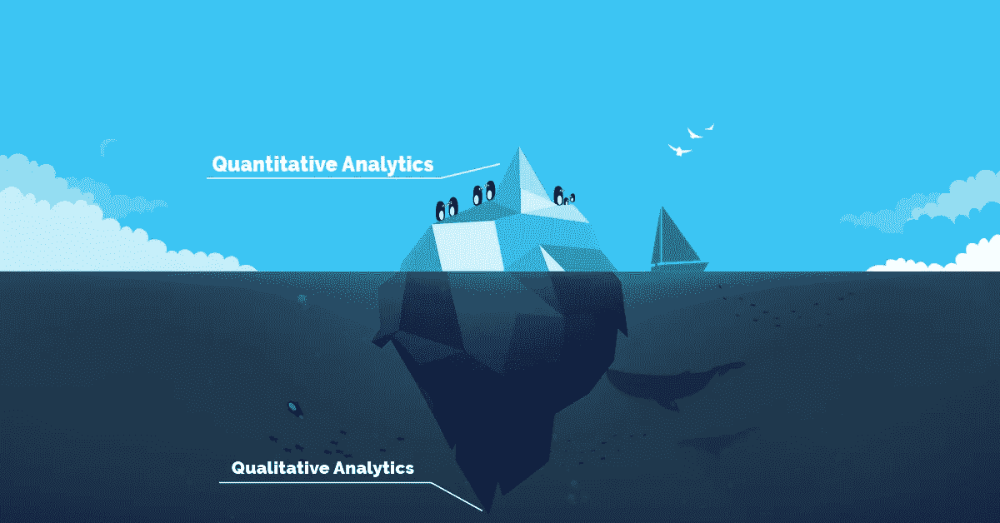
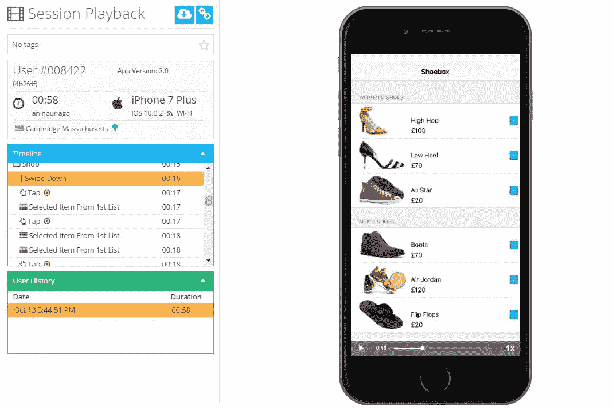
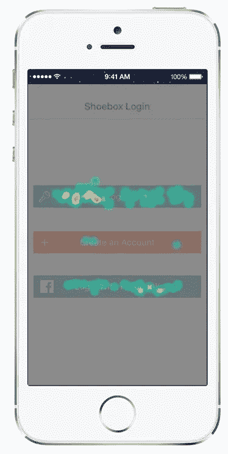

# 2017 年解决移动增长黑客难题

> 原文：<https://medium.com/hackernoon/solving-the-mobile-growth-hacking-puzzle-in-2017-6332d11ca8f>

移动增长黑客是一个术语，我们用来描述行业中聪明机智的人的做法，两年后我们都会使用这个术语。这个术语本身就值得关注。

首先，我们有“增长”这个词，它的目的是描述应用变得更好，不管它们目前是否成功。

第二个词‘黑客’——有两层含义:第一，表示你在弯曲(如果不是断裂？)游戏规则；第二，这意味着你真的很聪明，可能做一些很少有人能够理解或描述的事情，更不用说做了。

把这两个词放在一起，意味着你拥有不是每个人都有的知识。你很好地利用了它，扭曲和打破了规则，最终创造了一个令人敬畏的应用程序体验。

**这个术语的问题在于它不再代表我们上面所说的一切，这有几个原因:**

1)如今,“增长”一词的含义与五年前不同

2)如今我们所认为的“黑客”行为(当涉及到应用程序增长时)并不神秘，也不具有创造性，当然也不意味着要自己制定游戏规则

# 移动增长黑客改变了什么？

首先改变的是我们对增长的描述。增长曾经是一个应用程序在一段时间内获得的下载量。强调一个‘数’。过去，一切都围绕着应用程序下载，而没有关注人们实际上用该应用程序做了什么，他们停留了多长时间，以及他们是否真的对它感到满意。一切都是关于“多少”，而不是“如何”，或者最重要的是“为什么”。这一切都是为了以某种方式提高下载量，这被认为是“增长”。

黑客攻击也与下载有关。分析平台被用来衡量下载数量、高峰时间、最受欢迎的国家、最不受欢迎的国家——一切都在数字中。这些数字被用来调整营销和入职策略，最终带来所谓的增长。然而，事情发生了(不那么令人震惊的)转变，下载量不再是你应该非常关心的指标，因为绝大多数用户[可能会在不到三天后放弃它](http://www.androidauthority.com/77-percent-users-dont-use-an-app-after-three-days-678107/)。

现在你可能已经意识到了——这些“黑客”工具中也没有“为什么”,尤其是“为什么不”。如果你真的想以不同的方式做事，想利用并非所有人都在使用的知识，想制定自己的规则并改变现有规则，那么是时候开始问正确的问题了。2016 年增长黑客工具将有答案，我们喜欢把这些工具称为定性分析工具。

# 定性分析

与完全专注于数字(顾名思义)的定量分析不同，*定性*分析工具专注于用户对应用程序的体验质量。他们可以展示应用程序的细微差别，这些细微差别可以成就它，也可以毁掉它。

例如，你注意到你的一部分用户已经安装了应用程序，进行了大约 30 秒的会话，然后卸载。也许你的应用在他们的设备上太慢了。也许有一个错误阻止了他们去做他们想做的事情。或者他们只是不理解 UI 的某个方面。问题是——这里有太多的“可能”,无法用定量分析来回答。然而，定性分析平台可以回答这类问题。通过定性分析，你可以看到用户所看到的，体验用户所经历的。这样，你就可以真正地站在用户的角度，不带任何偏见或环境限制，更好地了解你的应用程序哪里失败了，哪里优秀了。通常，你有两条路可以找到你想要的答案:触摸热图和用户会话记录。

# 用户会话记录

这基本上是一个实时记录用户使用你的应用的数据库。有了这个工具，你真的可以看到你的用户是如何体验这个应用的，让你确切地看到为什么他们在某些点上卡住了，为什么这个应用崩溃了，或者为什么他们突然决定退出这个应用并删除它。

这种诚实而有力的输入可以帮助你了解你的应用程序的哪些部分急需优化或改变。根据这些信息采取行动，你将最终修改应用程序并获得更多活跃用户。最棒的是，你可以看到用户对新功能的反应，不管他们喜不喜欢。

所以让我们回到文章前面的小例子。举个例子，假设你有一个购物应用。用户安装它，玩一会儿就退出了。你知道他们安装了它，你知道他们在里面呆了一段时间，你知道他们离开了。定量分析都告诉你了。现在，你看一下最终导致应用程序被放弃的会议记录，你会看到他们进入支付方式，看到提供的内容，然后离开。这告诉你，这群用户想要一种特定的支付方式，通过在下一个版本中提供这种支付方式(并适当地传达这种变化)，应用程序会增长。黑客！

Example of User Recordings with the qualitative analytics platform Appsee.com.

# 触摸热图

该功能跟踪用户与应用程序的所有交互(捏、刷、轻敲、双击等)。)并将它们呈现在应用程序页面顶部的可视层中。这些交互以热图的形式直观呈现，显示了应用程序中哪些部分交互最多，哪些最少。它显示了在哪里使用了什么类型的手势交互，或者在特定屏幕上是否有任何无响应的手势。

触摸热图帮助你成长的另一个重要方法是通过 [A/B 测试](https://pm.appsee.com/2016/05/17/infographic-how-to-ab-test-your-app-like-a-jedi-master/?cpnid=701b0000000Wd7c)。您可以分析一个新特性的两个版本，看看哪个版本在交互方面得到更好的反馈。这样，触控热图可以帮助您就如何最好地优化即将推出的和现有的功能做出明智的决定。

让我们再说一次，为了举例，你有一个烹饪应用程序。当你看着菜谱屏幕时，你会注意到四分之一的用户不停地点击某个配料，认为它是一个按钮，而实际上它只是一个图像。这给了你很多选择:一个是重新设计图像，使它看起来不像一个按钮。或者，您可以找到并联系一家出售配料的商店，并在下一个版本中实现一个新功能。你的想象力是这里唯一的限制因素。

一个单一的见解可以帮助您得出多个结论。在这种情况下，这一有价值的见解催生了一个创造性的新解决方案，最终帮助您的应用程序增长。黑客攻击。

Example of Appsee’s touch heat maps on a login screen.

# 以不同的方式做事

Image Source: Bigstock/ mypokcik

“增长”和“黑客”这两个术语及其所代表的含义，在过去几年里肯定已经发生了变化。增长不再局限于由数字和百分比组成的监狱，黑客攻击也不再局限于定量分析工具。

但是说增长黑客已经远离了定量分析是错误的。一个更好的描述是，它缩小了一点，以查看更大的图景，现在意识到有一个叫做“用户体验”的小东西在应用程序的增长中起着主要作用，并且可以通过定性分析来衡量。

解决 2017 年的增长黑客难题意味着添加另一个元素(定性分析)，通过将其与定量分析相结合，您将打开有价值信息流的大门，帮助您创造性地提出想法并打破规则，使您的应用程序真正增长。

*该帖子最初出现在【T4 *移动行动的博客* *上。**

**如果你喜欢这篇文章，我们很乐意为你点击❤！**