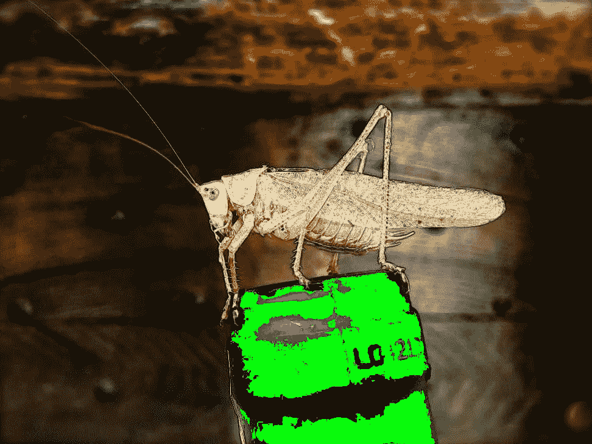

# 用 15 个步骤解决我职业生涯中最有趣的问题

> 原文：<https://medium.com/hackernoon/solving-the-most-interesting-bug-of-my-career-in-15-steps-1a1ccd337c35>

> 由乌达扬·班纳吉担任，在 Quora 工作。[原载](https://www.quora.com/What-is-the-most-interesting-bug-you-have-ever-solved-in-a-computer-program/answer/Udayan-Banerji)于 [Quora](http://quora.com?ref=hackernoon) 。

## **TLDR；花了两周时间调查一个 bug，修复只是一行代码的修改。**

在英特尔做编译工程师的时候，我曾经被分配了一个奇怪的 bug。这是一个 Android 应用程序，基本上是一个 Java 基准，它会随机崩溃。这款应用只有一个按钮，点击这个按钮就开始了整个基准测试套件的长时间运行。

1.  我没有应用程序的源代码，但我可以看到字节码。所以我首先尝试通过调试器运行它。我尝试了至少 30 次，它从来没有崩溃过。
2.  我又正常运行 app，随机死机。最终，我发现每运行 20 次基准测试，它就会崩溃一次。
3.  我在字节码中搜索任何包含 20 的代码。任何 20 度的循环，任何递归。没什么。程序一直崩溃。
4.  现在事情越来越严重了。在这款安卓手机上，砸碎电脑键盘似乎更容易让疼痛消失。
5.  过了一个周末，我又回到了这个问题上。我回到了爪哇的坠机事件。核心问题是断言失败——大浮点数不等于 NaN(“不是一个数”)。
6.  我回到字节码，寻找浮点除法。我一个接一个地分离出大约 12 个字节码序列，将它们转换成 x86 汇编，将每个序列放入一个长时间运行的循环中，并执行它们。最后每 20 次就有一个崩溃。我可以看到我腕管末端的光。
7.  我分析了汇编代码，看到了 8 除零运算。啊哈！除以零产生 NaN！所以我们的编译器被 0 除坏了…嗯，不知何故？
8.  除了没有，手写汇编除以零工作正常。沮丧的我做了一个 20 除以零的循环，它也通过了。然后我写了一堆随机的汇编指令，第一个给出了错误的结果。
9.  等等什么？
10.  最后，转到 gdb 并转储这些操作的所有 CPU 寄存器的值。
11.  就在那时，我注意到了一个趋势。x87 寄存器堆栈慢慢填满，然后停留在最大容量(8 项)
12.  原来，芯片中古老的 x87 处理器有一个 bug，就是负责做浮点运算的那个。我们在编译器中使用它进行所有浮点运算，除了除零路径之外的所有路径都在使用后清空它。
13.  似乎在堆栈溢出时，它没有抛出一个错误，但是无论你运行什么都返回一个 NaN 值。这也是你除以 0 得到的值。(基本上堆栈溢出错误，称为堆栈错误，是粘性的。一旦发生就要在编译器中手动清除，不然就一直发生)。
14.  所以每隔 8 个被零除一次后，它就会补满，然后它会把任何一个操作都当作被零除，返回 NaN。
15.  **修复只需要修改一行代码，**清除除零路径上的堆栈。

编辑:[杰伊·沙阿](https://www.quora.com/profile/Jay-Shah-6)问我实际的代码。就是这里: [Gerrit 代码回顾](https://android-review.googlesource.com/#/c/54874/3/vm/compiler/codegen/x86/LowerAlu.cpp)。请注意，大多数更改都是注释。有 4 行代码更改，但 3 行是相同的，1 行是加载值。

> 截止到[乌达扬·班纳吉](https://www.quora.com/profile/Udayan-Banerji)，在 Quora 工作。[原载](https://www.quora.com/What-is-the-most-interesting-bug-you-have-ever-solved-in-a-computer-program/answer/Udayan-Banerji)于 [Quora](http://quora.com?ref=hackernoon) 上。
> 
> 更多来自 Quora[的趋势科技答案，请访问](https://medium.com/u/3853f85f7d5e?source=post_page-----1a1ccd337c35--------------------------------)[HackerNoon.com/Quora](https://hackernoon.com/quora/home)。