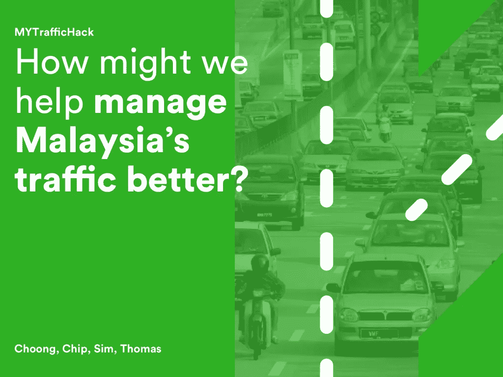
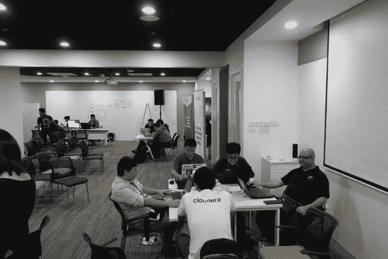
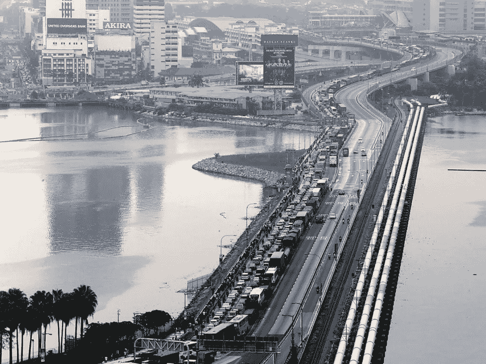
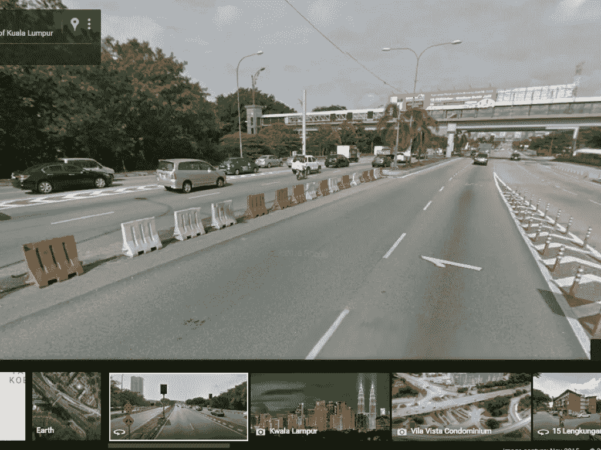
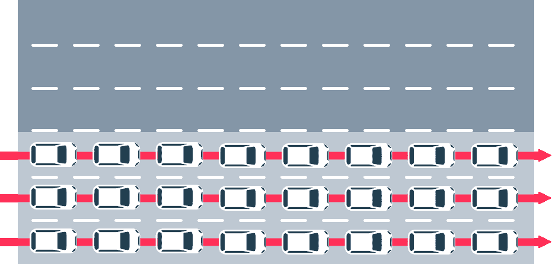
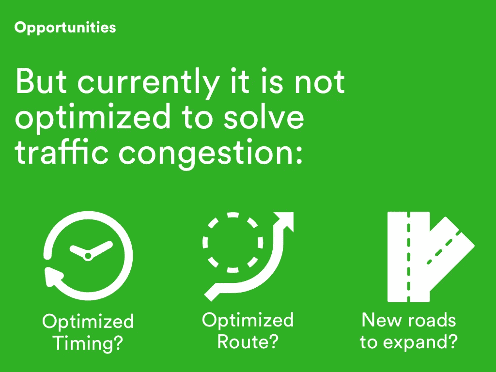
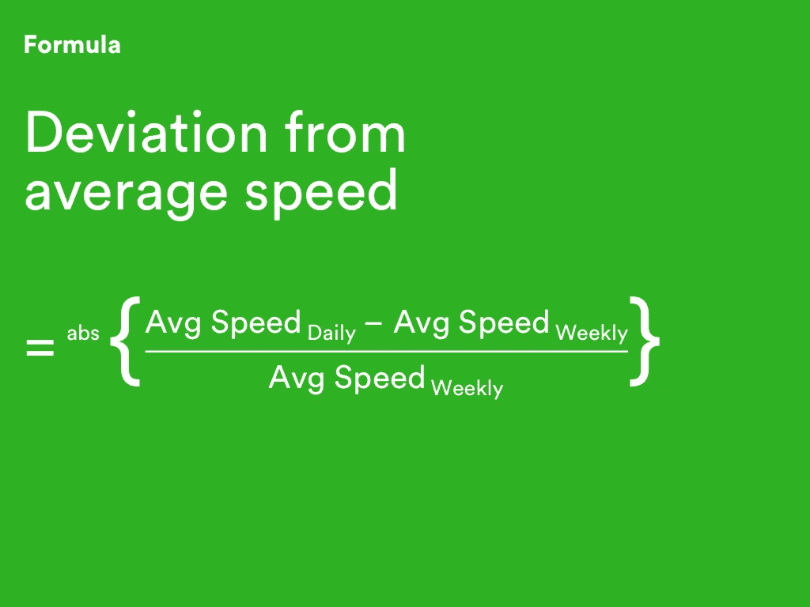
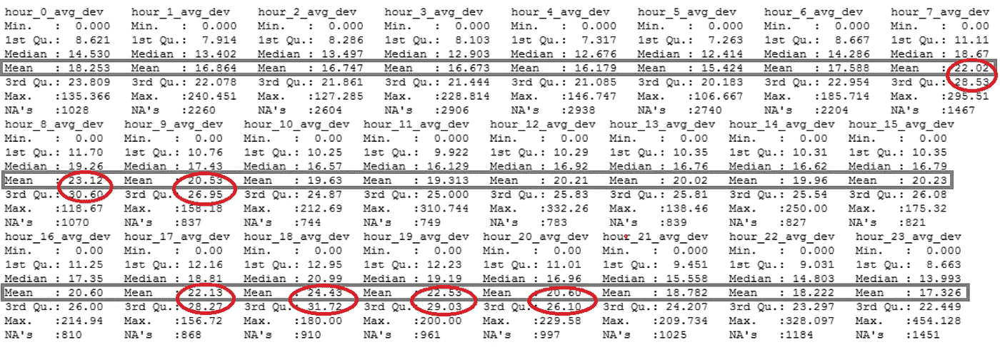
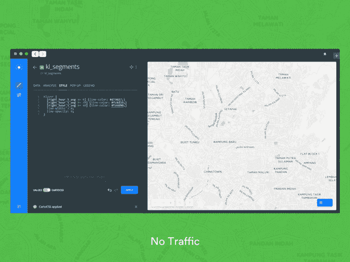

# 解决交通拥堵:我们在 Grab 的 24 小时黑客马拉松上建立了什么

> 原文：<https://medium.com/hackernoon/solving-traffic-congestion-what-we-built-at-grabs-24-hour-hackathon-2603658e1f5b>

我记得在注册后，我紧张地在 ADAX(东盟数据分析交易所)办公室温暖、热情的咖啡厅徘徊——试图寻找一些熟悉的面孔。

我交谈的第一个陌生人是 Choong，他是 MapIt 的一名软件工程师。我们互相问候并交换了名片。事实证明，他还没有一个团队。

在没有团队的情况下参加黑客马拉松，我能感受到这种焦虑。大多数人成群结队地坐在餐桌旁。有些人甚至把他们的电脑显示器放在行李包里。事实是，我不知道会有什么样的结果，这让我很兴奋。简报结束后，我找到组织者，问是否有团队组建会议。有人告诉我没有，但我被介绍给了 Sim，一位在当地银行工作的数据分析师，他也想加入一个团队。我在午餐时遇到了托马斯，他是一名网站开发人员——最后，我们一起组建了一个团队，在接下来的 24 小时里进行黑客攻击。

[📸](http://emojipedia.org/camera-with-flash/) : Event Photographer and Choong

# 框架问题:我们如何更好地管理马来西亚的交通？

我们得到了[开放交通数据集](https://github.com/opentraffic/kl_traffic_data_hackathon)进行工作，交互式[卡通](http://carto.com)地图和[地图](https://www.mapillary.com)街道照片作为解决问题的潜在工具。我们选择了问题陈述 1，它将使用所提供的数据集来帮助政府更有效地进行规划，并就[交通](https://hackernoon.com/tagged/traffic)干预做出明智的、基于证据的决策。

交通拥挤确实是每个人都讨厌的问题。噪音、污染、挫败感和坐在车里浪费的时间，而不是回家和家人共度美好时光。根据世界银行 2014 年的一项研究，交通拥堵仅在巴生谷就造成 200 亿林吉特的经济损失，相当于每天 5400 万林吉特。此外，交通堵塞也导致马来西亚人每天浪费一百万个小时。

# 机遇:路的另一边总是更绿？

我们看到的机会，真的存在于相反方向的空路上，我们可以在高峰时间的交通堵塞中利用这些机会。

事实证明，我们已经有了解决方案。上图是谷歌地图在切拉斯路通往市中心的路段上拍摄的照片。每隔一段时间，当你开车时，你会看到路障而不是道路分隔带，马来西亚当局已经在高峰时间通过相反方向的道路实施了交通改道。#马来西亚 Boleh

下面是我做的一个可视化演示，展示了它的样子:

在早上和晚上的高峰时段，有几条主要的长路段连接吉隆坡市中心和住宅区，长达 10 公里或更长。但目前，当局对实施路障的最佳时间没有准确的想法(是下午 4 点至 7 点，还是下午 3 点至 8 点？)，要实施哪些优化的路段或路线，为了缓解交通拥堵又要拓展哪些新的路线。

# 解决方案

通过观察平均偏差的分布中是否存在峰值，我们可以分析时间段以及哪些路段更容易发生拥堵。感谢 Sim 提出公式:

清理数据集后，我们将它们导入 Carto，叠加并分析如下:

通过使用地图可视化，当局现在可以分析道路状况，并根据基于证据的数据集采取行动，方法是根据优化的时间、优化的路段和要扩展的新路线设置路障。

# **数据集的未来改进**

*****数据中的异常值***在聚合数据以获得路段的平均速度之前，移除由于 GPS“跳跃”问题而导致的异常值**

# **应对交通拥堵的关键技巧**

**在解决系统性问题的创新解决方案实施之前，我们作为道路上的司机可以做的是:保持一个被认为安全的恒定速度，尽量不要不必要的变道，以实现最佳的交通流量。交通工程师 Brian Wolshon 在这个模拟中解释了交通冲击波:**

**这次我们没有获得任何奖项，但使用 Carto 和数据分析对我来说是一次很好的学习经历。祝贺 KingsoftheNorth、Ditto、S.I .、Rendezvous 和 FTT 团队获得前五名——令人惊叹的黑客技术，实至名归！特别感谢 Grab、MDec、Carto、mapi pile 和 OpenTraffic 组织了这次黑客马拉松！**

# **感谢你坚持到这篇日志的结尾！你喜欢读它吗？你可能想到的解决交通拥堵的其他创新想法有哪些？**

## **请在⇣下方评论或在 Twitter 上给我发推文让我知道🐦我很乐意加入谈话。谢谢你点击💚如果你喜欢这篇文章！**

**[*芯片 Dong Lim*](http://twitter.com/lcdvirgo) *是一名设计师，目前正在从事*[*car imed*](http://carinmed.com)——一种简单、实惠的电子病历，帮助医生高效、有效地管理无家可归者和城市贫困患者的病历。*在*[*madebychip.com*](http://madebychip.com)查看更多他过去的设计作品。**

************************

> **[黑客中午](http://bit.ly/Hackernoon)是黑客如何开始他们的下午。我们是 T21 家庭的一员。我们现在[接受投稿](http://bit.ly/hackernoonsubmission)并乐意[讨论广告&赞助](mailto:partners@amipublications.com)机会。**
> 
> **如果你喜欢这个故事，我们推荐你阅读我们的[最新科技故事](http://bit.ly/hackernoonlatestt)和[趋势科技故事](https://hackernoon.com/trending)。直到下一次，不要把世界的现实想当然！**

****