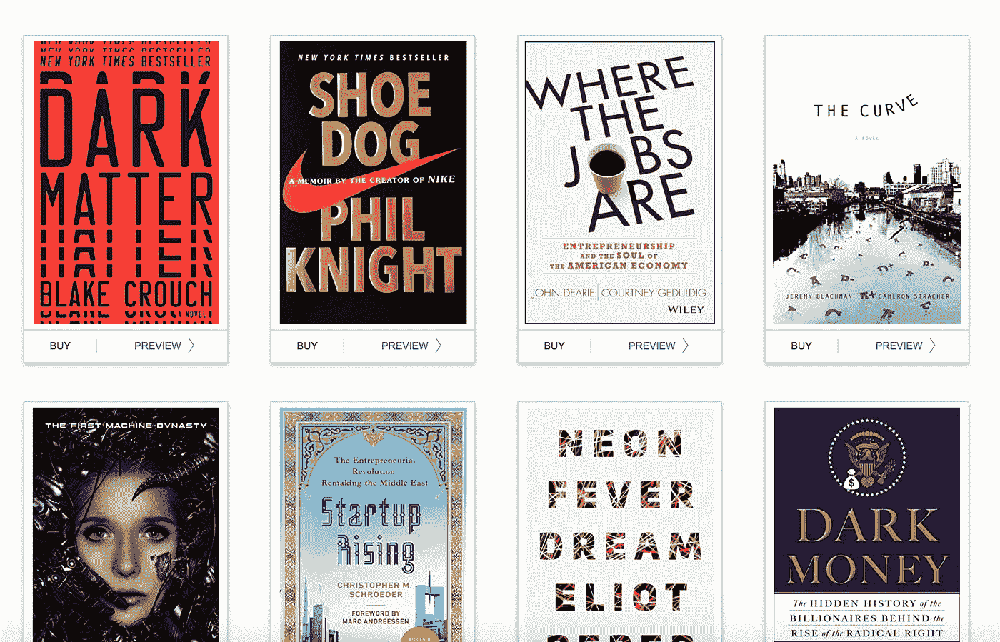

# 2016 年我最喜欢的几本书

> 原文：<https://medium.com/hackernoon/some-of-my-favorite-books-in-2016-7497ab6a8012>

[亚马逊](https://hackernoon.com/tagged/amazon)正在为一些人设置 Kindle 书架，包括我。如果你想看一些我在 Kindle 上读过的 2016 年我最喜欢的[书籍](https://hackernoon.com/tagged/books)，看看我的[费尔德思想 2016 书籍](https://read.amazon.com/kp/showcase/FeldThoughts2016Books)。

我在我的 Goodreads 页面上记录我读过的所有书籍(Kindle 或实体书)。有趣的是，Goodreads 也被亚马逊拥有。看看他们最终是否/如何整合所有这些东西会很有趣。

*最初发表于* [*费尔德思想*](http://www.feld.com/archives/2016/11/favorite-books-2016.html) *。*

> [黑客中午](http://bit.ly/Hackernoon)是黑客如何开始他们的下午。我们是 AMI 家庭的一员。我们现在[接受投稿](http://bit.ly/hackernoonsubmission)并乐意[讨论广告&赞助](mailto:partners@amipublications.com)机会。
> 
> 如果你喜欢这个故事，我们推荐你阅读我们的[最新科技故事](http://bit.ly/hackernoonlatestt)和[趋势科技故事](https://hackernoon.com/trending)。直到下一次，不要把世界的现实想当然！

