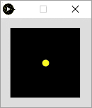
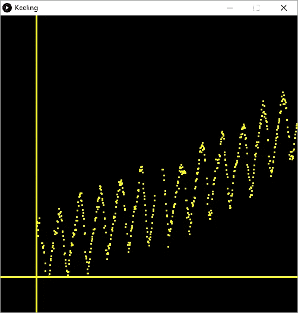

# 一些波兰人

> 原文：<https://medium.com/hackernoon/some-polish-62200a044d27>

这是 N 部分系列的第 9 部分，详细介绍了我如何制作我的动画。

[上一张](https://hackernoon.com/rates-of-change-ca904f010a19)下一张

我发现在[加工](https://hackernoon.com/tagged/processing)中有一个[命令](https://hackernoon.com/tagged/command)来绘制一个点，而不是像我做的那样绘制一个小椭圆！我看了看处理是如何设置像素的，这是用`[set()](https://processing.org/reference/set_.html)`命令做的，但是像素太小了。Processing 还有一个`[point()](https://processing.org/reference/point_.html)`命令，我忽略了它，因为它看起来是一样的。不同的是，`point()`以`strokeWeight()`为大小画一个圆！

```
strokeWeight(10);
stroke(255,255,0);
point(50,50);
```

生产:



哇哦，现在回到我们定期安排的节目…

我的数学老师反复向我灌输“永远给你的轴贴上标签”,所以让我们也给真正的轴贴上标签。

哦，但是我们的规模在不断变化。这让事情变得更加棘手，但并非不可能…

首先，我们最好为他们腾出一些空间，目前我们的地块紧靠着窗户的边缘。

我本打算只创建一个`margin`变量，然后简单地将它添加到`x`和`y`值中，但这比我想象的要复杂，因为我不得不以一种非直观的方式修改缩放算法(实际发生的情况是，我根本无法正确缩放它，并厌恶地放弃了)。

所以一个简单得多的方法是将代码提取到一个函数中，然后传入新的位置、宽度和高度。听起来工作量很大，但事实并非如此。首先将`draw()`函数重命名为`drawGraph()`。创建一个新的`draw()`函数并放入主体`drawGraph();`中，如下所示:

```
void draw()
{
   drawGraph();
}void drawGraph()
{
   ...
}
```

现在给`drawGraph()`加上`xPos`、`yPos`、`graphWidth`、`graphHeight`整数。

```
void drawGraph(int xPos, int yPos, int graphWidth, int graphHeight)
```

我认为 60 像素的边距是一个很好的起点。所以让我们用这个值做一个全局常数。在`draw()`之前添加这一行:

```
final int MARGIN = 60;
```

将某物标记为`final`意味着它不能被修改，按照惯例，这些变量全部用大写字母命名。

现在我们所做的就是从`draw()`呼叫`drawGraph()`,内容如下:

```
drawGraph(MARGIN, height - MARGIN, width - MARGIN, height - MARGIN);
```

所以让我们开始使用`drawGraph()`中的那些值:

首先分别用`graphWidth`和`graphHeight`替换`width`和`height`的所有用途。

然后用新发现的`point()`函数替换`ellipse()`函数:

```
point(xPos + x * xScale, yPos - (y * yScale));
```

你就完了。用`point()`绘图似乎也快了很多！哦，对了，把`strokeWeight(3)`加到`setup()`上，否则你的点数将是 1 个像素。

好，让我们画一些轴。从上到下使用`MARGIN`的简单线条，所以在`draw()`功能中:

```
line(MARGIN, 0, MARGIN, height);
line(0, height - MARGIN, width, height - MARGIN);
```

嗯，我第一次没成功。这是因为将`background(0)`留在了`drawGraph()`功能中，该功能正在清除绘制的线。将它移到`draw()`的第一行，它将全部工作。

结果应该是这样的:



线条粗细继承自`setup()`中的`strokeWeight`命令。因此，让我们将它移到`drawGraph()`的第一行，并将`strokeWeight(1)`添加到`draw()`的第一行。这将使一条细线的轴和图表的重点。

所以现在我们需要添加刻度线。由于刻度线需要缩放到与图表相同，因此需要从`drawGraph()`函数内部绘制。我们先做 x 轴，标记每年。

呀。这不像我想象的那么简单。因为每个数据点都是在星期六记录的，我们只需将我们的`dataIndex`乘以 7，就可以得到从开始日期算起的天数，从而得到数据，这使得计算刻度线变得非常重要。

经过相当多的实验，我能够将复杂度降低到以下函数:

```
void drawXAxis(int xAxisMaximum, float xScale)
{
  int yPos = height - MARGIN;
  float xAxisTick = 279.0 / 7.0;
  int axisYear = 1958;

  while(xAxisTick <= xAxisMaximum)
  {
    int tickLength = 5;
    int xPos = MARGIN + int(xAxisTick * xScale);

    if(axisYear % 5 == 0)
    {
      text(axisYear, xPos, yPos + 22);
      tickLength = 10;
    }

    line(xPos, yPos, xPos, yPos + tickLength);

    xAxisTick += 365.25 / 7.0;
    axisYear++;
  }
}
```

其中`xAxisMaximum`以绘图宽度开始，然后随着比例尺增加缩放的最大 x 值。`xAxisTick`的初始值是 1958 年 3 月 29 日(279)除以 7 转换成周之后的剩余天数。

这里我介绍一个`while`循环。当括号的内容为真时，这种类型的循环继续执行。在这种情况下，刻度的当前位置小于轴上的最大 x 值。

第`if(axisYear % 5 == 0)`行利用模数运算符`%`制作一个更长的刻度线，每五年显示一次年份。然后，我们简单地为分笔成交点画一条线，然后将分笔成交点位置增加一年中的平均周数。

这导致:

对此我很满意。下面是完整的代码:

```
import java.time.*;
import de.looksgood.ani.*;
Ani _ani;FloatDict _data = new FloatDict();
LocalDate _startDate = LocalDate.of(1958, 3, 29);void setup()
{
  loadData();
  size(500,500);
  background(0);
  stroke(255,255,0);
  textAlign(CENTER);

  Ani.init(this);
  Ani.setDefaultTimeMode(Ani.FRAMES);
  _ani = new Ani(this, 1032, "_change", 3, Ani.EXPO_IN);
}float yScale = 20.0;boolean _coda = false;
int _codaCount = 0;float _change = 1.0;
final int MARGIN = 60;void draw()
{
  background(0);
  strokeWeight(1);

  line(MARGIN, 0, MARGIN, height);
  line(0, height - MARGIN, width, height - MARGIN);

  drawGraph(MARGIN, height - MARGIN, width - MARGIN, height - MARGIN);
}void drawGraph(int xPos, int yPos, int graphWidth, int graphHeight)
{
  int deltaX = int(frameCount * _change);

  float xScale = 1.0;

  int xAxisMaximum = graphWidth;

  if(deltaX > graphWidth)
  {
    xAxisMaximum = deltaX;
    xScale = float(graphWidth) / float(deltaX);
  }

  drawXAxis(xAxisMaximum, xScale);

  strokeWeight(3);

  for(int dataIndex = 1; dataIndex <= deltaX; dataIndex++)
  {

    int daysFromStart = (dataIndex - 1) * 7;
    LocalDate frameDate = _startDate.plusDays(daysFromStart);

    if(_data.hasKey(frameDate.toString()))
    {
      float co2 = _data.get(frameDate.toString());

      float x = dataIndex;
      float y = (co2 - 313.04) ;

      if(y * yScale > graphHeight) 
      {
        yScale = float(graphHeight)/y;
      }

      point(xPos + x * xScale, yPos - (y * yScale));
    }
  }    
}void drawXAxis(int xAxisMaximum, float xScale)
{
  int yPos = height - MARGIN;
  float xAxisTick = 279.0 / 7.0;
  int axisYear = 1958;

  while(xAxisTick <= xAxisMaximum)
  {
    int tickLength = 5;
    int xPos = MARGIN + int(xAxisTick * xScale);

    if(axisYear % 5 == 0)
    {
      text(axisYear, xPos, yPos + 22);
      tickLength = 10;
    }

    line(xPos, yPos, xPos, yPos + tickLength);

    xAxisTick += 365.25 / 7.0;
    axisYear++;
  }
}void loadData()
{
  String[] lines = loadStrings("weekly_in_situ_co2_mlo.csv");

  for (String line : lines) 
  {
    if( line.startsWith("\"") ) continue;

    String[] values = split(line, ',');
    String date = values[0];
    float co2 = parseFloat(values[1]);
    _data.set(date, co2);
  }
}
```

这比我想象的要复杂得多。我打算这篇文章涵盖 x 和 y 轴以及标题等！我想那会是下周吧…

[](http://bit.ly/HackernoonFB)[](https://goo.gl/k7XYbx)[](https://goo.gl/4ofytp)

> [黑客中午](http://bit.ly/Hackernoon)是黑客们下午的开始。我们是 [@AMI](http://bit.ly/atAMIatAMI) 家庭的一员。我们现在[接受投稿](http://bit.ly/hackernoonsubmission)并乐意[讨论广告&赞助](mailto:partners@amipublications.com)机会。
> 
> 如果你喜欢这个故事，我们推荐你阅读我们的[最新科技故事](http://bit.ly/hackernoonlatestt)和[趋势科技故事](https://hackernoon.com/trending)。直到下一次，不要把世界的现实想当然！

