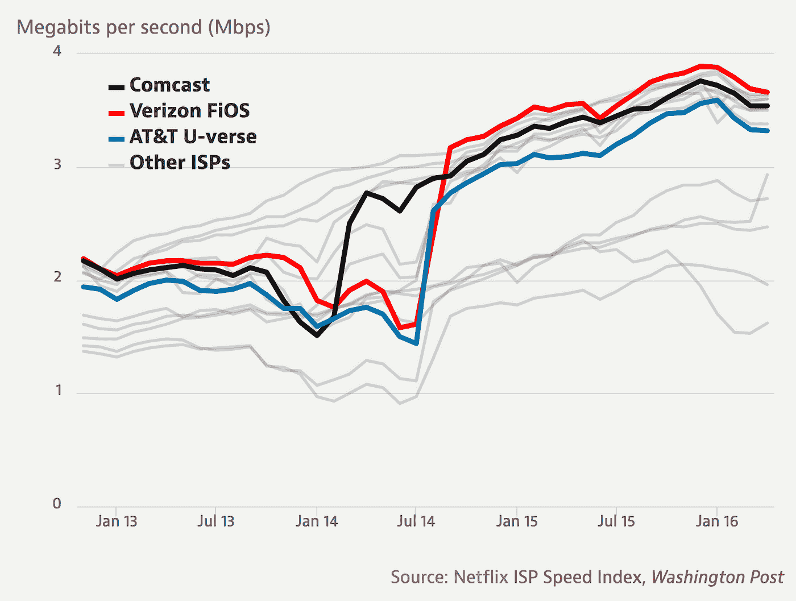

# 关于网络中立的几点思考

> 原文：<https://medium.com/hackernoon/some-thoughts-on-net-neutrality-247a0df25338>

我觉得我们在新闻提要和时间线上看到的关于网络中立性的大讨论中有一些观点被忽略了。其中包括联邦通信主席 Ajit Pai 对联邦通信委员会在治理中的作用的立场，第二章分类对互联网服务提供商投资的实际影响，以及网络中立性定义的相当狭窄的范围。如果需要的话，在阅读这篇文章之前查看一下这篇文章。

## Ajit Pai 很方便地改变了他对联邦优先权的立场。

他似乎完全改变了他对联邦优先于州法律的立场。

2015 年，FCC 优先于北卡罗来纳州和田纳西州的法律，允许市政电力系统在其服务区域外提供宽带服务。作为回应，Pai 写了一份[反对备忘录](https://apps.fcc.gov/edocs_public/attachmatch/FCC-15-25A5.pdf)，声称联邦通信委员会以这种方式干涉州主权是非法的。Pai 利用法院案例和以前的先例来解释为什么委员会无权参与规则制定。以下是反对意见的引文。

> *此外，[这一决定]是非法的。最高法院的先例表明，联邦通信委员会根本没有权力做它声称正在做的事情。在采取这一步骤时，联邦通信委员会篡夺了国家主权的基本方面****…我不认为这个机构有权力抢占*** *。*

他接着指出，联邦政府的干预将会干涉各州自行决定此类政策的权利。

> 通过先占权，委员会正试图向田纳西州和北卡罗来纳州的市政当局授予州政府没有授予他们的权力。 ***这种行动会干涉“国家管理自己政府的安排”，因为这不符合一个国家有“绝对酌处权”来决定它希望赋予其市政当局的权力的“数量、性质和期限”的基本原则*。**

在浏览了一系列案例和裁决后，他得出了以下结论。

> **然而，有一点是清楚的，那就是联邦通信委员会没有法律权力来推翻田纳西州和北卡罗来纳州做出的决定。**

**有趣的是，这是 Pai 上周二公布的[计划](http://transition.fcc.gov/Daily_Releases/Daily_Business/2017/db1122/DOC-347927A1.pdf)中的一部分:**

> ***我们的结论是，宽带互联网接入服务的监管应该主要由一套统一的联邦法规来管理，而不是由各州和地方的要求拼凑而成。我们今天的命令建立了一个校准的联邦监管制度的基础上，促进竞争，解除管制的目标，1996 年法案。允许州政府和地方政府采用各自独立的州政府和地方政府要求，这可能会比联邦监管制度带来更大的负担，可能会严重破坏我们在这里达成的平衡。联邦法院一致认为* ***一项积极的联邦放松管制政策享有与联邦管制政策*** *相同的先发制人效力。***

**现在，他在联邦通信委员会领导着共和党多数派，他很快就尽可能多地代表全国发言。在之前严厉地指出“华盛顿特区三名未经选举的官员”声称“在政党路线投票的基础上重写田纳西州法律”是错误的之后*，*看起来这正是 Pai 在给定机会的情况下正在做的事情。**

## **第二章没有显示出任何抑制投资或创新的迹象。**

**Ajit Pai 不断声称，被归入第二章(作为“公共运营商”而非互联网服务)损害了互联网服务提供商的投资和创新。自由媒体发布了一份报告，暗示互联网服务提供商通过与投资者的谈话和他们实际的财务数据否认了这一点。**

**这里有一些来自 report⁴:自由媒体的例子**

*   **2016 年 12 月，康卡斯特首席财务官被问及撤销 Title II 重新分类是否对公司有利。何[回应了](https://consumermediallc.files.wordpress.com/2016/12/comcasttranscript.pdf) ⁵:**

> **我认为就实际发生的事情而言——有人问我这个问题——**这是对标题 II 可能意味着什么的恐惧，而不是它实际意味着什么**。如你所知，我们非常相信政策背后的原则，但我认为 T2 未来的前景令人不寒而栗。**希望寒蝉效应已经消失；无论是投资者如何看待这个空间，还是企业如何看待这个空间。****

*   **康卡斯特的资本支出在 2016 年跃升至 91 亿美元以上，高于 2015 年和 2014 年的 85 亿美元和 74 亿美元。尽管声称 FCC 对宽带提供商的待遇“损害了投资和创新。”**
*   **在联邦通信委员会开放互联网投票后的两年时间里，公开交易的互联网服务提供商的资本投资比投票前的两年时间高出 5%。在投票后的两年时间里，24 家上市 ISP 中有 16 家的资本投资有所增加。**

**查看美国证券交易委员会的文件，很明显，增长或投资的任何下降或上升都被公司预测并正确解释为项目、M&A、服务领域变化等的结果。他们都没有提到第二章是任何趋势的原因，不管是积极的还是消极的。**

**因此，要么是互联网服务提供商淡化了第二章对投资者的影响，要么是夸大了它对政府的影响..无论如何，Ajit Pai 应该谨慎地发表声明，称开放前的互联网秩序政策被放弃“仅仅是因为假设的伤害和歇斯底里的末日预言”*，而这似乎正是他在这里所做的。***

## ***我们需要重新审视我们对中立互联网的期望。***

***我警告不要拿同样的煽动性言论来反对这个计划。反对派在 7 月份使用的一些策略(可能会再次使用)倾向于制造恐慌，并描绘了一种在特定条件下互联网服务提供商运营的可能性极小的情景。在某种程度上，网络中立性已经被破坏了，这并不是世界末日。***

***2014 年 2 月，网飞向康卡斯特支付了一笔未披露金额的款项，以获得在康卡斯特设施中放置自己服务器的权利。网飞实际上是在为其流量在康卡斯特的[网络](https://hackernoon.com/tagged/network)上获得优先处理的权利付费，这有可能损害其他提供商和竞争对手的流媒体和内容交付服务。[随后，它与美国电话电报公司和威瑞森达成了类似的协议。](https://www.aeaweb.org/research/will-an-internet-fast-lane-ruin-the-web) ⁶***

******

***Netflix speed on different ISP providers, deal with Comcast made in February 2014.***

***如果我们带着网络中立的精神来考虑一些自由，似乎在线内容不应该“因为它来自哪里而被偏爱、屏蔽或减慢。”在这种情况下，谷歌已经在谷歌搜索上偏爱自己的内容很长时间了。《T4 华尔街日报》的一项研究表明，在最近 25000 次搜索中，有 91%的搜索中，谷歌及其附属公司的广告出现在最显著的位置。它进一步发现，前两个广告有 43%的时间都是针对谷歌附属产品的。所有对笔记本电脑的搜索都出现在 Chromebook 上，98%对手表的搜索都出现在 Android 智能手表上，对烟雾探测器的搜索都出现在 Nest 的智能恒温器上。《华尔街日报》的⁷补充说，在与谷歌分享了这个故事后，几乎所有这些广告都被撤下了。***

***这暴露了一个我们已经接受的利益冲突——像谷歌和脸书这样销售广告的互联网服务公司也在和他们的广告客户竞争。虽然他们可能否认参与了任何形式的偏袒，但这并不能改变他们在法律上可以这样做的事实。这种行为与 ISP 将互联网流量更快地路由到合作伙伴站点的行为之间的区别纯粹是语义上的。***

***我的观点是，如果不从整体上审视整个竞争环境，而只对互联网服务提供商进行严厉批评，多少会让人产生误解。最重要的是，管理规则必须一致和公平，这将要求我们重新定义我们如何看待自由互联网——即使这意味着侵犯现有的先例或我们迄今为止允许的行为。互联网的发展和演变速度超过了它所遵循的规则。这里的一个教训是，就机器学习或自动驾驶汽车等新兴技术而言，开始考虑政策和治理永远不会太早。***

***[1]反对备忘录的全文可在[https://apps . FCC . gov/edocs _ public/attach match/FCC-15-25 a5 . pdf](https://apps.fcc.gov/edocs_public/attachmatch/FCC-15-25A5.pdf)找到***

***[2]FCC 推翻开放互联网令的完整计划可在[http://transition . FCC . gov/Daily _ Releases/Daily _ Business/2017/db 1122/DOC-347927 a 1 . pdf](http://transition.fcc.gov/Daily_Releases/Daily_Business/2017/db1122/DOC-347927A1.pdf)找到，节选部分在第 109 页。***

***[3]言论自由报告全文*它在起作用:互联网接入和在线视频市场如何在 Title II* 时代欣欣向荣，[https://www . freepress . net/sites/default/files/resources/Internet-Access-and-Online-Video-Markets-is-prospering-in Title II-Era . pdf](https://www.freepress.net/sites/default/files/resources/internet-access-and-online-video-markets-are-thriving-in-title-II-era.pdf)***

***[4]这些来自《言论自由报告》的具体例子在这里被称为 n[https://ars technica . com/information-technology/2017/05/title-ii-hasnt-hurt-network-investment-by-the-ISPs-self/](https://arstechnica.com/information-technology/2017/05/title-ii-hasnt-hurt-network-investment-according-to-the-isps-themselves/)***

***[5]在瑞士联合银行全球媒体和通信公司康卡斯特公司的电话会议的完整记录可在[https://consumer medial c . files . WordPress . com/2016/12/Comcast transcript . pdf](https://consumermediallc.files.wordpress.com/2016/12/comcasttranscript.pdf)中找到***

***[6]这个例子，以及更多关于最终放松管制的细节可以在 https://www . AEA web . org/research/will-an-internet-fast-lane-ruin-the-web 上找到***

***[7]《华尔街日报》的研究和更多细节见[https://www . WSJ . com/articles/Google-uses-its-search-engine-to-hawk-its-products-1484827203](https://www.wsj.com/articles/google-uses-its-search-engine-to-hawk-its-products-1484827203)***