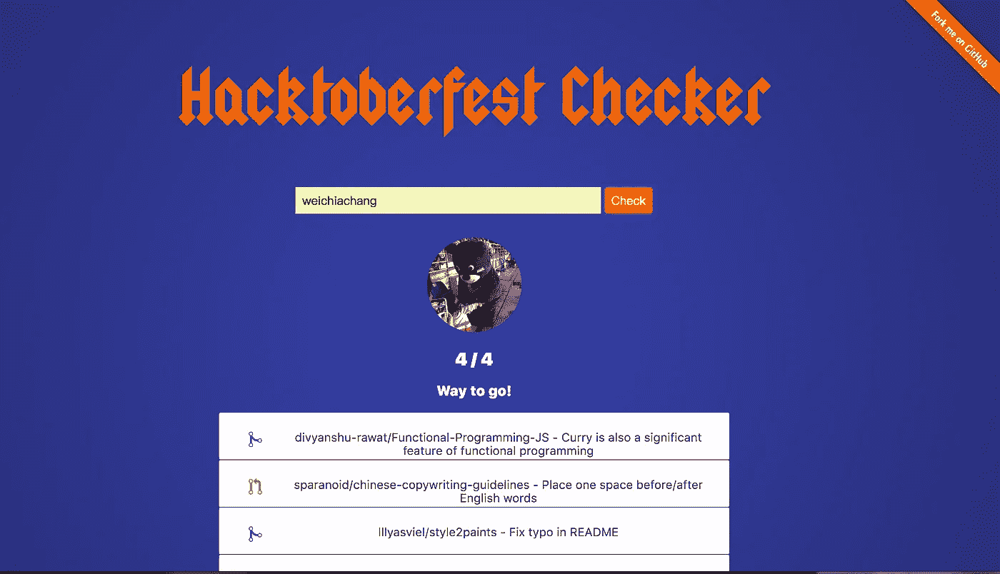
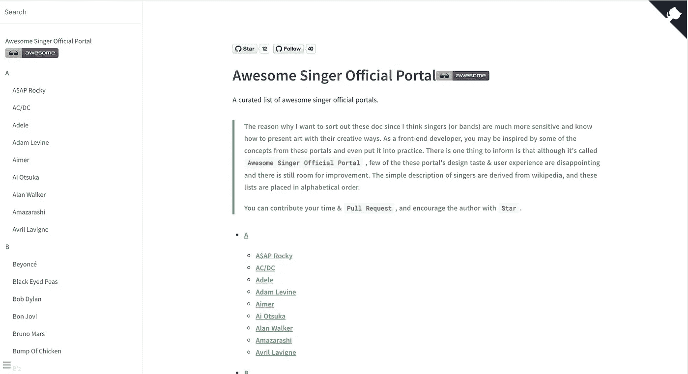

# Hacktoberfest 的一些提示

> 原文：<https://medium.com/hackernoon/some-tips-for-hacktoberfest-717d23e1e9c2>

> 首先，我的母语是中文，所以这篇文章可能会有一些语法错误，谢谢你的考虑。

我的许多朋友开始学习前端技能，因为他们发现编码很有趣，他们也渴望知道如何为开源项目做些贡献。

然而，拉请求这种方法他们似乎不熟悉，这也是我想写下这个小备忘单的原因之一。

边做边学可以帮助你更高效地实现一件事，对开源的贡献也是如此。幸运的是，一年一度的 Hacktoberfest 是初学者开始 OSS 之旅的友好方式。你甚至可以从 [Github](https://hackernoon.com/tagged/github) 获得免费的贴纸和 t 恤，只要你在 10 月份贡献至少四个拉请求。

你首先要注册你的 Github 账号:【https://hacktoberfest.digitalocean.com/sign_up/register】T5

等待投稿的相关项目可以在以下链接中找到，如果你愿意成为其中的一部分，只需在你的项目问题上添加一个名为“Hacktoberfest”的标签:
[https://hacktoberfest.digitalocean.com/#projects](https://hacktoberfest.digitalocean.com/#projects)

很高兴看到开源社区如此友好，比如 first-contributions 这个项目就是一个很好的例子:
[https://github.com/Roshanjossey/first-contributions](https://github.com/Roshanjossey/first-contributions)

你甚至可以用 Hacktoberfest checker 来检查你的进度:
[https://github.com/jenkoian/hacktoberfest-checker](https://github.com/jenkoian/hacktoberfest-checker)

作为对这个活动的回应，我还在业余时间创建了一个简单的副业项目，名为“牛逼-歌手-官方-门户”。它收集了一份与著名歌手或乐队官方网站相关的名单，任何**明星** & **拉请求**也欢迎！

Github 回购链接:
[https://github . com/weichi Chang/awesome-歌手-官方-门户](https://github.com/WeiChiaChang/awesome-singer-official-portal)

直播网站链接:
[https://weichi Chang . github . io/awesome-歌手-官方-门户/#/](https://weichiachang.github.io/awesome-singer-official-portal/#/)

最后但同样重要的是，我确实从开源社区学到了很多技能和知识，最重要的是: ***取自开源/回馈开源。*** 乐在其中。