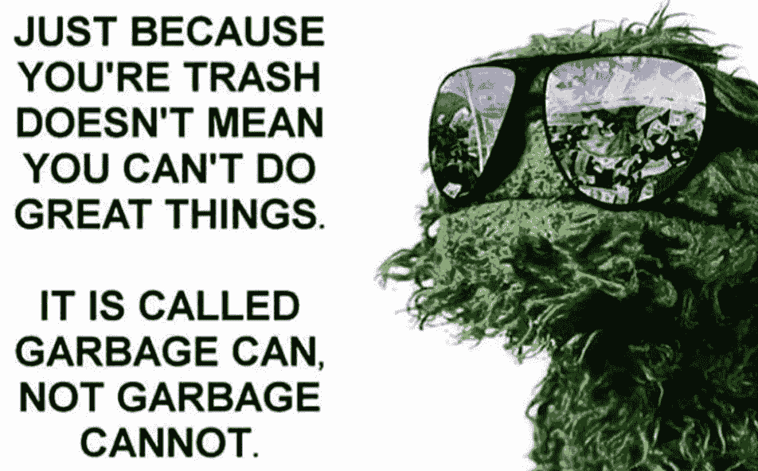
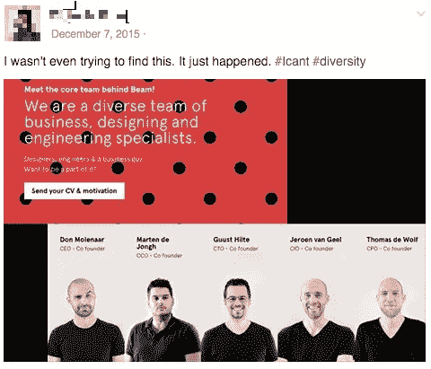
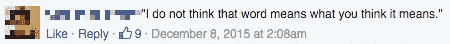
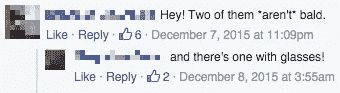
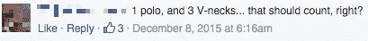
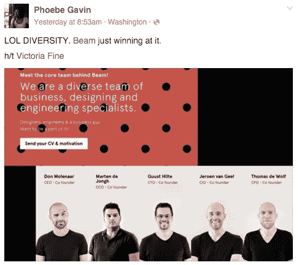
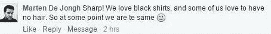
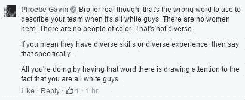
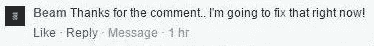
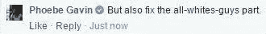

# 有人忘记告诉他们，多样性不仅仅是一个流行词。

> 原文：<https://medium.com/hackernoon/someone-forgot-to-tell-them-that-diversity-is-not-just-a-buzzword-5dab195a5368>

当滚动[脸书](https://hackernoon.com/tagged/facebook)的时候，你会发现很多有趣的事情。

比如今天的 LOL:

Always the wise sage, Oscar the Grouch

当我们谈到垃圾和大笑这个话题时，这里有一些让我大笑的垃圾——直到它超级不起作用。

Much diverse. Wow.

对任何一个左撇子美国人来说，这是非常好笑的，我们确实笑得很开心。

It means everything exactly the same and also next to each other. What do you think it means?

All hair matters.

The more the same it is, the more you notice the differences. Right?

所以我想，“我想知道他们是否会对一点点[刺激](https://www.facebook.com/mphoebegavin/photos/a.631774833571990.1073741828.631652016917605/987854154630721/?type=3)有所反应。”后来事情变得有趣了。

Will they respond to the @mention?

在我把它发布到我的公共页面上两个小时后，首席运营官和联合创始人[马丁·德容](https://twitter.com/martendejongh)做出了回应。

Peak WHOOSH

这是它不再有趣的时候。

美国人围绕多样性、代表性和包容性的对话量感觉前所未有。权力——它的结构和象征——正受到各种边缘化人群及其盟友的有组织团体的挑战。变革有时似乎迫在眉睫，不可阻挡。

很容易想当然。

我不应该感到惊讶，他对我来说如此明显的事情竟会如此健忘。

Why do I have to explain this to you?

这可能是它的结束，但显然潮人琼恩·雪诺对 v 领乌鸦说了些什么。

How can you fix it right now? Oh, wait…

一切到此为止，我可以穆里根。

[Beam Labs](http://beamlabsinc.com/) 是一家荷兰公司，荷兰几乎 90%是白人。在那样一个国家，有色人种是一个舍入误差。但这里有一个健康的女性群体，因此“解决”你公司缺乏多样性的问题，不是删除你“关于页面”上的一个词。

这就是为什么多元化对话不能只是在美国大声疾呼。欧洲可能没有那么丑陋和根深蒂固的种族历史，但包容性贯穿了许多光谱。即使是在荷兰这样的国家，公司也有责任实现多元化。完美的表现并不是在每种情况下都合理的期望，但是意识是。

我不应该说:

潮人琼恩·雪诺意识到这绝不是开玩笑，我不是在和他开玩笑，也不是在给他英语用法的提示。我知道这一点，因为他删除了他的评论，随后，整个线程。

幸运的是，互联网上的女人没有 screencap 快捷方式是不会离开她的主页的，她的博客就在附近。

*对了，梁拉布、*[T3 这不是更好的](https://www.facebook.com/mphoebegavin/photos/a.631774833571990.1073741828.631652016917605/988772614538875/?type=3) *。*

[*但这是可以接受的...*](https://www.facebook.com/mphoebegavin/photos/a.631774833571990.1073741828.631652016917605/989106367838833/?type=3) *勉强。*

> [黑客中午](http://bit.ly/Hackernoon)是黑客如何开始他们的下午。我们是阿妹家庭的一员。我们现在[接受投稿](http://bit.ly/hackernoonsubmission)并乐意[讨论广告&赞助](mailto:partners@amipublications.com)的机会。
> 
> 如果你喜欢这个故事，我们推荐你阅读我们的[最新科技故事](http://bit.ly/hackernoonlatestt)和[趋势科技故事](https://hackernoon.com/trending)。直到下一次，不要把世界的现实想当然！

