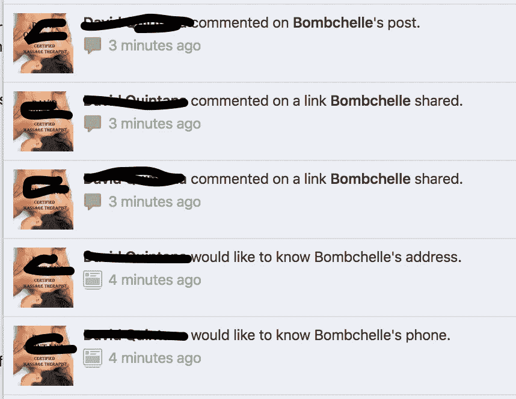
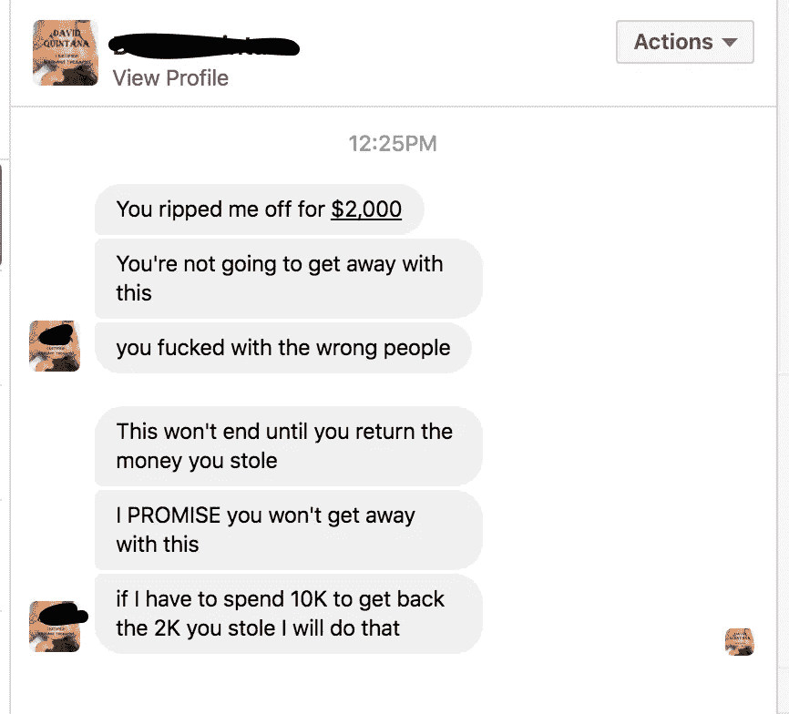
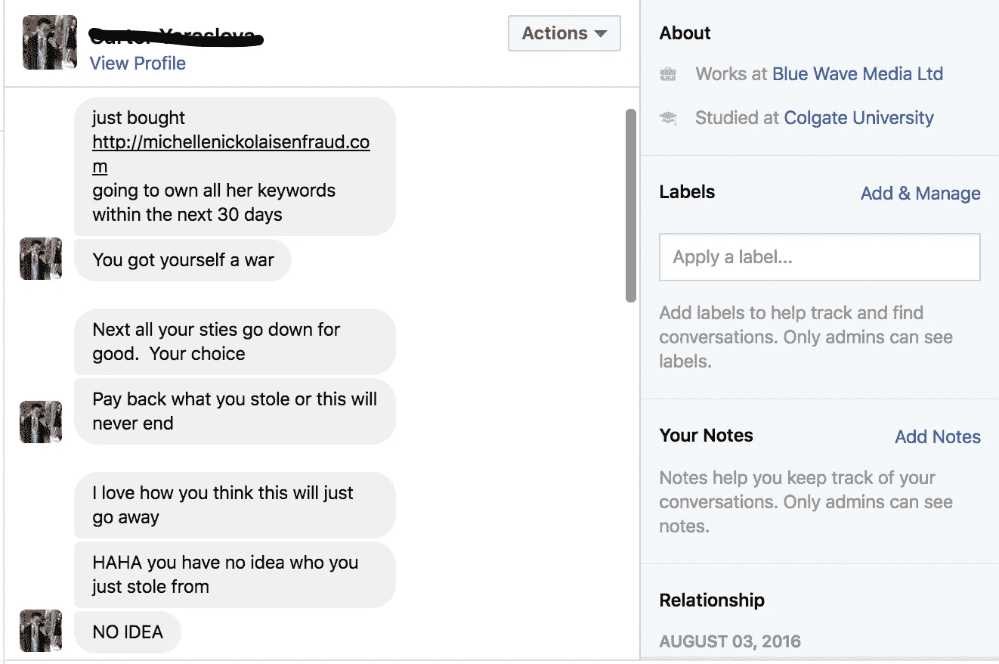
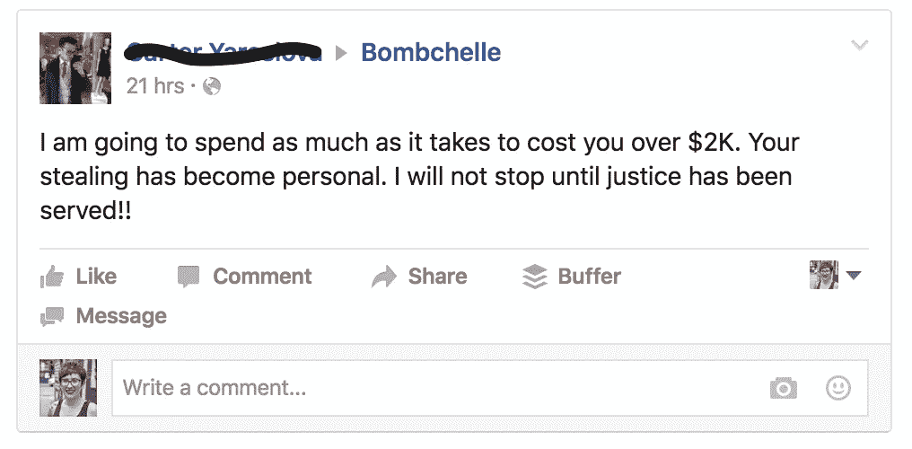
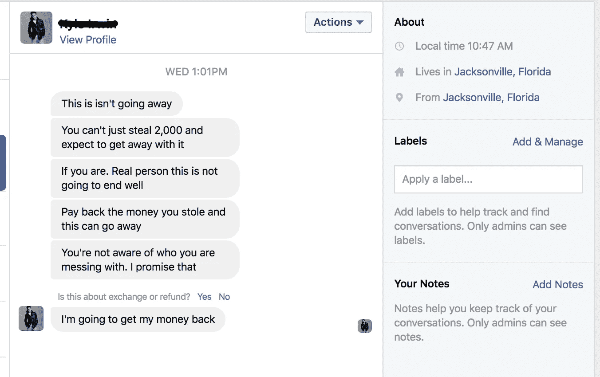
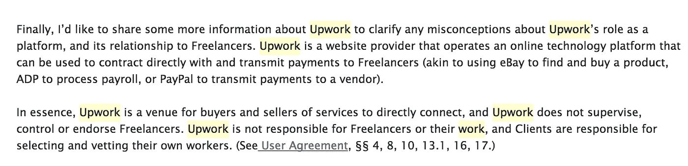
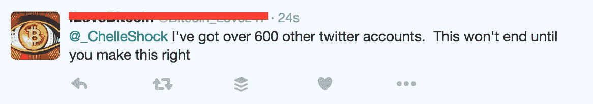
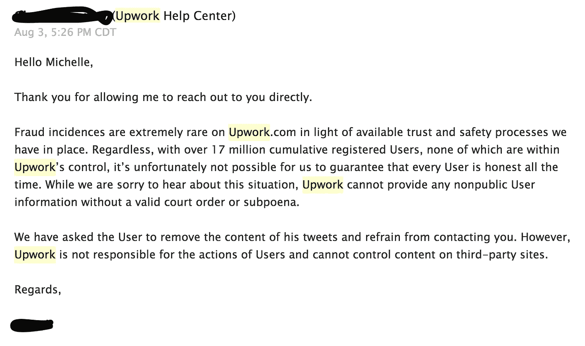

# 有人在 Upwork 上盗用了我的身份，而我得到的只是这篇恶心的博文

> 原文：<https://medium.com/hackernoon/someone-stole-my-identity-on-upwork-and-all-i-got-was-this-lousy-blog-post-d63aab2b4c90>

我的职业是自由作家。我已经做了七年的自由职业者，从我会拿铅笔开始写作，并且在那段时间里用免费游戏换取游戏评论，获得了我的第一份在线写作工作。最后但并非最不重要的一点是，我从未使用过自由职业者在线市场 Upwork(这一点马上就要提到了)。

八月初的一天，我打开笔记本电脑，准备开始一天的工作。在接到一个朋友的紧急电话后，我回到了电脑前——想象一下当我看到这一串通知时我有多惊讶:

紧随其后的是这些信息:

这还不是最后一个，哦不。**几个小时之内，这个家伙就:**

*   通过脸书和推特，通过多个个人资料给我发了多条威胁信息
*   通过多个电子邮件地址发送威胁邮件
*   在我的脸书主页、博客和其他我写过文章的网站上留下了评论，说我是一个需要避免的骗子
*   通过我在脸书的商业页面索要了我的电话号码和地址

我的第一个想法是，不幸的是，这种骚扰对于互联网上被边缘化的人来说很正常。我写了很多关于性别歧视、种族主义和[其他社会问题的文章。我以为在这个过程中，我惹了某个惹事的家伙生气，他试图恐吓和羞辱我作为回应。](/ms-tech/the-dark-side-of-freelancing-e63cdd84eeac#.du4o51v6i)

So far, this isn’t even half of the screenshots I have of harassment and threats from that day

**我发现，这个家伙确实有一个 Upwork 账户，当我在推特上直播这个有趣的经历时，Upwork 最终在推特上证实了这一点。** Upwork 还证实有人在他们的平台上冒充我(尽管我不得不直截了当地问了几次才得到确认，而不是含糊其辞的回答)。

他们的客户服务团队与我展开了一场从 Twitter DM 到电子邮件的对话。当我们进展到电子邮件时，我已经完全不为所动了，因为他们的社交媒体代表在 Twitter 上告诉人们，在我收到他们的任何电子邮件之前，情况已经得到了处理。

然而，一旦我们开始发邮件，情况只会变得更糟。我有过很多糟糕的客户服务经历，但没有多少是如此令人恼火和居高临下。他们的第一封邮件完全没有同情心，其余的邮件完全充斥着公关语言(以及奇怪的假设，即我不明白 Upwork 是如何工作的，这就像，拜托，这不是火箭科学)。

excerpt of email #2 from the stunningly awful customer service team at Upwork

他们也拒绝回答我关于该事件的任何问题。

## **Upwork 不愿告诉我的事情列表:**

*   有人用他们的平台冒充我多久了
*   这个人骗了多少人，这些人可能会以这种极其令人毛骨悚然的方式追杀我
*   模仿者以前的客户的任何其他信息，这样我可以联系他们，让他们知道他们没有和我一起工作，并试图为我的名字/品牌做损害控制
*   如果他们联系以前的客户，让他们知道他们是自由职业者欺诈的受害者
*   如果这个冒名顶替者使用了我的任何个人信息(如 SSN 或驾照号码等。)来冒充我，或者他们只是用我的名字和一封假邮件注册
*   任何关于被诈骗的客户的信息，谁以这样一种侵略性的方式来找我，以便我可以对他采取法律行动，如果威胁继续存在

**换句话说，在*所有*的任何事情……除非我想让律师参与进来。**

# 他们的一个客户主动骚扰并公然威胁我，我甚至不能对他采取行动，因为 Upwork 在保护他，躲在他们的服务条款后面。

我确实考虑过寻求法律援助来帮助处理这件事，但是，令人震惊的是，律师可不便宜。我一直想写一篇关于这个的帖子——这不是什么秘密，Upwork 对自由职业者来说非常可怕，但我希望其他人意识到身份盗窃是该平台的另一个潜在问题。然后我从另一个自由职业者那里看到了[这个故事，他*也*被 Upwork 搞得一团糟，这是我最终放下这个的动力。](/@AdShadlabs/why-you-should-never-use-upwork-ever-5c62848bdf46#.8nt7pdpsc)

# 向上爬对每个人都不好

这对自由职业者来说是不利的，因为这是一场逐利竞争，客户通常只关注成本，他们会拿走很大一部分薪水。还有像 Shadi 这样的情况——当有非常清楚的书面记录显示他没有做错任何事情时，Upwork 并不在乎一个怀恨在心的潜在客户已经盯上了他，并且在他有大约 1200 美元的付款等待提取时将他锁定在他的账户之外。

**这对客户不利**因为 Upwork 显然没有非常严格的防欺诈政策，因为有人假冒我(一名作家，2009 年至 2016 年住在德克萨斯州奥斯汀，现居住在里士满)的个人资料，声称我住在华盛顿州布雷默顿。你怎么知道和你一起工作的人是不是他们所说的那个人？*玩得开心！*

除此之外，许多不是自由职业者或技术专家的客户对此一无所知。因此，他们使用 Upwork 并有糟糕的体验，无论是因为市场倾向于比高质量自由职业者现实成本低得多的成本，还是因为缺乏安全措施。然后他们认为自由职业者都是不专业的小偷——我遇到过不止一个试图与自由职业者合作的人，在一三次糟糕的市场经历后放弃了。换句话说，Upwork 给我们这些自由职业者带来了坏名声。

**最后但并非最不重要的是，还有令人讨厌的客户服务。**我的经历和 [Shadi 的](/@AdShadlabs/why-you-should-never-use-upwork-ever-5c62848bdf46#.e9k8idgrf)的经历有一个共同点，那就是 Upwork 的客服两次都以刻板、居高临下的方式回答:

we won’t tell you what the trust and safety processes we have are, but we assure you they’re tremendous (also, sucks someone stalked and harassed you, but lol not our problem)

**整个对话就是这样。在某个时候，他们试图打电话给我，这可能是真的，但对我来说，这似乎是一种非常方便的方式，因为我没有谈话的书面记录。就像 Shadi 在[中对 Upwork 代表在他的帖子](/@AdShadlabs/rich-it-shouldnt-take-a-post-like-this-for-you-upwork-to-give-someone-special-treatment-e6b1b9c203c0?source=responses---------0-)上的回应所说的那样——他们不在乎，直到它变成一场狗屎风暴(就我而言，他们不在乎，直到我在 Twitter 上引起骚动)。即使这样，他们也不会在乎假装在乎他们的政策给你带来的压力和不便。**

*多余的*黑幕部分？我不完全相信这真的是一个骗局——或者说，这个人是通过 Upwork 被骗的。关于这次遭遇，有许多可疑之处:

*   骚扰者有很多脸书/推特/电子邮件等。账户(所有脸书账户显然都是假的)
*   还有多个 IP 地址(我能看到是因为他们留下了博客评论并使用了我的联系方式)
*   截图和他们的故事/评论不一致
*   我不完全确定有人真的可以像他们在 Upwork 上描述的那样欺骗别人，至少按照 Upwork 自己的支付指南

# 但由于 Upwork 没有给我任何信息，我不知道这是一起敲诈勒索还是身份盗窃案件，在这两种情况下，我都不能对我的品牌或业务造成的任何损害做任何事情。

换句话说，Upwork 没有严格的安全/欺诈防范措施这一事实可能会产生漏洞，使人们很容易从毫无戒心的自由职业者那里勒索金钱。

我的意思是，他们只是一家价值数百万美元的公司，目标是成为首屈一指的自由职业者市场。在这种情况下，他们为什么要竭尽全力保护自由职业者和客户(以及无辜的旁观者)？

当然，Upwork 需要市场上的客户才能发挥作用。**但他们也需要不吃醋的自由职业者，**如果他们继续这种行为，而不采取行动阻止*和*平台上的自由职业者被践踏，没有理由让任何人与他们联系在一起。

从一个自由职业者到另一个——不要使用 Upwork。不要通过向上工作来雇佣人。

## 不要再把你支付的项目费用的 20%给一个不关心使用它的人会发生什么的公司，而是给你的自由职业者更好的报酬。

> [黑客中午](http://bit.ly/Hackernoon)是黑客如何开始他们的下午。我们是 AMI 家庭的一员。我们现在[接受投稿](http://bit.ly/hackernoonsubmission)并乐意[讨论广告&赞助](mailto:partners@amipublications.com)机会。
> 
> 如果你喜欢这个故事，我们推荐你阅读我们的[最新科技故事](http://bit.ly/hackernoonlatestt)和[趋势科技故事](https://hackernoon.com/trending)。直到下一次，不要把世界的现实想当然！

