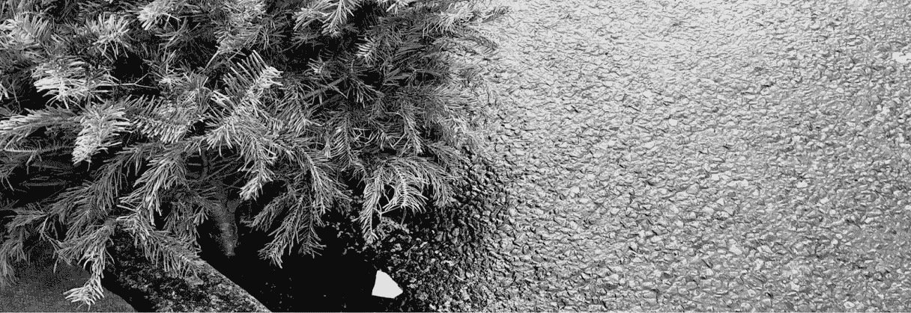
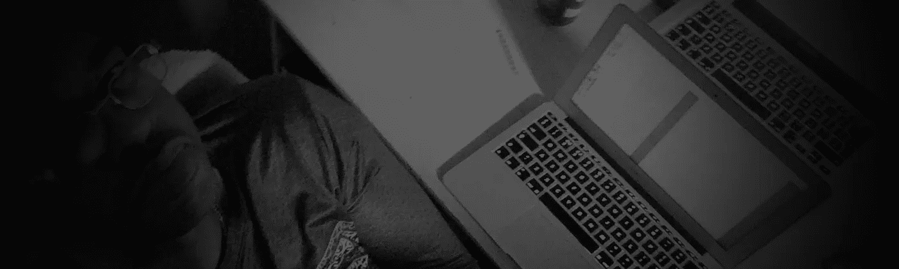

# 我不久前写的一些关于科技媒体的东西…

> 原文：<https://medium.com/hackernoon/something-i-wrote-a-while-back-about-tech-media-10a285051a2>

Taken with OnePlus Two

在过去的一年里，我越来越对我在 TechCrunch、The Verge 等热门网站和博客以及 TWIT network、Cult of Mac 等播客上看到的科技新闻水平感到沮丧。我还能提到更多，但你明白了。

我一直有点像极客，有点像书呆子，正因为如此，我很喜欢摆弄小玩意。(我的玩具)为我的 Mac 测试新软件，为我的 iPad 或 Android 手机下载应用程序。(或者当时我正在使用的任何手机)

像许多对科技世界充满热情的人一样，他们不在行业内工作，也没有大把的现金去购买最新的科技产品。我必须依赖那些知道自己在说什么的人，给我他们不带偏见的观点和事实。但我在过去一年中发现，他们没有。文章看多了。不，不是文章，是更多的观点。他们会告诉你小工具、软件、应用程序等等有什么问题。但是他们不会告诉你什么是独特的。或者你为什么喜欢使用它，他们写的东西没有什么可挑剔的。换句话说。轰动一时的作品。

在苹果宣布 Apple watch 之前，我已经阅读、聆听和观看了大量的文章和播客，这些文章和播客说 Android wear 有太多的错误，但一旦苹果发布 Apple Watch，他们就会解决这个问题。首先，是否有问题需要解决，他们是如何知道的？这东西还没发布。业内只有少数人见过 Apple watch。看过，没摸过，最重要的是它在运行一个演示软件。据我所知，还没有博客或记者真正测试过这款手表。(我喜欢苹果产品。我有一台 2007 年的 iMac，可以满足我的需求；一台 MacBook Pro，适合搬重物；一台 MacBook Air，适合我在旅途中使用；还有我的 iPad)

我不喜欢的是那些写文章的“记者/博主”，他们在文章中呕吐，亲吻苹果的屁股，(很难想象亲吻和苹果的屁股)我理解这样的公司会在一定程度上诋毁他们的竞争对手。谷歌对苹果，可口可乐对百事可乐，捷豹对奔驰，这样的例子不胜枚举。等等。等等。(刚刚进入国王和我模式)
但我对一个处理技术(是的，技术整体)的网站的期望是告诉我规格，告诉我它在日常生活中是如何使用的，告诉我价格，告诉我利弊，最重要的是在文章的结尾，告诉我你对它的想法和感受。但是写关于苹果的废话的博客和记者也是一样。
我喜欢我的安卓手机，对我来说它适合我的需求。但是我听腻了苹果抄袭这个功能，或者那个功能。Android 首先拥有更大的屏幕。谁他妈的在乎，这个领域的竞争很大，为什么因为公司会推动一个又一个改进他们的设备，改善功能，并希望降低设备的成本。我在设备上花更少的钱是个好消息。
我一直在思考媒体报道科技的方式，但是是什么让它达到了顶点。是我在两周内看到的所有关于 Ello 的文章。我知道 Ello 并不完美，任何说它完美的人都在撒谎。而是因为它是什么，以及它存在的时间有多长。它非常好，适合我的需要。(而且还在测试阶段)

但是这些文章打动我的是这些博客作者、记者、作家。称他们为你想要的，报告他们过去 4 个月在网站上的经历。举个例子，我给你讲讲我在同一时间段的经历。
当我注册了一个 Ello 账户时，我可能和其他人一样。“你好，你好，哈哈”，当然，还有来自伦敦北部的“你好，戈夫纳”。然后第一个星期我所做的就是跟踪人们。第二周我开始发帖，不知道上传什么，但我还是上传了。同时，我会对其他人的帖子发表评论，并关注更多的人，这样我就可以在我的 feed 中获得他们的内容。这个过程一直持续到今天。通过这样做，我让人们对我的帖子发表评论，作为回报，我得到了很多反馈。一个简单的过程，不难理解，而且我假设每个人在任何社交网站上都这样做。
(但这一过程似乎不适用于科技媒体中的某些人)

现在让我们看看写这些热门文章的博客作者和记者。在我读了这些文章后，我不明白为什么他们的经历和我的如此不同，为什么他们没有和我一样的互动水平。为什么他们说 Ello 还没开始就死了。但是当我看着埃洛的侧面时，一切都变得清晰了，这就是我所看到的。在他们登陆该网站的四个月时间里，他们上传了(平均)4 到 8 篇帖子，关注了大约 20 到 30 个人，其中超过一半的人停止了发帖。(哦，我忘了说我关注了大约 200 个人，还有差不多同样的人跟我回来)所以，这是我的论点。

如果你在网站上不活跃，如果你关注的人不发帖，如果你不与其他用户互动，不关注他人，不被考虑，网站只运行了 5/6 个月，仍处于测试阶段(而你与之相比的其他社交网站也已经运行了 2 到 10 年)，那么你将如何拥有丰富的体验。如果你不愿意付出努力，那么你当然会有糟糕的经历。但是这些博客作者/记者在网站上写了一篇关于他们经历的文章，但是他们甚至没有详细说明他们的参与程度。因此，乔或简公共来阅读它，并认为，好吧，这是网站听起来废话，我不会打扰。我只是厌倦了阅读那些研究极少的文章。
当我写这篇文章时，我想起了 Google+过去和现在的热门话题。多少次我会读到 Google+是一座鬼城，今年到目前为止还没被重提，不过还早。写这些文章的同一个“所谓的记者”，如果你去 Google+的个人资料，他们会有相同的共同点，

1.他们早在 2012 年就放弃了这个网站。
2。他们几乎不跟踪任何人。
3。他们只留下了自己文章的链接。
4。他们从未和任何人订婚。

以及在哪里相信他们是社交网站的权威，如何使用他们。这些自封的“社交网络大师”并不擅长社交，他们在这些网络上给我们提供建议。这是矛盾修饰法吗？这样的例子还有很多，而且还会继续，我知道。但是糟糕的新闻和缺乏事实确实让我恼火。我讨厌人们被误导的想法。由于缺乏研究，我被误导了。所以我能做的就是取消订阅这些网站，取消订阅这些博客和记者。

去年，我不再关注科技和媒体行业的某些人，博客和网站也是如此。纯粹是因为点击，我仍然关注一些和平地针对苹果和安卓用户的网站，但只是为了这些设备和生态系统的提示、技巧、应用和新闻。以下是我最喜欢的一些科技网站。Android Police，XDA，Android Authority，Tech Verse，Engadget，The Next Web，Mashabal(半信半疑)
我关注的科技行业内的人。吉尔·达菲、凯特·拉塞尔、安迪·伊纳特科、丹·帕特森、凯文·托弗尔、克里斯·纳卡、埃里卡·格里芬、杰瑞德·布施、杰斯·布洛达、TK·贝、杰森·豪厄尔、丽莎·伊迪克科和利奥·拉波特。
丹·帕特森和吉尔·达菲做了一个播客，他们讨论是什么让新闻来源值得信赖，[信号播客#01](https://www.youtube.com/watch?v=o-llpFzAIZ4)

Just me having a bit of a rant.

> [黑客中午](http://bit.ly/Hackernoon)是黑客们下午的开始。我们是 [@AMI](http://bit.ly/atAMIatAMI) 家庭的一员。我们现在[接受投稿](http://bit.ly/hackernoonsubmission)并乐意[讨论广告&赞助](mailto:partners@amipublications.com)机会。
> 
> 如果你喜欢这个故事，我们推荐你阅读我们的[最新科技故事](http://bit.ly/hackernoonlatestt)和[趋势科技故事](https://hackernoon.com/trending)。直到下一次，不要把世界的现实想当然！

