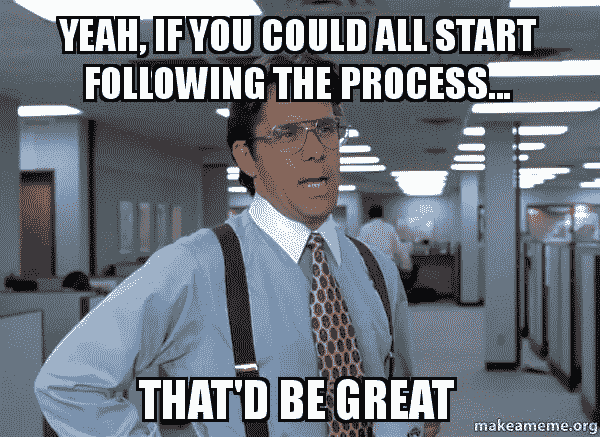

# 一些值得思考的事情

> 原文：<https://medium.com/hackernoon/something-to-meditate-on-fd6ca68b2ad2>

# 该过程

直接解决问题是如此诱人，尤其是当你确信自己是对的时候。

如果流程坏了，我们来修复它。我知道我们的文化拥抱直觉工匠。

另一方面，这个过程似乎是为假人准备的。然而，在许多情况下，这一过程被低估了。事实上，正确的工作流程实际上比我们现在面临的问题更紧迫。

当你的直觉失效时，这个过程就是你的王牌。

当你对直觉的依赖受到威胁时，这个过程会让你紧张。克服它。最好的过程利用你的直觉，并给它发展的空间。

> “无论你目前的衡量标准是什么，都要期待它会改变。并期望这种变化揭示出你需要做得更好的下一个数据。做好改变的准备。”

# **一步一个脚印**

如果你想提高水平，改变想法或采取行动，一个一致的计划总是比一个单一的事件更好。

循序渐进，随招生。

这个过程也是关于适应复杂变化的能力。工作流程就是不断努力。

许多领导者下意识地采取“自动驾驶”方式来应对。当你处于自动驾驶状态时，克服挑战并在过程中茁壮成长会失败，并可能导致你周围的人失去希望并放弃努力。

虽然运气可能比努力更有魅力，但你不能选择运气。另一方面，努力在任何时候都是完全可以得到的。我们必须努力解决这个问题。

**不磨。使用 hustle 作为长期策略。**

研磨者拼命寻找机会。如果有机会，他们会毫不犹豫地加入进来，向他人证明自己的价值。

**利用时间学习。**

当我们把自己推到现有技能和经验的绝对边缘时，我们就学会了。当我们接受一个能让我们激发最大潜能的项目时，学习部分就开始了。学习不舒服。我们做的每一件值得追求的事情都需要艰难的选择。

Yeah, the process is nothing like this

感谢阅读，我希望这有所帮助。

如果你有任何反馈或建议，我很乐意在评论中与你交谈。