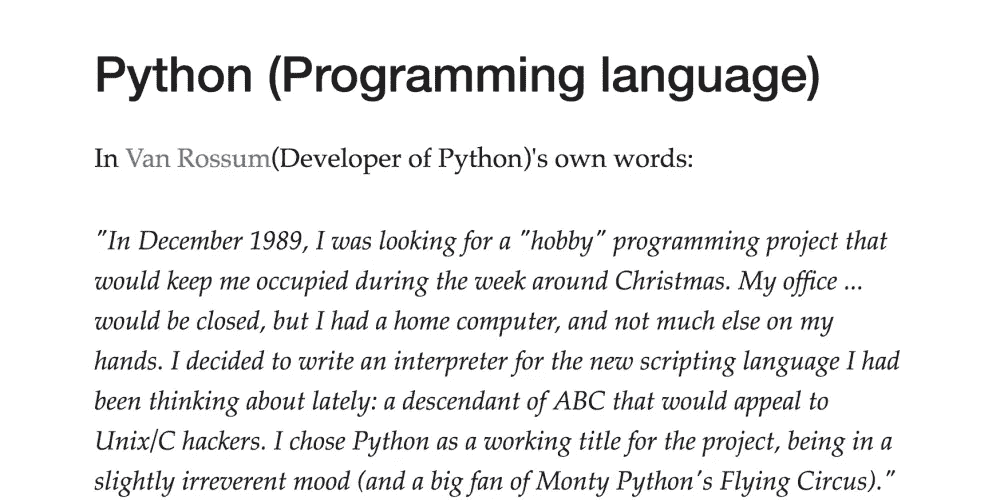

# 软件项目是如何得名的

> 原文：<https://medium.com/hackernoon/sometimes-its-kind-of-interesting-to-know-the-origins-of-the-products-projects-we-love-e95f3ce061f3>

有时候，知道我们喜欢的产品/项目的起源是一件有趣的事情。我收集了这些产品/项目以及它们如何得名的故事。

## JavaScript(编程语言)

摘自《T1》对其创作者[布伦丹·艾希](http://en.wikipedia.org/wiki/Brendan_Eich)的采访:

信息世界:*据我所知，JavaScript 最初是以 Mocha 开始的，后来变成了 LiveScript，再后来在网景和 Sun 合作时变成了 JavaScript。但实际上和 Java 没什么关系或者关系不大，对吧？*

艾希:*没错。从 1995 年 5 月到 12 月的 6 个月里，先是摩卡，然后是 LiveScript。然后在 12 月初，网景和 Sun 签订了一份许可协议，它变成了 JavaScript。我们的想法是让它成为 Java 和编译语言的补充脚本语言。*

## MySQL(数据库管理系统)

[Michael "Monty" Widenius](https://en.wikipedia.org/wiki/Michael_Widenius) 是 MySQL 的创始人之一，他的一个女儿名叫 My(MySQL 就是以他的名字命名的)。

## 版本控制系统

Linus Torvalds(Git 的开发者)曾戏谑 Git 这个名字，这是英式英语俚语，指愚蠢或令人不快的人。托瓦尔兹说:“我是一个自私的混蛋，我以自己的名字命名所有的项目。先是“Linux”，现在是“git”。手册页将 git 描述为“愚蠢的内容跟踪器”。

## Ubuntu(操作系统)

这款操作系统是以南非哲学 ubuntu 命名的，Canonical Ltd .认为这种哲学可以大致翻译为“对他人的人性”或“我之所以是我，是因为我们都是谁”。

## Java(编程语言)

这种语言最初被称为 Oak，是以詹姆斯·高斯林(Java 开发者)办公室外的一棵橡树命名的。后来这个项目被命名为 Green，最后被重新命名为 Java，来自 Java coffee。

## Python(编程语言)

用[Van Rossum](https://en.wikipedia.org/wiki/Guido_van_Rossum)(Python 的开发者)自己的话说:

1989 年 12 月，我在寻找一个“业余爱好” [*编程*](https://hackernoon.com/tagged/programming) *项目，这个项目能让我在圣诞节前后的一周里忙个不停。我的办公室...会被关闭，但我有一台家用电脑，手头没有太多其他东西。我决定为我最近一直在思考的新脚本语言写一个解释器:一个会吸引 Unix/C 黑客的 ABC 的后代。我选择 Python 作为这个项目的工作名称，带着一点不敬的心情(也是 Monty Python 的飞行马戏团的忠实粉丝)。*”

## Ruby(编程语言)

“Ruby”这个名字起源于 1993 年 2 月 24 日松本幸弘(Ruby 的开发者)和 Keiju Ishitsuka 之间的一次在线聊天，当时还没有为这种语言编写任何代码。最初提出了两个名字:“珊瑚”和“红宝石”。松本在后来给石冢的电子邮件中选择了后者。松本后来提到了选择“红宝石”这个名字的一个因素——这是他的一个同事的诞生石。

[翻译聊天内容](http://blade.nagaokaut.ac.jp/cgi-bin/scat.rb/ruby/ruby-talk/88819)当名字确定后，他们分享了电子邮件。最初的对话是用日语。

## Scala(编程语言)

Scala 这个名字是 scalable 和 language 的结合体，表明它是为满足用户需求而设计的。

## Django (Python frmaework)

这个框架以吉他手坦哥·雷恩哈特的名字命名。

## Chrome 浏览器

谷歌 Chrome 浏览器设计主管格伦·默菲回答了“Chrome 浏览器的名字是怎么来的？”。用他的话说，

"*在开发周期的早期，我们进行了一次“选择一个代号”的投票——那次比赛产生的名字太糟糕了，以至于当其中一个领导者否决了它并宣布代号将是“Chrome”时，我们都非常高兴，大概是因为他喜欢跑车。*

## Mozilla(公司)

Mozilla 这个名字的历史可以追溯到 1994 年最初的 Netscape Navigator 浏览器的内部代号，这个名字的意思是“马赛克杀手”,旨在与大楼粉碎 [Godzilla](https://en.wikipedia.org/wiki/Godzilla) 有一些相似之处，因为该公司的目标是取代 [NCSA Mosaic](https://en.wikipedia.org/wiki/Mosaic_(web_browser)) 成为世界头号网络浏览器。Mozilla 这个名字在 1998 年作为 Netscape 的一个开源组织而被重新命名。

## 火狐浏览器

“火狐”这个名字是 Mozilla 选择的，因为它与“火鸟”(火狐的前名字)相似，但也因为它在计算行业的独特性。

## PHP 框架

”*在试图想名字的时候，我想到了托尔金的《中土世界》和 C.S. Lewis 的《纳尼亚》。在纳尼亚，凯尔帕拉维尔是纳尼亚国王和王后居住的城堡的名字。Laravel 和 Paravel 押韵。我觉得这个名字听起来优雅而精致。*——[泰勒·奥特威尔](https://twitter.com/taylorotwell)(拉勒维尔的创造者)

## Hadoop(开源大数据软件)

Hadoop 这个名字不是一个缩写；这是一个虚构的名字。该项目的创作者，道格·卡丁解释了这个名字的由来:

我的孩子给一只黄色的填充大象起的名字。简短，相对容易拼写和发音，无意义，不在其他地方使用:这些是我的命名标准。孩子们擅长制造这样的东西。古戈尔是一个孩子的术语。”

## Skype(即时消息应用程序)

软件[的名字](https://hackernoon.com/tagged/software)来源于“Sky peer-to-peer”，后来缩写为“Skyper”。然而，与“Skyper”相关的一些域名已经被占用。去掉最后一个“r ”,剩下当前的标题“Skype ”,其域名是可用的。

## Adobe(公司)

Adobe 这个名字来源于 Adobe Creek，一条流经创始人之一 John Warnock 房子后面的河流或小溪。但是土坯溪在哪里？它位于加利福尼亚州的洛斯阿尔托斯。

**Apache(软件基础)**

根据阿帕奇项目网站上的常见问题，选择阿帕奇这个名字是出于对美国土著部落阿帕奇及其高超的战争和战略技能的尊重。人们普遍认为这个名字是“补丁服务器”的双关语(因为它是一组软件补丁)。

> 如果你知道这样的故事，请在评论区留下。