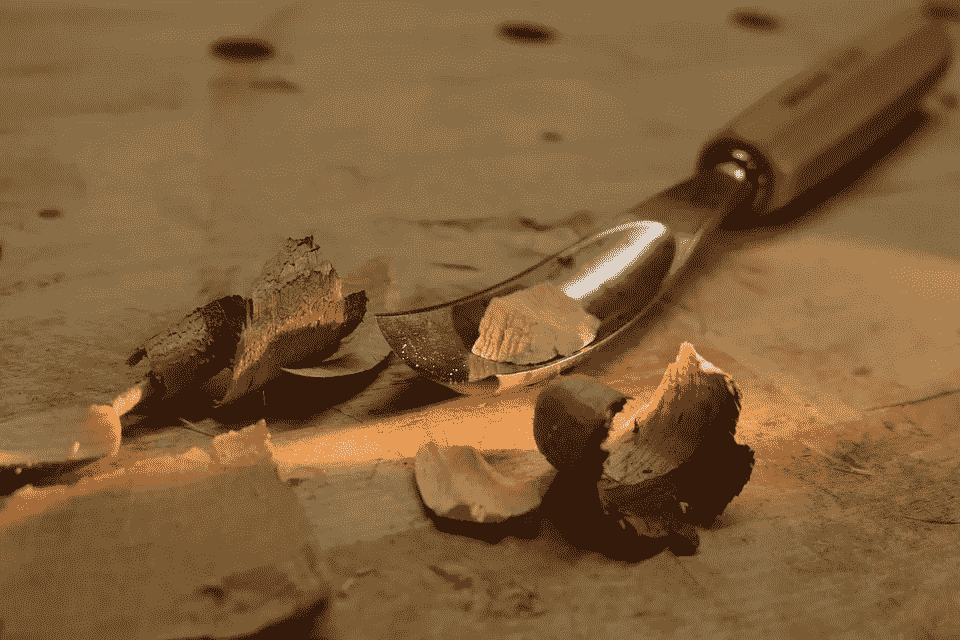
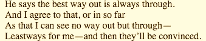

# 有时候，这只是工作的问题

> 原文：<https://medium.com/hackernoon/sometimes-its-simply-a-matter-of-work-88bec2e284b6>

## 没有黑客，诡计，或提示会做到这一点

credit: [pixabay.com](https://pixabay.com/en/tool-wood-work-edit-carve-craft-1364892/)

我很喜欢罗伯特·弗罗斯特的一首诗中的一句话——但你可能不会想到这句话:

from “A Servant to Servants” by Robert Frost

你可以随心所欲地破解、破坏和创新，但在某种程度上，这些方法不再推动创造的事业。然而，在许多情况下，以下是正确的:

> 这只是工作的问题。

你可以把这当成简单的老生常谈，仅仅是传递新教职业道德的传统智慧，但是你这样做是自担风险的。解开它一点，你可以找到一个更有用的处方来帮助推动你的创造性努力。

## 工艺艺术

， [*斜战略*](http://www.rtqe.net/ObliqueStrategies/OSintro.html) 背后的两个疯狂天才之一曾经说过:

> "手艺是当你没有灵感时能让你成功的东西。"

这里的关键词是*工艺*。它让人想起那份不性感的工作——你刚刚完成的单调且有时单调的任务，那份工作在你的工作流程中趋于统一和固定。它不是我们经常联想到的自发的、令人兴奋的工作，而是创造力和灵感。但是，它是创造性工作的基础。实际的构思——创造性工作的*创造性*部分，其中一个人字面上*做出*一些东西，是令人兴奋的，令人激动的，它将你带上旅程。但正如我们大多数人所知，它时断时续——并不一致。

关键是:你的创作过程不会总是令人兴奋的灵感下滑。有时候会是苦差事，有时候苦差事就是需要的。你必须习惯，并完全接受无常。就像你以前经历过疯狂的天才和轻松的创作势头的爆发一样——它们已经过去了——这种平静也会过去。但是只有你继续前进，它才会过去。手艺——所谓的苦差事——是让你前进的动力，让你专注于你的*事情*(不管是什么)，这样你就能不断进步。但是毫无疑问，这是一项困难的工作，既难做，又难激励自己去做。

## 保持前进的方法:理想车

因此，为了激励自己继续工作，提高你的创造力，这里有一个小小的建议:

> 我称之为 *idealanche* (请暂停你们的掌声)。

它是这样工作的。请穿戴合适的安全装备。在你接下来的工作时间里，只关注一份新鲜的新文件，想出一些点子。当你生产更多的时候，请随意划掉不好的。你也可以在每一个要点下随意详细说明，但是不要开始任何想法的实际工作。这个练习的目的是建立动力，创造一个想法日志，向你自己证明你仍然拥有它(不管它是什么，它允许完成事情)。你猜怎么着？这是一个真实的例子，你会发现创造性思维的*工艺*！

但是关于 idealanche 有一个问题:它*必须*在空白页、新文档、新便笺等等。它不能是笔记本的一部分，也不能是现有文档或大纲的新部分。你需要清除头脑中的任何其他想法或先入为主的观念——你需要尽可能清晰的精神空间。

不要把这个处方当成过度依赖工具，或者生产力色情的例子(沉迷于工具和方法，而不仅仅是完成事情)。认识到这是对一个简单情况的严肃处理:当涉及到创造性思维时，我们人类是脆弱的。太多的东西影响着我们，我们必须采取措施来对抗这些与我们的使命无关的影响。

## 守护地平线

我们经常受阻，因为作为人类，我们对其他想法和事物的影响力非常敏感。这并不意味着我们被他们控制，这只是意味着他们把自己挤进了我们的思维视野，以至于我们不得不环顾四周，看看我们在努力关注什么。

> 没有人能幸免于此；只要人类拥有与我们所知的智人相似的头脑，情况就会一直如此。

我们应该寻求的真正力量是，当某些东西涌入我们的思维视野时，我们能够注意到，并能够尽快将其清除。

有些东西——思想、观念、倾向——会一直存在，我们大多数人永远不会注意到其中的许多东西，但它们确实存在。它们影响着我们。它们是我们产生创意障碍、困惑、莫名其妙地焦虑、无法入睡以及许多其他心理痛苦的原因。这就是佛教徒所说的*苦乐*，也是他们特殊世界观的基础。

因此，像佛教徒一样，我们需要承认问题的根源，并努力确保我们有效地反对它。这就变成了你的手艺，你的工作。你站起来，确保你的精神视野尽可能清晰。显然，最好的工具是冥想，而不是(不幸的)咖啡和你的脸书饲料。我感觉如果你正在读这篇文章，你已经知道这是真的了。

对我来说，这篇文章的写作始于一架去波士顿的飞机上的 idealanche。我觉得自己完全没有创造力，坐在狭窄的飞机座位上，我旁边的那位先生打着鼾，不停地抽搐，我的背因为我奇怪的姿势而疼痛。但是，我的创意工作流程中的工艺部分帮助我度过了难关。我只是开始列出想法，并停留在页面上，直到我有一个足够好的列表开始。这篇文章不会是我最好的作品——绝对不会。现在回想起来，可能连*好*都算不上。但实际上是我做的。这种势头保持了下来，我变得更善于清理精神领域，这将在我有生之年很好地为我服务。希望你也能发现同样的事情。

一路平安。

感谢阅读！请考虑[通过 Patreon](https://www.patreon.com/Yourfool) 支持我的写作。你会得到一些很酷的独家新闻。

这篇文章的早期草稿保存在我的遗产博客中:[你的傻瓜桂冠](http://www.mikesturm.net/oblique-week-by-week-week-6)。

> [黑客中午](http://bit.ly/Hackernoon)是黑客如何开始他们的下午。我们是 [@AMI](http://bit.ly/atAMIatAMI) 家庭的一员。我们现在[接受投稿](http://bit.ly/hackernoonsubmission)并乐意[讨论广告&赞助](mailto:partners@amipublications.com)机会。
> 
> 如果你喜欢这个故事，我们推荐你阅读我们的[最新科技故事](http://bit.ly/hackernoonlatestt)和[趋势科技故事](https://hackernoon.com/trending)。直到下一次，不要把世界的现实想当然！

