# 数据表中的排序箭头混乱

> 原文：<https://medium.com/hackernoon/sorting-arrow-confusion-in-data-tables-5a3117698fdf>

理解和选择表示 ASC/DESC 的列排序符号

在工作中，我们讨论了应用程序数据表中使用的表格排序设计。我们没有就三角形符号正确方向表示列中的上升排序达成一致(▲或▼？).这不是一个设计师对抗开发者的对抗，而是一个关于符号如何被解释的好的用户体验案例。

## 在 Webdesign 中的大多数情况下，许多符号用于向用户显示在一列中应用了哪种排序:

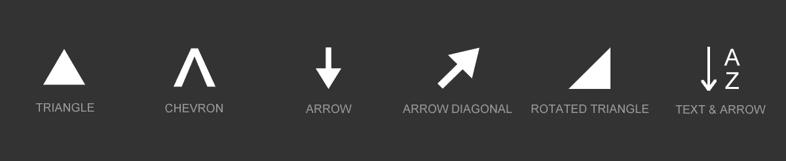

Example of symbols used for column sorting representation

Arrow sorting Twitter poll

考虑到上述情况，我在 Twitter 上发起了一个小投票，结果具体显示列排序符号的理解取决于人们的经验。我需要找到解决这个问题的最佳方式…🤔因此，我决定检查其他工具是如何设计的，以使排序箭头对用户来说更清晰。

# 常用数据表和操作系统中使用的排序设计

[**排序表**](https://kryogenix.org/code/browser/sorttable/) :三角形▼为 ASC

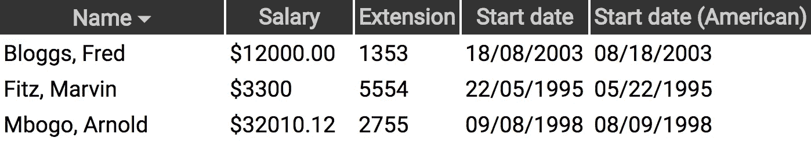

Sorttable sorting example

[**数据表**](https://datatables.net/examples/basic_init/table_sorting.html) :三角形▲为 ASC

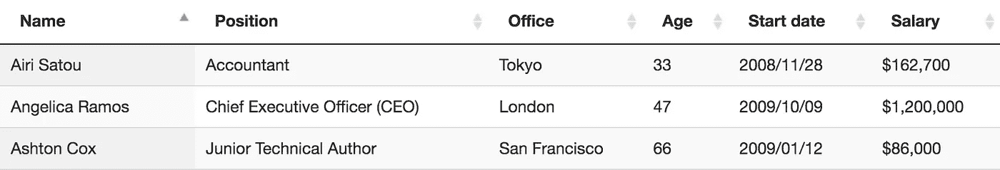

DataTables sorting example

[**表格排序**](http://tristen.ca/tablesort/demo/) :三角形▲用于 ASC

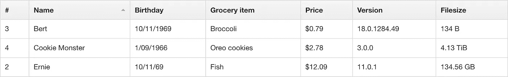

TableSort sorting example

[**NgTable**](http://ng-table.com/#/sorting/demo-sorting-basic) :三角形▲用于 ASC

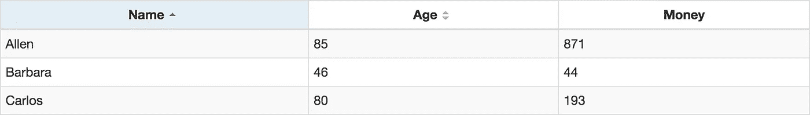

Ng-Table (Angular JS table component) sorting example

## 看看常用操作系统中的排序列符号是什么样子的

**MAC OS Sierra**:ASC 的雪佛龙 **⌃**

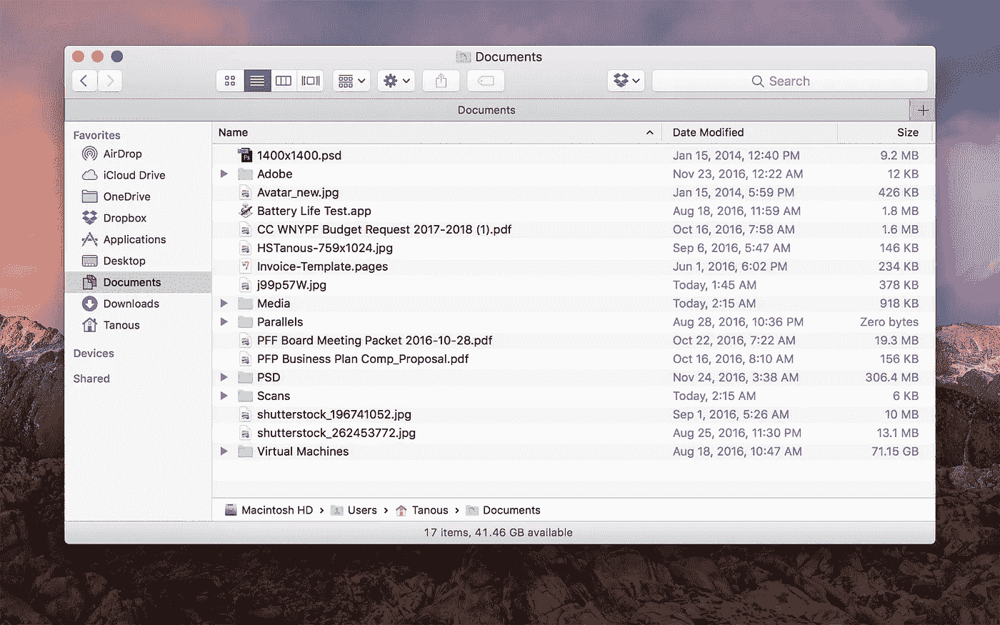

Mac OSX Sierra file sorting

**窗口 8**:ASC 的人字形 **⌃**

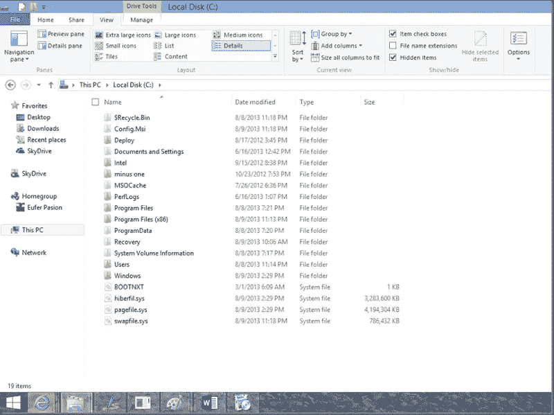

Windows 8 Explorer showing file sorting

**Ubuntu** :三角形▼代表 ASC

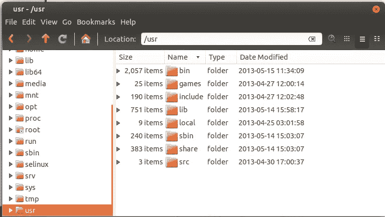

Ubuntu files sorting

Photo by [Smart](https://unsplash.com/photos/IM0GHpsjJic?utm_source=unsplash&utm_medium=referral&utm_content=creditCopyText) on [Unsplash](https://unsplash.com/?utm_source=unsplash&utm_medium=referral&utm_content=creditCopyText)

# 设计对排除误解很重要

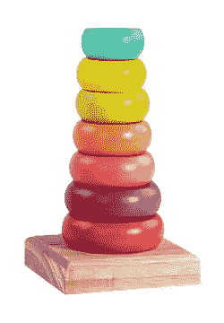

Ring stack toy real example of sorting

## “三角符号”的理解取决于你如何看待它:

*   向上三角形▲字面意思是像升序一样顶部最小，底部最大。你严格地把三角形看作三角形，没有任何解释。这可能是环形堆叠儿童玩具的抽象表示。
*   三角形可能被解释为不完整的箭头。如果你在⬆︎下面划一条线，你会看到一个向上的箭头，通常被解释为降序排列。

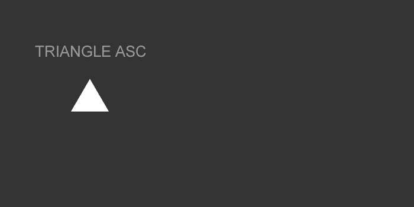

Triangle arrow seen as an incomplete arrow top change signification

# 选择哪个符号进行状态排序？

如你所知，选择是多而难的。以下是各种符号的一些表示法，以帮助您在实际使用中进行比较。

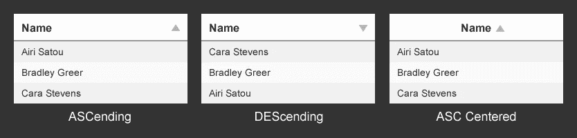

Triangle usage for table sorting like some datatables

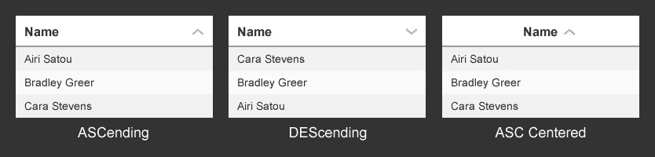

Chevron usage for table sorting like in macOS and Windows 8

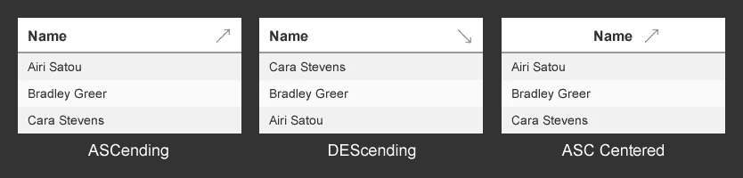

Diagonal arrow usage for table sorting

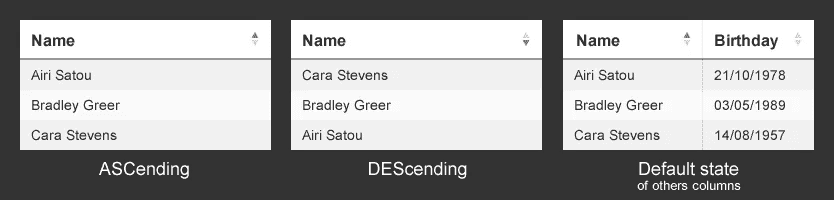

Triangle up and down representing both states or ordering

最快和最容易理解的可能是斜箭头↗↘︎ ➘︎➚ ⬊⬈，但在设计上，它不是最漂亮的。上下三角形可能是设计和理解之间的最佳妥协。

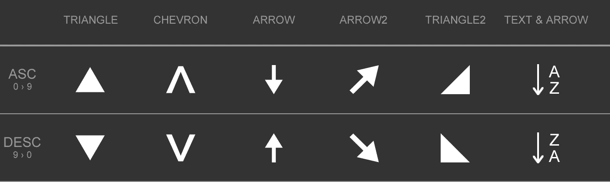

Some symbols used for column sorting in tables

总之，我认为你应该根据你的目标，在你的设计中使用一个常用的简单符号，如[人字形](https://iconmonstr.com/arrow-66/)、[三角形](https://iconmonstr.com/arrow-81/)或[箭头](https://iconmonstr.com/arrow-74/)。更重要的是，请记住，只有设计师或某些人可能对这个问题有批评的观点。大多数人不会注意它是三角形、金字塔、门环还是火箭🚀或者别的什么。关键事实是使用水平镜像使 ASC 和 DESC 符号在视觉上相对。这是 UX 的问题，不是设计问题。

感谢我妻子的逻辑，三角形可能被解释为不完整的箭头，感谢托马斯·雅各布森的建议和校对。