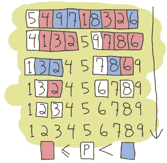

# Scala 中的排序，函数式编程的尾巴

> 原文：<https://medium.com/hackernoon/sorting-in-scala-tails-of-functional-programming-679fb2ee4af9>



在与一位同事讨论函数式编程以及他如何使用 Scala 创建表达式求值器时，我意识到在过去的几个月里，我一直在使用 Scala 做一些有趣的工作。然而，我从上学的时候就没有编写过任何基本的算法。

我决定实现一个排序算法，比方说快速排序，但是我想从中去除任何命令式编程的痕迹。

大约两分钟后，我以这个结尾:

```
def quickSort(list: List[Int]): List[Int] = {
    list match {
      case Nil        => Nil
      case a :: Nil   => List(a)
      case a :: tail  => quickSort(tail.filter(x=> x <= a)) ::: List(a) ::: quickSort(tail.filter(x => x > a))
    }
  }
```

这是一个有趣的快速排序实现，它总是将 pivote 作为列表的头部，但在我们只能以非常自然的方式访问该元素的特殊情况下，它是完美的。

然后我上网把我的解决方案和网上的做了比较。

这是出来的一个:

```
def sort(xs: Array[Int]) {
    def swap(i: Int, j: Int) {
      val t = xs(i); xs(i) = xs(j); xs(j) = t
    }
    def sort1(l: Int, r: Int) {
      val pivot = xs((l + r) / 2)
      var i = l; var j = r
      while (i <= j) {
        while (xs(i) < pivot) i += 1
        while (xs(j) > pivot) j -= 1
        if (i <= j) {
          swap(i, j)
          i += 1
          j -= 1
        }
      }
      if (l < j) sort1(l, j)
      if (j < r) sort1(i, r)
    }
    sort1(0, xs.length - 1)
  }
```

嗯，这是我们在任何编程类中都可以看到的经典快速排序，但是如果我们专注于 Scala 及其函数方面，解决方案的必要性使得编写和阅读起来很难看。

通过更深入的搜索，另一个解决方案出现了，这一次，更接近我正在寻找的。

```
def sort(xs: Array[Int]): Array[Int] = {
    if (xs.length <= 1) xs
    else {
      val pivot = xs(xs.length / 2)
      Array.concat(
        sort(xs filter (pivot >)),
        xs filter (pivot ==),
        sort(xs filter (pivot <)))
    }
  }
```

这个离我的很近。然而，它缺少*模式匹配*，仍然使用计算的 pivote，并且具有 *if else* 不必要的结构。

现在，我可以从我发现的东西中得到一些东西，我可能会将我的最后一个案例修改为案例 a::tail = > q(tail . filter(a >):::List(a):::q(tail . filter(a<=)). But it seems difficult to read and understand if you are not related with the language, so I kept my solution as in my first implementation.

## Endings

At the end, no everyone cares about implementation details, the only thing you see is a method (or function) signature you will call like def quickSort(list: List[Int]): List[Int]. Details of the implementation are left completely behind the wall that signature creates. This kind of approach is OK if you are the API user or consumer, but if you are the one who writes this API then it is a different story. On the other hand, how those details are written is important when the product has been implemented using different tools and technology stacks. Writing clean code, code that is easy to read and modify, is as simplest as we (*程序员*)决定。我相信*功能性* *编程*在这方面很有帮助，因为我们用代码表达思想的方式非常接近我们思考它们的方式。

我听到有人反对函数式编程和它所要求的思维转变。它有时可能会令人害怕，就像生活中的其他变化一样，但不要封闭自己，拥抱新技术和解决问题的方法，不要害怕，做一个愿意学习的人，你会没事的。

*阅读下一条:*

[*高阶函数，它们是什么？*](/@anicolaspp/higher-order-functions-what-are-they-be74111659e8#.odirv0prk)

[](http://bit.ly/HackernoonFB)[](https://goo.gl/k7XYbx)[](https://goo.gl/4ofytp)

> [黑客中午](http://bit.ly/Hackernoon)是黑客如何开始他们的下午。我们是 [@AMI](http://bit.ly/atAMIatAMI) 家庭的一员。我们现在[接受投稿](http://bit.ly/hackernoonsubmission)，并乐意[讨论广告&赞助](mailto:partners@amipublications.com)机会。
> 
> 如果你喜欢这个故事，我们推荐你阅读我们的[最新科技故事](http://bit.ly/hackernoonlatestt)和[趋势科技故事](https://hackernoon.com/trending)。直到下一次，不要把世界的现实想当然！

[](https://goo.gl/Ahtev1)