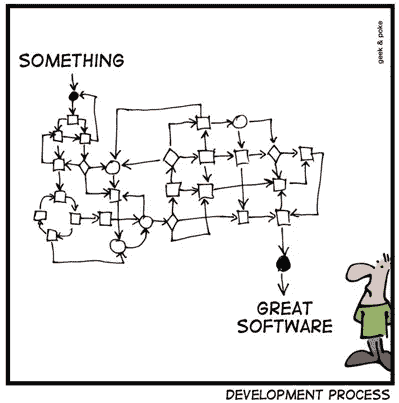

# SOS:尽早开始，过度简化，仔细检查

> 原文：<https://medium.com/hackernoon/sos-start-early-overly-simplify-scrutinize-fc60fccb733b>

昨天，我遇到了一位朋友，他是奥斯汀地区一位崭露头角的建筑师，事实证明，我们在创办新企业时面临着许多同样的挑战。我们都在努力优化流程，以便将尽可能多的时间花在公司的核心方面。

在 2016 年的股东大会上，埃隆·马斯克(Elon Musk)表示，“我们已经意识到，真正的问题、真正的困难以及最大的潜力所在，是制造制造机器的机器。换句话说，就是建造工厂。”类似地，Homebrew 的 Hunter Walk 被引用为“公司是第一个产品，在它准备好规模化之前，你必须真正有意识地了解你如何建立它。”

这凸显了打造一家伟大公司或产品的一个重要现实:实施的流程和框架往往会决定所取得的成功程度，这些运营组件的设计应考虑最终目标。 [*正如我的搭档乔纳森最近写的*](/@jonathan.m.crowder/when-small-things-arent-small-6e08d3c6b36d) ，精英中的精英几乎总是“出色地完成了平凡的工作”

尽早开始:公司规模越大，实施流程就越困难。这一点很简单，随着一家[初创企业](https://hackernoon.com/tagged/startup)开始扩大规模，让所有人朝着同一个方向前进变得异常困难。让 10 名工程师就产品开发方法达成一致，比让 40 名工程师达成一致要容易得多，也比让一个 100 人或更多的团队达成一致要容易得多。这不仅仅是一个工程或产品问题，同样的规则也适用于营销、财务和销售。好处:这将使跨职能执行变得更加容易。

**2)过度简化:**最好的早期公司有一种天生的能力，那就是在最困难的时候专注。在早期，初创公司容易追逐闪亮的物体，因为一切都像是一个巨大的机会。相反，避免诱惑，专注于执行一个核心产品或市场。实现这一点的示例策略包括:缩短会议时间(即站立会议)，挑选 2-3 个对成功至关重要的指标(例如边际贡献和转化率)，并在每个时间段选择 1-2 个战略优先事项。

**3)细看:**对自己诚实。我见过的团队使用的最有效的实践之一是回顾的敏捷概念。这让团队有机会讨论什么可行，什么不可行，以及改进的想法。这一步最关键的因素是责任，没有责任，这些会议不会帮助公司前进，反而成为过度批评而没有激励行动的机会。每次“回顾”开始时，先回顾一下团队在之前外卖工作中的表现，并记录分数。

初创公司内部的运营经常被忽视，因为有更多令人兴奋的挑战需要应对。当流程到位时，没有人会注意到，因为事情运行得很顺利，挑战直到游戏的后期才开始出现。然而，忽视它们就像在船还在港口的时候刺破它一样；它可能会离开码头，但不会走完全程。

喜欢这篇文章吗？请分享！

*原载于 2017 年 9 月 1 日*[*【kevindstevens.com】*](http://kevindstevens.com/2017/09/start-early/)*。*