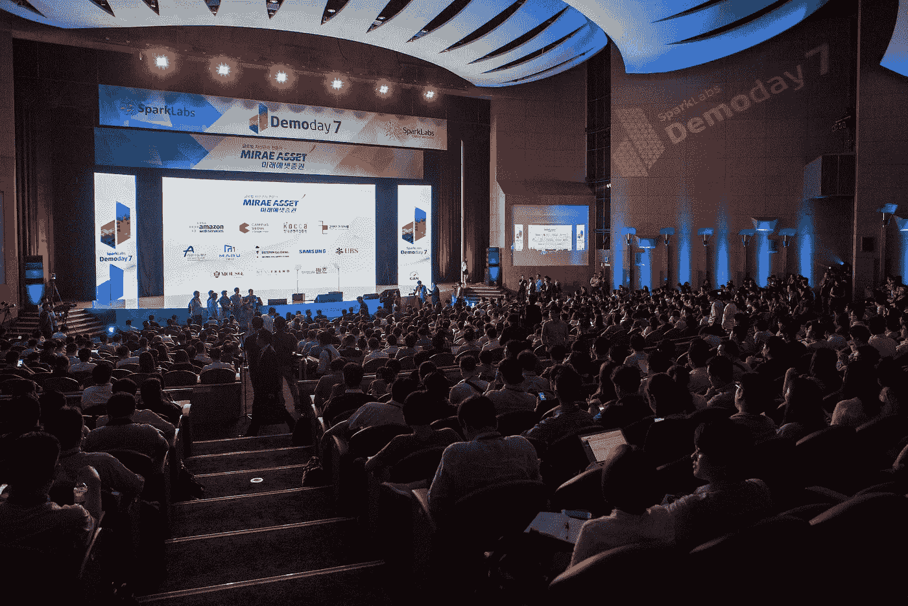
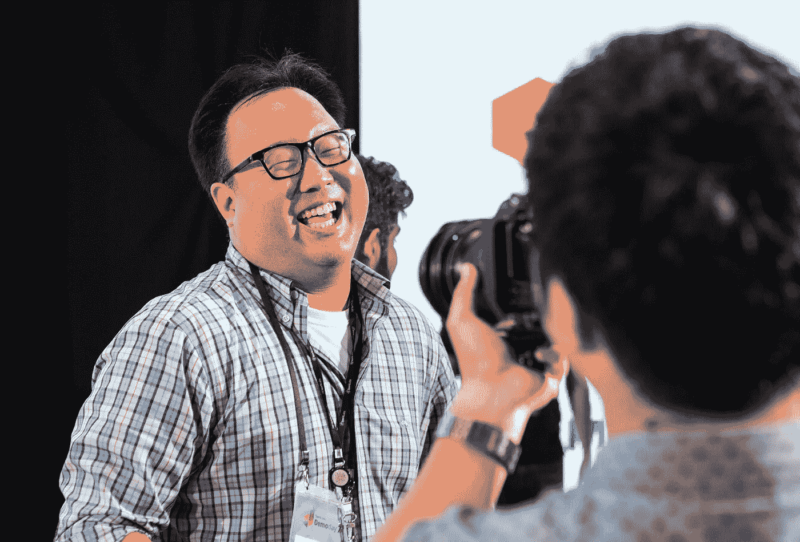
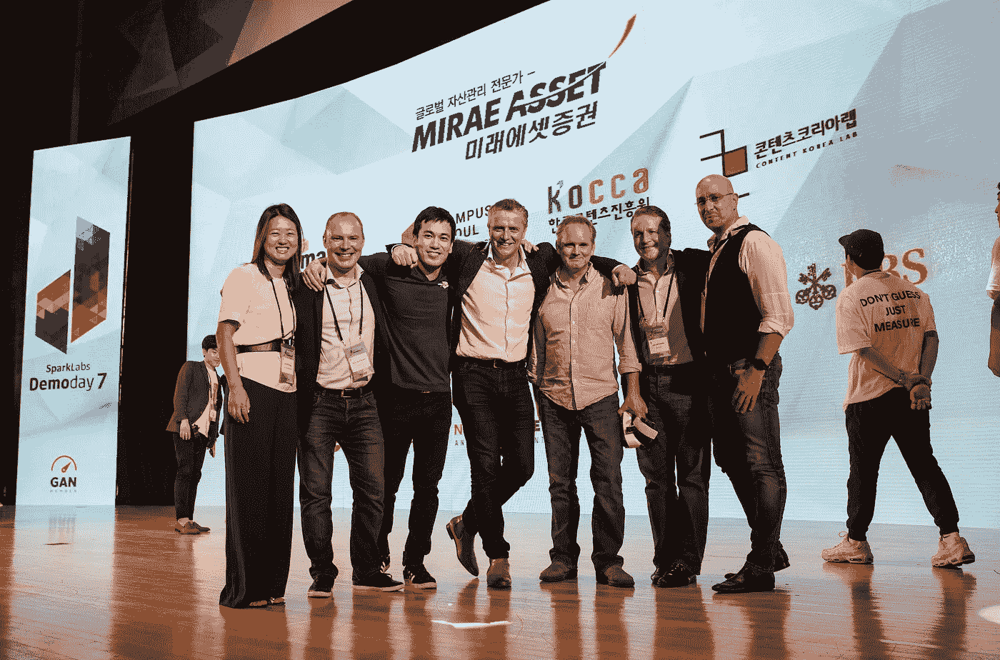
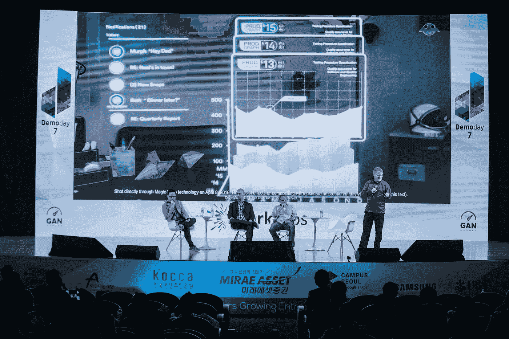
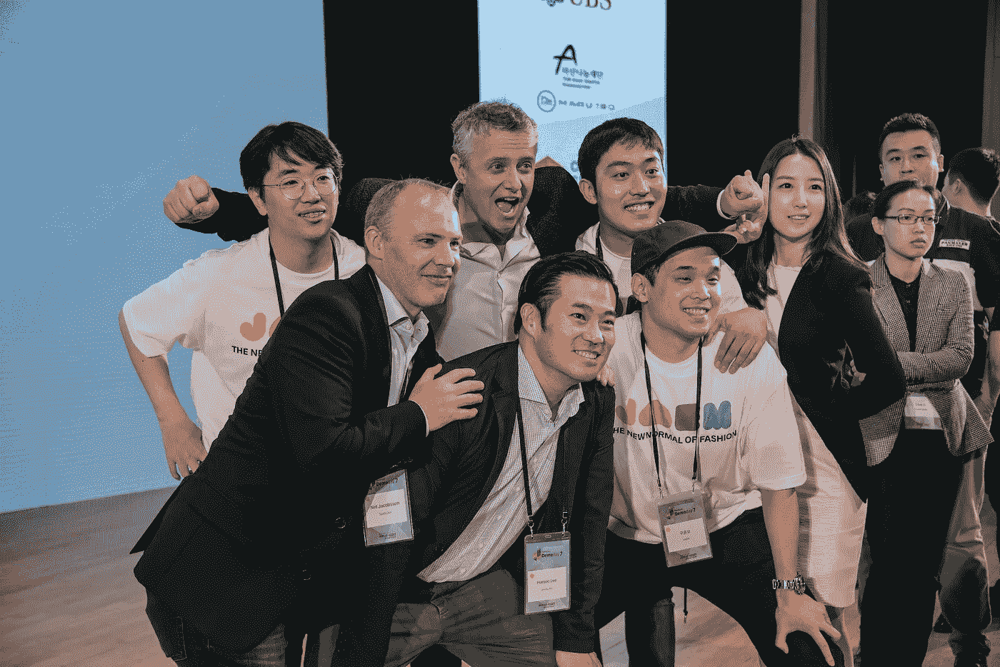

# SparkLabs: 3 年，56 家公司，超过 6.9 亿美元的股权价值和 8 条经验教训

> 原文：<https://medium.com/hackernoon/sparklabs-3-years-56-companies-over-690m-in-equity-value-and-8-lessons-learned-9b8d758b0491>

上周，我们刚刚结束了第七届 DemoDay，来自亚洲各地的 1800 多人参加了此次活动。虽然我们的活动已经成为世界上最大的加速器演示日，但我们并没有被我们的成就所误导，因为我们知道如果 Y Combinator 向公众开放他们的大门，这将使我们的活动蒙羞。

Over 1,800 people attended the SparkLabs DemoDay7 with over 350 investors from throughout Asia

对于我们的团队来说，继续激发对初创公司的兴趣并帮助韩国和亚洲的创新生态系统发展非常重要。我们在 [SparkLabs](http://www.sparklabs.co.kr) 的团队希望我们的演示日能够鼓励新的企业家打破三星、LG、NHN 和 Nexon 的藩篱，刺激新的投资者，并吸引潜在企业合作伙伴的兴趣。

DemoDay7 Highlight Video from June 22, 2016

自从 HanJoo Lee、Jimmy Kim 和我在 2012 年 4 月开始这个想法并在 2012 年 12 月推出我们的第一批产品以来，这是一个漫长而疯狂的旅程。我们得到了杰出顾问的支持，比如马克·库班(达拉斯小牛队的老板，直言不讳的亿万富翁)、(谷歌首席互联网传道者和“互联网之父”)和[雷·奥茨](https://www.youtube.com/watch?v=kouRvrHKZq8)(前微软首席软件架构师和 Lotus Notes 的创始人)。更重要的是，超过 [120 名活跃的创业导师](http://sparklabs.co.kr/en/html/mentors.html)加入了我们，他们对我们项目的成功起到了不可估量的作用。

Eugene Kim, Partner and Head of SparkLabs accelerator programs

最终，我们得到了其他合作伙伴的支持: **Jay McCarthy、Frank Meehan、Net Jacobsson 和负责 SparkLabs 项目和运营的 Eugene Kim** 。

Eugene Kim、Sophia Choi、Harry Han 和其他全职团队成员的辛勤工作为我们的 56 名毕业生创造了超过 6 . 9 亿美元的股权价值、800 多个工作岗位和超过 75%的跟进率。高跟进率的一部分是我们吸引强队的能力。在参加我们的加速器计划之前，平均募集金额超过 40 万美元，之后募集的资金超过 300 万美元。我可以自信地说，SparkLabs 的生产率是世界上最好的之一。

自从 HanJoo 让我和 Jimmy 成为“朝鲜的 YC ”,然后推出 SparkLabs 以来，已经过去了快 3 年半。这不是一条像任何新的冒险一样容易的路，但它令人难以置信地振奋和有益。带着一点反思，我想分享一下**我们从将 SparkLabs 发展成为亚洲领先的加速器项目以及从成为“朝鲜的 YC”到成为“亚洲的 YC”的雄心壮志中学到的 8 件大事**

**1。每次招聘都至关重要。**这句咒语总是被陈述，经常被引用，但并不总是被执行。我相信 SparkLabs 的成功来自于我们的第一位雇员尤金·金(Eugene Kim)，他负责我们的加速器运营和项目，以及随后的每一位雇员。Eugene 最近被提升为 SparkLabs 的合作伙伴，我们的成功给他带来的所有赞誉都是他应得的。

所有创始人都必须批准一项招聘，因为我们真的相信每一项招聘都至关重要。有几次，我们每个人都想雇用一名候选人，但最后一个人说“不”，我们尊重这一点。

2.**细节决定成败。**我们的团队认为细节是成功的关键。从我们演示日舞台上的每一盏灯，到写给公司合作伙伴的电子邮件，再到我们网站上的像素。我们关注细节，因为我们相信卓越是我们努力追求的最低标准，并希望通过 SparkLabs 的公司也能做到这一点。

Sarah Chung (CEO of Landing Int’l, Batch 7), Net Jacobsson (Partner at SparkLabs & SparkLabs Global), David Choe (CEO of myBox, Batch 7), Frank Meehan (Partner at SparkLabs & SparkLabs Global), Euan Macdonald (CEO of CryWorks / speaker at DemoDay7), Jay McCarthy (Partner at SparkLabs & SparkLabs Global), Rob DeMillo (Venture Partner at SparkLabs Global)

3.关系很重要。一切都是通过关系完成的。建立牢固的关系需要时间和努力，所以任何事情都不能用短期的眼光来看待。

4.遵循黄金法则。作为一条底线，我们希望别人怎样对待我们，我们就怎样对待别人，所以我们善待他人。如果人们犯了错误，我们希望锻炼耐心和理解，但也不要期望同样的。

5.超越黄金法则。这适用于那些与我们共事时间最长、贡献最大或最需要帮助的合作伙伴和人员。我们寻求为我们网络中的每个人多做一点，但也会为那些真正理解我们的热情和愿景的人多做几英里，以帮助其他企业家。

6.**接受反馈和批评。**有人说感知就是现实，所以我们努力接受我们收到的所有反馈和批评。即使批评是少数人的观点，但由于我们是韩国创业生态系统的领导者之一，倾听、学习和改进非常重要。

7.不要理会那些讨厌的人。另一方面，有时候批评实在是太荒谬了，所以只能忽略它。如果我们可以用很少的努力和时间做出反应，那么我们可能会这样做。例如，我们最初收到关于我们是否真的认识我们网站上的人和我们“假定的全球网络”中的其他人的问题(私下聊天)，但这些怀疑在我们推出后很快就消失了。在我们发布的第一年，我们邀请了我们的顾问[雷·奥茨](https://en.wikipedia.org/wiki/Ray_Ozzie)，他和其他人一起做了演讲，比如小米的联合创始人林斌，红辛烷/吉他英雄的联合创始人黄恺。我们继续将全球思想领袖和企业家带到首尔，鼓励和激励整个创业生态系统。

DemoDay7 Panel on VR/AR: Casey Lau (Founder of StartupsHK & Co-host of RISE), (Peter Wilkins, Co-founder, CEO, & CTO of Emergent VR), Euan MacDonald (Co-founder & CEO of CryWorks), Robert Scoble (EIR at Upload VR)

8.**诚信要紧**。诚信是绝对的起点。也许因为我们团队中的许多人住在中西部(芝加哥、安阿伯)，但我们真的相信一个人所拥有的就是他或她的话。我们也向我们的公司强调这一点；不要骗你的投资人，不要骗你公司的合作伙伴，不要骗你的员工，不要骗你自己。

我们的团队期待着未来 10 年甚至更久，在亚洲建立 SparkLabs 和整个创业生态系统。这是我们的激情、动力和使命。帮助全球企业家改变世界，SparkLabs 是我们实现这一目标的工具。

> [黑客中午](http://bit.ly/Hackernoon)是黑客如何开始他们的下午。我们是 [@AMI](http://bit.ly/atAMIatAMI) 家庭的一员。我们现在[接受投稿](http://bit.ly/hackernoonsubmission)并乐意[讨论广告&赞助](mailto:partners@amipublications.com)机会。
> 
> 如果你喜欢这个故事，我们推荐你阅读我们的[最新科技故事](http://bit.ly/hackernoonlatestt)和[趋势科技故事](https://hackernoon.com/trending)。直到下一次，不要把世界的现实想当然！

